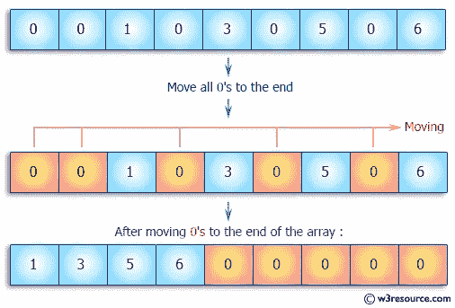
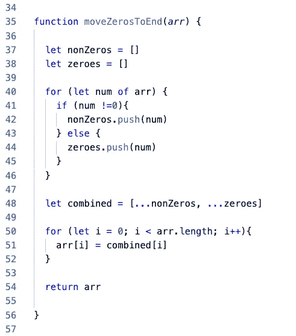
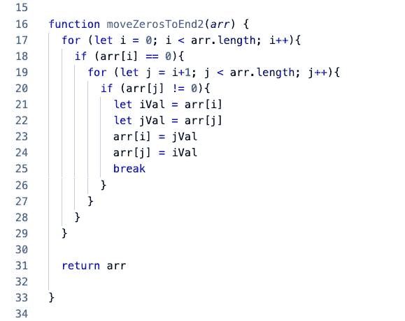
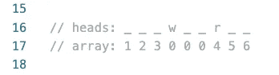
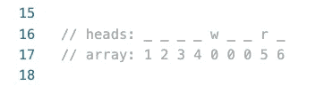
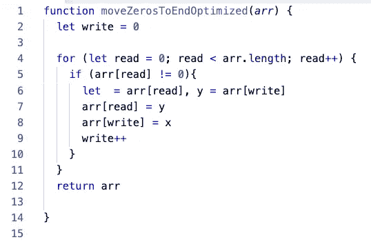

# 求解:移动零结束

> 原文：<https://medium.com/nerd-for-tech/solving-movezerostoend-760342d64026?source=collection_archive---------19----------------------->



在本文中，我将用 Javascript 以几种不同的方式来解决 moveZerosToEnd 问题。我将介绍我解决这个问题的过程，并讨论它的重要性。

我们开始吧！

# 问题

## 给定一个静态大小的整数数组`arr`，将数组中的所有零移动到数组的末尾。您应该保留数组中项目的相对顺序。

## 我们应该实现一个比简单的暴力更有效的解决方案。

**例子:**

```
input:  arr = [1, 10, 0, 2, 8, 3, 0, 0, 6, 4, 0, 5, 7, 0]
output: [1, 10, 2, 8, 3, 6, 4, 5, 7, 0, 0, 0, 0, 0]
```

**约束:**

*   **【时限】5000ms**
*   **【输入】数组.整数** `arr` → 0 ≤数组长度≤ 20
*   **【输出】array.integer**

我们来分析一下问题。我们所做的在概念上非常简单，如果在非零值之前有一个零值，将零值移动到它后面，同时保持非零值的相对顺序。

让我们考虑几种方法:

方法 1:

一种想法是遍历数组，将任何非零值推入非零数组，将任何零值推入 onlyZeros 数组。然后在一个新数组中展开两个数组，非零数组首先展开。

方法 2:

另一个想法是循环遍历数组，当我们遇到一个 0 时暂停，然后继续搜索数组，直到遇到一个非零值。此时，我们可以交换这两个值，最终返回一个末尾全是零的数组。

让我们来比较一下这两种方法:

## 方法 1



通过第 37-47 行，我们可以看到非零和零数组通过一个简单的 forLoop 进行实例化和填充，if 语句将值过滤到两个数组中。

在第 48 行，我们创建了一个新的数组，用 spread 操作符将两个数组组合在一起。

最后，因为我们想返回给我们的同一个数组，所以我们再次遍历给定的参数，并用给定索引的相应值替换每个值。

时间复杂度归结为 O(n ),而空间复杂度也是如此。

如果你想出了这个方法——干得好！简单有效！

## 方法 2



我们立即看到这里有一个嵌套循环。第一个循环遍历数组，检查每个值，看它是否等于 0。如果是这样，我们进入另一个迭代，从 i+1 开始，下一个值是 j。如果下一个值也为零，循环将继续，直到遇到非零值或结束循环的剩余部分。一旦 j 命中一个具有非零值的索引，我们将这些值分别存储在 iVal 和 jVal 中，并交换 I 索引和 j 索引处的值。

这背后的逻辑是合理的。我们循环遍历，在零值处暂停，搜索下一个非零值并交换它们的位置。

如果你找到了这个解决方案，那太好了。没什么问题。

然而，它目前的运行速度是 O(n )…我们如何才能让它更高效呢？

很明显，我们想摆脱嵌套循环。让我们看看这里的循环到底在做什么。

第一个循环在零值处暂停。第二个循环在非零值处暂停。

所以我们真正需要知道的基本部分是当前零值(第一个循环)和下一个非零值(嵌套循环)的索引。

我们如何做到这一点？

引入“指针”。

我们可以创建“指向”我们关注的指数的变量，并允许我们交换这些指数的值以获得期望的结果。同时对嵌套循环进行转义！

## 方法 2 —优化

这种方法使用类似于 quickSelect 的思想，通过非零值对数组进行分区。我们要做的是，遍历数组，当我们遇到非零值时，增加“写”指针和“读”指针，如果我们没有遇到非零值，我们将继续增加“读”指针，而“写”指针将停留在最左边的零的索引处。因此，当我们继续读取数组的值时，跟踪具有零值的索引。当我们遇到非零值时，我们将交换“读取”和“写入”索引的值。

它看起来会像这样:



请注意，对于索引 0–2，arr[read]和 arr[write]的值将是相同的，因此当您“交换”它们时，您只是将相同的值替换到数组的索引中。

一旦我们达到一个零值，写指针就一直指向该值的索引。同时读指针继续。

一旦读指针命中非零值，它将把其索引处的值与存储在写指针中的索引处的值交换。



现在我们已经把它形象化了一点。让我们看看代码。



这里我们可以看到，我们已经将这种方法的第一个版本简化为一个循环，使用一个 if 语句来检查读取值是否非零。

通过声明写指针并仅在非零值期间递增，我们取代了对嵌套循环的需要，而是可以简单地继续读取值并等待，直到我们找到非零值的索引来交换索引的值。

时间复杂度从 O(n)简化为 O(n ),而空间复杂度保持在 O(1)的可爱常数时间，因为除了指针读取和写入之外，不需要额外的空间。

## 结论

我认为了解不同的方法如何仍然能够提供可用的结果是有帮助的，我希望这种分解也说明了，无论您使用什么逻辑来解决问题，仍然有一种以低效/幼稚的方式使用该逻辑的方法——这意味着，如果您遵循您的逻辑并进入一段不那么高效的代码，有可能有一种更有效的方法使用相同的逻辑来编写它。所以不是你的逻辑感！这只是你解决方案的第一稿，每一遍都会变得更好！

希望这有所帮助！