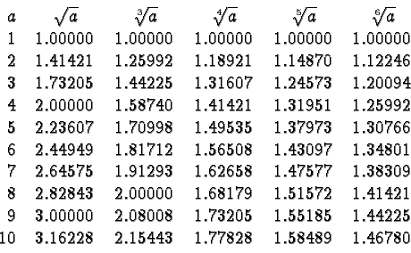
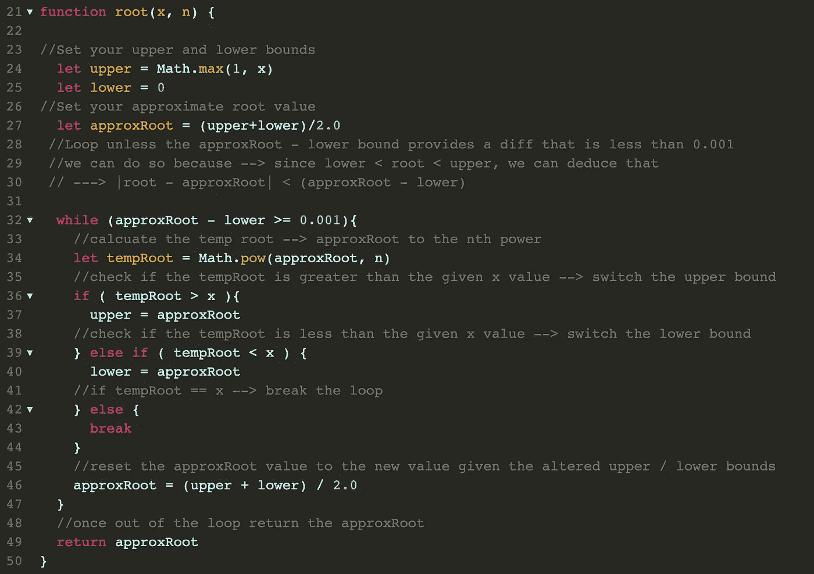

# 求解:rootOfNumber

> 原文：<https://medium.com/nerd-for-tech/solving-rootofnumber-fe1f74134350?source=collection_archive---------19----------------------->

在本文中，我将剖析 Javascript 中的 rootOfNumber 问题。我将介绍我解决这个问题的过程，并讨论它的重要性。

我们开始吧！

# 问题:

## 实现一个函数`root`，它计算一个数的`n’th`根。该函数取一个非负数`x`和一个正整数`n`，在误差`0.001`内返回`x`的正`n’th`根(即假设实根为`y`，则误差为:`|y-root(x,n)|`，且必须满足`|y-root(x,n)| < 0.001`)。

## 示例:

*   输入:x = 7，n = 3 →输出:1.913
*   输入:x = 9，n = 2 →输出:3

## **约束:**

*   **【时限】5000ms**
*   **【输入】浮动** `x` → 0 ≤ x
*   **【输入】整数** `n` → 0 < n
*   **【输出】浮动**

让我们用自己的话来分析和重述这个问题。

我们被要求写一个函数来确定一个数的 n 次方根。这意味着什么呢？这意味着给定一个浮点数“x”和一个整数“n ”,我们可以确定数字“z ”,其中 z 的^ n 次方将得到 x

*   z^nth = x

因此，给定 x= 7，n = 3，我们想找到 z，其中:

**z = 7**

我们怎样才能找到 z 呢？

我们知道些什么？

我们知道 z 必须在 0 和 x 的范围内:

0 ≤ z ≤ x → 0 ≤ z ≤ 7

现在知道了这一点，我们就可以遍历 0-x 的范围，检查这些值的 n 次方是否等于 x。

这是一些很好的逻辑，但也有一些问题:

我们需要检查所有的数字，而不仅仅是整数。这意味着包括每个整数之间的浮点值→ 1.1、1.2、1.3、1.4、1.5 等。

如果我们做一个循环，并且每次将 z 值增加一个整数的十分之一，那将花费…非常长的时间…

增加十分之一甚至可能不会给出正确的结果…那么我们如何在检查范围的同时增加我们检查的值的特异性并限制检查所有这些值所需的时间呢？

介绍:二分搜索法。

**二分搜索法:**通过重复将搜索区间一分为二来搜索排序后的数组。以覆盖整个阵列的间隔开始。如果搜索关键字的值小于间隔中间的项目，则将间隔缩小到下半部分。否则缩小到上半部分。重复检查，直到找到值或间隔为空。

现在，这可能对你有一些意义，但让我们打破这一点。

二分搜索法背后的理念包含了一些关键的思想:

*   您正在搜索的数字有一个**排序的**范围→在我们的例子中，它是 0 ≤ z ≤ x 之间的范围
*   在每一遍中，有一个**上界**、**下界**和一个**中值** →每一遍我们*改变这些界限以缩小我们正在搜索的范围的大小* *到*,*随后改变中值* →在我们的例子中，第一遍将有→上界= x，下界= 0，中值=(上界+下界)/ 2 →中值= (x + 0) / 2
*   在每一次传递中，我们将中间值与我们正在搜索的值进行比较，直到我们找到该值，在这种情况下，我们将返回它

既然我们已经谈到了二分搜索法，让我们回顾一下我们的游戏计划。

*   使用二分搜索法查找初始范围 0 ≤ z ≤ x 内的值
*   从二分搜索法取每个值(z ),检查是否→ z^nth = x
*   如果 z 值小于 x，我们切换我们的边界来查看上半部分，如果 z 值大于 x，我们切换我们的边界来查看下半部分，并继续下去，直到我们发现 z 值在 x 的 0.001 以内

太棒了。让我们进入一些代码。

在上面的代码中，我们设置了初始边界，然后遍历整个范围并更改范围的边界，直到我们达到正确的值，或者我们的近似根和下限之间的差等于或小于 0.001(当满足这个条件时，我们已经达到了相对于 x 的 0.001 误差范围内的值。

因为我们使用的是二分搜索法，所以每次输入的大小都会减半，导致 O(log(n))的时间复杂度和 O(1)的空间复杂度。

## 最终想法:

这个问题让我措手不及的是，为了找到答案，需要做实际的数学运算。我的数学并不差，但是从高中开始我就不用去找一个数的 n 次方根了(即使那样我也不认为我擅长这个)。

找到解决方案的关键是想出一个极其简单的想法，这在逻辑上是合理的，并把它分解成熟悉的部分，直到意识到我需要做的只是在一个范围内寻找一个值。通过让问题对我来说更熟悉，我能够不被数学困住，而专注于解决方案。

利用这些信息并使用二分搜索法算法来加速这个过程，让我找到了一个时间复杂度为 O(log(n))的解决方案。

我希望这对你的下一个算法有所帮助，并提醒你不要被这个问题迷惑，保持你的解决方案简单而熟悉！