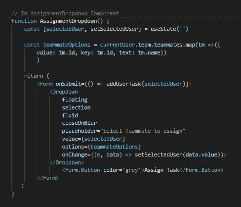

# 关于 React 事件侦听器的一些信息

> 原文：<https://medium.com/nerd-for-tech/some-about-react-event-listeners-cdd612c64129?source=collection_archive---------11----------------------->

待在圈子里第 2 部分。

在[之前的一篇文章](/nerd-for-tech/all-about-javascript-event-listeners-propagation-and-bubbling-19801c8558a1)中，我探索了用普通 JavaScript 向用户交互添加事件监听器的过程。现在是时候使用 React 将我们所学的扩展到同一个目标了！

React 使得添加和删除事件侦听器的许多事情变得更加简单。然而，作为程序员，我们仍然必须处理关于时间和地点的决策和逻辑。

# 该过程

我喜欢像听收音机一样思考事件倾听过程的机制。你调到一个特定的电台，听到一首你想听的歌曲或一个脱口秀节目，然后你利用这些信息做些事情，跟着唱，和朋友讨论，等等。事件侦听器遵循相同的步骤。

示例反应组分

## 调谐

在普通的 JavaScript 中，我们需要一个手动选择语句，比如`document.querySelector('btn')`，而在 React 中，寻找我们的元素将是开发人员的工作，包括首先确定我们的 DOM 元素位于哪个组件中，导航到那个文件，并定位适当的元素。这是因为 React 事件侦听器被内联附加到它们的元素，在组件的 JSX 返回部分。在上面的代码中，我们在一个 form 元素和一个 dropdown 元素上有事件监听器。

调谐收音机

## 听着

因为 React 是用 JavaScript 构建和编写的，所以我们可以使用普通 JavaScript 中可用的所有相同类型的事件。React 中最大的不同是命名约定。代替 T1 的是 T2，T3 是 T4，以此类推。第二个区别是，我们不再需要调用`addEventListener`；“on_”既充当此功能，又充当事件的名称！但是，每个事件侦听器仍然有两个主要部分:

1)事件名称
2)回调函数

在上面的代码中看起来是这样的:
`<Form onSubmit={() => addUserTask(selectedUser)}>`

听到那首歌了吗

## 作出反应

最后，我们需要在一个事件被听完之后让一些事情发生。在 React 中，这通常发生在 render return 语句之前的组件主体中的实际事件侦听器之外。我们把它写成一个回调函数，就像在普通 JavaScript 中一样，传递事件对象，因为它包含一些数据，比如表单输入值，我们以后可能要用它们来更新状态。

尽情跳舞吧！

# 要记住的其他差异

1.  一旦被监听的元素从 DOM 中移除，普通的 JavaScript 事件监听器就需要*显式的*清除。在 React 中我们不需要这样做，因为所有 React 事件都是合成事件，这意味着添加和删除事件侦听器的整个周期都是由 React 处理的。基本上，免费代码！
2.  事件委托也是 React 中自动为我们处理的事情。如果我们回想一下我们在普通 JavaScript 中学习的事件传播(冒泡),我们会记得我们将事件侦听器放得越高，它可以侦听的事件就越多，因为它可以听到每个子节点上发生的所有事情。
    React 直接在文档节点为每个事件类型附加一个事件处理程序(实际上，在 React 17 中，它附加在根节点，在文档下一级)。这意味着我们不需要明确决定在 DOM 树中的何处添加事件侦听器，因为 React 已经在最高的父元素处添加了一个事件侦听器。

React 在帮助我们简化事件监听过程方面很棒，但我们仍然需要通过成为优秀的开发人员来帮助它，并选择正确的元素、事件类型和响应，以便用户在网页上的交互直观而无缝地发生。

快乐聆听！