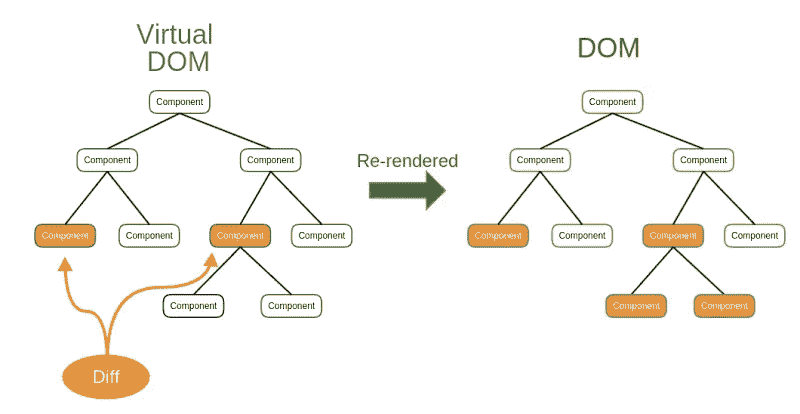
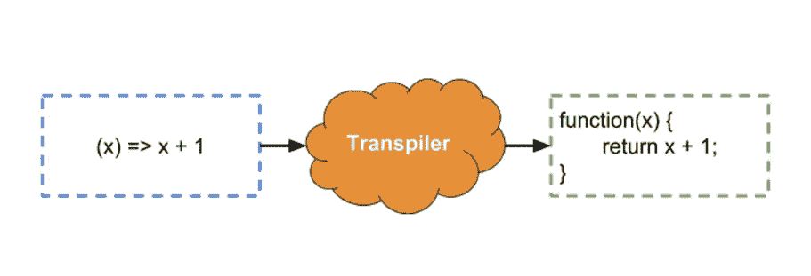
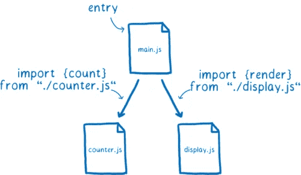
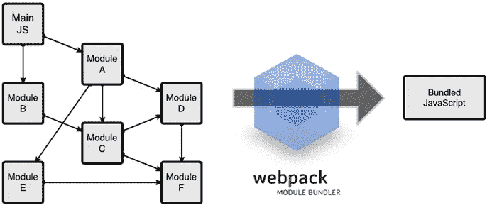
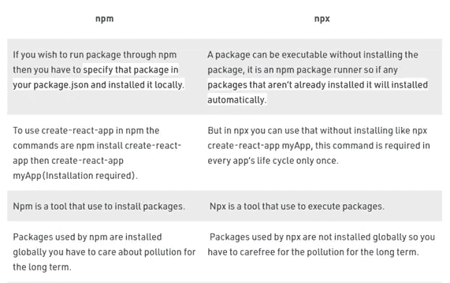
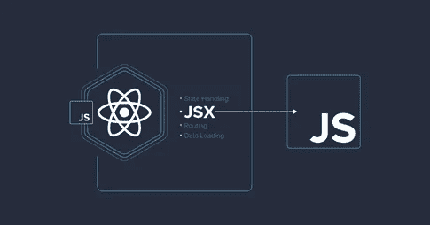
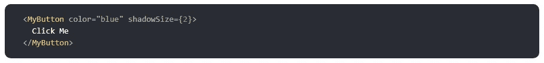
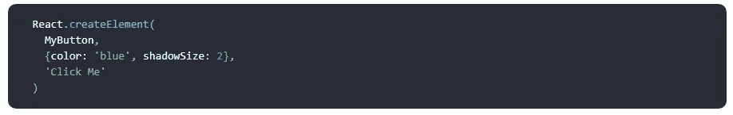
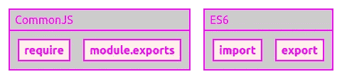

# 每个 React 开发人员都应该知道的一些特性

> 原文：<https://medium.com/nerd-for-tech/some-features-every-react-developer-should-know-f960117464e8?source=collection_archive---------1----------------------->

大家好，在这篇博文中，我想谈谈 React 的一些重要特性。

React 的网站对 react 的描述如下:

React 是一个声明式的、高效的、灵活的 JavaScript 库，用于构建用户界面。它允许你用称为“组件”的小而孤立的代码片段组成复杂的 ui。

React 是一种非常高效的网站性能语言。因为 React 使用虚拟 DOM。

**虚拟 DOM**

虚拟 DOM 是真实 DOM 的副本。因此，每当我们刷新页面时，它只呈现更改的地方，而不是整个页面。这增加了网站的性能。

虚拟 DOM

**ECMAScript**

ECMAScript

ECMAScript 是一种软件语言标准。JavaScript 是实现这些标准的最流行的编程语言。ECMAScript 有 ES6、ES7、E8 等版本。在 ES6 之后，这些版本提供了一些新功能，在 React 中，我们使用了这些功能:

箭头

类—面向对象

模板字符串

对象破坏

出租和成本

模块

承诺

扩展语法

异步功能

**巴别塔**

巴比伦式的城市

当前的浏览器不运行 ES6 代码。他们还没有实现 ES6 的所有功能。现在的浏览器(Chrome，Firefox，Internet Explorer 等。)了解 javascript 的 ES5 版本。他们看到 ES6，什么都不懂。他们知道一些单词，但是他们还不能完全理解应用程序。他们需要一个翻译来理解这些美丽的 ES6 代码。

这是译者巴别尔。它将你输入的 es6 代码翻译到浏览器中。所以它变成了 ES5 并呈现给浏览器。

**ES 模块**

ES 模块

Ecmascript 2015 在语言上增加了 ES 模块，确保建立官方模块体系。ES 模块(Ecmascript 模块)为 JavaScript 提供了一种导入机制。这种机制通过将包含在不同文件中的代码导入到其他文件中，使它们可以重用。

**网络包**

网络包

Webpack，从它的名字可以看出它是一个 web packager，当我们以最基本的方式来看它时，我们可以说它是一个为现代 JavaScript 应用程序制造的模块包。Webpack 创建一个依赖图，该图采用项目可能需要的每种类型的模块，并生成一个应用程序包作为该图的处理结果。

**Npm vs Npx**

npm 与 npx

npm 代表**节点包管理器，它管理所有的包和模块。使用 **npm** 安装节点项目中所需的包和模块。npx 代表**节点包执行**，它与 npm 一起提供。它是一个 npm 软件包运行程序，可以从 npm 注册表中执行您想要的任何软件包，甚至无需安装该软件包。**

**JSX**

JSX

JSX 的基本目的是通过在 javascript 文件中编写 HTML 代码来提供更加可视化的代码使用。

它还允许我们以声明的方式显示作为文档结构一部分的元素或组件。

JSX 把这个代码；

变成下面的代码:

**要求 vs 导入**

要求与导入

`require`和`import`的主要区别在于`require`会自动扫描`node_modules`来寻找模块，而来自 ES6 的`import`不会。你**不能**用`require`选择性的只加载你需要的棋子，但是用`import`可以选择性的只加载你需要的棋子，这样可以节省内存。

另一方面，`import`可以是异步的(不需要等待之前的导入),因此*的性能比*T9 稍好一些

感谢您的阅读:)

> [https://tr.reactjs.org/](https://tr.reactjs.org/)