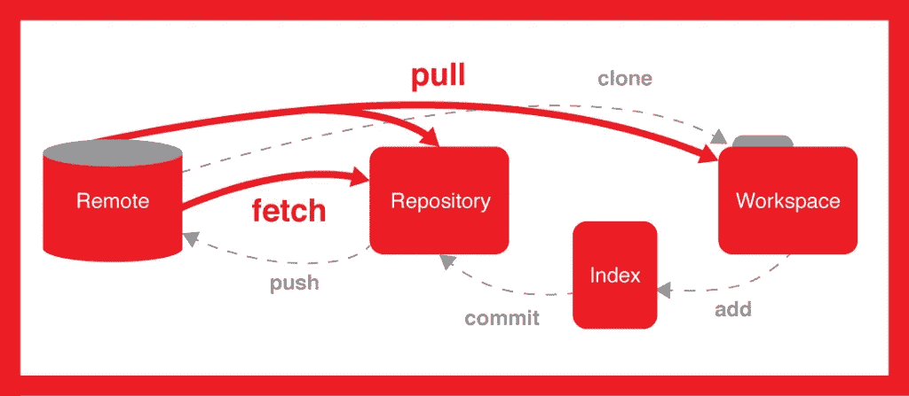

# 你应该知道的一些重要的 Git 命令！

> 原文：<https://medium.com/nerd-for-tech/some-important-git-commands-you-should-know-f3112cae503e?source=collection_archive---------8----------------------->



读者们好，

我带着一篇关于每个开发者都应该知道的 **Git 命令的新文章回来了！**在本文中，我们将学习各种 git 命令，以及在对现有存储库进行任何更改或创建任何新存储库时如何使用它们。

**什么是版本控制系统？**

现在，你们中的许多人一定使用过 GitHub 或者任何其他相关的版本控制系统，当不止一个人参与或者正在工作的时候，这些系统会帮助你对你的项目进行修改。它基本上可以帮助你跟踪你正在改变的所有文件。谈论任何特定的场景，假设你的一些朋友正在做一个项目，并且位于很远的地方，那么现在！想象一下这样一种情况，当你和你所有的朋友在同一个地方完成你的项目时，查看别人的代码并据此计划你将如何执行你的项目以及你将做出什么样的改变是多么容易，你甚至可以添加一些信息或分享你的观点，甚至可以在你们都在同一个地方的时候检查一个人的代码， 但是如果你们都在不同的地方，那么你们将如何管理你们在一起时可以很容易做的事情呢？

这里只有版本控制系统发挥作用！使用版本控制系统有一个巨大的好处，最重要的是创建一个分支，并独立地将你的工作添加到其中，最后，你可以将它合并到主分支，即**主分支。**您将要创建的分支将与**主分支**不同，您可以在那里添加您特别分配到的工作！

现在，让我们看看基本的 git 命令，这些命令将帮助我们理解如何创建和更改存储库，或者创建我们的独立分支并对其进行更改，以及对现有存储库进行更改。

现在，首先，配置您的系统，以便您可以从系统本身对您的存储库进行更改，为此，您需要在终端中键入以下命令

```
$git config --global user.name <your username>
$git config --global user.email <your email id>
```

上面的 git 命令将帮助您配置您的用户名和电子邮件，以用于您的提交，从而确保您将代码推送到您创建的正确的帐户和正确的存储库！**确保电子邮件和用户名与您的帐户用户名和电子邮件相匹配。**

现在，要初始化您现有的目录/文件夹或启动一个新的存储库，您需要在终端中键入以下命令

```
$cd <path> git init
```

`<path>`表示需要初始化的目录/文件夹在系统中的位置。为了成功执行上述命令，您只需出现在您的目录/文件夹中并输入 about 命令。现在，你的目录/文件夹已经初始化了！当您将任何特定的目录/文件夹添加到 GitHub 或 Bitbucket 帐户以使其成为新的存储库时，将使用该命令。

现在，要将您的本地存储库连接到远程服务器，您必须使用这个命令

```
$git remote add <variable name> <remote server link>
```

这里的`<variable name>`可能是**的来源**，`<remote server link>`可能是指向您的存储库的链接。

现在，要创建并切换到另一个**分支**你需要使用这个命令

```
$git checkout -b <branch name>
```

`<branch name>`可以是你想保留的任何东西。该命令在创建和将所有更改推送到新创建的分支时都很有用，建议在创建任何新分支并将所有更改推送到那里后使用 **stash** 命令，这样可以简化您的工作！

现在，想象一个场景，其中目录/文件夹已经初始化，但您仍然需要对现有的存储库进行任何更改或添加一些功能，那么首先您必须**将存储库克隆到您的本地系统。**

```
$git clone <url of the repo you want to clone>
```

该命令会将目标库复制或克隆到您的系统中，然后，使用您喜欢的任何代码编辑器，您都可以轻松地在本地对代码进行更改！

让我们更深入地了解一下**克隆人命令**

假设现在，您需要克隆一个特定的**分支**而不是存在于**主分支**中的完整代码，那么您可以使用命令

```
$git clone -branch
```

`-branch`参数让你指定一个特定的**分支**到**克隆**而不是远程`HEAD`指向的分支，通常是**主**分支**分支**。

现在，在你修改了你的代码之后，你想检查你修改过的文件的状态，你可以简单的在你的终端输入下面的命令

```
$git status
```

上面的命令让您跟踪所做的更改，并帮助您了解哪些文件没有被**添加**以便以后提交！

A 在跟踪您需要的更改之后，现在**添加**您所做的更改，以便您能够**在将来提交**您所有的更改，您可以简单地在您的终端中键入以下命令

```
$git add <file name>
$git add .
```

这里我们有两个命令，第一个用于添加一个单独的**未跟踪的**文件，其中`<file name>`表示必须被**跟踪的**文件的名称，下一个命令用于添加所有的**未跟踪的**文件，这些文件存在于您进行了更改的文件夹中，您可以使用这两个命令中的任何一个。但是，有必要在**提交**之前**跟踪并添加**您所有更改的文件，否则不会对您的存储库进行任何更改！

现在，在**跟踪了**你所有的文件之后，现在你已经准备好**提交**你的工作了，再次在你的终端键入下面的命令

```
$git commit -m "Message"
```

该命令用于提交您在**跟踪的**文件中所做的更改。

最后，你只需要推动你的工作

```
$git push <variable name> <branch name>
```

这个命令将你所有的代码推送到分支`<branch name>`，在那里`<variable name>`可能是**的原点。**

这里有另一个非常重要的命令，用于从远程服务器上获取并合并更改到你的工作目录

```
$git pull <url of the repo you want to pull from>
```

有时，可能会有这样的情况，你在浏览器中对你的文件做了一些更改，或者其他人对你的**分支**做了一些更改，那么在直接**推送**你的更改之前，你需要首先**从你的**分支**中拉出**，然后进行更改，然后**推送**以解决冲突。这个命令主要是将远程存储库中的更改合并到当前分支中。

这里还有一个非常重要的命令，那就是 **stash**

```
$git stash
$git stash push
```

现在，为了理解这个命令做了什么，让我们来看一个场景，你正在你的机器中进行更改，你已经直接在**主分支**中进行了更改，但是你需要制作你自己的另一个**分支**，然后你必须在那里进行更改，所以只是切换**分支**，但是你不想**提交**你已经处理过的内容，所以你将**存储**这些更改。要**将新的筹码**压入你的筹码堆，运行`$git stash`或`$git stash push`。这是开发人员有时会忽略的非常重要的命令之一！

N ow，to **合并**指定**分支的**历史到当前分支使用

```
$git merge <branch name>
```

其中`<branch name>`是您的**分公司的名称。**

您也可以使用命令列出当前**分支**的版本历史

```
$git log
```

到T31 删除一个文件使用命令

```
$git rm <file name>
```

该命令从您的工作目录中删除文件，并且**执行**删除，其中`<file name>`是您想要删除的文件的名称。

到 **卸载**所有文件，但同时使用

```
$git reset <file name>
```

其中,`<file name>`是您要卸载的文件的名称。

所以，这就是关于 git 命令的全部继续探索更多关于 git 命令 [**这里**](https://git-scm.com/doc)

继续学习，继续成长，继续探索！

**万事如意！**

更多有趣和信息丰富的文章和提示，请关注我的 [**Medium**](https://swapnilkant11.medium.com/) **和**[**Linkedin**](https://www.linkedin.com/in/swapnil-kant-279a3b148/)