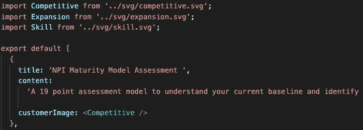

# 关于 GatsbyJS 的一些经验:插件和 SVG

> 原文：<https://medium.com/nerd-for-tech/some-lessons-on-gatsbyjs-plugins-and-svgs-ddddb3246b9?source=collection_archive---------13----------------------->

自从我在上一篇文章中称赞 GatsbyJS 作为静态站点生成器的强大功能以来，作为一个初学者，我在使用这个工具时遇到了一些障碍，我认为分享这些障碍是有帮助的，希望可以帮助其他初学者避免在堆栈溢出上花费大量时间。


# Gatsby 插件和模块错误

我花了几天时间才理解的一个主要问题是，当我试图安装 Gatsby 插件和其他 npm 包时，我不断收到这个错误消息:

```
npm ERR! code ERESOLVE
npm ERR! ERESOLVE unable to resolve dependency tree
npm ERR!....
```

该消息继续基本陈述了各种版本冲突，包括我的 React 版本(v17)和我试图安装的插件。我的“啊哈时刻”部分归功于这个[堆栈溢出](https://stackoverflow.com/questions/66239691/what-does-npm-install-legacy-peer-deps-do-exactly-when-is-it-recommended-wh)解释:

> 由于绝大多数模块没有专门将 React v17 添加为对等依赖项，因此在 v17 React 应用程序中运行 npm 安装时遇到`unable to resolve dependency tree`错误是很常见的。

简而言之，我试图安装的模块不是为与我正在使用的 React 版本一起工作而设计的。因此，安装失败是因为一个或多个模块没有将 React 17 列为 peerDependency —而是列出了旧版本。

**解决方案** : `npm install x --legacy-peer-deps`

默认情况下，NPM v7 会安装对等依赖，因此将此标志添加到您的安装中会绕过自动安装。

您可能想知道什么是对等依赖，以及它们是否不同于常规的 ol 依赖。事实上，它们是——**peer dependencies**是您的 package.json 文件中列出的对象，并且指定您的包与 npm 包的特定版本兼容；它们是模块需要处理的一组版本。**依赖项**是项目所依赖的npm 包。

# 将 SVG 作为组件导入

许多网站采用可缩放矢量图形(SVG)来放大它们的设计和信息。我在尝试将 SVG 复制并粘贴到 React 组件时遇到了一些问题，因为它们的语法与 JSX 不兼容。

为了解决这个问题，假设你没有遇到插件问题，如果你打算在你的站点中包含 SVG 图标，我推荐使用插件`gatsby-plugin-react-svg`。

使用这个插件，您可以将 SVG 保存在您选择的目录中，并将其作为 React 组件导入，如下所示。



这些只是我最初在我的 Gatsby 网站上遇到的几个障碍，随着我继续涉足 Gatsby，我预计将来会遇到更多的障碍，我将继续添加到这个列表中，作为那些经历类似问题的人的简要参考。