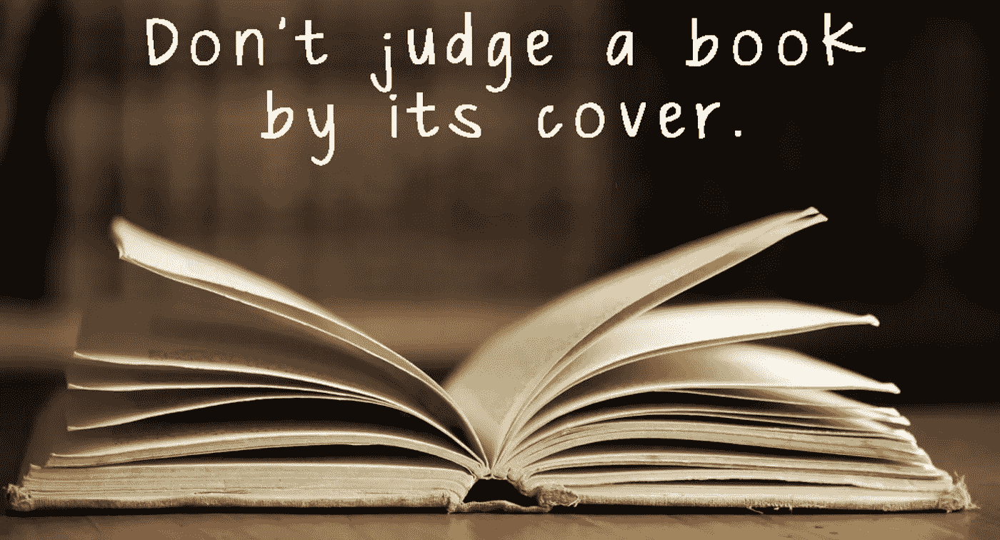
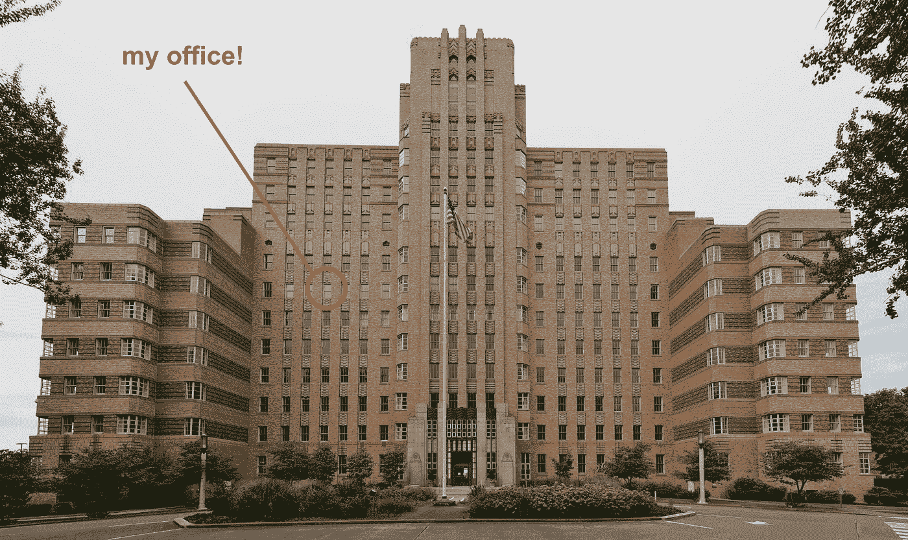
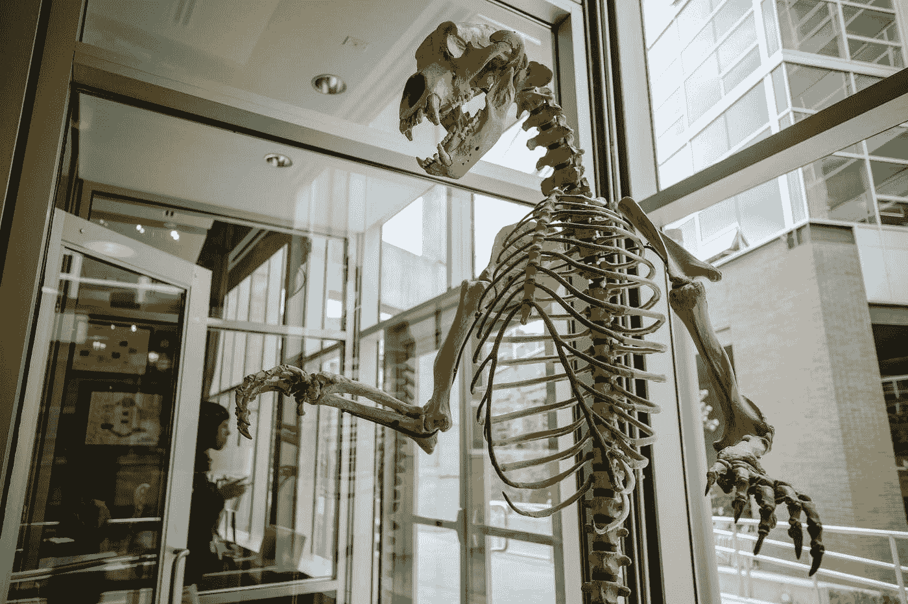
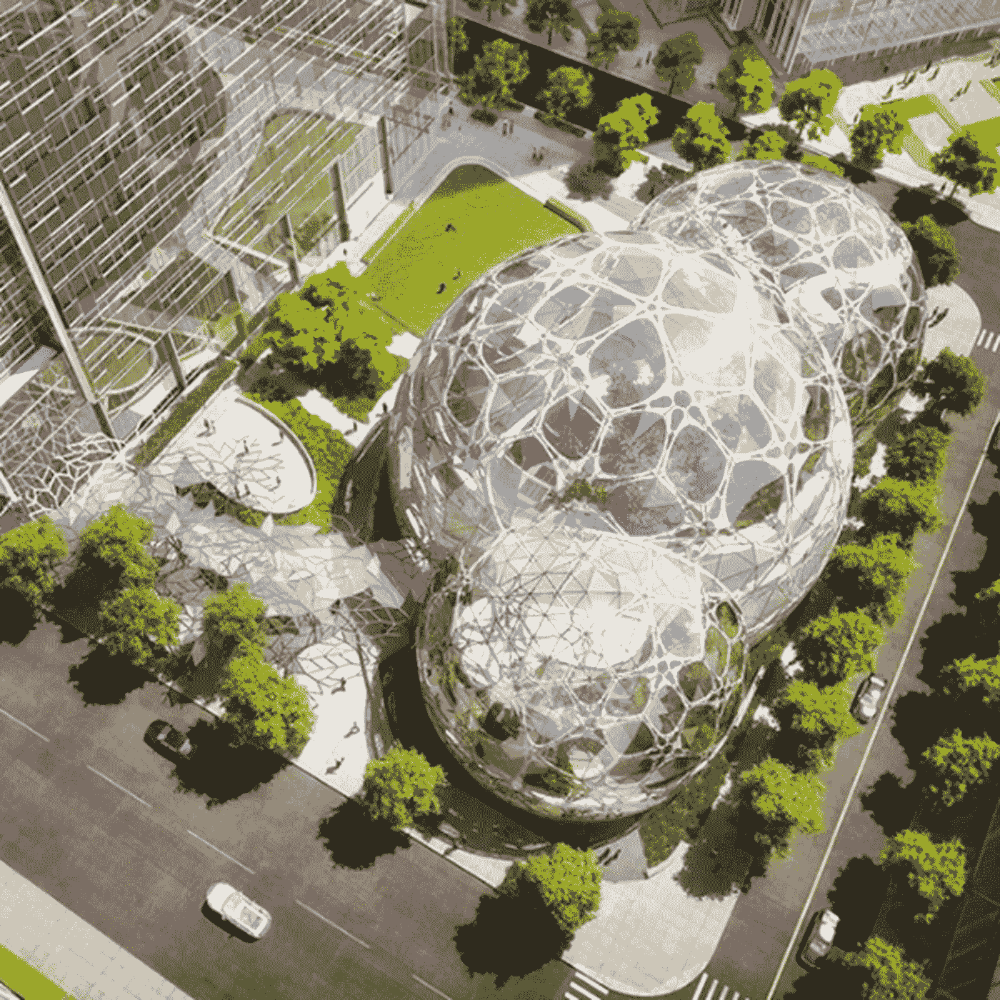
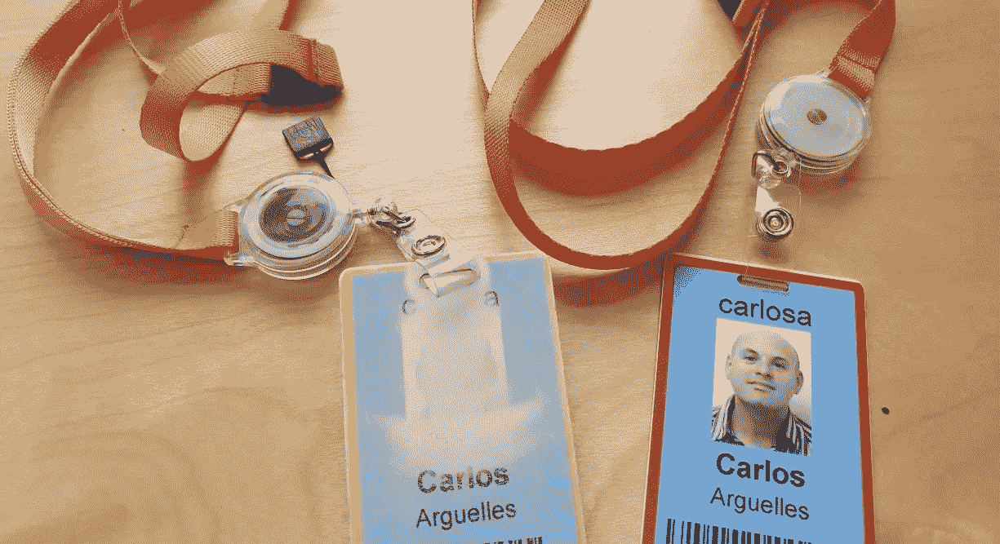

# 有时候你只需要一个信念的飞跃

> 原文：<https://medium.com/nerd-for-tech/sometimes-you-just-need-to-take-a-leap-of-faith-5e1d0da74603?source=collection_archive---------0----------------------->

## 2009 年我如何从微软到亚马逊的故事

几天前，我在微软可爱的私人角落办公室里思考人生的选择，办公室位于华盛顿州雷蒙德市无可挑剔的高档区。像过去 11 年的每一天一样，我开着我的奔驰 S-500，加热座椅轻轻地按摩着我的背部，听着古典音乐，啜饮着一杯完美的拿铁咖啡。然而今天早上，我在街上无家可归者的帐篷和垃圾中漫步，尽量不踩到海洛因注射器。杰克逊街和第五街绝对是西雅图市中心的一个街区。我乘坐的是 358 路公共汽车，这是一条肮脏的牛奶路，在奥罗拉每隔一个街区就停一次，挤满了妓女、吸毒者和打架斗殴的人。我终于去了亚马逊。里面的建筑昏暗幽闭，荧光灯闪烁不定。令人沮丧的一排排紧挨着的桌子。这感觉就像是《乔大战火山》 中的办公室场景。我深吸了一口气。不要以封面来判断一本书，我对自己说，要看得更远。我特意选择了这条路，尽管在那一天，我有了很大的改变。

那是 2009 年 4 月 6 日。为了了解我是如何到达那里的，我将带你回到 2008 年 12 月 31 日。每个新年前夜，我都会做一些自我反省，思考我去过哪里，又将去哪里。由于多种原因，我在微软的日子越来越不开心[。我决定我需要改变。我匆匆完成了我的简历，并发送给了谷歌和亚马逊。不到一周，我就安排好了对两人的采访。对谷歌和亚马逊的面试都很顺利，所以我最终接受了两家公司的邀请。我必须做出选择。](https://carloarg02.medium.com/the-day-i-lost-my-job-at-microsoft-anatomy-of-stasis-f0e2cd653e3a)

谷歌绝对是我的首选。在 2009 年，它是任何人的首选。它一直被评为最适合工作的公司。我在他们柯克兰办公室面试的经历棒极了。和我交谈过的每个人都很好，非常聪明。好处是惊人的。办公室很漂亮，到处都是额外津贴，明亮的颜色和宽敞的空间。该公司正走向成功。喜欢的东西太多了。

我在亚马逊的经历与众不同。办公室很暗。去办公室的公共汽车很暗。津贴是不存在的。从头到尾，这都是一次平淡无奇的经历。甚至我在亚马逊工作了 3 年的朋友也直截了当地告诉我，我会讨厌它。

***于是，我跟亚马逊走了。***

这时候你会停下来仔细想想，心想*这家伙是个白痴吗？*

也许……这肯定是一个出乎意料的选择。但在我下定决心之前，我仔细考虑了几个星期，我知道，*对我来说，*在当时是正确的选择。

*我的选择是有个人原因的。*

我刚从微软的长期停滞中走出来。我变得安逸、懒惰和自满，我的事业停滞不前。谷歌太棒了，太舒服了，我可以看到自己陷入了我试图摆脱的相同的行为模式。这不是谷歌的错，是我的错。另一方面，亚马逊似乎不是一个我会爱上的地方。我想我会在这里工作几年，专注于学习、交付和再次证明自己，*然后*我会去谷歌。离开亚马逊会很容易，因为，嗯，因为我会讨厌在那里工作！

我大错特错了。我最终爱上了亚马逊，并在那里度过了 11 年零 3 个月。我唯一做对的一件事是:我最终去了谷歌，但是是在 2020 年。

我的选择还有其他原因。

在 2009 年，我可以预见云将会成为一种事物。微软没有，它即将错失良机(Azure 花了好几年才赶上)。谷歌也是(GCP 仍在追赶)。但是亚马逊看到了。AWS 本质上是 2009 年亚马逊的一个小初创公司，但我知道它将改变世界。*如果我加入的时候没有加入，我就要后悔了。我必须参与其中。这种机会一生难得。他们的未来激励了我。人们工作的决心和目的给我留下了深刻的印象。*

但这是一个巨大的信念飞跃……2009 年的亚马逊与 2021 年的亚马逊截然不同。今天，亚马逊无处不在，零售，云，设备。它的市值接近 2 万亿美元。它有超过 50，000 名工程师。它是创新的，它在很多方面改变了世界。福利其实是有竞争力的。但在 2009 年，亚马逊是众多销售书籍和其他东西的零售网站之一，有一个相对较小的团队专注于云。它只有 3000 名工程师，与在微软这样拥有 10 万名工程师的庞然大物中工作相比，这是一个巨大的退步。它的市值为 200 亿美元，还不错，但它在互联网泡沫破灭后勉强存活下来，并且没有特别好的利润记录。分析师们一次又一次地一致预测它会破产。然而杰夫·贝索斯没有理会他们，耐心而固执地继续他的设想。我很好奇。

所以，我在 2009 年初加入了 AWS。我的第一个团队是一个 [2-pizza](https://www.theguardian.com/technology/2018/apr/24/the-two-pizza-rule-and-the-secret-of-amazons-success) 团队，最终成长为 AWS [Cloudwatch](https://aws.amazon.com/cloudwatch/) ，AWS [弹性负载平衡器](https://aws.amazon.com/elasticloadbalancing/)和 AWS [自动伸缩](https://aws.amazon.com/autoscaling/)。今天，这些产品中的每一个都有成百上千的工程师支持，并创造了数百万的利润。但那时候只有几个人在会议室里。我在那里的第二份工作是另一个 2-pizza 团队，他们发布了亚马逊关系数据库服务的第一个版本。我记得很生动地讨论了 RDS 将要拥有的 API！仅今天这个组织就有成千上万的工程师，也赚了数百万。我很自豪他们出生时我在场。

2009 年至 2020 年间，我参与的 AWS(和亚马逊)的发展令人眩晕。

但是有很多次，尤其是在 2009 年，我想知道我到底做了什么？

我在每天早上送我去市区的 358 路公交车(今天的 E 线)上经历了许多冒险。这当然不光彩。有一天，我旁边的两个家伙因为一笔毒品交易打了起来，最终一个人拔出刀，刺入了另一个人的腹部。公共汽车司机停下车，冲着他们两个尖叫着让他们下车，其中一个人已经半死不活了。当我们的公共汽车开动时，他们继续在人行道上打架。司机对座位上的一滩血感到恼火，抓起一些纸巾擦了擦。358 号公路上的又一天。我很快学会了不要和车上的任何人有眼神接触。我会坐下来，打开我的笔记本电脑，在 45 分钟的旅程中专注于工作。与我的 S 级奔驰的舒适性和温暖的真皮座椅上的臀部按摩相比，这无疑是一个退步。每天都有人向我兜售可卡因或口交。但是在高峰时间开车去市中心很痛苦，而且在市中心停车很贵，再加上我对碳友好和乘坐公共交通工具而不是开我的油老虎感到自豪，所以我坐了 11 年的公交车。

在巴士上生存是许多挑战中的第一个。亚马逊的建筑(名为 US1 和 US2)位于镇上一个破旧的地方，周围都是无家可归的人。经常有人在大楼外面大便。(人类的气味？)外墙上的尿每天早上都欢迎我到楼里。我特意在天黑前离开。

我无法轻描淡写这一切对我来说是多么的震惊，因为我在一个高档郊区的微软工作了十多年。不过，这让我大开眼界。我一直生活在美国中上阶层的泡沫中，我唯一的朋友是其他微软公司的人，他们的收入舒适地达到了六位数。西雅图市中心是各种文化的大熔炉，收入和生活条件差异很大。我在我的小泡泡里太天真了。这是真实、原始的生活。

US2 就在唐人街旁边，所以在 4 个街区的范围内，我有 30 家很棒的中国餐馆可供选择。大约在那个时候，一些亚马逊的家伙开始了一个博客，对该地区的所有餐馆进行评级，名为[msg 150](http://msg150.com/2007/11/rules-of-game.html)——这是我们每个午休时间探索唐人街的美食指南。

这是我的亚马逊冒险开始的地方

偶尔，Amazon.com 零售网站有多余的东西需要尽快处理掉，所以他们会把一堆不需要的垃圾直接倒在大厅里，你可以随便拿。我最终得到了一大堆我从未听过的晦涩难懂的音乐 CD。

一年后，我把办公室从 US2 搬到了 PacMed，在 Beacon Hill 以南大约一英里的地方。PacMed 是一个 1932 年的装饰艺术怪物，在亚马逊出于某种奇怪的原因选择它作为总部之前，它已经成为医院很长一段时间了。它的确很有个性。

PacMed！亚马逊过去的总部

PacMed 是古怪的，也不是特别迷人。我的小办公室(我和另外一个人共用)*五十年来一直是退伍军人医院的病房*，它的感觉和外观依然如此。几十年来，许多病人死在那栋大楼里，而且有传言说，大楼里经常有他们中一些人的鬼魂出没……没有人愿意深夜在那里工作。我偶尔会莫名其妙地感到脖子后面的汗毛竖了起来。

在其他方面也很奇怪。当你走进大楼时，你看到的第一件东西是杰夫·贝索斯从亚马逊拍卖行购买的[史前冰河时期洞熊骨骼](https://www.breakinglatest.news/health/the-prehistoric-bear-skeleton-at-the-amazon-headquarters-bezos-most-important-lesson-on-failure/)。这是杰夫独特的方式提醒我们，为了创新而尝试和失败是可以的:虽然拍卖导致了一次失败的冒险，但它后来导致了亚马逊市场的成功。这具骷髅现在藏在亚马逊 SLU 园区的范·沃斯大楼里。

每天早上，杰夫·贝索斯的史前冰河时期洞熊骨骼迎接我们！

亚马逊当时非常便宜。我很欣赏他们的节俭，他们欣然接受了这一点，并且非常坦率和自豪。好处是最基本的。津贴是不存在的。当我第一次出差回来时，在 Seatac 国际机场有一个巨大的出租车队伍，我从东欧乘坐经济舱飞了 17 个小时，所以我决定乘坐 70 美元而不是 50 美元的出租车回来。我的经理拒绝了我的费用报告——他的评论是“你应该花 3 美元坐公共汽车”。您只有一台 19 英寸显示器。这是一份六位数的工作，而我们花了 200 多美元买了一台秒钟的显示器，这可以大大提高我们的生产率。但是我们很快学会了如何利用这个系统:你在夏天接待了一个实习生，然后，你可以把这个实习生的显示器作为你的第二个显示器！自然减员还意味着您必须在同事离开大楼的那一刻，在服务台来拿回显示器之前，迅速拿走显示器。我们甚至在团队成员中列出了一份名单，看看谁能拿到我们能找到的显示器。它变成了一个游戏。

今天的亚马逊是一家完全不同的公司，与那些卑微的开端相去甚远。SLU 校区其实很不错。今天的福利出奇的好，包括，是的，额外津贴，如多台大型显示器。2009 年，当我走过那些在破旧的办公室外拉屎的瘾君子时，我想我永远也想象不到，有一天亚马逊会在一个价值 10 亿美元的校园里建造一个未来世界的迷你雨林。

亚马逊 2020…一个不一样的世界！

**然而，当我想起那些早期的日子，我总是微笑。**在 2009 年，亚马逊肯定不是雇主的明确选择。这是可笑的节俭，办公室很糟糕，位置很糟糕，福利也很糟糕。如果我只是根据外表或对我的短期利益来判断我的未来，我会立刻逃离亚马逊。但是在表面之下总有一些东西，强烈地拉着我留下来。我很高兴我做到了。亚马逊给我的职业生涯充了超级电。我想建立一些有意义的东西，影响整个社会，我愿意大胆尝试成为其中的一员。我周围其他亚马逊人的决心和激情激励了我。T4 的环境很紧张，但这让我充满活力。

在你为我和我的基本福利感到难过之前，我做得很好，公司给我的股票在十年内增长了 100 倍，从 40 美元涨到了 3700 美元，还有几次晋升到首席工程师。我 45 岁了，如果我想的话，我可以退休。我建造了一些我引以为豪的东西。我在公司留下了印记。

努力工作，享受乐趣，创造历史。

还有，不要以貌取人。

亚马逊黄边徽章 5 年，红边徽章 10 年