# 索纳库贝

> 原文：<https://medium.com/nerd-for-tech/sonarqube-55660348c987?source=collection_archive---------0----------------------->

**定义**

这是一个开源的静态测试分析软件。开发人员用它来管理源代码的质量和一致性。SonarQube 将计算出的度量值保存在一个数据库中，并在一个丰富的基于 web 的仪表板中展示出来。提供趋势和领先指标。

**工作**

Sonar 使用各种静态和动态代码分析工具，如 Checkstyle、PMD、FindBugs、FxCop、宪兵和许多其他工具来提取软件度量，然后可以用来提高软件质量。提供许多插件。

声纳结构

注意:—上面的图片来自谷歌

**特色**

**1)** **支持语言:** Java、C/C++、Objective-C、C#、PHP、Flex、Groovy、JavaScript、Python、PL/SQL、COBOL 等。(注意其中一些是商业的)

**2)** 也可以用于 Android 开发。

**3)** 提供关于重复代码、编码标准、单元测试、代码覆盖率、代码复杂性、潜在缺陷、评论、设计和架构的报告。

**4)** 记录指标历史，并提供演进图(“时间机器”)和差异视图。

**5)** 提供全自动分析:集成 Maven、Ant、Gradle 和持续集成工具(Atlassian Bamboo、Jenkins、Hudson 等)。).

**6)** 集成 Eclipse 开发环境

**7)** 集成外部工具:JIRA、螳螂、LDAP、Fortify 等。

**8)** 使用插件可扩展。

**9)** 实现 [SQL](https://en.wikipedia.org/wiki/SQALE) 方法来计算[技术债务](https://en.wikipedia.org/wiki/Technical_debt)。

装置

第一步

**转到此链接**[https://www.sonarqube.org/downloads/](https://www.sonarqube.org/downloads/)

第二步

点击社区版下载 SonarQube

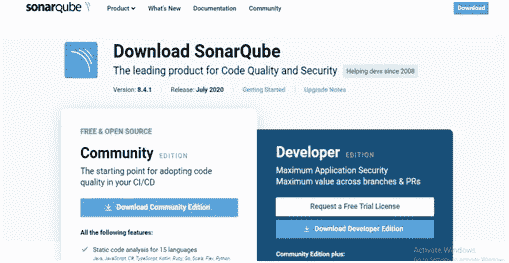

第三步

提取您的文件

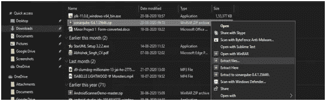

第四步

现在打开你的命令提示符，进入命令提示符下的 SonarQube 文件夹

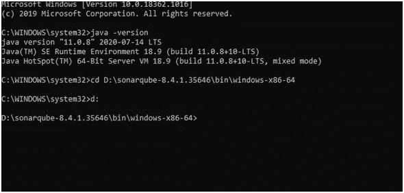

注意:-您的系统应该有 JDK 11 来运行 SonarQube，所以通过运行命令"**JAVA–version**"来检查您的 JAVA 版本

第五步

进入 SonarQube 文件夹后，运行命令“StarSonar.bat”

(这将启动您的 SonarQube)

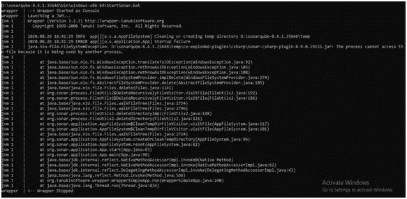

第六步

运行命令后，进入 chrome 并输入:— **localhost:9000**

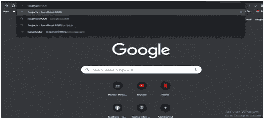

**这将打开您的登录页面(默认 ID- admin，密码- admin)**

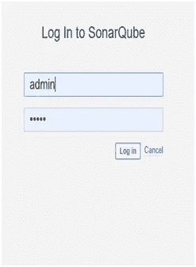

**您的仪表盘将会打开**

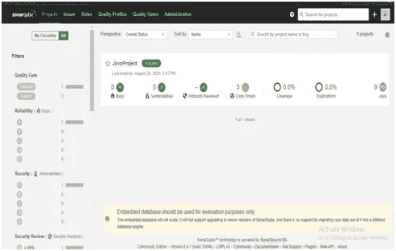

**安装完成！！！！！！！！！！！**

# SonarQube 项目分析

第一步

为了进行分析，你需要下载一个软件“声纳扫描仪”

**前往链接**[https://docs . sonar qube . org/latest/analysis/scan/sonar scanner/](https://docs.sonarqube.org/latest/analysis/scan/sonarscanner/)

第二步

点击你想下载软件的系统 **(** 我在做 [**Windows 64 位**](https://binaries.sonarsource.com/Distribution/sonar-scanner-cli/sonar-scanner-cli-4.4.0.2170-windows.zip) **)**

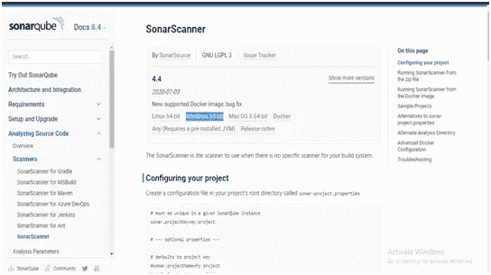

第三步

提取您的文件

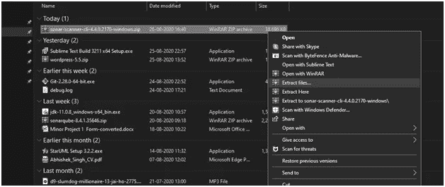

第四步

在 eclipse 上创建一个将用于分析的项目

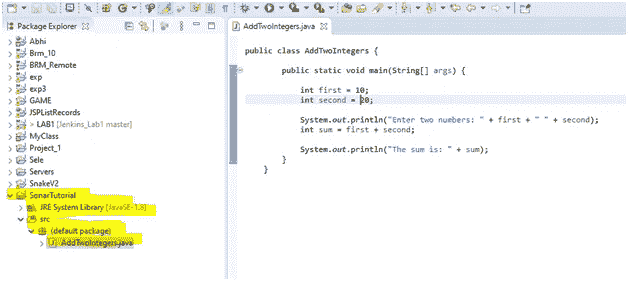

第五步

转到 SonarScanner 配置文件夹，编辑 sonar-scanner.properties

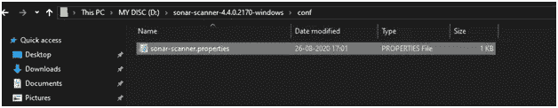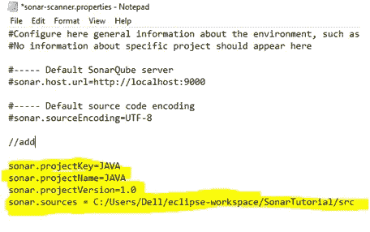

第六步

现在打开命令提示符，转到项目位置并运行命令

**"sonar-scanner.bat"**

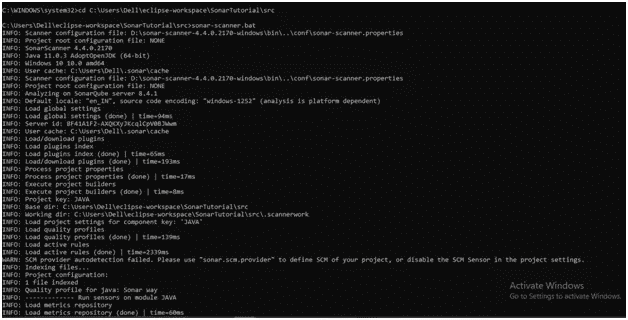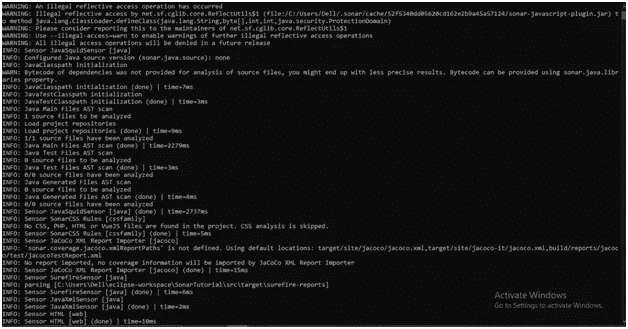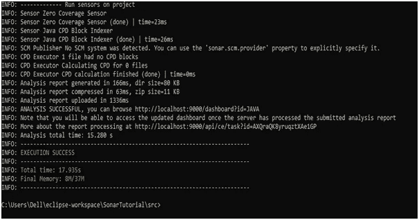

**你将获得执行成功！！！**

第七步

在 chrome 上检查你的“localhost ”,它显示你的项目分析

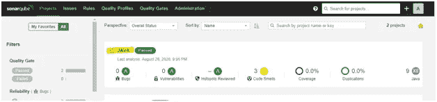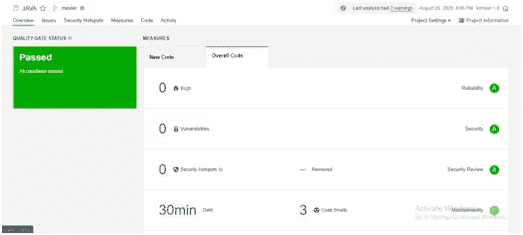

**项目分析完成！！！！！！！！！**