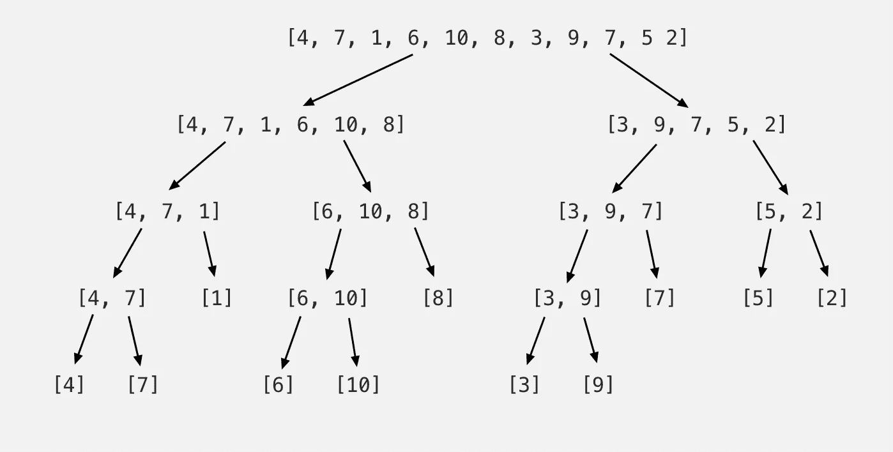
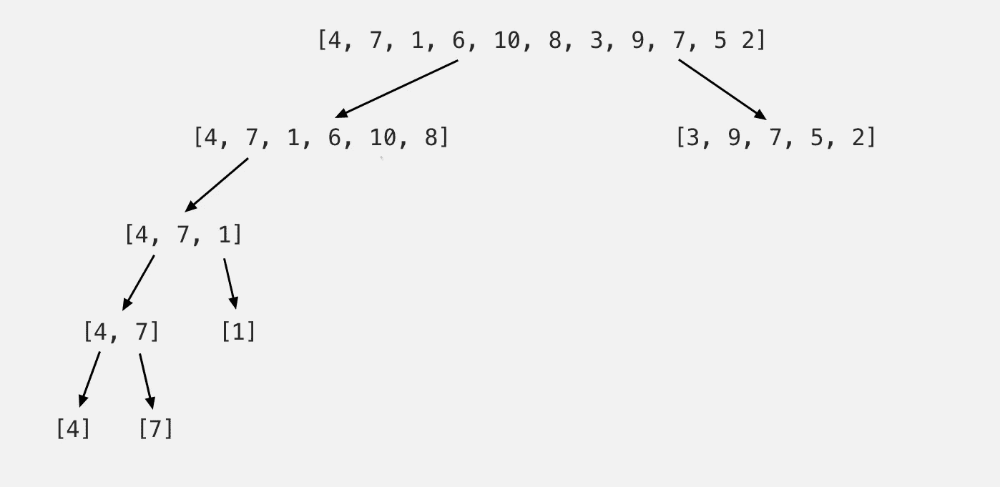
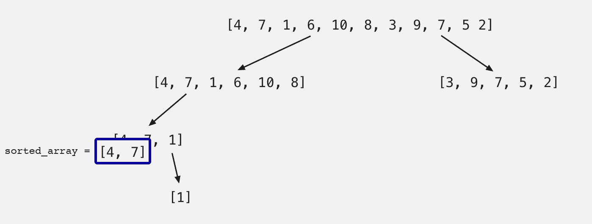
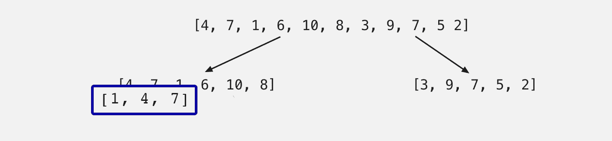
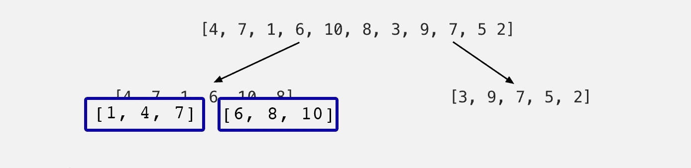

# 排序算法 101:合并排序

> 原文：<https://medium.com/nerd-for-tech/sorting-algorithms-101-merge-sort-d28e98a4080?source=collection_archive---------12----------------------->


由[雅罗米尔·卡万](https://unsplash.com/@jerrykavan?utm_source=medium&utm_medium=referral)在 [Unsplash](https://unsplash.com?utm_source=medium&utm_medium=referral) 拍摄的照片

欢迎回来！今天，我带着我的五部分系列中的第四个排序算法回来了。我们之前介绍过，[冒泡排序](/codex/sorting-algorithms-101-bubble-sort-cfc7df8fb6aa)，[选择排序](/@freda.hon/sorting-algorithms-101-selection-sort-778c201e330a)，以及[插入排序](/geekculture/sorting-algorithms-101-insertion-sort-ee585f6a62cf)。

让我们简单回顾一下前三个，然后直接进入归并排序。

1.  冒泡排序在其迭代中找到最大的*未排序数，并将其移动到数组的末尾*
2.  选择排序在其迭代中找到最小的*未排序数，并将其移动到数组的开头*
3.  插入排序使用一个键，并将其与该键左侧的数字进行比较。如果键左边的数字小于键上的数字，则发生交换。

为了继续今天的合并排序，您需要对递归有一个基本的理解。如果你对它不熟悉，我做了一个快速的帖子，在这里，让你快速了解。

没错。现在我们已经准备好了，让我们进入合并排序！

# 合并排序:工作原理

合并排序通过分而治之来实现。该算法将数组分成两半，调用它自己(使用递归)，并继续这个划分过程，直到每个元素都是它自己的数组。想象一棵树在每次分裂时被制作，每个分支由一个新分裂的列表组成。当单个元素在其自己的列表中时，到达*基本情况*。

在这一点上，该算法然后开始在排序时沿树向上移动，并且*将这些单个元素合并*回到一个*新的*排序数组中。

让我们使用下面的数组来形象化地展示这一点:

```
list = [ 4, 7, 1, 6, 10, 8, 3, 9, 7, 5, 2 ]
sorted_array = []
```

顾名思义，`sorted_array`将是一个列表，当我们沿着树向上工作并进行排序时，我们会将数字添加到这个列表中。它将在我们的排序算法中定义和创建。

该算法首先将该列表分成两半，然后再分成两半，再分成两半，直到达到基本情况:



一下子涵盖所有内容有点混乱，所以我将只着重解释树的左侧。具体来说，左边列表:`[4, 7, 1, 6, 10, 8]`。之后，您可以轻松地对正确的列表应用相同的步骤。请记住，该算法将同时在左侧和右侧工作——从上到下工作(基本情况),然后再次返回*到*。

现在让我们来看看左边列表的最左边部分:



当每个分割列表的左半部分变成单个元素时，就达到了基本情况，并且该单个元素被返回给调用它的人。如果你对前一步如何“调用”它有点困惑，请记住算法中的*递归*性质。

让我们回到上面的例子。原始数组一直向下拆分到[4]。由于[4]是单个元素，不能再拆分，因此到达基本情况，并且[4]返回到上一步[4，7]。

我们现在正在努力。因此，我们现在处于最低水平。由于[7]不能进一步拆分，所以它是基本情况，也返回到[4，7]。

在基本案例返回到上一步之后，将左边列表的第一个元素[4]与右边列表的第一个元素[7]进行比较。两者中较小的一个将首先被追加到新的`sorted_array`中，随后是较大的数字。这将导致`sorted_array = [4, 7]`，然后将返回到前面的步骤【4，7，1】。

到目前为止，我们已经做了很多，让我们来看另一个画面:



当我们从下往上工作时，我们有[1]下一步。[1]是基例，所以返回到[4，7，1]。然后将这两个列表相互比较。

```
to sort: [4, 7] [1]
```

[4]与第二个列表的第一个元素[1]相比较。因为[1]更小，所以它被追加到一个新的`sorted_array`中，并且因为[4，7]已经被排序，我们简单地把它追加到[1]后面。现在[1，4，7]已经排序了，它被返回给调用它的人。* *请注意:每次都会创建一个新的`sorted_array`，因为我们的合并算法被递归调用。



接下来，[6，10，8]将经历完全相同的过程，返回[6，8，10]的 sorted_array:



同样，第一个数组的第一个元素将与第二个数组的第一个元素进行比较。由于 1 小于 6，所以 1 将被追加到新的`sorted_array`中。然后将第一个数组的下一个元素与第二个元素进行比较。4 小于 6，也追加到 1 后面的`sorted_array`中。然后将 7 与 6 进行比较。因为 6 比 7 小，所以 6 被附加在 4 后面……我相信你已经明白了其中的要点。最终，[1，4，6，7，8，10]的`sorted_array`将返回到调用它的原始数组，在那里它将与树右侧的排序数组进行比较。


应用与上面相同的比较和排序逻辑，当一个完全排序的列表返回:[1，2，3，4，5，6，7，7，8，9，10]时，我们的排序算法将最终停止。

# 算法

像往常一样，我将在下面使用 Python，但是请随意使用您选择的语言。

我们将使用两个独立的函数来组成算法:1)设置基本情况并处理数组划分，2)处理排序和合并。

让我们从前者开始，定义我们的基本情况:

```
def divide_arr(arr):
    if len(arr) < 2:
        return arr[:]
```

***注意:* `*[:]*` *创建数组的浅层副本。*

现在，让我们在此 *if* 语句中添加第二部分，以指示部门是否未满足基本情况:

```
def divide_arr(arr):
    if len(arr) < 2:
        return arr[:]
    else:
        middle = len(arr)//2
        list1 = divide_arr(arr[:middle])
        list2 = divide_arr(arr[middle:])
        return merge_sort(list1, list2)
```

`middle`，是中间的数字。它得到数组除以 2 的长度，并将用作索引来帮助将数组一分为二。`list1`表示中间数字左边的元素，而`list2`表示右边的元素。

注意，我们调用的是`divide_arr`本身。这个递归调用将导致每个数组继续分成两半。同时，我们将两个列表作为参数插入到合并函数中。

对于`merge_sort`函数，我们将首先创建新的数组，这样所有排序后的数字都可以追加到其中。我们还将定义另外两个变量，代表我们要比较的两个数组的索引。索引将用于帮助我们在比较过程中遍历每个数组。为了简单起见，我将使用`i`和`j`。

```
def merge_sort(arr1, arr2):
    sorted_arr = []
    i, j = 0, 0
```

为了建立我们的比较，我们将使用一个*if*-语句。

我们知道，如果数组 1 中的元素小于数组 2 中的元素，我们希望将数组 1 中的元素添加到排序后的数组中。否则，如果数组 2 的第一个元素小于数组 1 的第一个元素，则追加数组 2 的元素。所以让我们把这个包括进来:

```
def merge_sort(arr1, arr2):
    sorted_arr = []
    i, j = 0, 0 if arr1[i] < arr2[j]:
        sorted_arr.append(arr1[i])
    else:
        sorted_arr.append(arr2[j])
```

很好，但是因为我们需要遍历每个数组来比较每个元素，所以我们应该添加一行代码，在追加数组中的一个元素后，该代码将索引递增 1:

```
def merge_sort(arr1, arr2):
    sorted_arr = []
    i, j = 0, 0            if arr1[i] < arr2[j]:
        sorted_arr.append(arr1[i])
        i += 1
    else:
        sorted_arr.append(arr2[j])
        j += 1
```

在这个阶段，指数只会向上移动 1，一次。为了让它遍历数组，我们必须抛出一个 *while* -loop:

```
def merge_sort(arr1, arr2):
    sorted_arr = []
    i, j = 0, 0 while i < len(arr1) and j < len(arr2):
        if arr1[i] < arr2[j]:
            sorted_arr.append(arr1[i])
            i += 1
        else:
            sorted_arr.append(arr2[j])
            j += 1
```

太棒了，好多了——但是我们还没有完成。

现在，使用上面的*while*-语句，迭代和比较将一直运行，直到到达任一数组的末尾。这意味着，如果一个数组的长度比另一个长，循环将在所有元素完全排序之前提前结束。

为了解决这个问题，我们需要合并另外两个*while*-语句，以确保迭代在两个数组的长度上继续。

```
def merge_sort(arr1, arr2):
    sorted_arr = []
    i, j = 0, 0 while i < len(arr1) and j < len(arr2):
        if arr1[i] < arr2[j]:
            sorted_arr.append(arr1[i])
            i += 1
        else:
            sorted_arr.append(arr2[j])
            j += 1

    while i < len(arr1):
        sorted_arr.append(arr1[i])
        i += 1

    while j < len(arr2):
        sorted_arr.append(arr2[j])
        j += 1

    return sorted_arr
```

现在让我们把所有的*放在一起:*

```
def divide_arr(arr):
    if len(arr) < 2:
        return arr[:]
    else:
        middle = len(arr)//2
        list1 = divide_arr(arr[:middle])
        list2 = divide_arr(arr[middle:])
        return merge_sort(list1, list2)def merge_sort(arr1, arr2):
    sorted_arr = []
    i, j = 0, 0 while i < len(arr1) and j < len(arr2):
        if arr1[i] < arr2[j]:
            sorted_arr.append(arr1[i])
            i += 1
        else:
            sorted_arr.append(arr2[j])
            j += 1

    while i < len(arr1):
        sorted_arr.append(arr1[i])
        i += 1

    while j < len(arr2):
        sorted_arr.append(arr2[j])
        j += 1

    return sorted_arrlist = [ 4, 7, 1, 6, 10, 8, 3, 9, 7, 5, 2 ]
print (divide_arr(list))
```

# 时间复杂度

树中的每个级别或步骤代表(n)个操作，因此在*每个步骤*的时间复杂度为 O(n)。

因为我们在每一步都将我们的列表分成两部分以产生(n)个列表，所以这等同于 log(n) *总步骤*。

把*的每一步*和*的总步数*放在一起，我们得到(n×log(n))，一个时间复杂度为 **O(nlog(n))** 。

哇，我们做到了。如果你跟随我经历了这一切，那么你应该受到热烈的欢呼！

现在我们已经完成了合并排序，这是我的五部分系列的最后一个排序算法…接下来，快速排序！下次见。