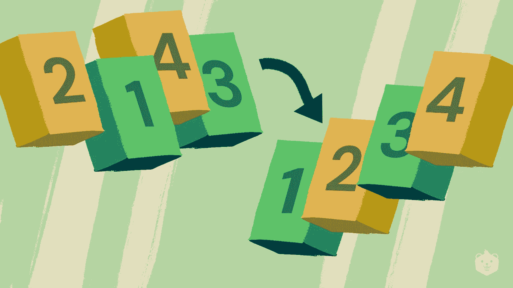
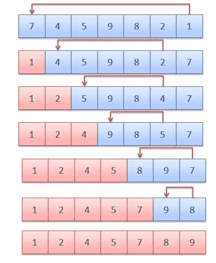
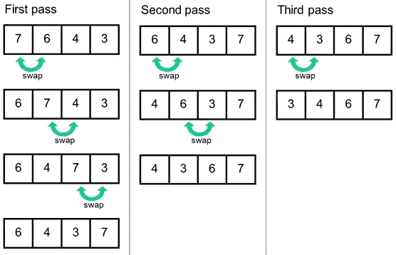
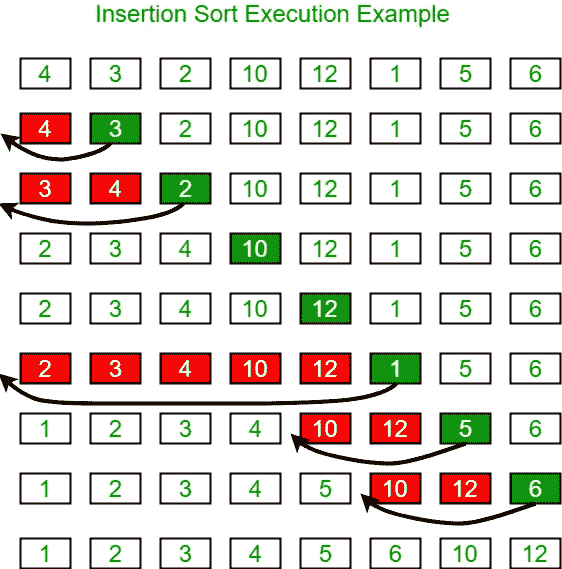
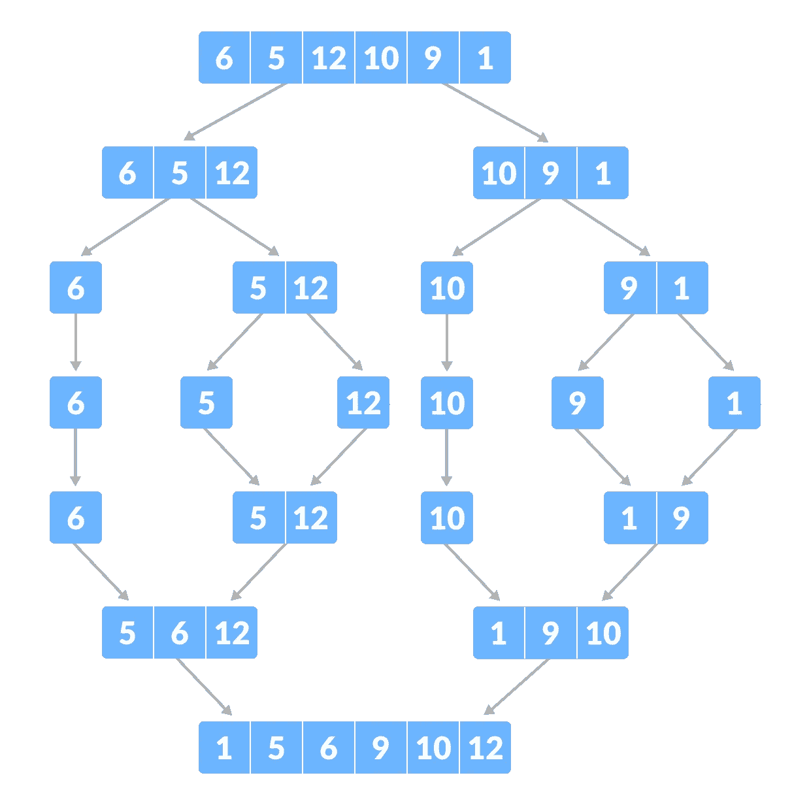
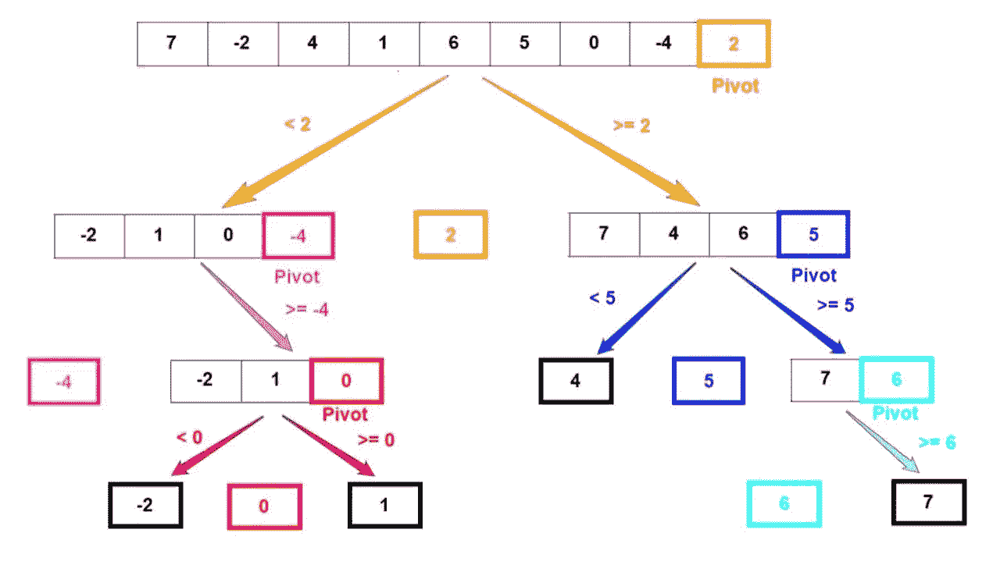

# 排序算法

> 原文：<https://medium.com/nerd-for-tech/sorting-algorithms-20fae8479594?source=collection_archive---------13----------------------->



排序意味着以特定的方式排列数据。有两种类型的排序算法。他们是

1.  迭代排序算法

*   选择排序
*   冒泡排序
*   插入排序

2.递归排序算法

*   合并排序
*   快速排序

# 选择排序

该列表分为两个子列表。

1.  分类的
2.  未分类的

我们从未排序列表中找到最小的元素，并用未排序列表的第一个元素替换它。

在每一次交换(称为排序传递)之后，排序列表中的元素数量增加 1，而未排序列表中的元素数量减少 1。

n 个元素的列表需要(n-1)次排序才能对整个数组进行排序。



蓝色的列表是未排序的列表，粉色的是已排序的数组。

这个数组中有 7 个元素。所以它需要(7–1)= 6 次排序来排序这个数组。

```
void selectionSort(int arr[]){
        int n = arr.length;
        for (int i = 0; i < n-1; i++)
        {
            int min_idx = i;
            for (int j = i+1; j < n; j++)
                if (arr[j] < arr[min_idx])
                    min_idx = j;
            int temp = arr[min_idx];
            arr[min_idx] = arr[i];
            arr[i] = temp;
        }
}
```

# 冒泡排序

这是一种基于比较的算法。我们比较两个相邻的元素，如果它们没有按顺序排列，就交换它们。每次迭代后，排序后的值将设置在未排序数组的末尾。

如果列表中有 n 个元素，平均和最坏情况下的时间复杂度都是ο(n^2。所以，这不适合大型列表。



这是冒泡排序的一个实现。该数组在 3 次迭代后被完全排序。

```
void bubbleSort(int arr[]){
        int n = arr.length;
        for (int i = 0; i < n-1; i++)
        {
            for (int j = 0; j < n-i-1; j++)
                if (arr[j] > arr[j+1])
                {
                    int temp = arr[j];
                    arr[j] = arr[j+1];
                    arr[j+1] = temp;
                }
        }
}
```

# 插入排序

这是一种基于就地比较的算法。位于列表下部的子列表被维护以进行排序。

我们按顺序搜索数组，并将未排序的元素插入到排序后的列表中合适的位置。这个过程一直循环，直到所有元素都被添加到排序后的子列表中。



这是一个显示插入排序如何工作的示例图。

```
void insertionSort(int arr[]){
        int n = arr.length;
        for (int i = 1; i < n; i++)
        {
            int key = arr[i];            
            int j = i-1;
            while(j>=0 && arr[j]>key){
                arr[j+1] = arr[j]
                j = j-1;
            }
            arr[j+1] = key;
        }
}arr[j + 1] = key;
        }
}
```

# 合并排序

这是一种基于分治的排序算法。

## 一般过程

1.  将阵列分成两半
2.  递归地对它们进行排序
3.  将它们合并在一起



```
Mergesort (A,lb,ub){
   Mid = (lb+ub)/2;
   Mergesort (A,lb,Mid);
   Mergesort (A,Mid+1,ub);
   Merge (A,lb,Mid,ub);
}
```

在这里，

*   A = >一个数组
*   lb = >数组的下限
*   ub = >数组的上限
*   Mid = >数组的中间值

# 快速排序

这种排序算法使用分治技术。

## 一般过程

1.  从数组中选择一个枢轴
2.  将数组分成 2 个子数组—元素大于轴心，元素小于轴心
3.  递归地执行步骤 1 和步骤 2，直到数组排序完毕



```
quickSort(arr[], low, high)
{
    if (low < high)
    {
        pi = partition(arr, low, high);
        quickSort(arr, low, pi - 1);  
        quickSort(arr, pi + 1, high); 
    }
}
```

在这里，

*   低= >起始索引
*   高= >结束指数