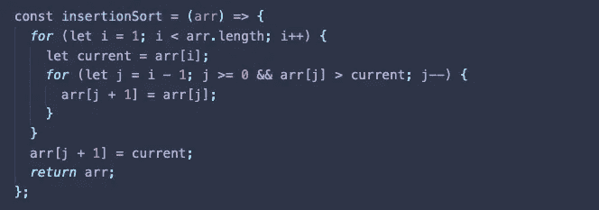
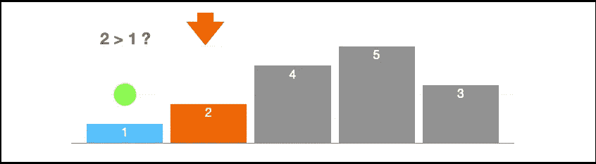
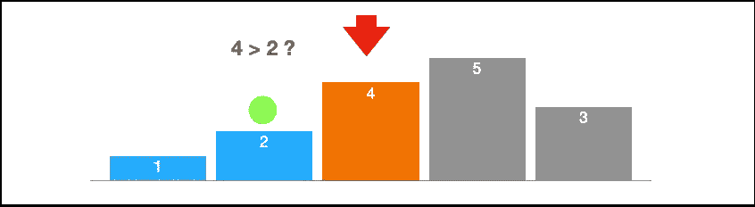
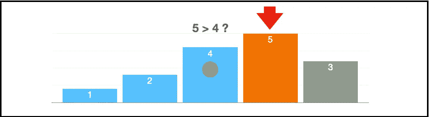
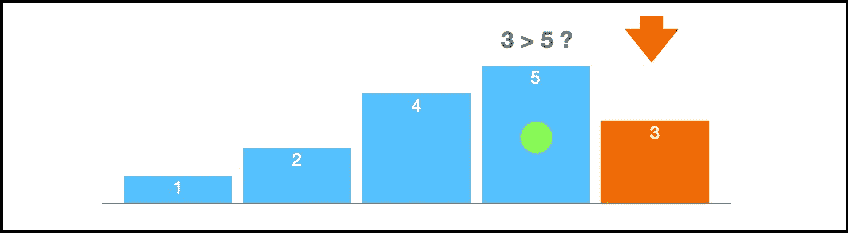
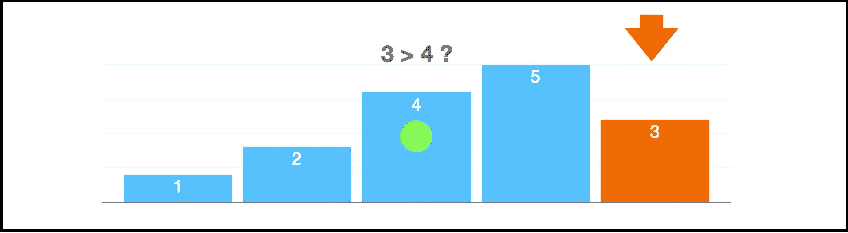
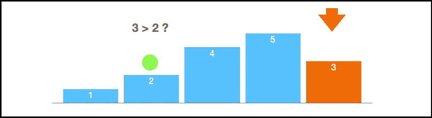
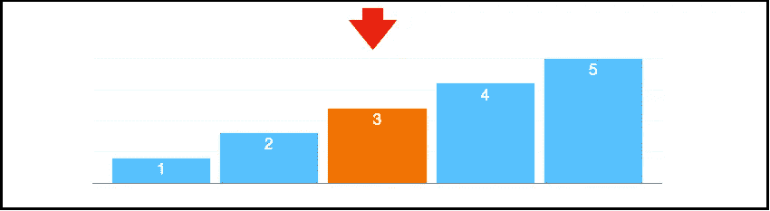
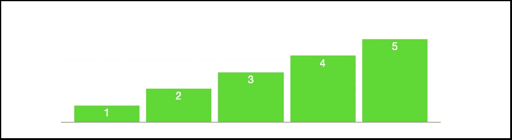

# 排序算法:插入排序

> 原文：<https://medium.com/nerd-for-tech/sorting-algorithms-insertion-sort-e018917d2b1b?source=collection_archive---------23----------------------->

## (Javascript 实现)



插入排序算法

## 时间复杂度:

最坏情况: **O(n )**

## 工作原理:

插入排序的工作原理与选择排序和冒泡排序稍有不同。

为了对数组进行排序，插入排序所做的是创建一个总是被排序的左边部分的假想切片。

这听起来有点复杂，但非常简单。假设我们认为第一个元素已排序，那么这将是到目前为止已排序的切片。
一旦我们将它与第二个元素进行比较，我们就会知道第二个元素与第一个元素相比是否排序。

如果第二个元素大于第一个元素，我们保持不变，否则，我们在第一个元素之前插入第二个元素。

通过这种方式，排序后的切片现在变得更大且已排序，而未排序的部分变得更小。我们只需要继续前进穿过未排序的部分，并找出在哪里插入未排序的元素。

最好的方法是创建一个外部循环，它负责从数组的第二个元素向前移动，直到最后一个元素。和一个嵌套循环，它将比较向后移动的元素。

让我们通过看这些图片来理解它是如何工作的。红色箭头表示外部循环向前移动，绿色大点表示嵌套循环向后移动。以便将当前值与排序后的元素进行比较。(切片部分的表示只是为了更好地理解正在发生的事情，我们并不创建实际的切片)。

[1][2,4,5,3]



因为我们认为数组的第一部分已经排序，所以让我们从第二个元素开始，并与第一个元素进行比较。在这种情况下，2 > 1 是真的，所以我们保持它们那样。

[1,2][4,5,3]



我们可以说数组的第一个切片([1，2][4，5，3])是排序的，所以我们向前移动一个索引，并与前一个进行比较。4 大于 2，所以我们认为它仍然排序。

[1,2,4][5,3]



到目前为止，第一个切片排序为[1，2，4]，我们需要继续比较其余的元素。5 大于 4，所以我们继续前进..

[1,2,4,5][3]



到目前为止，我们的订单片段看起来像这样[1，2，4，5]，现在我们将比较 las 元素。3 大于 5 吗？不，所以我们要把 3 和排序后的部分或者数组进行反向比较。

[1,2,4,5][3]



3 比 4 小，所以让我们继续后退。

[1,2,4,5][3]



3 大于 2 吗？是的，它是。所以我们停止迭代，因为我们找到了插入未排序元素的正确位置。

[1,2,3,4,5]



我们在正确的索引中插入 3。



该数组已排序。

## 伪代码:

```
*// Start from the second index of the array and compare it with the 
   previous one**// Swap if the second element is greater than the previous one. 
   Otherwise just move forward**// Continue to the next element and if is not in the correct order 
   iterate backwards through the sorted part and insert it in the 
   correct spot**// Repeat until everything is sorted*
```

## 代码:

插入排序实现

请在此查看对其他基本排序算法的解释:

*   [*气泡排序*](https://eduru.medium.com/sorting-algorithms-bubble-sort-a49ab9de1d7f)
*   [*选择排序*](https://eduru.medium.com/sorting-algorithms-selection-sort-e14651a1a262)