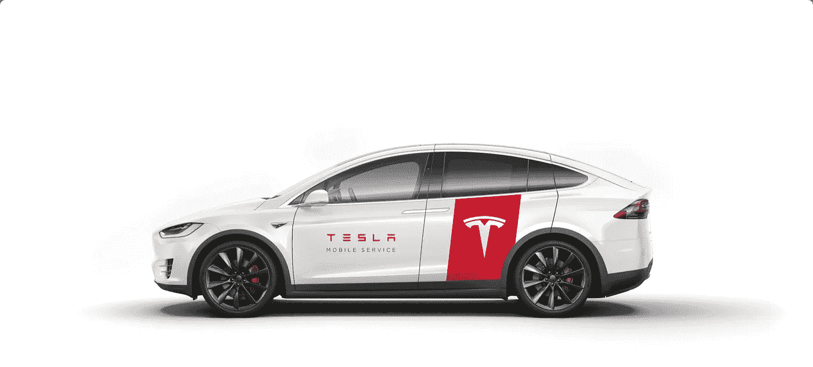

# 以前听不到的声音

> 原文：<https://medium.com/nerd-for-tech/sounds-where-there-were-none-before-93841f1fdd0c?source=collection_archive---------0----------------------->

对于非常规汽车(电动和混合动力)制造商来说，许多人可能认为是卓越和商品的特征，已经成为一个大问题。他们的车辆太安静了！

没有意义或者…是吗？

嗯，**如果你看看统计数据，电动和混合动力汽车造成的行人事故比传统汽车多 40%**,其中一个主要原因是…