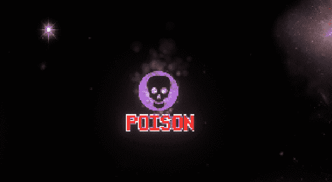
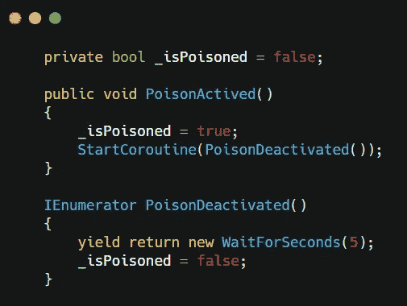
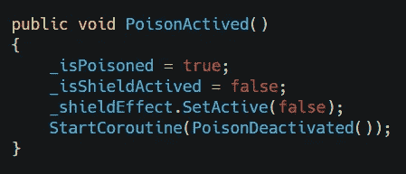
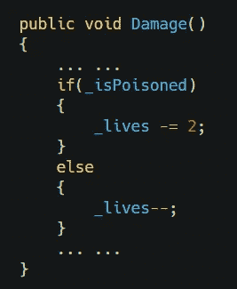
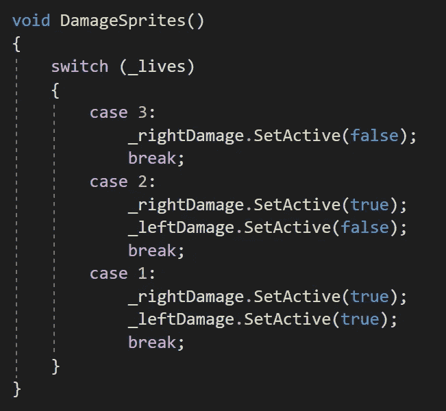
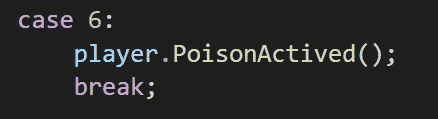
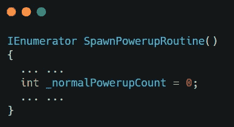
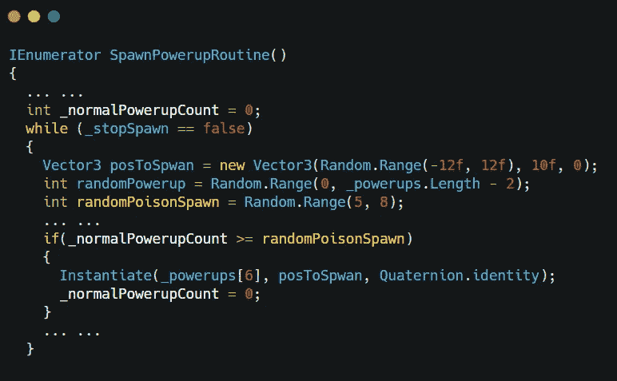
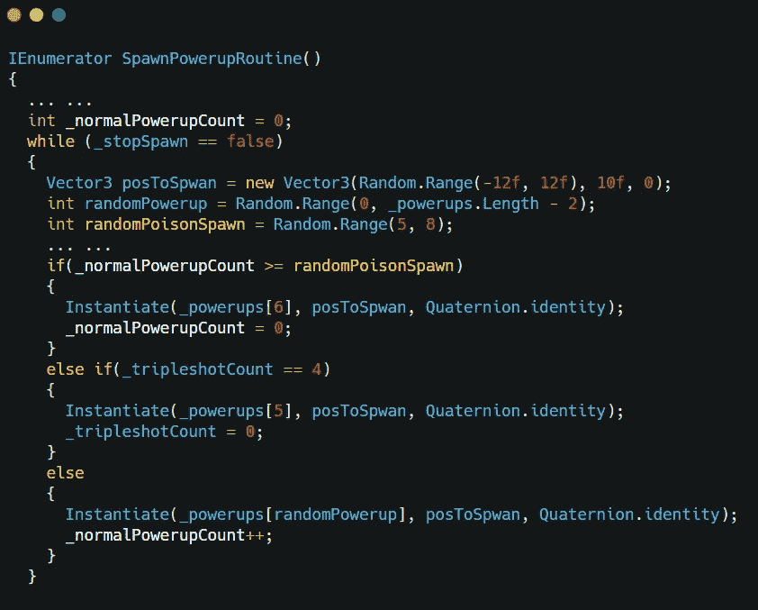
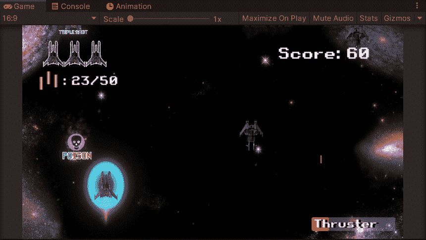

# 太空毒素来袭！-游戏开发系列 43

> 原文：<https://medium.com/nerd-for-tech/space-poison-incoming-game-dev-series-43-eb4ec025270d?source=collection_archive---------25----------------------->

目标:在游戏中制造负面能量。

通电并不总是好的。当玩家很忙的时候，消极的激励应该是一个分散玩家注意力的陷阱，让玩家受到更多的伤害。

在这篇文章中，我将跳过一些[以前的](https://sj-jason-liu.medium.com/feeling-like-a-real-video-game-game-dev-series-15-1b2ffa8e46d0) [文章](https://sj-jason-liu.medium.com/ammo-collected-game-dev-series-36-5bc21edaa6fa)中相同的预制创建部分。我们将跳转到编码和调整一些现有的脚本。

## 运动员

我们应该弄清楚毒药的作用是什么？作为一个负面的力量，我会让我们的玩家中毒后受到双倍的伤害。更有甚者，它还会使护盾失去保护。有了这个想法，我们现在应该准备编码了。

在播放器中，我们将创建一个公共方法来处理毒药。首先，我们需要一个布尔。用这个魔法，我们可以在中毒时制造一个 5 秒的效果。

并且在这个方法中添加 2 行来禁用屏蔽。

然后我们可以在**伤害()**中设置毒药效果。

有点残忍…

接下来我们应该调整伤害动画，因为我们的生命可能会从 3 跳到 1，我们需要让它更合理。

在这个调整中，当生命值为 1 时，左右两边的伤害动画都会被激活。

接下来，我们可以设置加电 ID。

## 通电

在这个脚本中，我们需要做的就是在 switch 语句中创建另一个 ID case。

不要忘记在编辑器中添加毒药预置和设置 ID。

接下来是毒的产卵规律。

## 产卵管理器

我们应该使毒药的产卵频率比别人少一些。为此，我们需要一个整数变量来进行计数。

在 **SpawnPowerupRoutine()** 中创建一个 int 变量。

我们可以设置一个随机范围来随机化毒液的产卵时间。然后在 if 语句中生成它。在这个语句中，当计数大于随机化数时，毒素产生。

当我们产生毒素时，我们可以清除正常能量的计数。

然而，使用这个 if 语句，我们可能会同时产生 2 个加电。为了防止这种情况，我们可以将 firework shot 语句和其他语句合并成一个语句。

不要忘记在最后一行的正常加电计数中加 1。

全部完成！我们现在可以品尝毒药了！

下一个:[多么狡猾的敌人！](https://sj-jason-liu.medium.com/what-a-tricky-enemy-game-dev-series-44-502c7e361010)