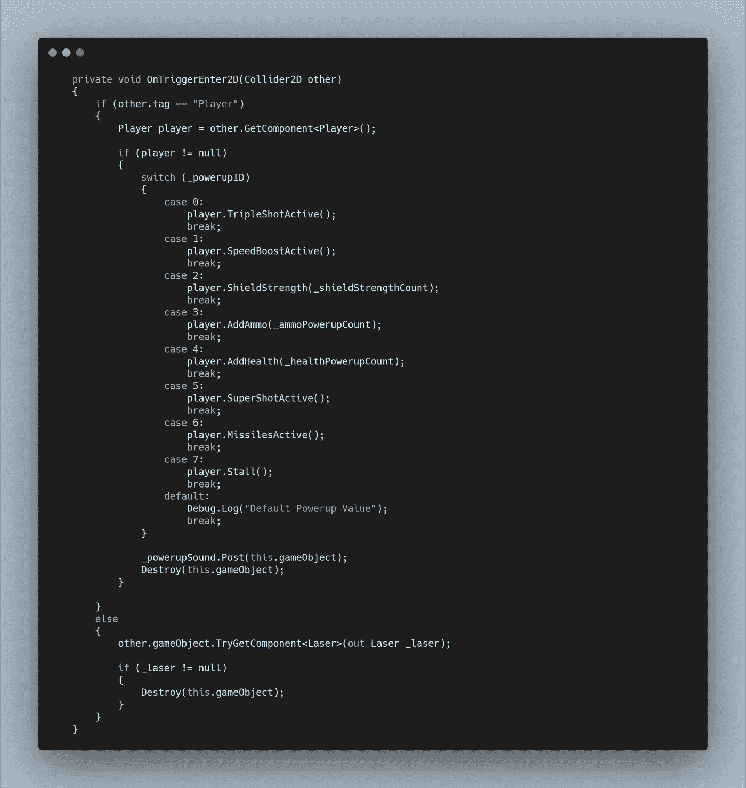
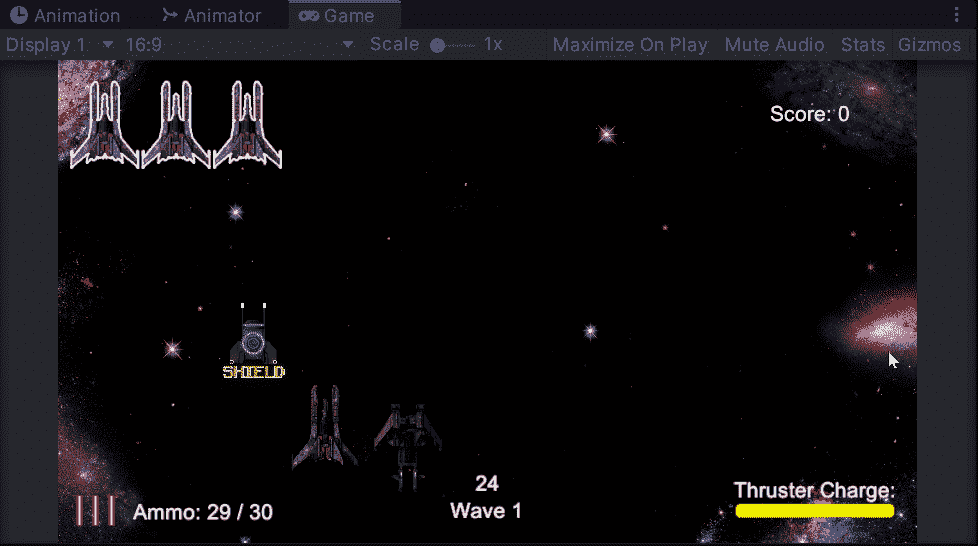

# 太空射击挑战:摧毁电源

> 原文：<https://medium.com/nerd-for-tech/space-shooter-challenge-destroying-powerups-5b1b78d7b5e1?source=collection_archive---------25----------------------->

今天的挑战是让敌人察觉到他们面前有能量，然后开枪摧毁。

我的敌人已经向前开火了，所以我对这个挑战的解释是，只是为激光的任何实例创建逻辑来摧毁电源，包括玩家自己的激光。

为了创建这个，我向 **Powerup 的 OnTriggerEnter 方法添加了一个 **else 语句**。**然后，我可以使用 **TryGetComponent** 返回**激光脚本**，如果它存在于与之碰撞的物体上。如果是这样，电源将被破坏。

现在作为一名球员，你必须更加小心地射击！

