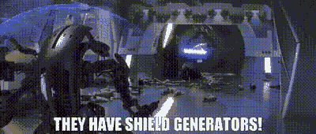
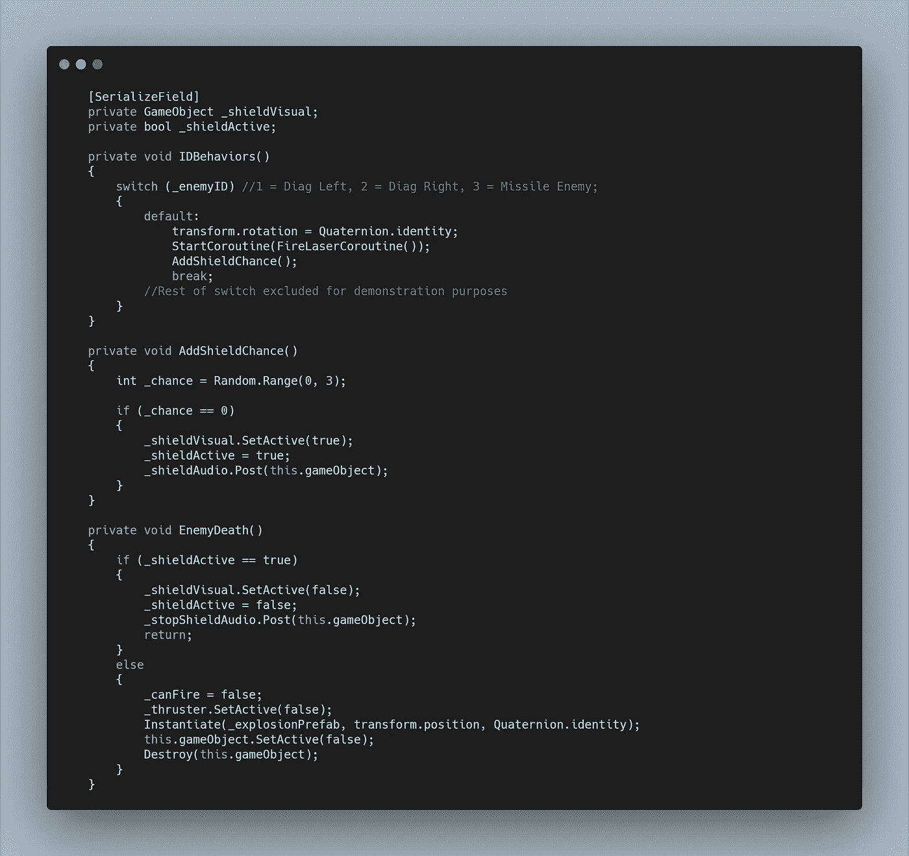

# 太空射击挑战:敌人的盾牌

> 原文：<https://medium.com/nerd-for-tech/space-shooter-challenge-enemy-shields-7ecaee317c1c?source=collection_archive---------21----------------------->

下一个挑战是增加一些敌人来获得盾牌。我决定我只是想让标准的敌人现在有这个机会，最初是 1/5 的机会，但经过测试，有点低。所以我选择了三分之一。我是这样做的。

首先我需要将现有的**盾牌**复制到**标准敌人**上，然后我将颜色改为红色并将其设置为非活动状态。然后在**敌人脚本**中，我可以得到一个对象的引用，并运行一些逻辑来激活它。

在我的 **IDBehaviors Switch 语句中，**我在**默认情况下调用了一个新的**方法**，因为它处理我的标准敌人。我将这个**方法称为 AddShieldChance。****

该方法简单地创建一个介于 0 和 3 之间的随机数，由于是 **int 值**，最大值是唯一的，因此选项为 0、1、2。

接下来，如果那个数字恰好是 0，我可以将**屏蔽**设置为**激活。**我还需要设置一个 **bool，**来进行损害检查。现在在**敌人死亡方法**中，我可以在禁用护盾之前检查它是否激活。否则，我会使用死亡函数。

