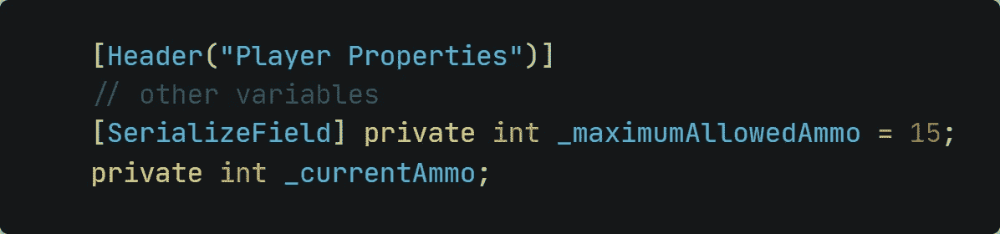
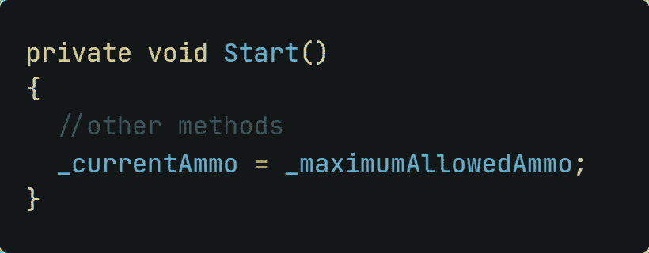
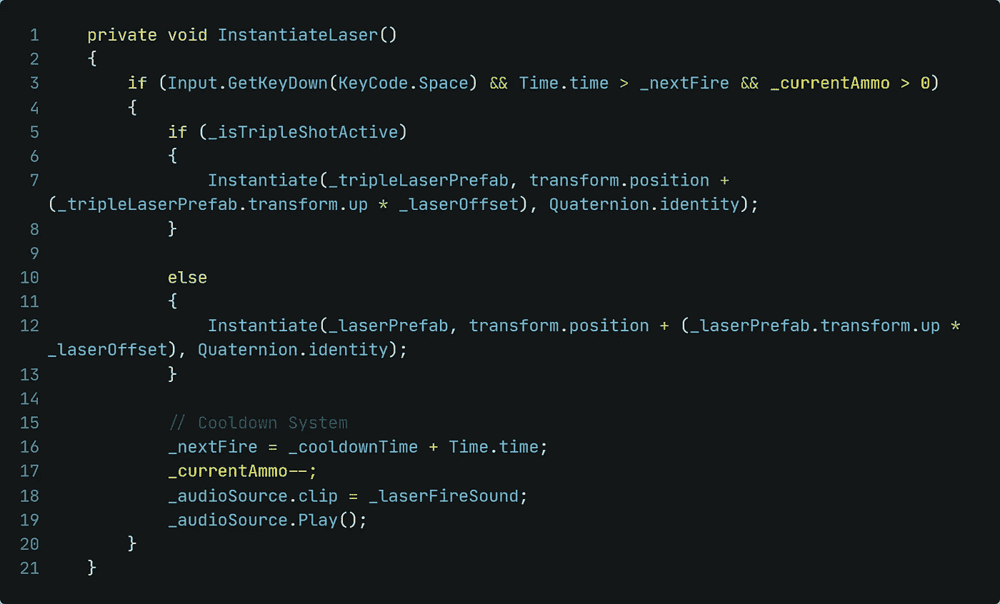
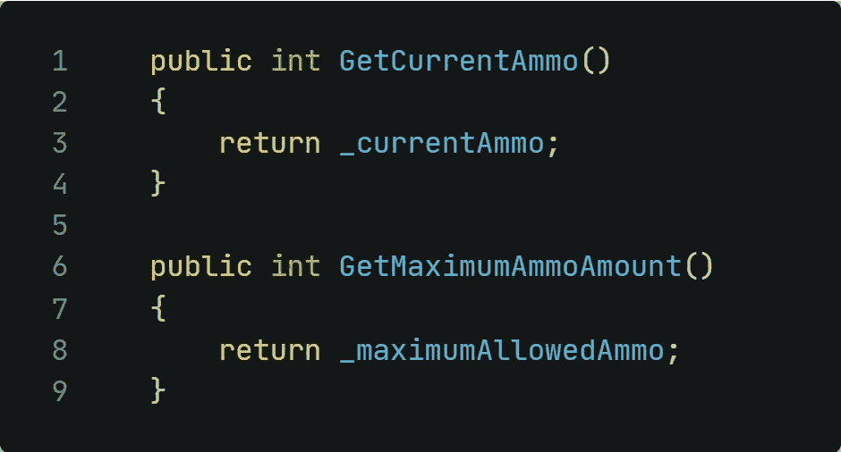
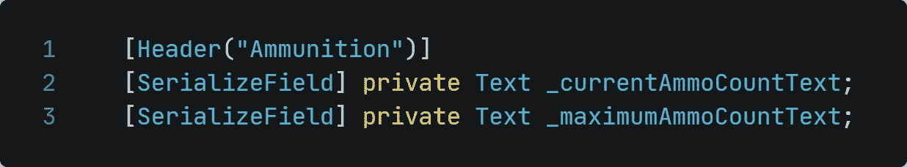
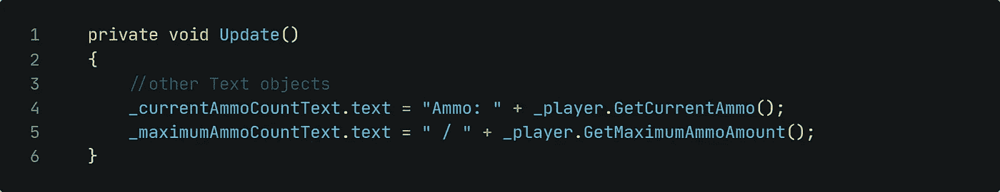
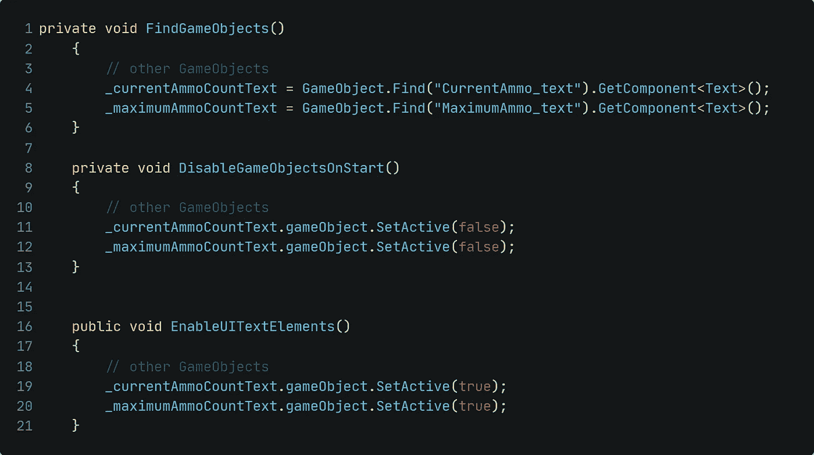
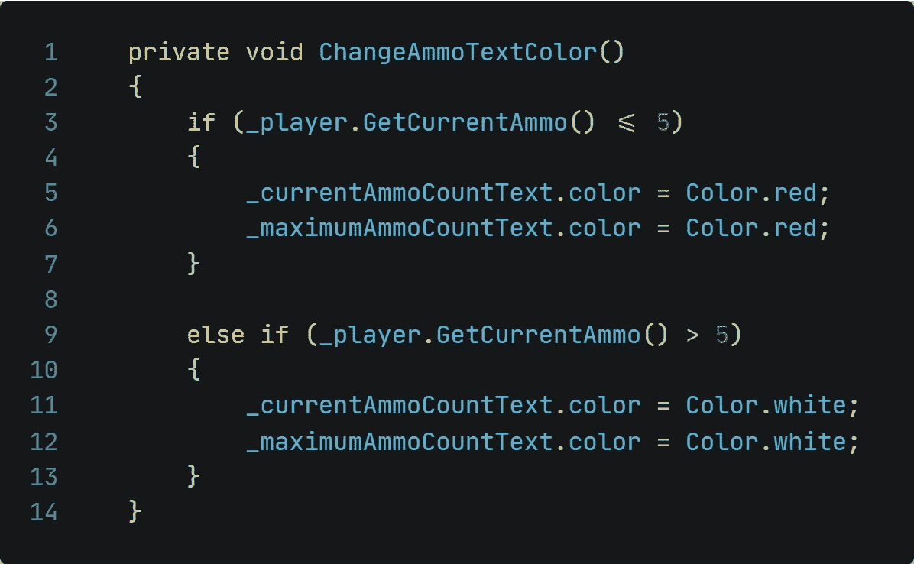
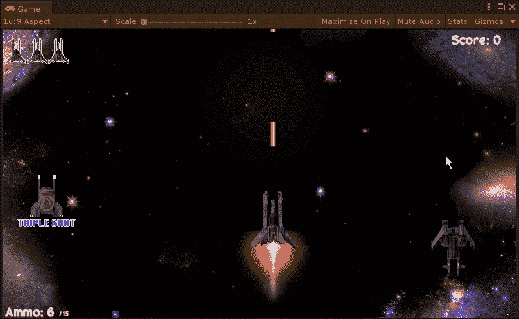

# 太空射手:限制玩家的弹药

> 原文：<https://medium.com/nerd-for-tech/space-shooter-limiting-the-ammo-of-the-player-5e55e574be57?source=collection_archive---------20----------------------->

## 给玩家一点挑战！

没有挑战的游戏算什么？我不能说出一个没有挑战的游戏。即使是休闲游戏也有挑战。不要误解我，挑战是游戏中很棒的东西。让我们为玩家增加一个弹药限制！

**设置 Player.cs 脚本**

***一、变量*** 一如既往，我们需要变量作为逻辑的基础。我们需要一个显示最大允许弹药，一个显示玩家当前可用的弹药。

***二世。在游戏开始的时候，我们应该确保给玩家最大数量的弹药。***

接下来，我们应该确保玩家只能在剩余可用弹药的情况下射击。为此，我们只需在实例化激光器之前检查当前弹药是否大于零。如果是这样的话，我们发射一束激光，从现有的弹药中减去一束。

*变更以黄色字体突出显示。*

我们想显示当前和最大弹药作为一个 UI 文本元素。要做到这一点，我们需要两个新方法，一个返回当前可用的弹药量，另一个返回最大允许的弹药量。

**设置 UIManager.cs 脚本**

***I .变量*** 此处程序相同。我们需要一个变量来告诉 UIManager 我们想要操作哪些文本元素。

***二世。修改现有的方法*** 我们想改变文本来表示当前可用的弹药量，并说明允许的最大弹药量。因此，我们需要访问刚刚创建的文本变量的文本组件:

***三世。细节*** 细节工作重要！是的，在游戏开发中也是。考虑我们想要实现的以下内容:

*   我们也应该通过检查游戏对象名来分配脚本中的文本变量
*   玩家应该只看到开头的小说明文本，没有其他 UI 元素
*   玩家拍摄完小行星后，UI 元素应该会出现在屏幕上

如果您愿意，还可以更改文本颜色。假设我们想在玩家还剩 5 发或更少弹药的时候将文本颜色改为红色。为此，我们必须访问弹药"*文本"*游戏对象的颜色属性

**最终结果** 这是弹药文本颜色改变后的最终结果:

