# 可视化火花连接类型

> 原文：<https://medium.com/nerd-for-tech/spark-join-types-visualized-30d784068c8a?source=collection_archive---------4----------------------->

oin 是任何数据分析或整合过程中不可或缺的一部分。根据 ***连接类型*** ，通过比较一个或多个列(读取键)以及连接条件将左、右两组数据集合在一起，以确定最终输出，该输出可以包含来自左、右或两者的数据。

Apache Spark 提供了以下连接类型，

1.  **内部**联接(左右数据集中关键字匹配的记录)
2.  **外部**连接(左或右数据集中关键字匹配的记录)
3.  **左外部**连接(左数据集中带有键的记录)
4.  **右外部**连接(右数据集中带有键的记录)
5.  **左半部**连接(左数据集中的记录与右数据集中的匹配键)
6.  **左反**联接(左数据集中的记录与右数据集中的键不匹配)
7.  **自然**连接(使用数据集之间的隐式列匹配完成)
8.  **交叉**连接(左右数据集的笛卡尔乘积)

让我们创建一些数据来演示各种连接。

我已经创建了 2 个 data frame(names df，typesDF ),可以使用' **Id** '列将它们链接起来。这是它们的样子，

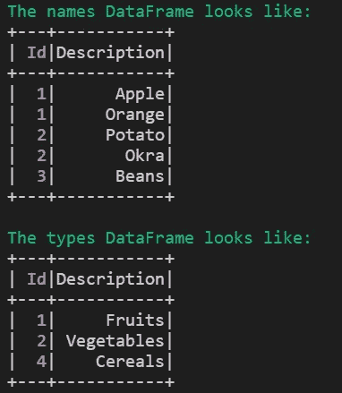

我将更多地关注 DataFrame APIs，因为 SparkSQL 的语法与任何其他 SQL 都相似。使用 DataFrame APIs 进行连接的语法是，

```
DataFrame1.join(DataFrame2, [on=keys], [how=joinType])
```

*连接条件和连接类型可选。****data frame 1****称为* ***左侧*** *和****data frame 2****称为* ***右侧***

# 内部联接

这是默认连接，即如果没有提及连接类型，Spark 将执行内部连接。只有那些左右两个数据集的键匹配的记录才会被提取到输出中。不存在于两个数据集中的关键字被忽略，即不显示/输出。

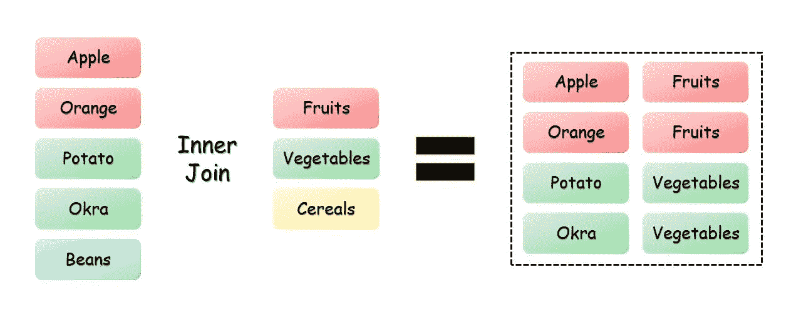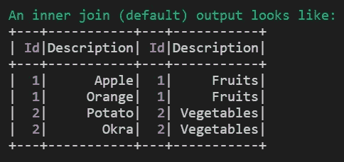

# 外部联接也称为完全外部联接

来自左侧和右侧数据集的记录都包括在输出中。在键与**不匹配的地方，空值**被插入。

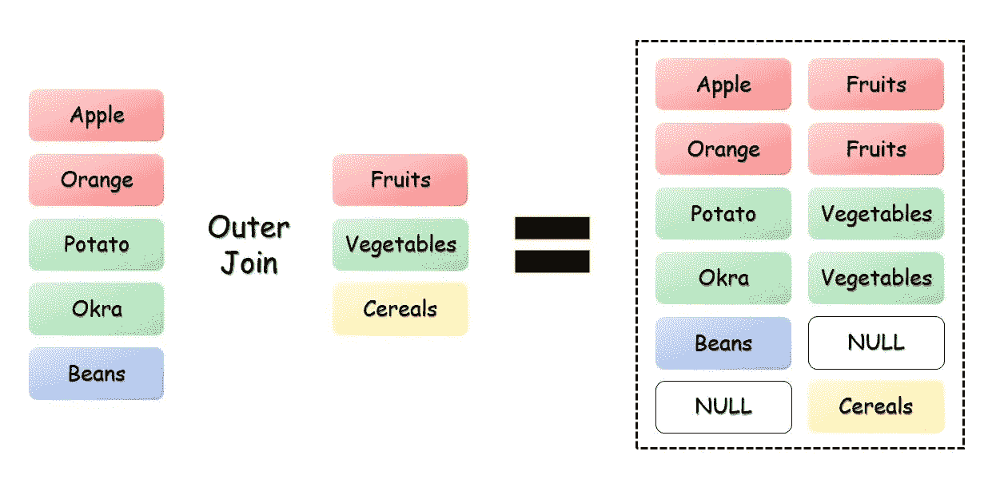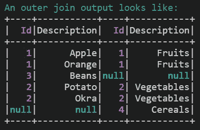

# 左连接也称为左外部连接

左侧数据集中的所有记录都是输出的一部分。右数据集中的记录包含在匹配键的位置。对于剩余的**，空值**被插入。

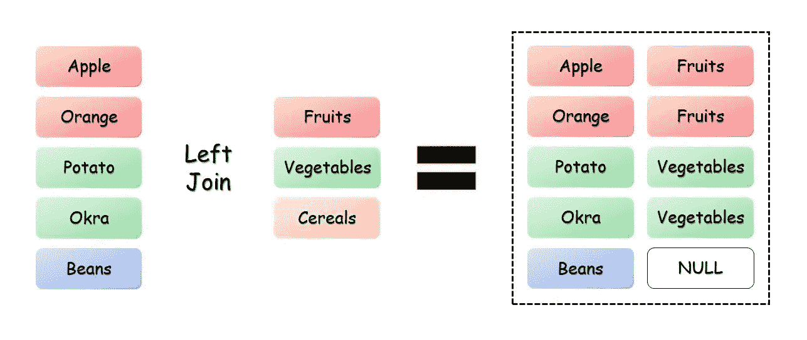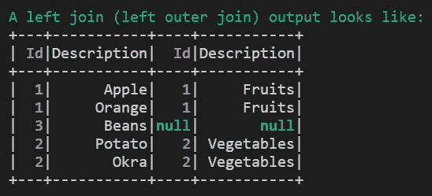

# 右外部联接也称为右联接

右侧数据集中的所有记录都是输出的一部分。左侧数据集中的记录包含在匹配键的位置。剩余的空值被插入。

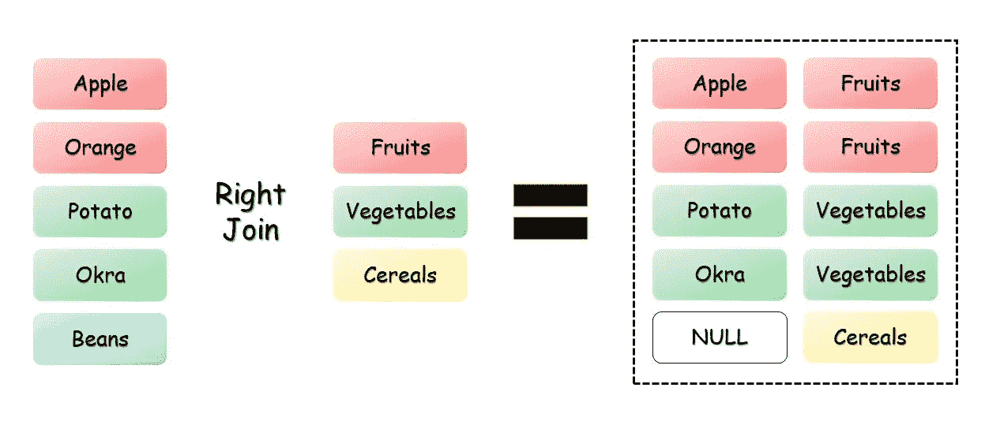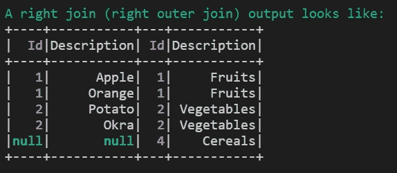

# 左半连接

只有左侧数据集中的记录在右侧数据集中具有匹配键，才会被包括在内。如果左侧数据集有重复项，则输出将包含重复项。它可以被看作是一个过滤器，而不是一个连接。我们根据右边数据集中的匹配关键字过滤左边的数据集。

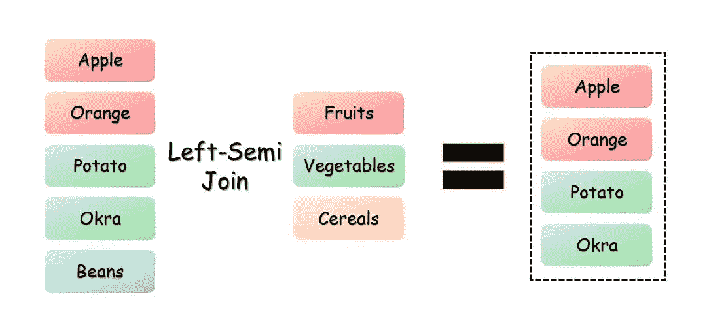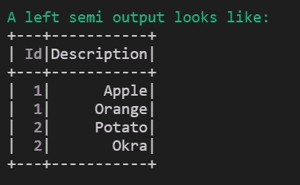

# 左反连接

与左半连接相反。
只有来自左侧数据集中的记录被包括在内，而这些记录在右侧数据集中没有匹配的关键字。类似于 NOT IN SQL 筛选器。

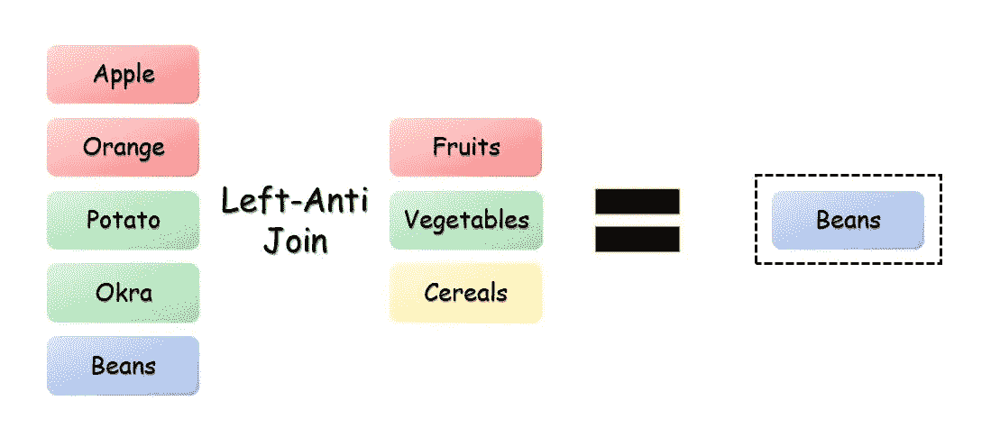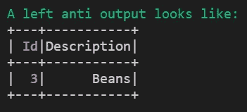

# 自然连接

当使用自然连接时，Spark 试图隐式地猜测要连接的列。隐式连接总是有风险的，因此应该谨慎使用这种连接。*此外，它仅在 Spark SQL 中可用，在 DataFrame APIs 中不可用。*

# 交叉连接又名笛卡儿积

左侧数据集中的每条记录都连接到右侧数据集中的每条记录。这导致了爆炸🎆记录的🧨。如果我们交叉两个各有 1000 条记录的数据集，那么结果输出将是 1000 * 1000 = 1，000，000 条记录。这很容易导致 OOM 错误。
但是可能存在这样一种有效的情况，即您想要生成两个数据集的每一种可能的组合。所以为了避免混淆，你可以使用**交叉连接**方法显式地调用它。

*注意:我认为作为预防措施，避免创建可能导致应用程序崩溃的笛卡尔乘积，低于 3.x 版本的 Spark 默认将交叉连接配置设置为 False。您将得到如下所示的错误(在 v2.4.4 上检查)，它将要求您显式地将****spark . SQL . cross join . enabled****设置设置为* ***True。*** *从 v3.x 开始，该设置默认设置为 True。*

```
pyspark.sql.utils.AnalysisException: 'Detected implicit cartesian product for INNER join between logical plans
Join condition is missing or trivial.
Either: use the CROSS JOIN syntax to allow cartesian products between these relations, 
or: enable implicit cartesian products by setting the configuration 
variable spark.sql.crossJoin.enabled=True;'
```

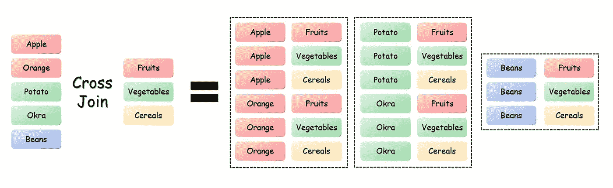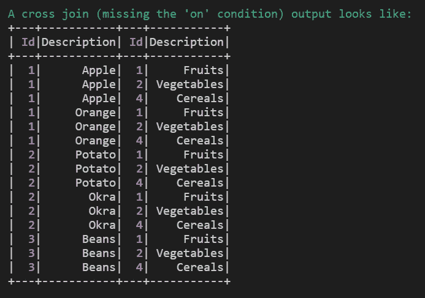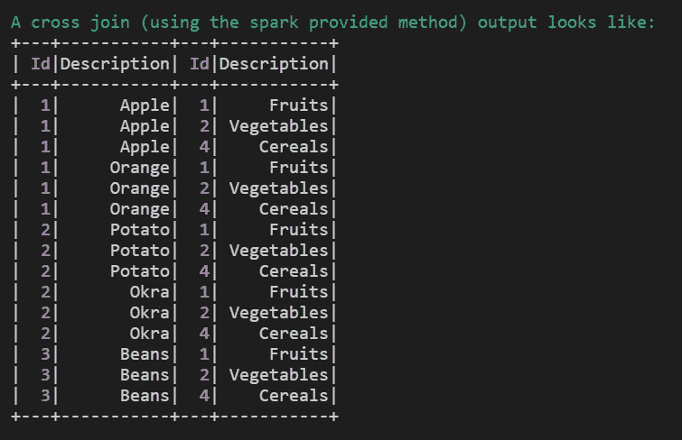

# 笔记

1.  许多关于 SQL 连接的维恩图没有沟通的一件事是，如果在您的源中有重复，它们将会出现在您的连接输出中

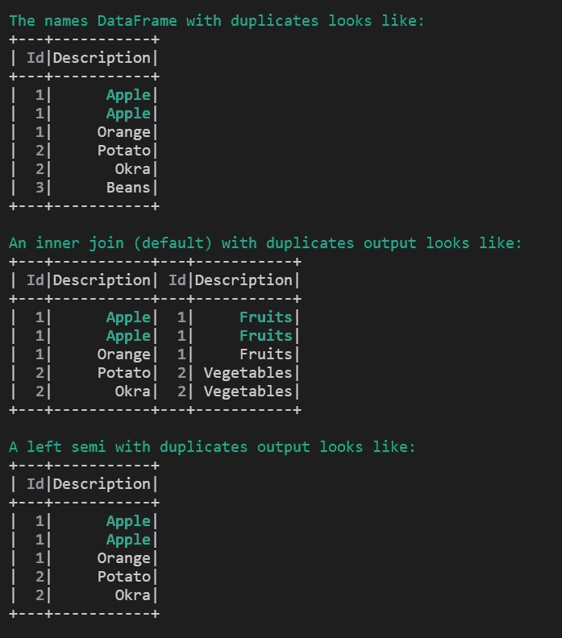

2.通常你连接的键不会包含空值。但是如果你想在空键上连接，那么你可以在连接条件中使用 **eqNullSafe** 选项。

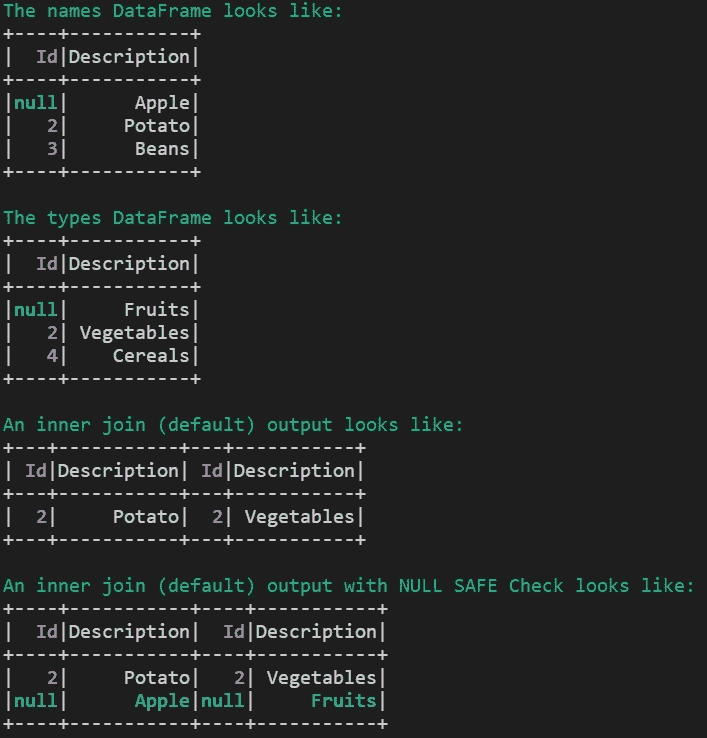

感谢您花时间阅读这篇文章。祝你愉快😃

# 参考

1.  [火花文件](https://spark.apache.org/docs/3.1.1/api/python/reference/api/pyspark.sql.DataFrame.join.html)
2.  [堆栈溢出](https://stackoverflow.com/questions/41728762/including-null-values-in-an-apache-spark-join)
3.  [Stackoverflow 空安全检查](https://stackoverflow.com/questions/41728762/including-null-values-in-an-apache-spark-join)