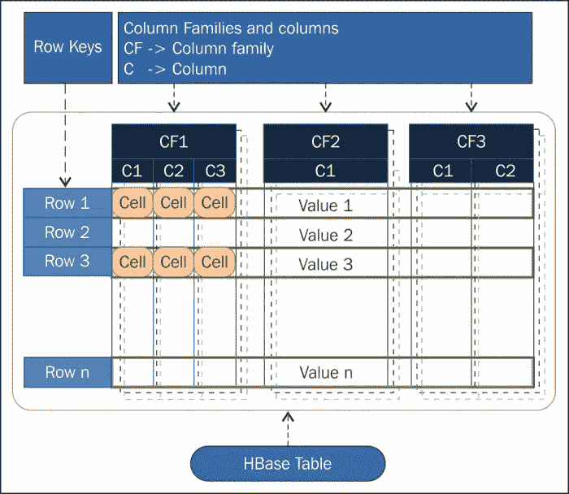
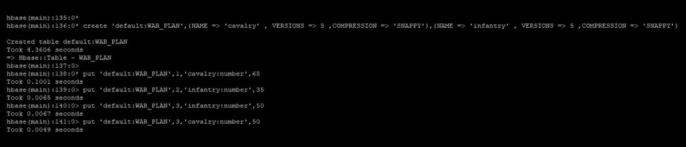

# 使用数据帧对 HBase 表进行 Spark 读写

> 原文：<https://medium.com/nerd-for-tech/spark-read-from-write-to-hbase-table-using-dataframes-5c3b585c161?source=collection_archive---------0----------------------->

## 有可能使用结构化的 API 来操作非结构化的数据吗？


如今，对 NoSQL 数据库的需求变得非常迫切，我们用不同的形式和结构操作数据，HBase (Hadoop Base)就是为了满足这种需求而创建的，它建立在 HDFS (Hadoop 分布式文件系统)之上，提供了跨多个节点的基于对象的数据的分布式存储。

与任何其他 NoSQL 数据库类似，HBase 将数据表示为由字段(列)组成的对象，每个对象(相当于关系数据库中的一个数据行)都有一个唯一的键(比其邻居多或少的列)。

此外，Hbase 引入了列族的概念，将相关数据分组在一起，以实现更优化的读写操作。下图为我们提供了有关此事的更多细节:



每个行键都被编入索引，以执行快速数据检索和更新操作。

我希望你喜欢这个简短的介绍，很明显，HBase 有很多有趣的功能，从数据分布，NoSQL 数据表示，到对更新操作的支持，它真的很酷，对吗？尽管我们仍然没有提到非常重要的一点，特别是在生产环境中，如何将其与现有的大数据环境集成？

为了缩小答案的范围，我想在本文中重点讨论 Spark-Hbase 集成，Spark 几乎存在于任何集群部署中，它被认为是最受欢迎的大数据工具之一，因此，很明显它们最终会相互交流。

HBase 有一个用于数据操作的默认 API，提供的主要方法如下:

*   **扫描**:扫描一定范围的行
*   **获取**:使用一个键获取特定的行
*   **Put** :在表格中插入一行

Hbase-Spark 社区支持这种低级交流:

 [## Apache HBase 参考指南

### 13.4.1.注意变化！首先，我们将介绍升级到 HBase 时您可能会遇到的部署/运营变化…

hbase.apache.org](https://hbase.apache.org/book.html#_basic_spark) 

它可以很好地处理小规模的数据，但是，对于大数据集，性能问题会一个接一个地出现，相信我，当我第一次开始使用 HBase 时，我也经历过类似的情况。

我们已经走到了路的尽头，有什么解决办法？，如何既保留 NoSQL 的好处，又不以牺牲性能为代价？

Spark 不是无缘无故地如此受欢迎，它有一个丰富的社区，当我第一次在工作中面临这一困难时，它让我的日子变得很糟糕，但最终，我找到了解决所有问题的方法，一种以优化的方式读写 HBase 的方法，这是在 Spark DataFrames 的帮助下。

我希望现在我已经引起了你的注意，你很想知道解决方案是什么？让我们一起来发现吧。

# 从 HBase 读取数据

公园数据帧是数据的结构化表示，支持类似 SQL 的操作，以同样方式与 HBase 交互的关键是在对象字段和我们的数据帧列之间创建映射

为了详细说明我们的用例，我们首先使用 HBase Shell 创建一个测试表，然后用一些数据填充它:



我创建了两个纵队家族**骑兵**和**步兵**(我是古代战争的忠实粉丝)，表格的全扫描显示了可用的数据:

```
hbase(main):154:0> scan 'default:WAR_PLAN'ROW                                    COLUMN+CELL1        column=cavalry:number, timestamp=1609327934978, value=652        column=infantry:number, timestamp=1609327954343, value=353        column=cavalry:number, timestamp=1609327983183, value=503        column=infantry:number, timestamp=1609327965760, value=50
```

现在，让我们编写一些 Spark 代码来检索这些数据，在下面的例子中，我将使用 Scala 编程语言，我为 Python 爱好者道歉，尽管使用 Pyspark 也可以做到这一点:

我们首先启动 Hbase 和 Spark 之间的连接，HBase 完全依赖于 [Zookeeper](https://zookeeper.apache.org/) 进行节点间的状态通信，因此，首先，我们提供其相关的仲裁(运行 Zookeeper 服务器的主机列表)和客户端端口。

```
import org.apache.hadoop.hbase.spark.HBaseContext
import org.apache.hadoop.hbase.HBaseConfigurationval conf = new HBaseConfiguration()    conf.set("hbase.zookeeper.quorum", "hostname1,hostname2...")  conf.set("hbase.zookeeper.property.clientPort", "2181") 
new HBaseContext(spark.sparkContext, conf)val hbaseTable = "default:WAR_PLAN"val columnMapping = """id string :key,        
                      |infantryNumber string infantry:number,        
                      |cavalryNumber string cavalry:number"""
                      .stripMargin val hbaseSource = "org.apache.hadoop.hbase.spark" 
```

HBase 表是指我们正在尝试加载的表，其格式遵循以下语法:

***命名空间:表名***

映射是一个逗号分隔的列表，每个元素格式遵循以下规则:

***DataframeColumnName 类型 column family:HbaseColumnName***

最后，hbaseSource 对应于负责确保 Spark 和 HBase 之间通信的库，为了使用它，应该将下面一行添加到您的 **sbt** 依赖项中(我使用的是 [Cloudera CDH](https://www.cloudera.com/products/open-source/apache-hadoop/key-cdh-components.html) 提供的库):

```
libraryDependencies += "org.apache.hbase" % "hbase-spark" % "2.1.0-cdh6.3.4"
```

下面是相应的 Maven 库，如果你使用的是包管理器而不是 **sbt :**

[](https://mvnrepository.com/artifact/org.apache.hbase/hbase-spark) [## maven Repository:org . Apache . h base " h base-spark

### 编辑描述

mvnrepository.com](https://mvnrepository.com/artifact/org.apache.hbase/hbase-spark) 

现在，让我们将已经定义的参数合并到一行代码中，并将我们的数据加载到 DataFrame 中:

```
val hbaseData = sql.read.format(hbaseSource).option("hbase.columns.mapping", columnMapping).option("hbase.table", hbaseTable)val hbaseDf= hbaseData.load() 
```

这项工作几乎完成了，我们的配方变了一些魔术，这是我们的数据看起来像这样:

```
+-------------+--------------+--------+|cavalryNumber|infantryNumber|  id    |+-------------+--------------+--------+|           65|          null|   1    ||         null|            35|   2    ||           50|            50|   3    |+-------------+--------------+--------+
```

这是一个 spark 结构化数据帧，表示实际驻留在 Hbase 中的数据，这真的很酷，Spark 数据帧 API 对我们来说已经完全可用(Hbase 数据帧上的一些操作将被排除，如 joins…，进一步的解释将在单独的文章中提供)。

# 将数据写入 HBase

一旦创建了相应的 spark 数据帧，写入 Hbase 表将不再困难(这正是我们在上一步中所做的)。

我们将使用与之前相同的 Spark-Hbase API，它不仅有助于读取，而且可以将使用 Hive sql 查询构建的结构化数据帧写入具有非结构化模式的 Hbase 表中。

我已经准备了一个有两列和几行的 Hive 表，下面是表的内容:

```
hive> select * from work.war_planid      infantrynumber   cavalrynumber4             56              75             6               996             50              27
```

回到编码的时候了，我们首先在我们的 Hive 表的顶部构建一个 spark 数据帧:

```
val hiveTmp = spark.sql("select * from default.war_plan") 
val columns: Array[String]= hbaseDf.columns
val hiveDf = hiveTmp.select(columns.head, columns.tail: _*) hiveDf.createOrReplaceTempView("hiveDataframe")
```

然后，我们使用 Spark-SQL insert 语句将数据从 Hive 数据仓库移动到 Hbase 存储中:

```
val insertStatement = "insert into hbaseDataframe select * from hiveDataframe"spark.sql(insertStatement)
```

这里所有的魔法都发生在引擎盖中，Spark 首先将 insert 语句翻译成它的对等 Hbase put 方法，然后，使用 Hbase Spark 原生 API 运行生成的指令，[此链接提供了一个示例代码](https://hbase.apache.org/book.html#_basic_spark)。

Spark-Hbase Dataframe API 不仅易于使用，而且还极大地提高了读写性能。事实上，在连接建立阶段，每个 Spark 执行器直接与同一本地节点上的 Hbase 区域通信，因此读写操作以分布式模式执行。

# 结论

我们通过本教程设法与 NoSQL 数据库交互:Hbase 通过 Spark Dataframe API，完整代码在我的 [GitHub 库](https://github.com/bechirnahali/hbase-spark-integration)中提供。

我希望你觉得这个帖子有用，内容丰富，不要忘记在评论区讨论它，欢迎所有问题，谢谢你的阅读。