# 产卵管理器

> 原文：<https://medium.com/nerd-for-tech/spawn-manager-a7c0e6446b2a?source=collection_archive---------19----------------------->

在本文中，我将解释我通过使用一种称为协程的强大方法来实现 Space Shooter 项目的基本 Spawn 管理器的步骤。通过将产卵的敌人分配给一个新的父代，我们保持了层次概观的整洁，并防止它聚集。我们还将学习如何创建一个玩家脚本的引用，以防止玩家死亡时产卵管理器产生敌人。

## **产卵管理器脚本**

通过创建一个繁殖管理器，我们可以自动繁殖我们的敌人，这样我们就不必在场景中手动设置他们。

首先为产卵管理器创建一个新的脚本，并将其附加到一个名为 ***【产卵管理器】*** 的新的空游戏对象上。

现在让我们把我们想要生成的敌人预置存储到一个私有的游戏对象变量中。在新的 SpawnManager 脚本中，我们通过创建一个*private****GameObject _ Enemy Prefab 来创建一个对敌人预设的引用；***

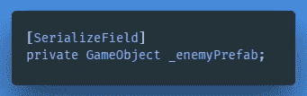

然后将敌人预置从项目窗口拖到检查器的种子管理器脚本的新位置。

为了产生敌人，我将向你介绍一个新概念，**协程**。

这是一种特殊的功能，可以等待**根据**给出的指令**执行其功能，并在下一帧从停止的地方恢复。**

协程能够包含一个名为 ***Yield*** 的语句，任何类型的让步，包括 null，都会导致执行返回到后面的帧，除非协程已经停止或者已经完成。

在我们设置协程之前，我们需要一个布尔类型***_ stop spashing***，默认设置为 **false** 。

为了设置我们的协程，我们创建了一个类型为 ***IEnumerator*** 的方法***【method name】***，其中我们将建模一个 ***while()*** 循环，如果***_ stop spasing***设置为 false，该循环将运行它的代码。

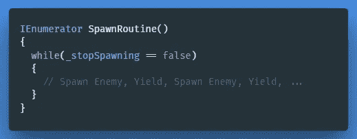

在 ***while()*** 循环中，我们声明我们想要实例化哪个对象，并定义一个新的产卵位置及其方向。现在，我已经为我们实例化的敌人分配了一个随机的位置到新的产卵位置。

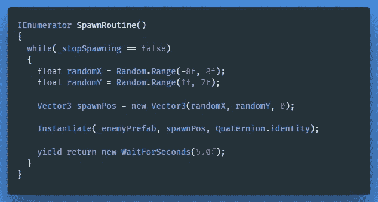

最后，我们使用***Yield return new WaitForSeconds(5.0f)***语句来指示重新运行代码之间的暂停。在我们的例子中是 5 秒。

由于 ***while()*** 方法中的代码在循环中运行，我们还需要一个单独的函数来启动实际的协程方法。

在 ***Start()*** 函数中我们在游戏开始时启动我们的 ***SpawnRoutine()*** 。

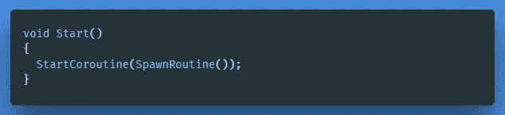

> **重要提示:**虽然协程在代码清晰性和声明多个帧的行为方面非常出色，但由于协程的 CPU 代码总是出现在跟踪中的两个位置，它们会带来更高的内存开销。将一系列操作浓缩到尽可能少的单个协程是一个很好的实践。

我们将在另一个专门讨论 Unity 优化的系列教程中更彻底地研究协程的最佳用法。

**让我们保持干净** 为了防止等级聚集，我们应该为敌人创建一个新的父级，当他们在运行时繁殖时可以附着。

创建一个新的私有游戏对象***_ enemy container***并将其作为子对象附加到层级窗口中的 SpawnManager。

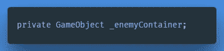

然后我们在实例化敌人的 ***while()*** 循环中将它的新父代设置为***_ enemy container***。

我们还应该在内存中缓存新的敌人，把它存储在一个本地变量中，最后我们可以声明另一个变量，这个变量可以在 inspector 中的组件上调整，这样我们就可以很容易地调整产卵率。

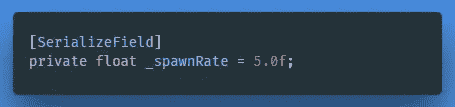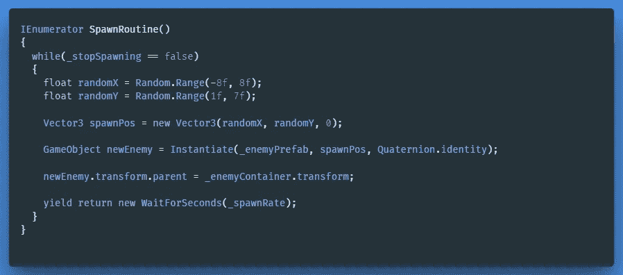

## 玩家脚本

在玩家脚本中，我们必须做一些修改，以防止玩家死亡时产卵管理器产生敌人。然而，SpawnManager 有自己的脚本，所以我们需要通过使用脚本通信来获得对它的引用。

首先我们创建一个新的私有成员变量***spawn manager _ spawn manager；*** 来缓存我们曾经抢过的那个 SpawnManager。

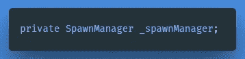

在 ***Start()*** 方法中，我们获取了 **"SpawnManager"** ，但是首先我们执行了一个*空值检查*以确保存在一个空值，否则我们打印一个错误。

如果你不熟悉 ***游戏对象。find()***&***get component<spawn manager>()；*** 方法[在这里](https://gert-coppens100.medium.com/script-communication-in-unity-using-getcomponent-45fba58f322a)我想邀请你，在这里我将向你介绍 Unity 中的脚本通信。

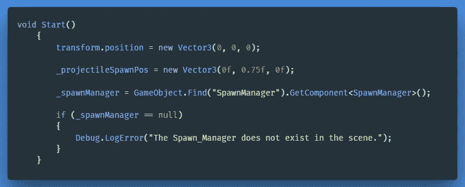

为了在我们的例子中停止协程方法，我们将首先在 Spawn Manager 脚本中创建一个***【OnPlayerDeath()***方法，该方法简单地将***_ Stop spacing***的条件设置为 true。请注意，有多种方法可以停止协程。

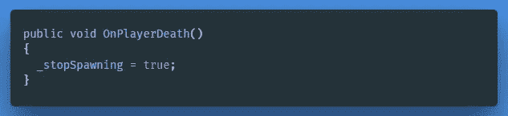

为了让 SpawnManager 在玩家死亡时停止繁殖敌人，我们随后添加了 ***_spawnManager。OnPlayerDeath()*** 函数给我们的 ***破坏()*** 方法放在播放器脚本中。

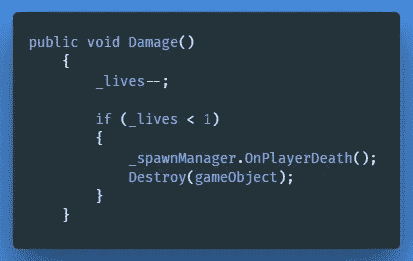

当玩家死亡时， **OnPlayerDeath()** 中的 _ stopSpawning 被设置为 false

← [上一张](/nerd-for-tech/script-communication-in-unity-using-getcomponent-45fba58f322a) | [下一张](/geekculture/scrolling-sprite-background-cfa82fbccc0d) →