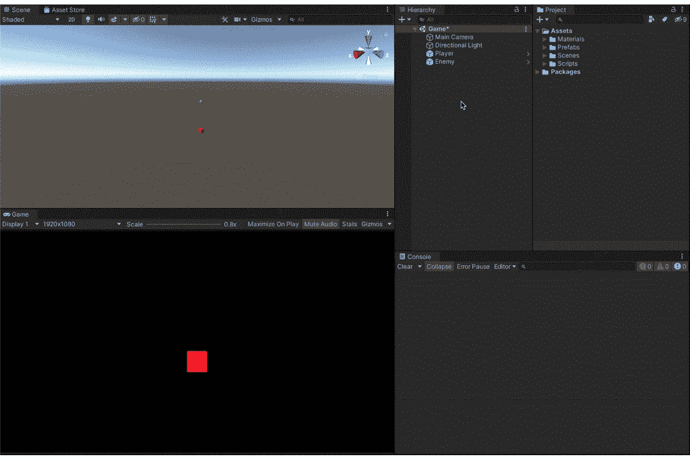
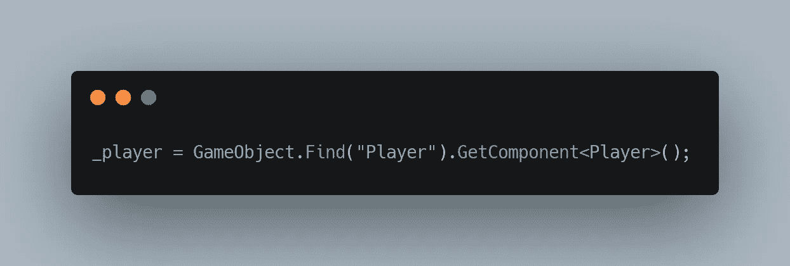
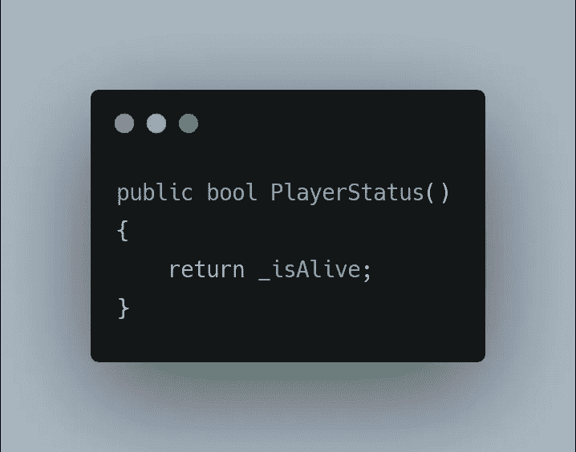
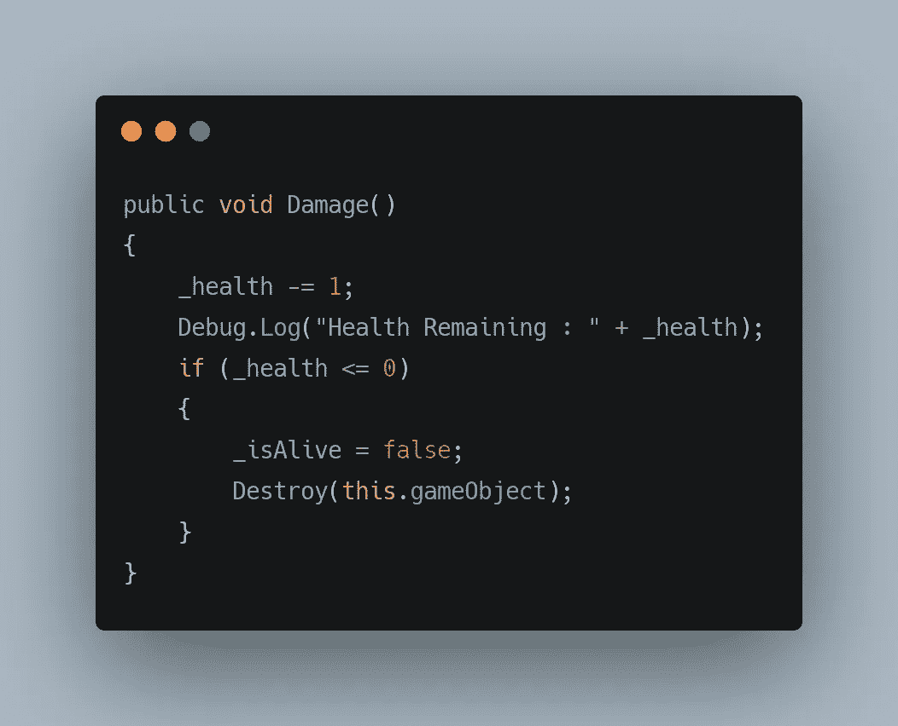
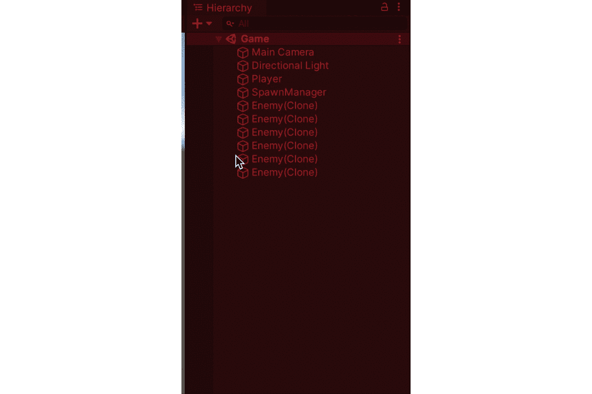
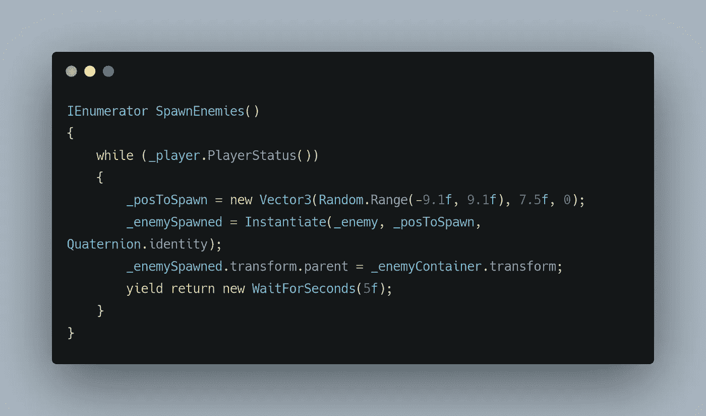
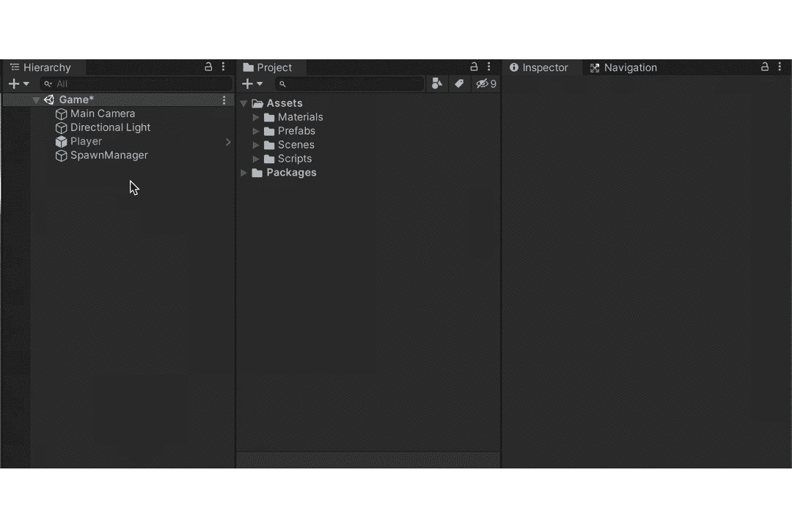
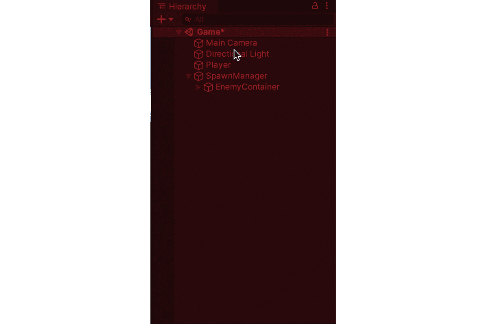

# 在 Unity 中生成对象，没有杂乱

> 原文：<https://medium.com/nerd-for-tech/spawning-objects-in-unity-without-the-clutter-8a680e7427be?source=collection_archive---------8----------------------->

***产卵的敌人！！！***

我们致力于移动玩家，让玩家发射激光，并创造了一个基本的敌人行为。但是现在是时候让敌人在给定的时间间隔内产卵了。

正如在以前的文章中所讨论的，当处理任何与时间相关的事情时，我们可以使用协程。所以让我们从创建一个每 5 秒产生一个敌人的产卵管理器开始。

这个空的游戏对象将负责生成我们的游戏对象。现在，让我们给它添加一个**产卵管理器**行为脚本，它将包含我们负责为敌人产卵计时的协程。

这里， *_posToSpawn* 是一个 **Vector3** 变量，它存储一个随机位置，这个位置将用于**实例化**没有旋转的*_ 敌人*游戏对象。

这里，*yield return WaitForSeconds()*用于暂停我们的执行。这整个代码块只在**玩家**游戏对象活着的时候运行。其中 *_player* GameObject 在哪里，

游戏对象。Find 用于获取具有所需名称的游戏对象。

使用这个我们可以访问**玩家**行为脚本中的所有公共函数，它包含**玩家状态()**方法。

其中 *_isAlive* 是一个布尔变量，其默认值设置为 **true** 。

当健康值达到 0 时，_isAlive 设置为 false。

伤害行为在[简单敌人行为](/nerd-for-tech/simple-enemy-behaviour-in-unity-b38f88009635)文章中有解释。

这给了我们以下结果，

***清理编辑杂物:***

我们可以观察到等级随着更多敌人的产生而增加，当我们增加能量或者让收藏品产生时,**等级**面板会变得非常混乱。这种混乱可以通过在我们的协程中添加以下内容来清理，

我们基本上是让所有衍生的敌人成为我们的敌人容器游戏对象的子对象。其中， *_enemyContainer* 为，

这给了我们以下结果，

感谢您的阅读！！！更多即将到来。