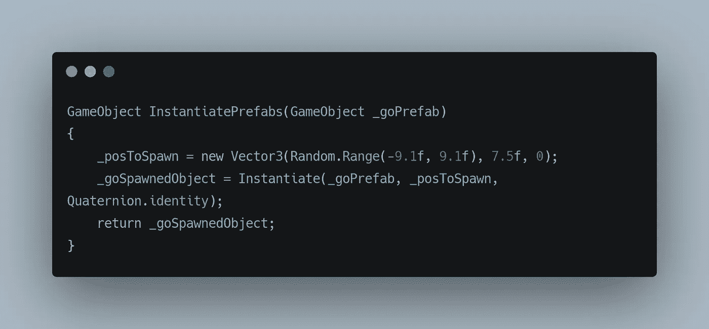
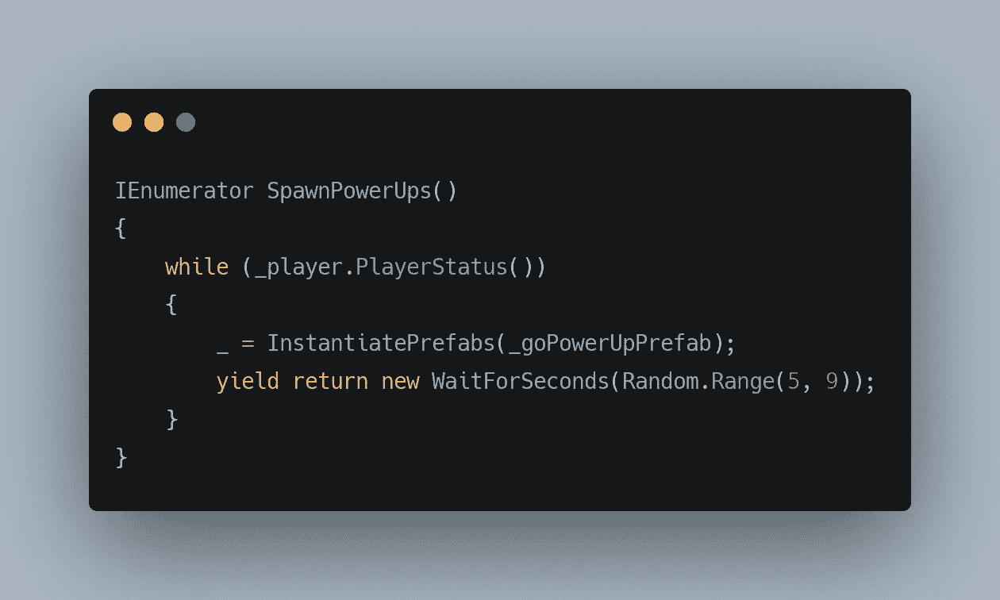
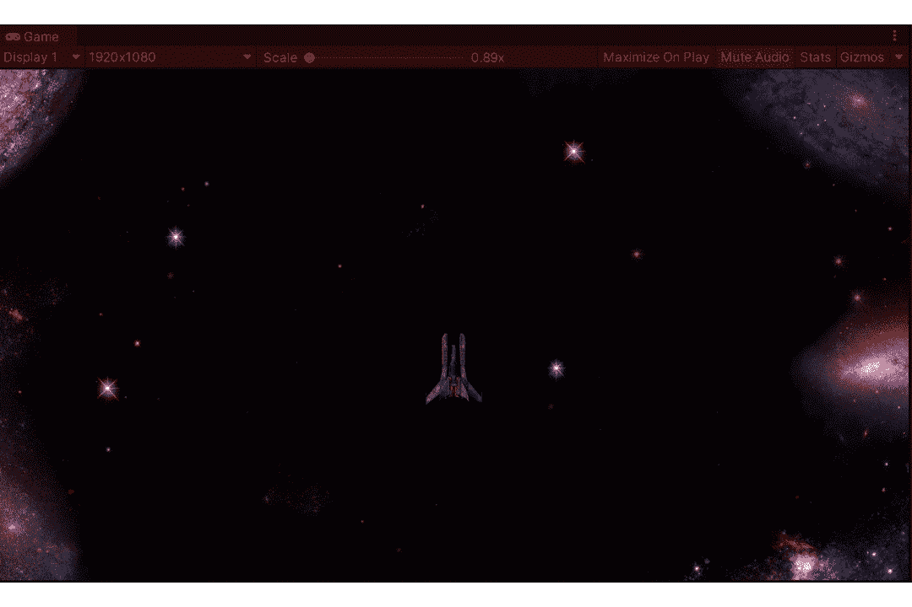

# 在统一中产生能量

> 原文：<https://medium.com/nerd-for-tech/spawning-power-ups-in-unity-57607cfc05b0?source=collection_archive---------18----------------------->

我们已经看到如何产生敌人

这将是相似的，如果不是完全相同的话。让我们看看它是如何完成的。

SpawnManager 负责生成游戏对象，所以让我们修改它的行为，以便它也可以生成电源。

这个方法在沿着 x 轴的随机位置产生给定的游戏对象，并返回新产生的游戏对象，然后我们的协程将使用它在给定的时间间隔产生游戏对象。

协程方法如下:

这个方法处理在玩家活着的时候产生我们的游戏对象。这里， **yield** 语句用于以 5-9 秒的随机间隔暂停正在生成的对象的执行。

这给了我们以下结果，

感谢您的阅读。更多即将推出！！！