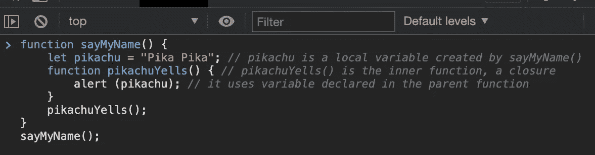

# 在原始克隆时使用闭包会影响使用状态钩子

> 原文：<https://medium.com/nerd-for-tech/speaking-closures-while-cloning-a-primitive-version-of-react-usestate-hook-241a8184722c?source=collection_archive---------11----------------------->

在这篇博文中，我将简要定义闭包，并展示 React hook UseState 是如何工作的。


**在切换按钮的情况下，使用状态挂钩非常方便**

# 首先，什么是终结？

我们可以像 [MDN](https://developer.mozilla.org/en-US/docs/Web/JavaScript/Closures) 将它定义为捆绑在一起(封闭)的函数的组合，并引用其周围状态(**l**exic 环境)。换句话说，闭包就是当一个函数能够记住它的词法范围时，即使这个函数在它的词法范围之外执行。

“词法”一词指的是这样一个事实，即词法范围使用源代码中声明变量的位置来确定该变量在哪里可用。嵌套函数可以访问在其外部作用域中声明的变量。

这是一个从我们的浏览器控制台关闭的简单例子:



*   `sayMyName()`被初始化。
*   `pikachu`是在`sayMyName()`内部创建的。
*   `pikachuYells()`在`sayMyName()`内部初始化。
*   `alert(pikachu)`是我们在调用函数`pikachuYells()`后希望它执行的内容。
*   为了让它执行，它需要访问变量`pikachu`。感谢闭包`pikachu`在`sayMyName()`的整个词法范围内被记住。

**结果:**


请记住，闭包的概念只有在函数返回函数时才更有意义。返回的函数可以访问不在全局范围内的变量，但是它们只存在于它的闭包里。

我希望这澄清了关闭的基本原则。现在让我们来谈谈如何使用闭包来编程 useState。

# 为什么使用 State？

首先必须从 React 导入一个名为`useState`的函数。

```
import React, { useState } from "react";
```

`useState` hook 让我们“挂钩”React 在我们函数组件内部的内部状态。

我们不打算讨论太多关于用法的细节，但是我们知道，如果你想使用 React Hooks 而不用担心 bug，理解闭包和这个特殊函数是如何构建的是非常重要的。

让我们开始我们的原始克隆吧

```
function useState(initialValue) {
  var _val = initialValue
```

*   `_val`是由 useState 创建的局部变量。

```
function state() {
    return _val 
  }
```

*   `state`是一个内部函数，一个闭包。
*   `state()`使用`_val`，由父函数声明。

```
function setState(newVal) {
    _val = newVal
  }
```

*   设置`_val`而不暴露`_val`。

```
return [state, setState]
}
```

*   公开函数供外部使用。

```
var [foo, setFoo] = useState(0)
```

*   使用数组析构。

**这里是完整的代码和一些帮助我们展示结果的 console . log:**

```
function useState(initialValue) {
  var _val = initialValue
  function state() {
    return _val
  }
  function setState(newVal) {
    _val = newVal
  }
  return [state, setState]
}
var [foo, setFoo] = useState(0)console.log(foo()) // logs 0 - the initialValue we gave
setFoo(1) // sets _val inside useState's scope
console.log(foo()) // logs 1 - new initialValue, despite exact same call
```

那是我们的 React 的`useState`钩子的原始克隆。在我们的函数中，有两个内部函数，`state`和`setState`。`state`返回上面定义的局部变量`_val`，而`setState`将局部变量设置为传递给它的参数(即`newVal`)。

就像上面的 console.log 所表明的那样，我们能够访问和操作(也称为“关闭”)内部变量`_val`。它们保留对`useState`范围的访问，这个引用被称为闭包。在 React 和其他框架的上下文中，这看起来像 state，而这正是它。

最后，我想和你分享一个非常有趣的思维过程，这是我在熨斗学校学到的。

正如我们现在所知道的，`useState` hook 允许我们的数据是动态的。这意味着，每当我们的程序中不真正需要那种改变激励的时候，`useState` hook 就变得没有用了。因此，在选择与 state 合作之前，有三个问题需要问自己:

*   *数据是通过 props 从父节点传入的吗？如果是这样，它可能不是 state。*
*   *它会随着时间的推移保持不变吗？如果是这样，它可能不是 state。*
*   你能根据组件中的其他状态或道具来计算它吗？如果是这样，那就不是国家了。


只是我希望这篇文章的结尾是全球疫情的结尾