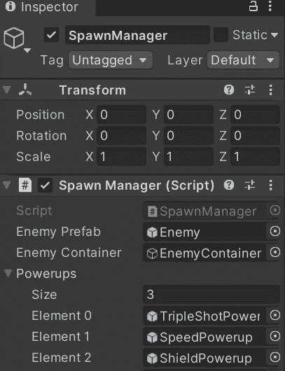
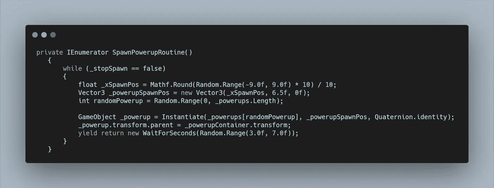
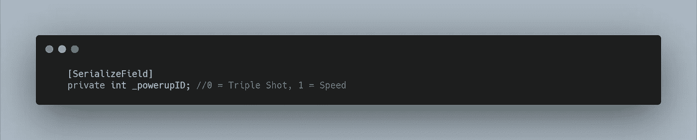
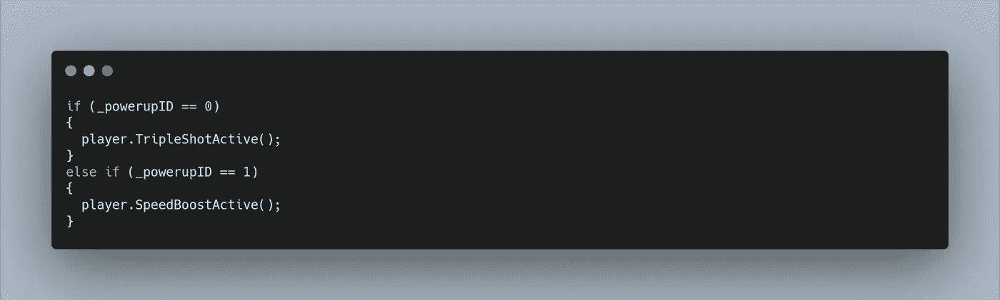
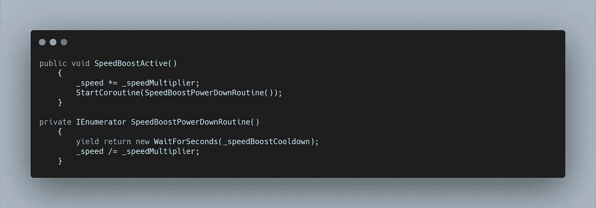
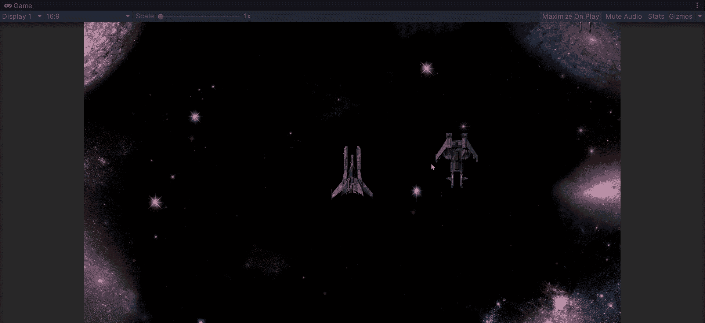

# 速度提升！

> 原文：<https://medium.com/nerd-for-tech/speed-boost-f800f0e4ca82?source=collection_archive---------14----------------------->

# 创建模块化通电系统

所以我们有了我们的**三倍拍摄加电**。让我们添加另一个来暂时增加我们的**速度**。

在很大程度上，我们的两个**电源**具有相同的功能。它们都需要**衍生，**它们都有相同的**动作，**它们都可以被**玩家收集。**

因此，让我们复制我们的**三重镜头预置**，重命名它，并改变精灵。现在我们需要删除我们的动画关键点，并创建一个新的剪辑。拖动**速度提升**精灵，我们就有了一个起作用的**加电物体**。我们只需要它产卵。

如果我们看看我们的 **Spawn Manager 脚本**，我们可以为我们的**加速**添加另一个**游戏对象变量**，或者，因为我们知道我们最终会有更多的**加速，**让我们创建一个**数组。一个**数组**允许我们在一个**变量中存储多个对象。**要创建一个，在**游戏对象类型**后添加[]。**

现在我们可以定义一个大小和存储多个电源！

在我们的 **SpawnPowerUpRoutine** 中，我们现在可以为**随机加电**创建一个 **int** 值，将其分配给**随机。使用**在 0 和我们的 **_powerups 阵列总数**之间的范围**。长度**功能。使用**。长度**允许我们始终选择我们的**电源的完整范围，**无论我们添加多少。

为了**实例化**随机加电**，**我们可以将方括号中的 **int** 值添加到 **GameObject** 变量中。现在我们的**协程**应该是这样的。

我们现在有了一个**模块化**系统，用于生成我们的各种**电源**。但是我们如何创建我们的**速度提升的功能呢？**在我们的**加电脚本中，**我们可以分配一个 ID。

有了这个 **int 值**，我们可以在所有 **powerup 预设、**上使用相同的脚本，但是在检查器中分配不同的值。使用 **If 语句**来检查值，我们可以在我们的**播放器**上调用不同的**公共方法**来启用每个**加电。**

在我们的 **OnTriggerEnter2D 方法**中，在我们的**空检查**中，我们可以使用下面的方法。

最后要做的事情是创建我们的 **SpeedBoostActive 方法**并创建功能。

在我们的**播放器脚本**中，创建一个新的**公共方法**并使用相同的名称。在这种情况下，我们可以将已经创建的**_ 速度变量**相乘。这将改变我们的**移动方法中的值，**从而使玩家移动得更快。如果我们以后想改变乘数，我们可以创建一个新的**浮动变量**，这样我们就可以在检查器中分配它。

然后，我们需要创建另一个**协程**来运行我们的冷却时间，然后将 **_speed** 除以我们的乘数，将速度返回到它的初始值。

现在我们可以使用一个**种子管理器、**和一个**模块化加电脚本来添加多个**加电**。这使得导航 bug 变得更加容易，并且防止我们有一个巨大的文件夹，里面装满了重复做类似事情的脚本。效率！**

呜呜呜！