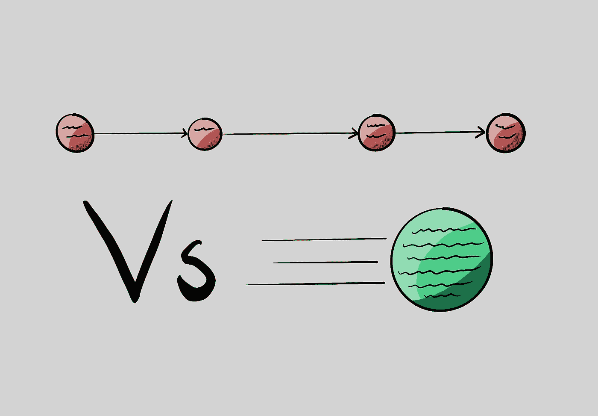

# 通过减少管道中的步骤来加速 Gitlab CI

> 原文：<https://medium.com/nerd-for-tech/speed-up-gitlab-ci-by-using-fewer-steps-in-the-pipeline-7e6819cd0e47?source=collection_archive---------3----------------------->

当我在 Gitlab Ci 中写如何做[颤振测试报告时，我注意到我的管道被分成了三个步骤:](https://www.greycastle.se/easy-flutter-test-reports-in-gitlab-ci/)

*   林挺
*   试运转
*   覆盖率报告

当我第一次设置它时，我觉得它“更漂亮”。他们都是独立的，如果有一步失败了，我很容易就能看出是哪一步。