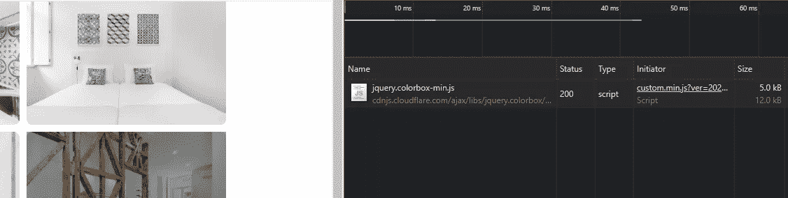
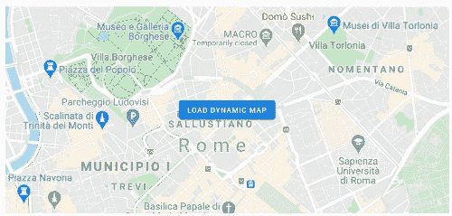

# 通过在交互中加载第三方脚本来加速你的 Wordpress

> 原文：<https://medium.com/nerd-for-tech/speed-up-your-wordpress-by-loading-3rd-party-scripts-on-interaction-1abd146e87f?source=collection_archive---------4----------------------->

## 节省带宽并动态加载资源

Wordpress 是一个非常受欢迎的内容管理系统，但是它的健壮性有一些缺点。你可能会面临性能问题，除非你的网站是非常好的优化，或者你只是在后端使用它，因为前端是静态生成的。然而，如果你运行了完整的 Wordpress 并且使用了第三方脚本，考虑动态加载它们。

我们可以使用 [dynamic import()](https://v8.dev/features/dynamic-import) 在交互时延迟加载脚本，而不是在初始加载时加载所有资源，例如当用户单击按钮或滚动组件时。(这篇文章是关于 Wordpress 的，所以我们真的可以使用动态导入吗？请继续阅读，寻找答案。)

更具体地说，我将向您展示如何动态加载两个不同的库:

*   [Colorbox](https://www.jacklmoore.com/colorbox/)(jQuery 的一个轻量级可定制 lightbox 插件)
*   [谷歌地图 JavaScript API](https://developers.google.com/maps/documentation/javascript/overview) 。

这些库是常用的，但是在我向你展示如何在交互中加载它们之前，让我们看看在 Wordpress 中加载 Javascript 文件的标准方式是什么，以及我们可能会面临什么挑战。


照片由[启动按压](https://unsplash.com/@launchpresso?utm_source=medium&utm_medium=referral)上的 [Unsplash](https://unsplash.com?utm_source=medium&utm_medium=referral)

# 将 WP 脚本入队

有一个 functions.php 文件，在那里我们必须使用[*WP _ enqueue _ script*](https://developer.wordpress.org/reference/functions/wp_enqueue_script/)函数。例如，要加载一个[微型滑块](https://github.com/ganlanyuan/tiny-slider)库，我们可以执行以下操作:

```
*function* my_scripts() {**wp_enqueue_script( ‘tiny-slider’,   ‘https://cdnjs.cloudflare.com/ajax/libs/tiny-slider/2.9.3/min/tiny-slider.js', array(), ‘20210327’, true );**// other scripts
}
add_action( 'wp_enqueue_scripts', 'my_scripts' );
```

这个函数中的所有脚本都被插入到网站的末尾(在结束的 body 标签之前)。为了减少请求的数量，我们可以将它们连接起来，并可能创建包含所有第三方代码的 vendor.min.js。

如果我们只在某个页面(例如主页)上需要脚本，我们可以编写 If 语句并只在那里对其进行排队:

```
*if* (is_front_page()) { wp_enqueue_script(...) }
```

这就是我们在 Wordpress 中排列脚本的方式。这仍然给我们留下了性能问题。我们如何动态地加载它们呢？

# Javascript 动态导入()和 Wordpress

如果您熟悉 Javascript promises，您也会轻松处理动态导入，因为导入会加载一个模块并返回一个 promise。在普通 JS 中，它看起来像这样:

```
import('module-name')
.then( //do something here )
.catch(err => { console.log(err) });
```

> 注意:也可以使用 async/await 语法。

但是在 Wordpress 中我们会有一个问题。由于 WP 的本质和它的文件系统，我们不能像在我们的主 JS 文件中那样使用它。我们最终会得到以下错误:

```
ReferenceError: require is not defined
```

[**@ WordPress/lazy-import**](https://developer.wordpress.org/block-editor/reference-guides/packages/packages-lazy-import/)

我发现了模仿动态导入()行为的[@ WordPress/lazy-import](https://developer.wordpress.org/block-editor/reference-guides/packages/packages-lazy-import/)NPM 包，但是有一点很重要:

> *目前这种对* `import` *的对齐是表面的，模块解析仍然使用*[*CommonJS*](https://nodejs.org/docs/latest-v12.x/api/modules.html#modules_require_id)`[require](https://nodejs.org/docs/latest-v12.x/api/modules.html#modules_require_id)`*，而不是更新的* [*ES 模块支持*](https://nodejs.org/docs/latest-v14.x/api/esm.html) *。*

看起来 WP 和动态导入不能很好的结合在一起。安装 require.js 或设置 webpack 来启用代码分割看起来也是一项令人生畏的任务，这不是理想的方法。

## [](https://www.toptal.com/designers/htmlarrows/symbols/black-right-pointing-index/)****自定义脚本加载器****

****Google 的一位工程经理 Addy Osmani 写了一篇非常好的文章《交互模式的导入》，详细讨论了动态导入、第三方代码和相关技术的使用。正如他所说:****

> ****第三方资源经常被添加到页面中，而没有充分考虑它们如何适应网站的整体负载。同步加载的第三方脚本会阻塞浏览器解析器，并会延迟水合。如果可能，3P 脚本应该使用 async/defer(或其他方法)加载，以确保 1P 脚本不会缺乏网络带宽。除非它们很关键，否则它们是使用交互导入等模式转移到延迟后加载的良好候选。****

****对于普通的 JS 实现，他为我们提供了下面的脚本，我们可以将它放入 Wordpress 中。****

****它用我们需要的模块创建一个脚本标签，并把它附加到主体中。我们可以这样使用它:****

```
***const* loader = new scriptLoader();loader.load(['moduleURL']).then(() *=>* {});**
```

****现在让我们描述一下利用这个脚本的具体场景。****

# ****外观也叫假组件****

****外观是模拟基本体验的占位符组件。例如，它可以是 Youtube 视频播放器的图像或地图。我们不需要嵌入和加载必要的资源，我们可以节省带宽，只在用户与 facade 交互后加载它们。用户可能会点击、悬停或滚动组件。****

********

****[Youtube facade save +540KB](https://addyosmani.com/blog/import-on-interaction/)****

## ******装载彩盒******

****我们有一个图像库，我们想在点击后显示在 colorbox。用户实际上可能永远不会点击图像来查看弹出窗口中的大图。如果我们可以节省几千字节，为什么还要加载库呢？****

****画廊本身不是一个门面，但它与我们可以推迟的功能有关。在下面的例子中，当用户将鼠标悬停在图库中的任何图像上时，我会加载 colorbox。点击后，库已被加载，弹出窗口显示。****

********

****将鼠标悬停在任何图像上都会加载颜色盒库****

```
**var appendedColorbox = false;$( 'body' ).on( 'mouseenter', '.gallery-image', *function*() { *const* loader = new lpa.scriptLoader();  
  // check if the library was already loaded
  *if*(appendedColorbox) {*return*};loader.load(['https://cdnjs.cloudflare.com/ajax/libs/jquery.colorbox/1.6.4/jquery.colorbox-min.js'])
  .then(() *=>* {
    appendedColorbox = true;
  });});**
```

****在这段代码中，我们监听“mouseenter”事件，初始化 scriptLoader 并加载 colorbox 库。****

## ****[延迟加载动态地图](https://developers.google.com/maps/documentation/javascript/examples/programmatic-load-button#maps_programmatic_load_button-javascript)****

****下面是一个合适的外观示例。不是完全加载的谷歌地图，而是只有一个带有按钮的地图图像，上面写着加载动态地图。****

********

****这个例子取自谷歌官方网站，它使用静态地图 API。不幸的是，我们的自定义脚本加载器不支持谷歌地图(它抛出了 CORS 策略错误)，而且**谷歌有自己的加载器**我们必须使用[@ Google maps/js-API-loader](https://www.npmjs.com/package/@googlemaps/js-api-loader)。****

# ****摘要****

****当加载第三方资源时，交互模式的导入非常有用和重要。在这篇文章中，我主要关注如何将它集成到 Wordpress 中，因为它仍然是最流行的 CMS 之一。因为它不是无头的，我们应该考虑性能影响。****

****通过利用 facade 技术，我们可以通过动态加载资源来节省大量的千字节。由于 Wordpress 的工作方式，我们不得不克服一些挑战，但是感谢 Addy Osmani 的脚本加载器，我们能够在交互中加载脚本。****