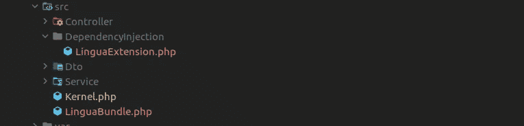
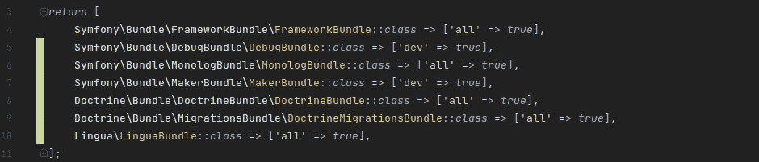
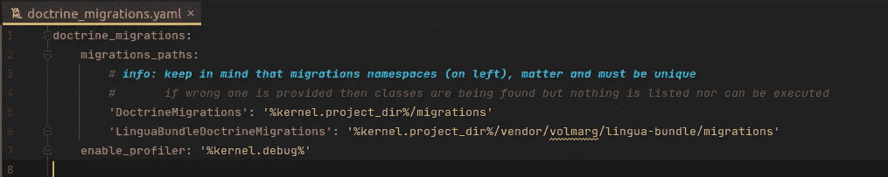

# 将 Symfony 项目分割成块

> 原文：<https://medium.com/nerd-for-tech/splitting-symfony-project-into-chunks-c297b5a55dab?source=collection_archive---------1----------------------->

# 你为什么要离开？

我一直(现在仍然)经常在两个国家之间旅行。我的主要台式电脑(更强大的钻机)留在一个国家，而我总是带着我的笔记本电脑时，访问第二个国家。

现在问题出现了:

*   我的笔记本电脑已经用了 7 年，已经过时了，
*   我的台式机也有点旧，但功能更强大，

虽然我可以运行 **Symfony** 服务器、 **Websocket** 服务器、**调试工具**和 **Vue.js** dev 工具(持续运行编译和代码分析)，但它只是在笔记本电脑上窒息，简直是在呼救。

# (过度)分块

Chunking bigger **Symfony** 项目其实很容易。每当你需要给项目添加一些额外的逻辑时，请这样想:

> *“这个逻辑可以是独立代码吗？我最终能重用它吗？拆分可能太小，还是它是当前工作空间不可分割的一部分？*

你不希望你的代码被分割得太多。起初这可能很诱人，但是创建一个小的包来提供包装其他 composer 包逻辑的服务是没有意义的。遵循这种方式甚至可能导致这样的问题，最终您可能会在自己的存储库中找到大量的包(因为您肯定希望将它们存储在某个地方)。

考虑一个购物平台的例子:

*   具有用户登录/帐户/购物逻辑的核心本身应该仍然是项目的核心，
*   产品提供逻辑(让它与外部服务集成)可以是*“产品-提供者-捆绑包】、*
*   *“意见-收集器-捆绑包”*可以是负责从某些页面获取数据的其他包，

你可以把它想成**桥/连接器**逻辑，虽然听起来一样，但这里的实现有一点点不同。

没有我们需要**连接**或**桥接**的项目。

# 如何

W ***大块是什么帽子？*** 在这种情况下**块**只是另一个 ***【独立 Symfony 项目】*** ，带有一些额外的配置，允许将**插件**捆绑到主项目。

要使 chunk 完全工作，需要将其配置为一个**包**，为此，您只需要将两个文件放在正确的目录中，如下图所示:

捆绑文件( **LinguaBundle** ) &扩展文件(***lingua Extension***)

**语言捆绑**

***lingua extension****(我在我所有的其他包中都使用这个代码片段)*

可能还有更多的东西，但是这个最小的配置就是让这些包工作的全部。

*   完整的细节可以在这里找到:[https://symfony.com/doc/current/bundles/extension.html](https://symfony.com/doc/current/bundles/extension.html)

I ***用编写器安装组块(bundle)。*** 你可以像平常一样通过 composer 安装你的包(比如把它添加到你的私有 Gitlab 实例中)，或者你可以在本地安装这个包。

对于本地安装， **Composer** 实际上创建了 link，因此您仍然可以使用您的 bundle 项目，它将在您安装软件包的项目的`vendor`文件夹中自动更新。

> 如何在本地安装软件包？

*   通过在提到的文件的根目录中提供这个部分来更新将要安装包的项目的`composer.json`文件:

*   在**包**的`composer.json`中设置`name`(这个名字将用于安装包)，例如:`"bundle": "volmarg/lingua-bundle"`，
*   像平常一样安装软件包，只需调用:`composer require volmarg/lingua-bundle @dev`

一个 ***激活束*。那实际上只是`bundles.php`文件中的一个附加行。按照上面的**语言绑定**示例，激活(添加)它的逻辑等于:**

bundles.php

现在可以在项目中调用**控制器&服务**，否则 **Symfony** 将抛出异常，如*“没有找到名为* `*<ServiceName>*` *的服务”*。提供的示例包配置允许 **Symfony** 加载额外的`services.yaml`文件。

I问题

到目前为止，我发现的唯一问题是迁移并没有像它们应该的那样工作——这意味着如果一个捆绑包包含了迁移，那么这些迁移在安装了该捆绑包的项目中就不会工作。

*   然而，这可以通过以下指南来解决:[https://www . goetas . com/blog/multi-namespace-migrations-with-doctrinmigrations-30/# symfony-integration](https://www.goetas.com/blog/multi-namespace-migrations-with-doctrinemigrations-30/#symfony-integration)

**简单解释**

教义 _ 移民. yaml

还要记住，**键**必须等于 bundle 中迁移文件的名称空间。所以它应该变成`LinguaBundleDoctrineMigrations`，而不是使用默认的名称空间`DoctrineMigrations`。

# 摘要

对我个人来说，最大的好处是我可以在使用旧笔记本电脑的同时处理项目中较小的部分。

我还发现好的一点是，我现在实际上在另一个 bundle 中重用了一些 bundle——我经常达到这样一个点，当我想“我想从 bundle***A****中得到那个逻辑，结果是我已经得到了那个逻辑准备好被重用。*