# 体育分析— NBA API — Facundo Campazzo

> 原文：<https://medium.com/nerd-for-tech/sports-analytics-nba-api-facundo-campazzo-e3f9309fdf50?source=collection_archive---------13----------------------->

图片来自 shottracker.com

6 月 13 日星期天标志着 Facundo Campazzo 的第一个 NBA 赛季的结束。这位身高 5.1 英尺(1.78 米)的阿根廷控卫总共为**丹佛掘金队**打了 75 场比赛，直到**凤凰城太阳队**横扫西海岸的一场 NBA 半决赛(4-0)。

让我告诉你，即使坎帕佐不能进入 NBA 总决赛，他也有一个**伟大的**和**在渐强**登陆赛季。你可能想知道我为什么这么说，好吧，如果是这样的话，你来对地方了，因为我们将通过这个**体育分析**帖子来了解它。

为了完成这项工作，我使用了 NBA 的 API 来收集 2020-21 赛季的数据。因为我不会讨论如何从 API 中检索数据，所以我会给你一个[**repo**](https://github.com/ndominutti/NBA_analytics)**的链接，以防你有兴趣浏览一下支持这篇文章的全部代码。**

**最后但同样重要的是，为了获得可比性，我们需要一些基准，所以我们将测量一些坎帕佐的统计数据与:
1)全联盟统计数据
2)丹佛掘金统计数据
3)全联盟控卫统计数据**

**好了，足够的序言，准备一杯咖啡，让我们进入数据的飞跃。**

****

**图片来自 tycsports.com.ar**

# **年龄**

**尽管法库是联盟的新生，但他离新秀还差得远。他 30 岁，有 10 年以上的职业高水平篮球经验。从统计学的角度来看，我们可以说他在丹佛掘金队的排名是:
*全联盟第 80 百分位*第 85 百分位(只有 4 名球员比他大)**

**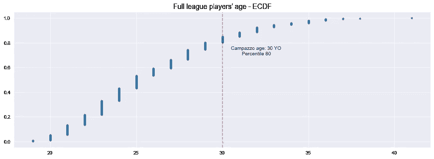**

**年龄经验累积分布函数**

# ****玩过的游戏****

****

**尽管这是法库接下来的第一个 NBA 赛季，但他成功地将自己定位为第二个打更多比赛(75 场)的丹佛球员，仅次于本赛季 MVP 尼古拉·约基奇(82 场)。**

# ****分钟****

**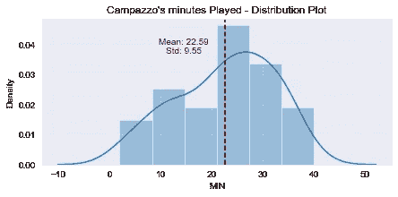**

**Facu 的平均上场时间为 22.59 分钟，标准差为 9.55 分钟。
STD 是平均值的~42%，这告诉我们，数据确实是从中心点向外扩散的，那么，分布是怎么回事呢？有没有一种我们可以察觉的模式？让我们深入探讨一下整个赛季中**分钟的演变**:**

**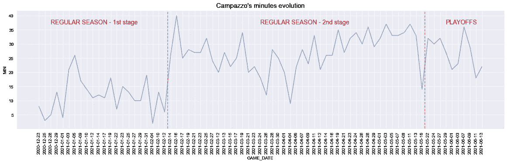**

**在这里，我们绘制了坎帕佐在 2020/21 赛季每场比赛中的上场时间。
分析图表后，我们可以看到有两个明显不同的时刻**:****

1.  ****第一场**是从第一场比赛开始的，第一场比赛是在 2 月 12 日进行的，我们称之为第一阶段**。我们可以推断，对丹佛掘金队来说，事实上对整个 NBA 来说，他是一名新球员，法库需要这场比赛来赢得对联盟打球方式的信心，并让球队主教练相信他的能力。********
2.  **第二场比赛将持续到本赛季剩下的时间，我们称之为第二阶段**。这里是法库巩固自己在 NBA 地位的地方。****
3.  ****我们将任意添加一个代表**季后赛**的**阶段 3** 。为什么？嗯，每个自称为 NBA 球迷的人都知道，季后赛是一场完全不同的比赛，它给球员增加了更多的压力，因为它由 7 场比赛组成。****

****因此，在接下来的分析中，我们将为我们设置的每个**阶段**分解许多统计数据。
看看 Campazzo 的每场比赛分钟数**的分布**在不同阶段是如何变化的:****

****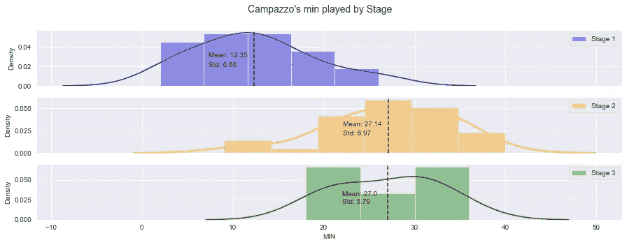****

****毫无疑问，法库巩固了他在第二阶段的表现，他的平均上场时间提高了 100%，轻松超过了联盟 AVG 的 19.7 分钟(T21)。****

****但是等一下，这几分钟是如何分布在一场比赛的各个时间段的呢？****

****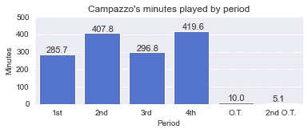****

****很明显，总的来说，Facu **不是首发球员**，无论是在比赛开始时还是中场休息时，他大部分时间都在第二和第四节比赛。****

# ******得分点数******

****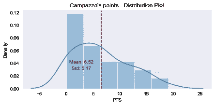****

****尽管法库并没有因为他的得分能力而在球队中赢得一席之地，但他在本赛季的得分统计中表现得相当不错，场均 AVG 达到 6.5 分，并两次拿下赛季最高的 19 分。****

****现在让我们分析每个**阶段**的得分:****

****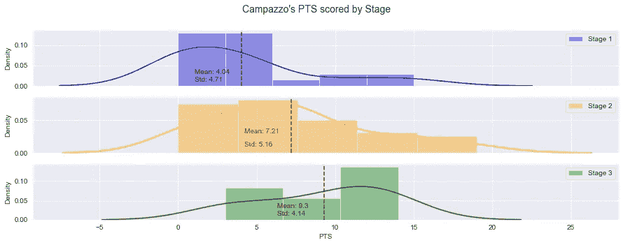****

****这与我们之前看到的上场时间有关。很明显，随着他变得越来越自信，他开始对比赛感到更舒服，找到他的位置和投篮，所以他的得分数据上升了。****

****到目前为止，我们一直在进行孤立的特征分析，但看到变量如何相互关联确实很有趣，因此，我们将看一下**分钟**和**点之间的相互作用。******

****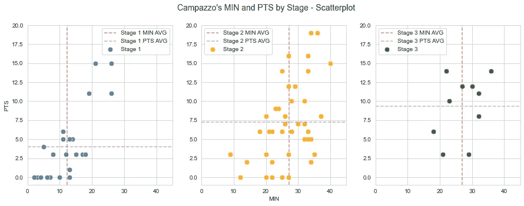****

****图表中的每个点都是不同的游戏。这些线是给定阶段每个特征的平均值。****

****在这张散点图中，我们看到了坎帕佐在 NBA 的整合，需要考虑以下几点:****

*   ****看看**阶段 1** 的平均值是如何受到 2 个异常值的高度影响的——有+15 分的游戏，如果我们放弃那些游戏，从阶段 1 到阶段 2 的跳跃甚至更高。****
*   ****赛季的最高分-分和分-是在**阶段 2******
*   ****只有一场比赛与<10 min since **第二阶段**开始****
*   ****法库在季后赛的 10 场比赛中有 6 场得分+10 分****

****现在我们看到了得分数据，你可能会问自己:他是怎么得分的？他拍得最多的是哪种类型的照片？坎帕佐更像一个 2 分球员还是一个 3 分狙击手？好吧，让我们试着给那些问题一个答案。****

# ******拍摄******

****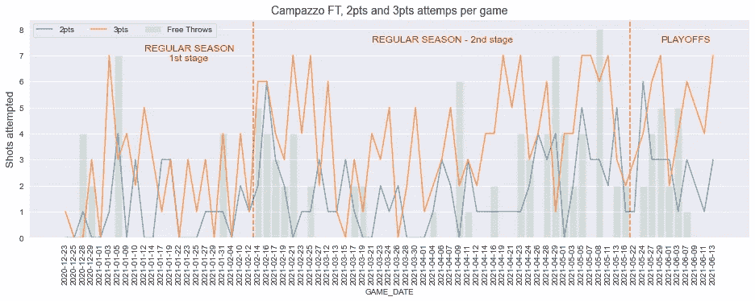****

****NBA 20/21 赛季每场比赛的所有投篮次数****

****特别要注意的是，法库只有在极少数比赛中的 2 分比 3 分多，很明显他在这个赛季更像是一个 3 分球员。
纵观全局，整个赛季他一共出手:
***3 次** : 264 -(赛季 67.9%的投篮命中率)
***2 次** : 125 -(赛季 32.1%的投篮命中率)
* **FTs** : 110****

****到目前为止，我们只谈论了**尝试**投篮，但你一定想知道，坎帕佐的**投篮**怎么样？而他的**准确率** **%** 呢？让我们花点时间来分析一下****

****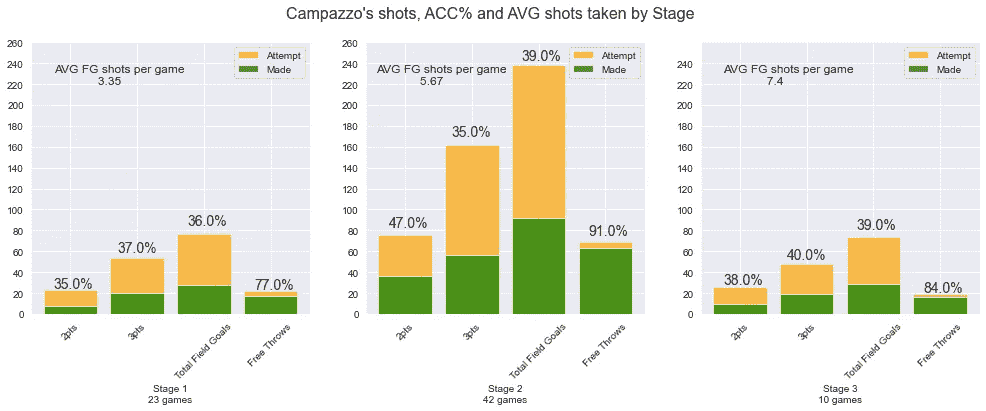****

****FG =投篮命中率= 2 分+3 分****

****这是一张很好的照片，展示了法库在这个赛季的发展，一些很酷的事实值得一提。****

*   ****看看随着赛季的推移，每场比赛的投篮命中率是如何增加的****
*   ****在过去的 10 场比赛中，他的出手次数几乎和前 23 场比赛一样多(记得他在 10 场比赛的 3 场比赛中有 6 场得分+10 分)****
*   ****自本赛季开始以来，法库提高了他所有的投篮命中率****

****现在我们可以问自己‘为什么坎帕佐把 2/3 的投篮集中在三分球上？’→嗯，我想到了 **2 个主要原因**，它们可能会提示这个问题的答案:****

1.  ****他的准确率% :法库在整个联盟中排名第 62 位，整个赛季的命中率高达 36%****
2.  ****他的身高:我告诉过你法库有 5.1 英尺高，但是，他的身高和联盟中的其他球员相比如何呢？嗯…****

****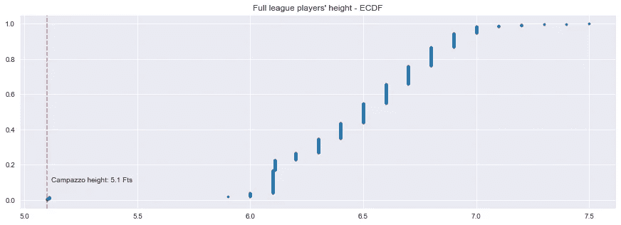****

****坎帕佐在全联盟**第 1 百分位**，比他小的球员只有 3 个！好吧，现在你可能认为这是一个非常不公平的图表，因为我们正在比较坎帕佐(一个控球后卫)和一些中锋或大前锋，但是看看同样的后卫图表:****

****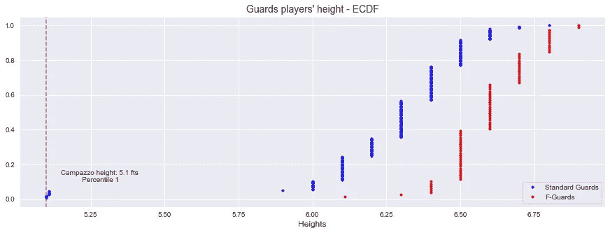****

****鉴于这一相关事实，我有理由认为法库很难把球送到篮下，所以他在三分线后发展了他的比赛。****

****好的，但是现在，让我们以稍微不同的方式分析同样的数据。如你所知，一场篮球比赛分为 4 个时段，所以现在我们来看看坎帕佐在这 4 个时段的投篮趋势。****

****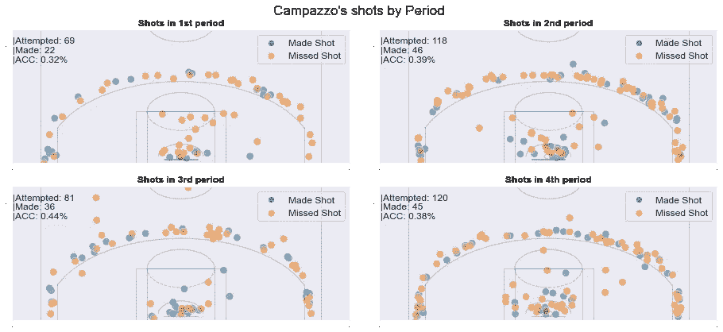****

****乍一看，这个图像非常合理，因为它与我们之前看到的 period 上场时间有关，上场时间越少→尝试投篮次数越少。在这里，我们看到法库在每一阶段的投篮命中率 **+32%，随着游戏的进行，他的准确率不断增加，在第三阶段**达到了**的最大百分比。******

****接下来，通过分割由球场区域拍摄的**镜头，然后试图推断出关于法库比赛的一些事实，我们的分析结果非常简单。******

****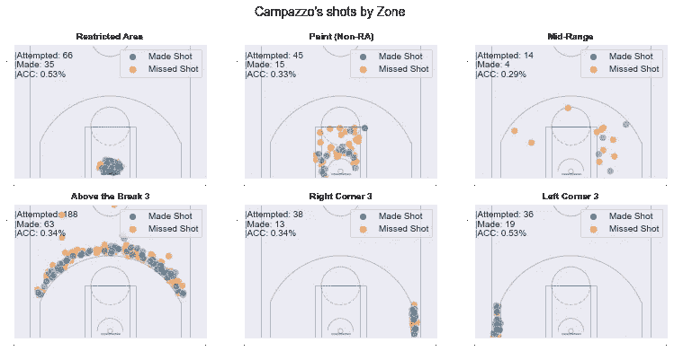****

****我认为这是理解 Campazzo 游戏的一个很好的图片，这里有一些重要的事实:****

*   ****最高精度在 RA :这很常见，因为这是离篮筐最近的投篮，可能来自上篮，主要是在给定 Facu 速度的反击中。****
*   ******他的大部分投篮来自“突破之上”:**这可能告诉我们，当他打挡拆时，他往往会投三分球——我们稍后会分析这种投篮类型——****
*   ******低“区域内”和“中距离”准确性:**这有助于我们支持我们在前面提到的理论，当他走到挡拆的内线时，他往往会传球，当他投篮时，他的命中率很低****
*   ******角球的准确性很高:**这是一个相关的事实，因为角球的大多数射门都是球员在传球后站着准备射门的结果。****

****我们将继续开发我们的 Campazzo 的游戏研究，看看 Facu 的投篮和% by ' **投篮类型**'。****

****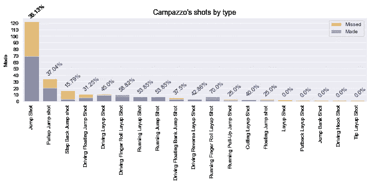****

****你注意到了什么，对吗？他的绝大多数投篮都是站着跳投，也就是大多数传球后的投篮——而不是像拉起跳投或后退跳投那样来自运球。****

****那么现在，让我们按照'**场区&投篮类型'**来深入探究法库的三分球****

****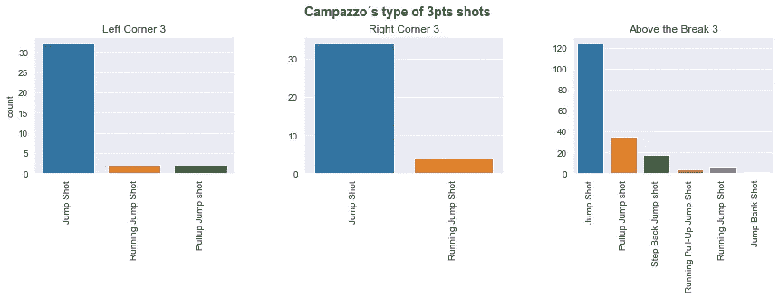****

****这个图让我们假设:****

*   ****当我们推断他的大多数角球来自传球时，我们是对的****
*   ****大多数突破 3 **以上的 Facu 不是来自挡拆打法**，因为它们是跳投——至少不是来自运球。****
*   ****坎帕佐在反击时不怎么投中三分球，因为他几乎没有跳投。****

# ******援助******

****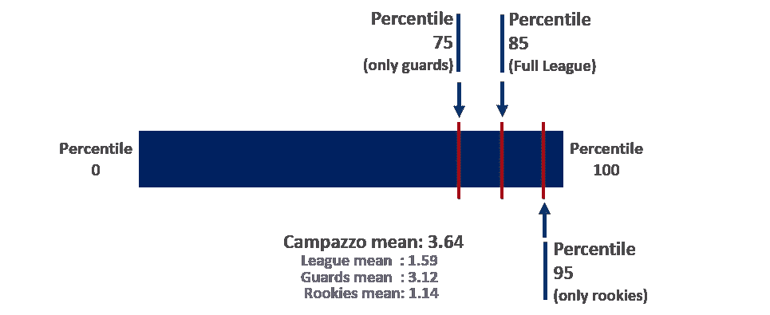****

****作为一名控卫，助攻次数是理解法库比赛的一个重要特征。看一下左边的图表，这是不言而喻的，当只分析坎帕佐与 NBA 后卫的对抗时，他位于第 75 百分位**，当与整个联盟进行比较时，他位于第 85 位**。但是，如果我们按照**阶段来分离这些价值观会怎么样呢？**********

****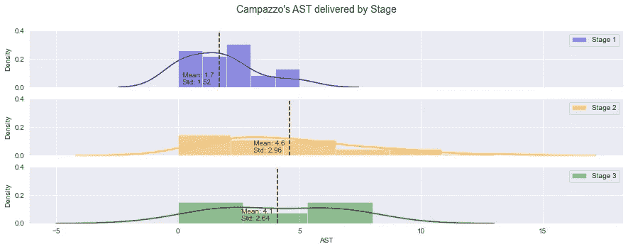****

****随着坎帕佐走过这个赛季，不仅他的投篮统计数据有所提高，他的整场比赛都被带到了另一个水平——部分是因为更多的上场时间。请注意 **AST 平均值如何增加约 2.5 倍**。
如果我们取**阶段 2 & 3** 的 AVG AST，这就把 Facu 定位在百分位数: **88** (对全联盟)| **78** (对后卫)| **97** (对新秀)****

# ******抢断******

****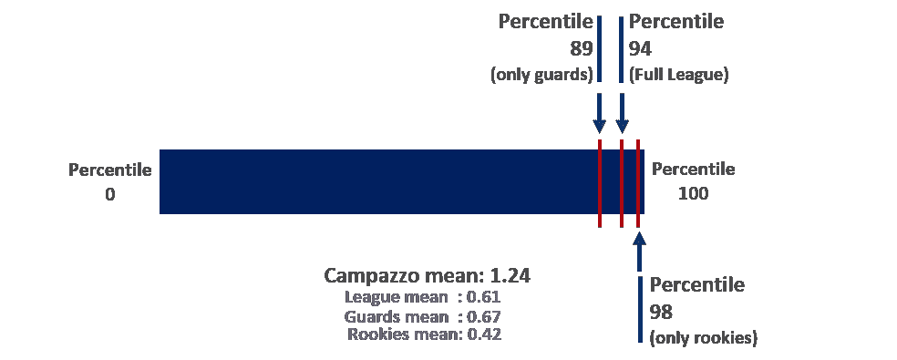****

****坎帕佐游戏中另一个相当重要的数据是 **STL** 。这一次，他利用自己的身高和敏捷的双手，成为一名顶级的抢断者:第 89 百分位(对后卫)| **第 94 百分位(对联盟)| **第 98 百分位(对新秀)********

# ****篮板****

**对于坎帕佐来说，这可能是一个不太有代表性的数据，因为他是控卫**他不需要抢很多篮板**。尽管如此，我们看到随着赛季的进行，法库的防守篮板数一场比一场提高，越来越接近全联盟的后卫。**

**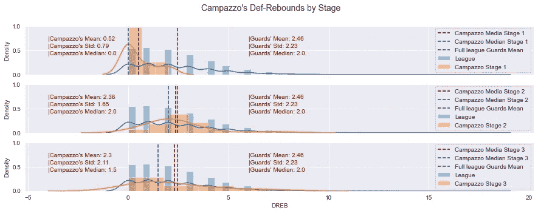**

**个人 DREB 分布按阶段划分。联盟距离和后卫意味着整个赛季。**

# **胜率**

**最后但同样重要的是，坎帕佐的赢球率约为 66.2%(T37)，在整个 NBA 排名第 84 位！对于联盟中的新生来说，这已经很不错了——一个几乎打了丹佛掘金队所有比赛的新生。**

**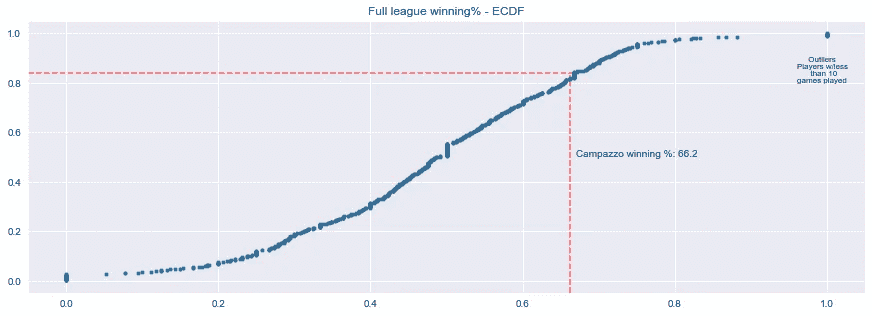**

**正如我之前所说，这是 Facu 在 NBA 的第一次亮相。对于一个登陆赛季来说，他无疑做了一件伟大的工作，抓住这个机会来实现巩固自己作为一名极具竞争力的球员的目标。**

**明年的目标是什么？NBA 总决赛？我想我们得等等看。可以肯定的一点是，如果它发生了，我们将从 NBA API 收集大量数据，并编写 ***体育分析-NBA API-Facundo Campazzo part II*。****