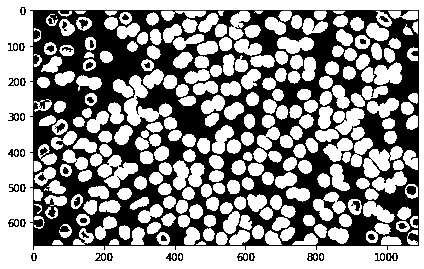
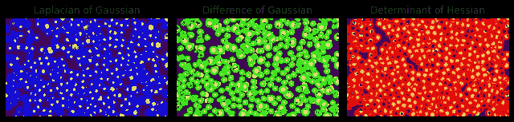
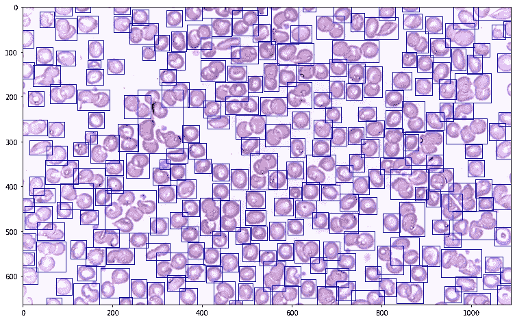

# 发现工作中的斑点:使用 Python 进行图像检测、标记和测量

> 原文：<https://medium.com/nerd-for-tech/spot-the-blob-on-the-job-image-detection-labeling-and-measurement-using-python-6faf7af2fc19?source=collection_archive---------1----------------------->


[卡利内里](https://unsplash.com/@kalineri?utm_source=medium&utm_medium=referral)在 [Unsplash](https://unsplash.com?utm_source=medium&utm_medium=referral) 上拍摄的照片

**斑点检测**

斑点是给定图像中感兴趣的对象。为了确定斑点，它们必须被定义为黑暗背景中的明亮物体，以确保算法能够正确地检测它们。讨论了三种检测斑点的方法:

1.  高斯拉普拉斯算子(LoG)-高斯平滑图像的拉普拉斯算子
2.  高斯差异(DoG)-两个高斯平滑图像的差异
3.  黑森行列式(DoH) —黑森行列式矩阵中的最大值

将图像转换为斑点的主要好处是我们的机器能够检测到所述斑点。以这种方式，我们可以标记和测量从任何给定图像中检测到的对象的属性。让我们看一个红细胞的样本图像作为例子

```
# library imports
from math import sqrt
import matplotlib.pyplot as plt
import numpy as np
from skimage.io import imread, imshow
from skimage.color import rgb2gray
from skimage.feature import blob_dog, blob_log, blob_doh
from skimage.morphology import (erosion, dilation, closing, opening,
                                area_closing, area_opening) # binarizing source imageim2 = rgb2gray(imread('rbc.jpg'))
im2_bw = im2<0.85
imshow(im2_bw)
```


原始图像(左)和二值化图像(右

在应用上面提到的三种斑点检测方法之前，让我们先试着清除图像中的斑点

```
img_morph = area_closing(area_opening(im2_bw, 200), 200)
imshow(img_morph)
```



大多数的洞现在已经被盖住了

```
#Applying the blob detection algorithms
blobs_log2 = blob_log(img_morph, max_sigma=20, num_sigma=10, threshold=.1)# Compute radii in the 3rd column.
blobs_log2[:, 2] = blobs_log2[:, 2] * sqrt(2)blobs_dog2 = blob_dog(img_morph, max_sigma=20, threshold=.1)
blobs_dog2[:, 2] = blobs_dog2[:, 2] * sqrt(2)blobs_doh2 = blob_doh(img_morph, max_sigma=20, threshold=.01)blobs_list2 = [blobs_log2, blobs_dog2, blobs_doh2]
colors = ['blue', 'lime', 'red']
titles = ['Laplacian of Gaussian', 'Difference of Gaussian',
          'Determinant of Hessian']
sequence2 = zip(blobs_list2, colors, titles)fig, axes = plt.subplots(1, 3, figsize=(9, 3), sharex=True, sharey=True)
ax = axes.ravel()for idx, (blobs, color, title) in enumerate(sequence2):
    ax[idx].set_title(title)
    ax[idx].imshow(img_morph, interpolation='nearest')
    for blob in blobs:
        y, x, r = blob
        c = plt.Circle((x, y), r, color=color, linewidth=2, fill=False)
        ax[idx].add_patch(c)
    ax[idx].set_axis_off()plt.tight_layout()
plt.show()
```



LoG、DoG 和 DoH 斑点检测算法。

基于参考图像的性质，LoG 将是最适合这种情况的算法，因为它可以正确地识别红细胞的形状，不像其他两种情况，在其他两种情况下，圆有时会包围两个细胞而不是一个细胞。

**连接组件**

尽管 LoG 在我们的参考图像的斑点检测中看起来是准确的，但所有三种算法都试图通过将斑点标记为圆形对象来识别斑点。因为不是所有的对象都是圆形的，甚至还有不规则形状的对象，所以图像中的连通分量可以被认为是感兴趣的对象。然而，连通分量严重依赖于图像结构，这就是为什么图像清理是必须的，这可以使用形态学操作来完成。

使用我们之前清理过的图像，可以识别连通分量的区域属性。

```
from skimage.measure import label, regionprops
label_im2 = label(img_morph)
imshow(label_im2)
```


用它们相应的区域属性映射的连接组件

连接的组件被映射为再次包裹在矩阵中的像素，就像过滤和形态学操作一样，通过识别要对其应用操作的对象。

给定图像上的坐标，我们可以通过 Python 中的 regionprop 模块确定连接的组件，并实际尝试计数图像中有多少红细胞。让我们从检查一个参考值开始，我们可以设置这个参考值来开始红细胞计数

```
area_list = []
for prop in props:
    area_list.append(prop.area)min(area_list) 
```

通过使用 regionprop 的面积参数，我们可以确定该算法所识别的红细胞的大小。

```
208
```

现在，我们可以将 208 设置为阈值，以对图像中识别的所有对象进行计数。

```
rbc_bw = label(img_morph)
rbc_props = regionprops(rbc_bw)fig, ax = plt.subplots(figsize=(18, 8))ax.imshow(rbc)rbc_count = 0
for i, prop in enumerate(filter(lambda x: x.area > 207, rbc_props)):
    y1, x1, y2, x2 = (prop.bbox[0], prop.bbox[1],
                      prop.bbox[2], prop.bbox[3])
    width = x2 - x1
    height = y2 - y1
    r = plt.Rectangle((x1, y1), width = width, height=height,
                      color='b', fill=False)
    ax.add_patch(r)
    rbc_count += 1
print('Red Blood Cell Count:', rbc_count)Red Blood Cell Count: 263
```



由该算法识别的红细胞及其相应的边界框

现在，您已经了解了如何对算法所识别的对象进行计数的一般概念

对我的工作感兴趣吗？你可以在我的个人资料里看到更多的故事

[](https://nico-aguila.medium.com/) [## 尼科·阿奎拉——中等

### 2020 年 11 月，我上了第一堂图像处理课，希望能学到很多关于如何理解……

nico-aguila.medium.com](https://nico-aguila.medium.com/)