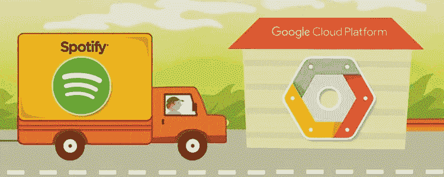

# Spotify 云计算

> 原文：<https://medium.com/nerd-for-tech/spotify-cloud-computing-bdf8b4c6bbbf?source=collection_archive---------5----------------------->

# 介绍

[工业 4.0](https://www.technologiesinindustry4.com/2020/11/how-to-learn-industry-4-0.html) &云计算技术已经改变了包括音乐行业在内的所有行业。在本文中，我们将了解全球最大的音乐门户网站 Spotify(【www.spotify.com】T2)。

# 描述

Spotify 是全球最大的音乐流媒体服务，拥有 3.5 亿活跃用户。其音乐流媒体服务于 2008 年推出。它只播放数字合法版权的音乐，包括来自唱片公司和媒体公司的 7000 多万首歌曲。Spotify 上注册的音乐艺术家数量为 700 万名歌手和艺术家。

Spotify 云计算技术允许下载&离线收听和无广告收听。[其先进的人工智能算法根据艺术家、专辑或音乐类型搜索音乐&可以自动创建、编辑&共享播放列表。](https://www.technologiesinindustry4.com/)

到 2021 年底，Spotify 预计将在 178 个国家运营。该服务在 Windows、macOS 和 Linux 平台 iOS 上提供。此外，这项服务还可以在 Android 智能手机和平板电脑以及支持人工智能的智能扬声器上使用，包括亚马逊 Echo 和谷歌 Home。

# 显著的优势

Spotify 等云计算技术的惊人优势如下:

*   无需购买卡带、CD、USB 等。— [这些过时的东西和光盘等等。在 5-10-15 年内受损。](https://www.technologiesinindustry4.com/)
*   无需在笔记本电脑、硬盘、固态硬盘等设备上存储音乐。
*   音乐存储在云上的数据中心。
*   用户可以在任何设备上访问它，包括智能手机、笔记本电脑、台式机等。
*   该技术不依赖于设备。
*   Spotify 上的任何音乐都可以轻松删除或添加。

# Spotify 模式及其优势

*   Spotify 模型是一种独立的方法，以人为本，用于扩展敏捷。
*   这凸显了文化和网络的重要性。
*   它帮助 Spotify 和其他组织通过专注于自治、电子邮件、问责制和质量来提高创新和生产率。
*   正如 Spotify 教练 Henrik Kniberg 所说，Spotify 的模式不是一个框架。
*   这是 Spotify 对从技术和文化角度进行扩展的看法。
*   这是在产品开发组织中塑造几个团队的一个例子，强调了文化和网络的重要性。
*   2012 年, [Spotify 模式首次向世界展示,](https://www.technologiesinindustry4.com/)引起了广泛关注，并在敏捷转型领域广为流传。
*   它强调将工作整合在一起，而不是遵循一套特定的实践。
*   它关注的是企业如何建立一个允许敏捷性的组织。
*   Spotify 模式捍卫团队自治，因此每个团队选择他们的框架。
*   小队被准备成部落和行会，以帮助人们保持一致和交叉传授知识。

应用 Spotify 模式的结构性好处包括:

*   Spotify 模式强调围绕工作建立，而不是本质上的流程和仪式。
*   这为一个组织提供了更好的灵活性。
*   取代那些需要改变工作方式的团队。
*   它强调让他们相互协调，并激励他们实现个人团队成果。
*   Spotify 模式通过相信人们以他们理解的适当方式完成他们正在做的工作来激发自主性和创造性。
*   Spotify 的模式可能会增加工作的透明度。
*   还产生了一种额外的基于实验的方法来解决高信任环境中的问题。
*   所有这一切可能会带来诸如改进产品、更愉快的顾客和更多参与的员工。

# Spotify 的内部扩展

*   目前，Spotify 正在扩大其内部播客计划，增加了两个与通信相关的播客。
*   这些都是针对特定行业，创作者，娱乐，消费趋势，生活方式的支持者，以及商业和金融界。
*   多年来，Spotify 一直在努力通过收购播客相关公司来维系播客创作者社区。
*   其中包括许多工作室和创作工具，如 Anchor。
*   它还可以帮助创作者更好地利用他们在展示新广告产品方面的努力赚钱。
*   就像付费订阅、参与工具和整合一样，这将使创作者能够将他们现有的订户基础与 Spotify 平台联系起来。
*   它同样推出了一个名为 Spotify Greenroom 的社交音频应用，将在那里托管直播内容。
*   该公司还将于 10 月 26 日收回其旗舰节目《记录》(For the Record)的第三季。
*   这个节目将继续提供 Spotify 对产品和金融新闻的注释。

# 我们能从音乐产业学到什么

*   云服务和 Io 创造了新的业务副本。
*   音乐产业告诉我们，那些能让顾客和消费者轻松生活的模式将会成功。
*   通过专利、诉讼和活动来要求停止变革，预计会以失去商业机会而告终。
*   云计算可以为高计算能力提供量身定制且经济高效的入口。
*   与 CDs 类似，硬件将在一定程度上被云服务淘汰。
*   比如，使用本地存储技术。
*   [智能服务将处理定制解决方案](https://www.technologiesinindustry4.com/)并为客户提供及时支持，这将是一个额外的优势。
*   供应、咨询和维护帮助将不再在问题上交易。
*   当它们发生时，它们必须在客户的流程中直接组合成按需解决方案。
*   这将允许预测性的问题解决，更快，更有效的生产。

更多详情请访问:[https://www . technologiesinindustry 4 . com/2021/10/Spotify-cloud-computing . html](https://www.technologiesinindustry4.com/2021/10/spotify-cloud-computing.html)