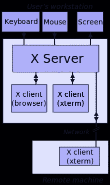
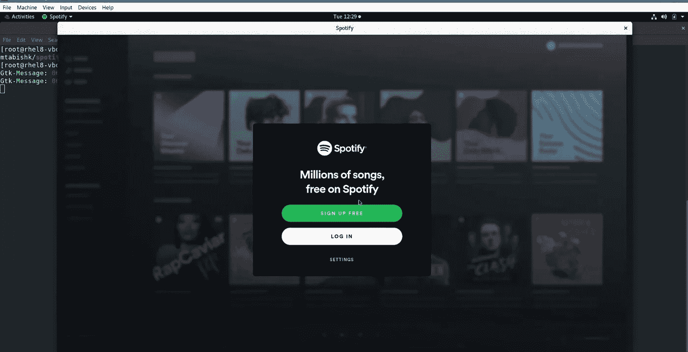

# Docker 容器中的 Spotify

> 原文：<https://medium.com/nerd-for-tech/spotify-in-docker-container-2c0c2ce16c9?source=collection_archive---------6----------------------->

在我之前的文章[这里](https://mtabishk999.medium.com/running-gui-applications-in-docker-firefox-nautilus-file-manager-5424694104ec)中，我已经讨论了我们如何在 Docker 中启动像 Firefox 浏览器、Nautilus 文件管理器这样的 GUI 应用程序。

今天，我再次使用 Docker 容器中的另一个 GUI 应用程序， **Spotify。**

# 为了运行 GUI 应用程序，我们需要一个 XServer，它可以作为每个 Linux 桌面环境的一部分。

*对于 Windows，可以使用*[*Xming*](https://sourceforge.net/projects/xming/)*。*

*对于 OSX，可以用*[*Xquarkz*](https://www.xquartz.org/)*。*

但是在容器中，我们没有任何**x server**——所以我们将:

*   将本地机器上`/tmp/.X11-unix`中的`X11`插座安装到容器中的`/tmp/.X11-unix`中。

`-v /tmp/.X11-unix:/tmp/.X11-unix`

*   将主机的**显示**环境变量共享到容器中

`-e DISPLAY=$DISPLAY`

*   使用**主机运行容器**网络驱动程序

`--net=host`

*   为了声音

`--device /dev/snd`

# Dockerfile 使用 Spotify 应用程序构建图像:

`$ cat Dockerfile`

`$ sudo docker build -t mtabishk/spotify-app .`

docker Hub:[https://Hub . docker . com/repository/docker/mtabishk/Spotify-app](https://hub.docker.com/repository/docker/mtabishk/spotify-app)

`$ sudo docker run --rm -it -e DISPLAY=$DISPLAY -v /tmp/.X11-unix:/tmp/.X11-unix --net=host --device /dev/snd mtabishk/spotify-app`

**您应该会看到 Spotify 应用程序现在显示在您的主机操作系统桌面上。**

# 视频演示:

今天就到这里吧！我很快会带一些新文章回来，谢谢！🤗

穆罕默德·塔比什·坎戴

领英:[https://www.linkedin.com/in/mtabishk/](https://www.linkedin.com/in/mtabishk/)