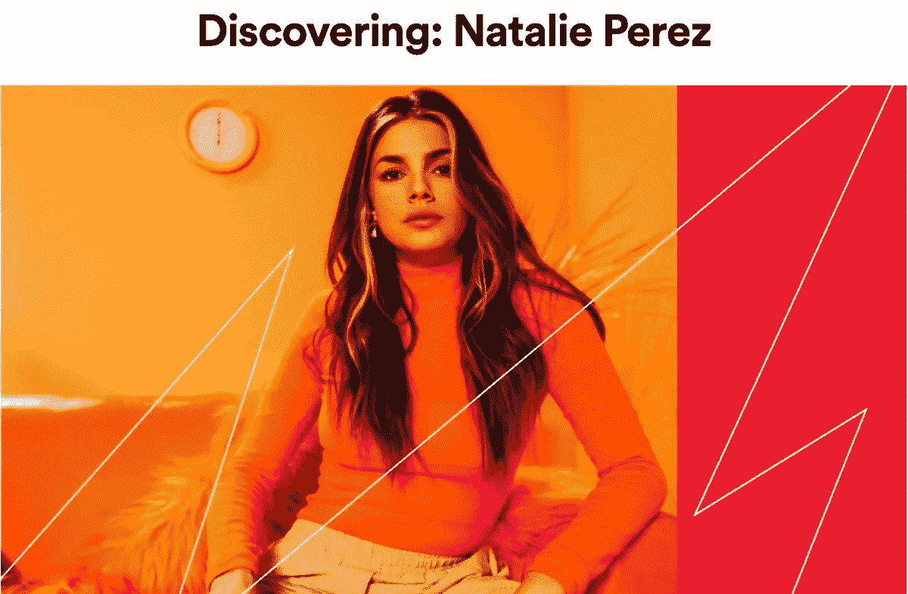
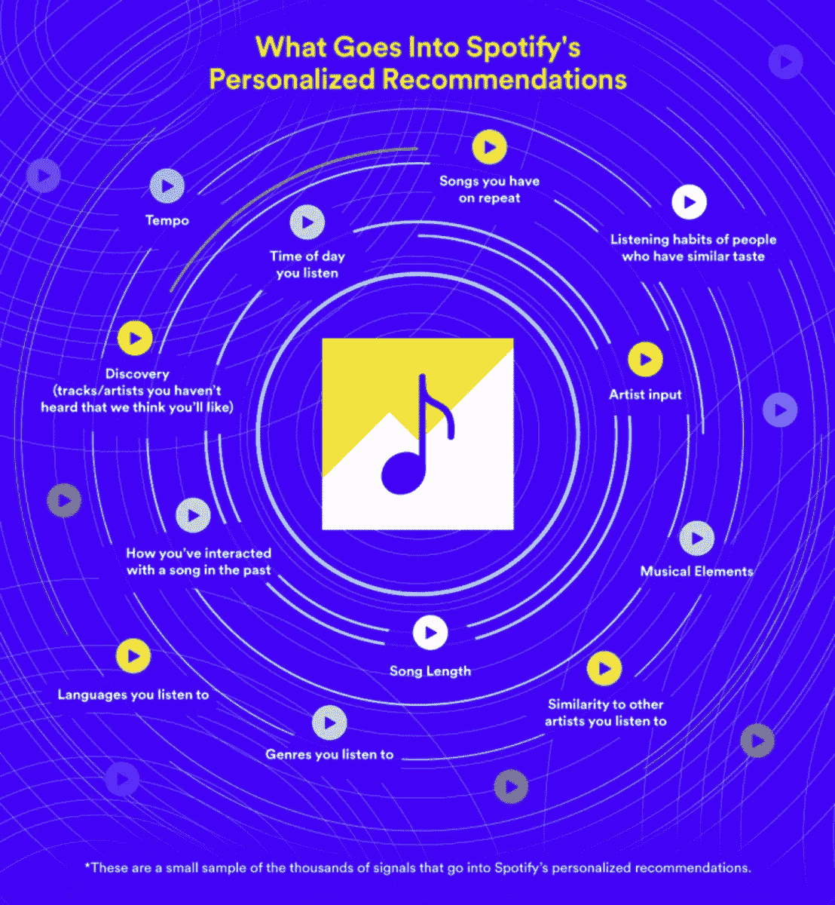
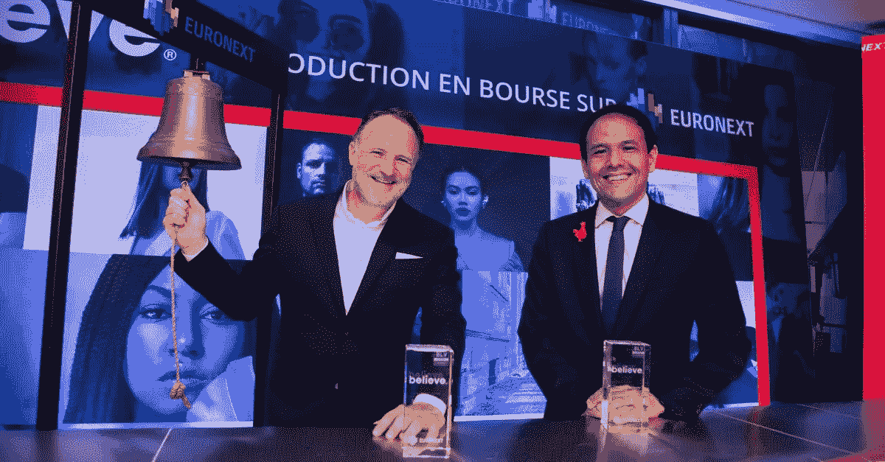

# Spotify 备受争议的探索模式👀

> 原文：<https://medium.com/nerd-for-tech/spotifys-controversial-discovery-mode-877a360a87d6?source=collection_archive---------16----------------------->

我们写了一份关于音乐及其背后的商业和技术的每日时事通讯。如果您想直接在您的收件箱中获得它，请立即订阅 [***！***](https://incentify.substack.com)

对大家有什么好处？

去年年底，Spotify 推出了一项备受争议的新功能，名为**“发现模式”**，这使得艺术家们能够**从平台上的额外算法播放中获益**，**作为回报，他们接受了更低的流媒体版税**💰

听起来像是公平的交易，对吗？

艺术家可以让他们的歌曲更经常地被发现，并愿意接受更低的版税🤝

然而，并不是每个人都喜欢这样——尤其是美国国会议员🇺🇸🏛

没错，大约在上个月，探索模式引起了美国众议院司法委员会的关注，该委员会询问 **Spotify 首席执行官丹尼尔·埃克**Spotify 采取了哪些“保护措施”来确保该工具不会导致“**一场竞争，在这种竞争中，获得推荐的唯一可行方式是接受降低的版税”**。

迷茫？

在其官方网站上，Spotify 声称发现模式类似于👇🏻

基本上，Spotify 正在利用这样一个事实，即在其算法上被发现对艺术家来说已经成为一件大事，这让他们在谈判桌上占据了上风。

这到底有多重要？

Spotify 的发现工具和个性化播放列表算法非常庞大。它每月推动 160 亿次艺术家发现，这意味着每月有 160 亿次粉丝在 Spotify 上聆听他们从未听过的艺术家🎧

Spotify 上的个性化推荐接收了 1000 个信号，但迄今为止，它们没有受到音乐艺术家的影响。

Spotify 正试图推广“发现模式”,作为他们解决“T21”问题的尝试，并让艺术家在排行榜上更频繁地被发现方面有发言权📈

查看他们现有算法的一些信号是如何工作的👇🏻

虽然这只是决定推荐的许多其他指标中的一小部分，但 Spotify 现在准备调整这一点，允许艺术家减薪并在探索排行榜上插队。

那么，他们将如何确保公平和透明的做法呢？

确保这不会变成一场疯狂的逐底竞赛？⬇️

美国国会众议员杰罗德·纳德勒(Jerrold Nadler)和众议员小汉克·约翰逊(Hank Johnson Jr .)(T25)最近写信给 Spotify 首席执行官丹尼尔·埃克(Daniel Ek)调查这一问题，表达了类似的担忧👇🏻

> “我们写道，Spotify 已经开始对其广播和自动播放功能进行试点测试。**这可能会引发一场‘逐底竞赛’**，在这场竞赛中**的艺术家和唱片公司会感到不得不接受更低的版税**，这是突破极度拥挤和竞争激烈的音乐环境的必要手段。”
> 
> “在全球疫情摧毁了音乐家和其他表演者的收入的时候，没有一条回到疫情之前水平的明确道路，任何最终可能导致在职艺术家进一步减薪并最终减少消费者选择的计划都会引发重大的政策问题，”

来自纽约的民主党国会议员杰里·纳德勒

虽然国会**介入像 Spotify** 这样的**瑞典公司** **的事情可能不仅仅是一种**美德信号战术，但看到这封信的实际后果还是很有趣的。****

虽然他们在版权对美国经济的贡献方面确实有一点，但消费技术的监管仍有待大规模解决，像脸书这样的公司不得不分别与澳大利亚、欧盟和 T21 这样的国家解决数据隐私法问题。

脸书与国会在数据隐私问题上的斗争是有据可查的

像脸书和 Spotify 这样的平台利用互联网将他们的产品扩展到各个大洲和民族国家的地理界限之外🌏然而，管理它们的法律仍然停留在过去。

但说到 Spotify 的新“发现模式”，唱片公司会怎么做💽不得不说？

今年 3 月，尽管没有明确指出 Spotify 的新功能，但欧洲独立唱片公司机构呼吁结束音乐流媒体“ **payola** ”，抨击数字工具为版权所有者提供“算法或其他功能的特权待遇”的优惠版税

“ ***贿赂*** *”这个词是不是很熟悉？你可能已经定期阅读了我们的时事通讯* 🥳

*我们在* [*中写过，我们那篇关于 90 年代音乐产业骗局的文章*](https://incentify.substack.com/p/music-industry-so-bent-its-straight) *！如果你喜欢这个，为什么不与人分享呢？*

与此同时，美国独立唱片公司表示，探索模式**“令人质疑 Spotify 推荐引擎的可信度”。**

上个月，美国艺术家权利联盟将探索模式比作贿赂。

然而，并不是所有人都感到不安。

DIY/独立艺术家领域的两个主要参与者对 Spotify 的发现模式给出了积极的反馈。

DIY 音乐分销平台及其位于巴黎的母公司证实，他们已经与 Spotify 合作，在过去 6 个月里与许多艺术家一起测试探索模式。

Believe 对这个工具如此热衷，它现在甚至投资于**“建立一个专用的数据和数字营销智能平台**，以便选择最有可能在探索模式中取得成功的艺术家和曲目。

*上个月，* [*信托在巴黎的泛欧交易所上市*](https://www.musicbusinessworldwide.com/believe-successfully-raises-e300m-in-paris-ipo-giving-tunecore-owner-a-market-cap-of-e1-9bn/) *，成功融资约 3 亿欧元，估值约 19 亿欧元*

它的敏锐可能与以下事实有关👇🏻

Spotify 今天公布的新数据显示**“与探索模式之前相比，探索模式下的艺术家平均找到了超过 40%的听众”**，并且“这些新听众中有 44%以前从未听过该艺术家的音乐”。

通过 Spotify 为艺术家分享的一个案例研究描述了 Natalie Perez 的经历。

Believe 表示，去年 12 月，它“开启”了佩雷斯的 33 首歌曲的探索模式，佩雷斯在 Spotify 上每月有超过 60 万名听众。

然后，它进行了为期 3 个月的活动。

结果呢？

Spotify 表示，在这 33 首歌曲中，有 14 首表现“非常好”,佩雷斯在美国和墨西哥的每日 Spotify 收听量增长了 57%。

# 我们对此的看法？

这是一个自由市场。

指责 Spotify 试图获得分销渠道是徒劳的，过去十年，Spotify 孜孜不倦地与用户建立分销渠道，并帮助开创了全球音乐流媒体的先河。

它是一家上市公司，其受托责任是最大限度地提高股东回报，它会以道德上认为合适的方式做到这一点🤷‍♂️

在这里，监管几乎不是最好的解决方案。然而，艺术家们陷入了两难境地，要么接受已经微不足道的低版税，要么错过吸引用户注意力的机会🧐

那么解决办法是什么呢？

建立分散的网络。

**区块链和加密货币使协议能够在不需要唱片公司甚至 Spotify 等流媒体平台的情况下建立**。

艺术家可以建立自己的**媒体分销渠道，将他们的知识产权符号化，**甚至**利用智能合同设计自己的货币化算法**。

虽然有许多很酷的项目正在围绕着它建立，最受欢迎的是 **Tidal** - [**Jay Z 和杰克·多西的激情项目**](https://incentify.substack.com/p/jay-z-and-jack-dorseys-music-revolution) **，**我们 Incentify 也在致力于类似的愿景，从唱片公司和流媒体平台等把关者那里免费音乐。

作为其中的一部分，我们最初的产品是一个工具，让用户以平台无关的方式分享他们的播放列表📲

当你在使用 Spotify 的时候，你有没有试过和一个使用 Apple Music 的朋友分享一个播放列表？

我们会掩护你的💪🏻

在或上给我们留言，或者发表评论来独家了解我们正在做的事情👀

*原载于*[*https://incentify.substack.com*](https://incentify.substack.com/p/-spotifys-controversial-discovery)*。*