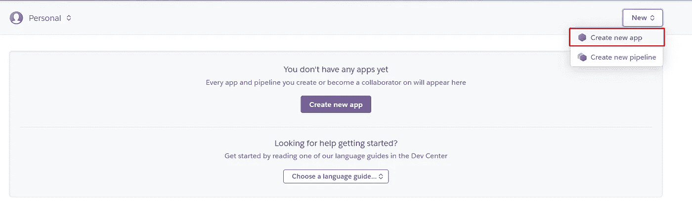
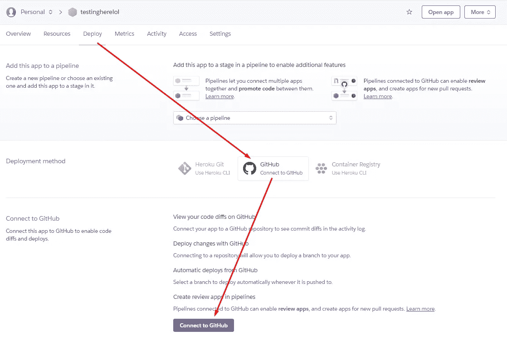
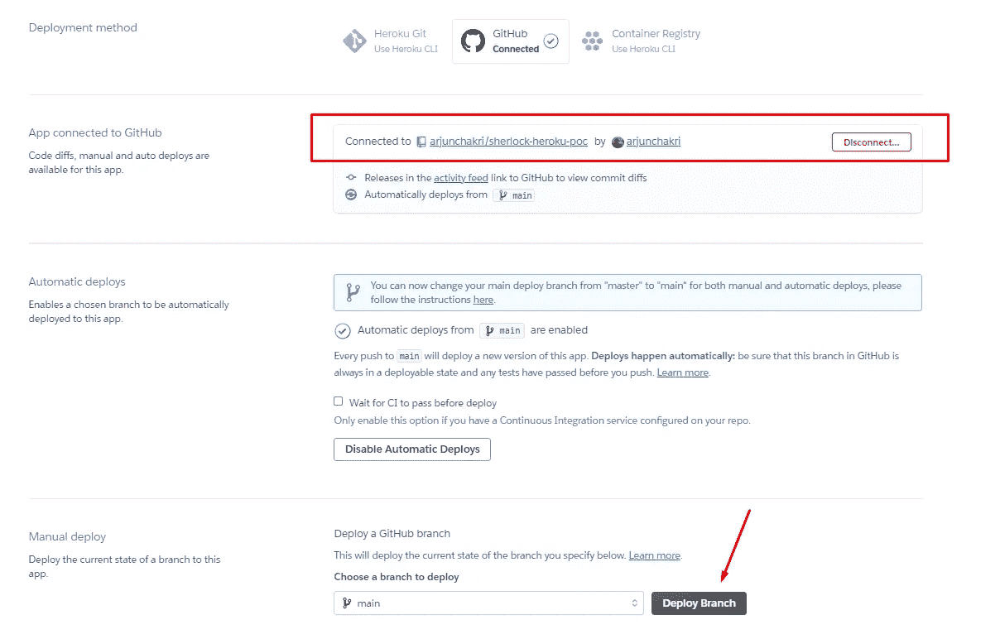
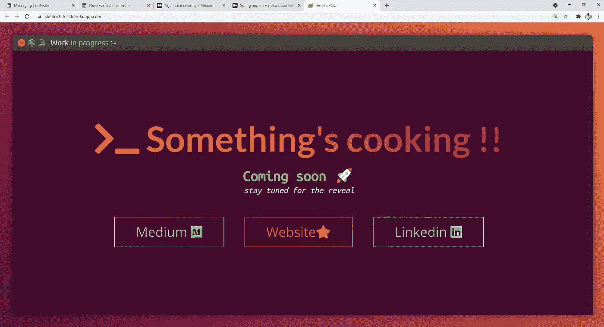

# Heroku cloud 上持续部署的 Spring 应用程序

> 原文：<https://medium.com/nerd-for-tech/spring-app-on-heroku-cloud-with-continuous-deployment-328ff8fbfe7a?source=collection_archive---------13----------------------->

快速阅读📖在互联网上发布网络应用🌐。容易，没有压倒性的服务🤖比如 AWS 或者谷歌云。


Heroku ☁️是一个基于 Salesforce 的**平台即服务**，它简化了**软件发布**的痛苦部分——构建、服务器、负载平衡、日志、监控和部署**，让开发人员将**专注于**编码**💻。

> 请在 [Heroku docs](https://www.heroku.com/dynos) 阅读相关内容。

应用程序托管在 Heroku 的云上，在类似 docker 的专有容器 dynos 中。

> Heroku 是技术栈不可知的，它支持 Python，node，PHP 和其他几个栈。

下面的文章需要对 GitHub、Spring Boot 和 Maven 有基本的了解。

# **GitHub 设置**

首先，你需要 spring 应用程序🍃GitHub 存储库中的代码库。我以下面的回购为例。

知识库:[https://github.com/arjunchakri/sherlock-heroku-poc](https://github.com/arjunchakri/sherlock-heroku-poc)

设置您的 spring 应用程序代码，并在 pom.xml 中声明[spring-boot-maven-plugin](https://docs.spring.io/spring-boot/docs/current/maven-plugin/reference/htmlsingle/)，以便在构建后生成二进制文件。(使用“mvn 干净包”)

O 需要说明的一件重要事情是你的应用程序的入口点**。Heroku infrastructure 在您的项目根目录中寻找一个“Procfile”文件。**

```
web: java -Dserver.port=$PORT $JAVA_OPTS -jar target/herokupoc-*.jar
```

*   这是在 Heroku cloud 中使用包目标构建项目后，应用程序的入口点。
*   根据项目的工件 ID，编辑上面的二进制名称。
*   在部署期间，端口将被设置为动态端口号。

一旦 spring 服务器从本地构建的 jar 成功运行，就将代码推送到您的 git 存储库。

# Heroku 设置

现在代码库已经准备好了，让我们在 Heroku 上设置一些东西。如前所述，Heroku

> Heroku 目前有一个[自由层](https://www.heroku.com/pricing)🎁使用有限。应用程序在 30 分钟不活动后进入睡眠状态(一旦被调用，大约需要 30 秒才能上线)，并且只有有限的动态时间。
> 
> 保费等级**💰**提供更多功能，使应用程序生产就绪，扩展、监控、记录和提升服务器内存和 CPU。

在 https://www.heroku.com/[注册新账户](https://www.heroku.com/)

您现在将看到 **Heroku 仪表板**，发布电子邮件验证和协议。选择**新建** - >新建一个 app。



Heroku 应用仪表板

请谨慎选择应用程序名称，因为它将是该应用程序的公共 URL。

```
**appname**.herokuapp.com
```

选择唯一的应用程序名称后，从部署部分连接您的 GitHub 帐户。然后连接您的存储库。



Heroku 应用仪表板—部署选项卡

第一次，点击“部署分支”按钮，Heroku 检查您的代码，运行 Maven build，并发布您的应用程序。

确保启用自动部署选项🔄—非常适合启用了**连续部署**的暂存环境。

> 持续部署？你推送到 Git 库的任何代码更改都会触发一个新的构建并重新部署应用。



您可以从“设置”选项卡->域中查看您的应用程序的公共 URL。

[https://sherlock-test.herokuapp.com/](https://sherlock-test.herokuapp.com/)



奥拉，你的应用程序现已上线🎉！！
此外，对您的存储库的代码更改将在几分钟内生效！！