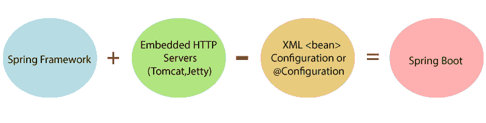
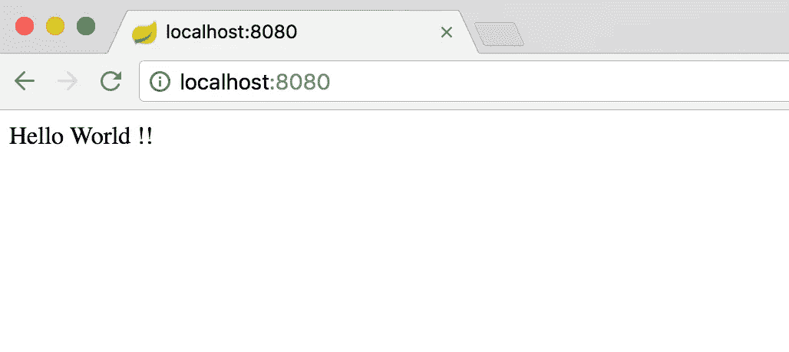

# Spring Boot

> 原文：<https://medium.com/nerd-for-tech/spring-boot-9a304e28a25f?source=collection_archive---------13----------------------->


图 1: Spring 徽标

Spring Boot 是一个开源的基于 Java 的框架。用于开发**【微服务】**。微服务是一种架构，使开发人员能够独立开发和部署他们的服务，并且每个运行的服务都有自己的流程。这个**“关键团队”**创造了它。Spring 应用程序用于创建独立的生产级应用程序。他们提供了 Spring 平台和第三方库。

Spring Boot 是“Spring 框架”和“嵌入式服务器”的混合体。



图 2: **Spring 框架+嵌入式服务器**

## Spring Boot 框架的使用

*   采用依赖注入方法。
*   它具有高级数据库事务管理功能。
*   它提供强大的批处理并管理 REST 端点。
*   它降低了应用程序的成本和开发时间。
*   它包括嵌入式 Servlet 容器。
*   它提供了一个基于注释的 spring 应用程序。

# 它是如何工作的？

Spring Boot 根据我们用@***enable auto configuration***注释添加到项目中的依赖项自动配置您的应用程序。spring boot 应用程序的入口点是包含@**spring boot application**注释和 main 方法的类。通过使用@ **ComponentScan** 注释，Spring Boot 自动扫描项目的所有组件。

## 要求

您的系统需要满足以下最低要求才能创建 Spring Boot 应用程序。

*   Java 7
*   Maven 3.2
*   Gradle 2.5

Spring Boot 应用程序的入口点是包含@**spring boot Application**注释的类。这个类的 main 方法应该用于运行 Spring Boot 应用程序。自动配置、组件扫描和 Spring Boot 配置都包含在@**spring boot application**注释中。

```
import org.springframework.boot.SpringApplication;
import org.springframework.boot.autoconfigure.SpringBootApplication;

@SpringBootApplication
public class DemoApplication {
   public static void main(String[] args) {
      SpringApplication.run(DemoApplication.class, args);
   }
}
```

## Spring Boot CLI

Spring Boot CLI 是一个命令行工具，可以让你运行 Groovy 脚本。使用 Spring Boot 命令行界面，这是构建 Spring Boot 程序最简单的方法。在命令提示符下，您可以构建、运行和评估程序。

您需要使用以下两个文件夹:

*   **spring-boot-CLI-2 . 0 . 0 . build-SNAPSHOT-bin . zip**
*   **spring-boot-cli-2.0.0.BUILD-SNAPSHOT-bin.tar.gz**

在命令提示符下，导航到 Spring Boot CLI bin 目录并执行命令 Spring –- version，以确保 Spring CLI 已正确启用。创建一个包含 Rest 端点脚本的简单 groovy 文件，保存为“**hello . groovy”**并使用 spring boot CLI 运行。然后，所需的依赖项将自动下载，并在 Tomcat 服务器中启动应用程序。

```
@Controller
class Example {
   @RequestMapping("/")
   @ResponseBody
   public String hello() {
      "Hello Spring Boot"
   }
}
```

最后，进入浏览器，点击 URL(例如:[**http://localhost:8080/**](http://localhost:8080/))并查看输出。



图 3:本地主机:8080

## Spring Boot 的优势

*   它创建了可以使用 Java **-jar** 启动的**独立** Spring 应用程序。
*   它为“**starter**”POM 提供了强有力的意见，帮助我们简化我们的 Maven 配置。
*   易于理解和开发 spring 应用程序。
*   提高生产率。
*   减少开发时间。
*   不需要 **XML** 配置。
*   提供**插件的数量**。
*   提供了一个用于开发和测试 Spring Boot 应用程序的 CLI 工具。

## Spring Boot 的目标

*   以避免复杂的 XML 配置。
*   以更简单的方式开发生产就绪的 Spring 应用程序。
*   减少开发时间并独立运行应用程序。
*   避免编写导入语句。
*   避免定义更多注释配置。

## 参考

```
1.[https://www.tutorialspoint.com/spring_boot/spring_boot_quick_start.htm](https://www.tutorialspoint.com/spring_boot/spring_boot_quick_start.htm)
```