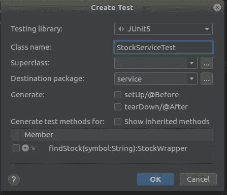

# 弹簧靴系列—单元测试基础

> 原文：<https://medium.com/nerd-for-tech/spring-boot-series-unit-testing-basics-3ce566250465?source=collection_archive---------19----------------------->

嗨伙计们。所以到目前为止，我们已经开发了一个基本的 spring boot 应用程序，它从 Yahoo finance API 获取数据并显示股票价格。所以在本教程中，我将稍微涉及一下单元测试领域，因为当你在一家大型科技公司工作时，这些实践会很方便。所以在本教程中，我将使用 JUnit 进行单元测试。如果你看一下我已经给你们看过的 gradle.build 文件，它包含了 JUnit 依赖项。所以让我们直接进入代码中的测试场景。教程到目前为止，

 [## 春靴系列—股市数据终点

billa-code.medium.com](https://billa-code.medium.com/spring-boot-series-stock-market-data-end-point-356592487254) [](https://billa-code.medium.com/create-the-first-spring-boot-app-4e930d812a22) [## 创建第一个春季启动应用程序

### 我不打算深入了解许多功能和描述，而只是深入了解 Spring boot 的世界…

billa-code.medium.com](https://billa-code.medium.com/create-the-first-spring-boot-app-4e930d812a22) 

所以前几天我们创建了一个从 Yahoo fiance API 获取股票数据的服务。所以我将为该文件添加单元测试。伙计们，我在这里不是要深入基础知识，让这个教程变得无聊。所以我将向您展示使用 intellij 创建测试文件的简单方法。转到 StockService.java 文件，然后在类中右键单击。在弹出窗口中，您会看到一个名为“生成”的选项卡，单击它。在那里，您会找到一个名为 Test 的选项卡，并单击它。所以你会看到这样一个对话框。



所以这里你可以看到它在问我们需要单元测试的方法。因为我们只有一个方法，所以我们将为其编写单元测试。

```
package service;
import org.junit.jupiter.api.Test;

class StockServiceTest {
    @Test
    void findStock() {
    }
}
```

这是刚刚创建测试文件后的代码。所以在 spring boot @Test 注释在构建时调用测试。由于我们获得的股票价值数据每分钟都在变化，我将测试我们从 Yahoo finance API 获得的符号是否等于我作为输入给出的符号。所以代码如下。

```
import org.junit.jupiter.api.Test;
import wrapper.StockWrapper;

class StockServiceTest {
    @Test
    void findStock() {
        StockService stockService = new StockService();
        StockWrapper stockWrapper = stockService.findStock("GOOG");

        assert stockWrapper.getStock().getSymbol().equals("GOOG");
    }
}
```

因此，现在转到终端/CMD windows 用户类型。

```
gradlew test
```

对于 ubuntu 用户类型，

```
./gradlew test
```

只需在 assert 中更改“GOOG”的值，然后再次运行 gradle test，您将会看到测试将会失败。这是单元测试的基本介绍。快乐的编码伙计们。下一次，我们将改进我们的股票控制器，以 JSON 格式向前端应用程序发送数据。