# 10 分钟讲述 SQL 基础知识

> 原文：<https://medium.com/nerd-for-tech/sql-basics-covered-within-10-minutes-7f20bdc62b50?source=collection_archive---------0----------------------->

SQL 代表结构化查询语言，用于访问和操作数据库。

RDBMS 代表关系数据库管理系统。它是 SQL 以及 MS SQL Server、Oracle、MySQL 和 Microsoft Access 等数据库系统的基础。

1.  在 RDBMS 中，数据存储在名为**表**的数据库对象中。表格是相关条目的集合，由列和行组成。
2.  每个表都有更小的实体，称为**字段。**字段是表中的一列，存储特定表中每个条目的特定信息。
3.  一个**记录**是表中存在的每个单独的条目。它是表格中的水平实体。
4.  一个**数据库**通常包含一个或多个表。每个表都有一个唯一的名称。

对于本文，我将使用 MySQL db。

# 数据库命令

1.  **列出所有数据库**:‘显示数据库；“命令是用过的。

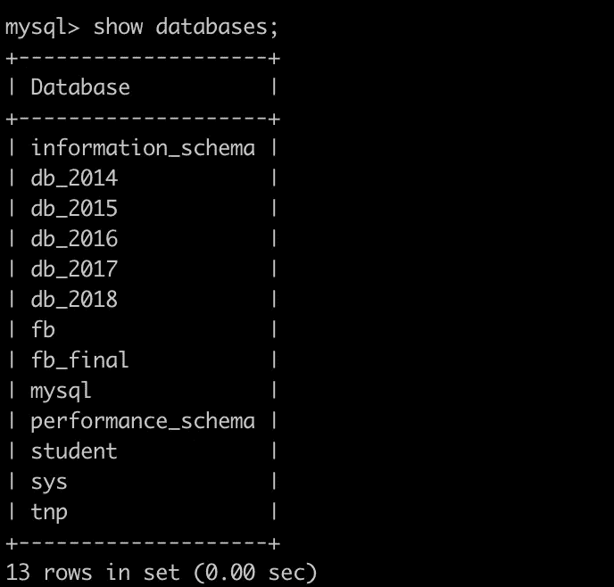

2.**创建新数据库**:创建新数据库，使用

```
CREATE DATABASE *database_name;*
```

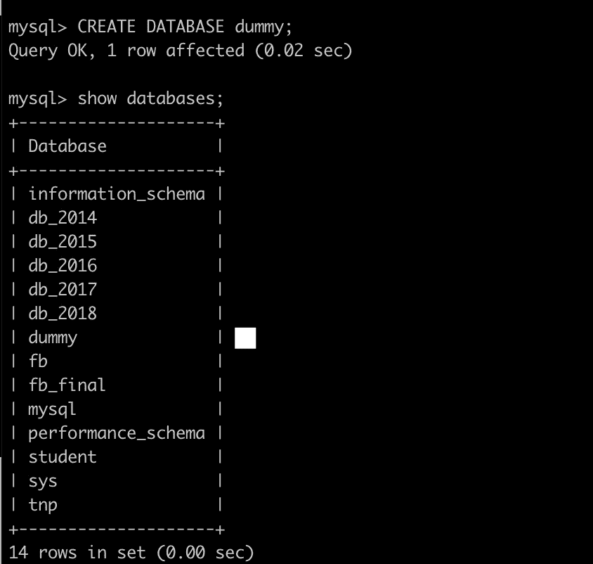

在上面的截图中，我创建了一个名为“dummy”的新数据库。

3.**删除现有数据库**:如果要删除现有数据库，使用

```
drop database *database_name*;
```

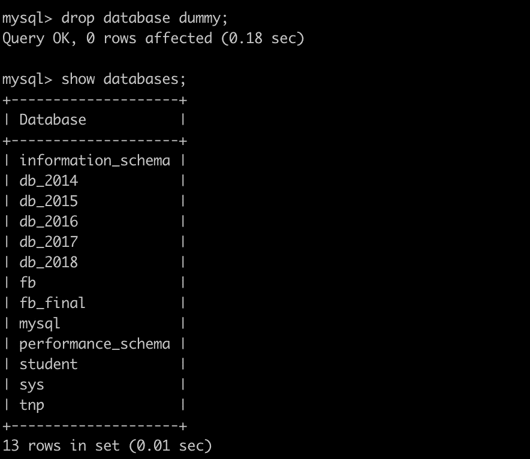

在上面的截图中，我删除了名为' dummy '的 db。

4.切换到特定数据库:

```
use database_name;
```

# 表格命令

1.  **显示数据库中现有的表:**要列出数据库中的所有表，请使用

```
show tables;
```

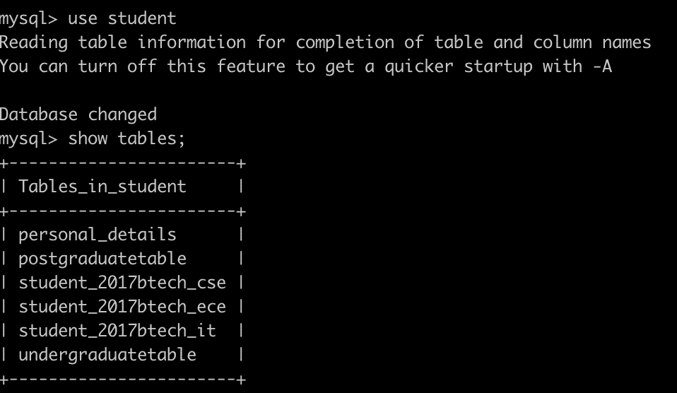

2.**创建新表:**要创建新表，请使用:

```
CREATE TABLE table_name (
   id INTEGER PRIMARY KEY,
   name TEXT,
   age INTEGER
);
```

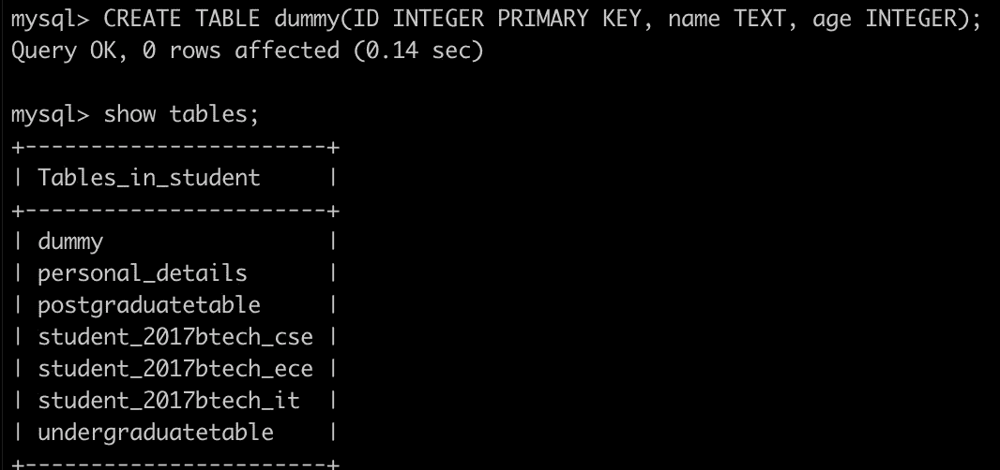

3.**使用另一个表格创建表格:**也可以使用`CREATE TABLE`创建一个现有表格的副本。可以从现有表中选择所有列或特定列。如果使用现有表创建新表，新表将填充旧表中的现有值。

```
CREATE TABLE *new_table_name* AS
    SELECT *column1, column2,...*
    FROM *existing_table_name*
    WHERE ....;
```

4.**删除一个现有表格**:

```
DROP TABLE *table_name*;
```

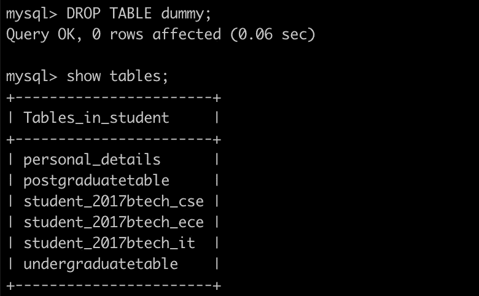

在上面的截图中，我删除了名为' dummy '的表。

5.**从表格中删除数据**:

```
TRUNCATE TABLE *table_name*;
```

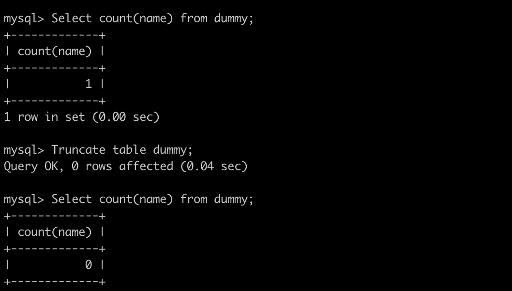

在上面的截图中，表“dummy”中有 1 条记录。截断后，表变空了。

6.**修改已有表格**:用于增加、删除或修改已有表格中的列。它还可以用来添加和删除表上的各种约束。

```
ALTER TABLE *table_name* ADD *column_name datatype*;
```

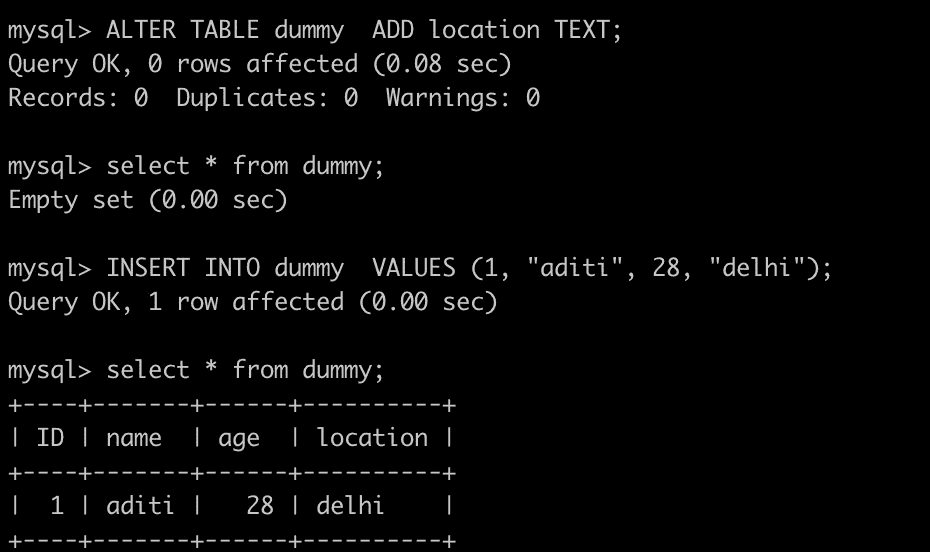

我在现有的表中添加了一个新列“location”。

要删除列，请使用以下命令

```
ALTER TABLE *table_name* DROP COLUMN *column_name*;
```

要更改特定列的数据类型:

```
ALTER TABLE *table_name* MODIFY COLUMN *column_name datatype*;
```

7.**将数据添加到表格中**

它用于向表中插入新数据。

```
INSERT INTO table_name (column_name) VALUES (values);
```

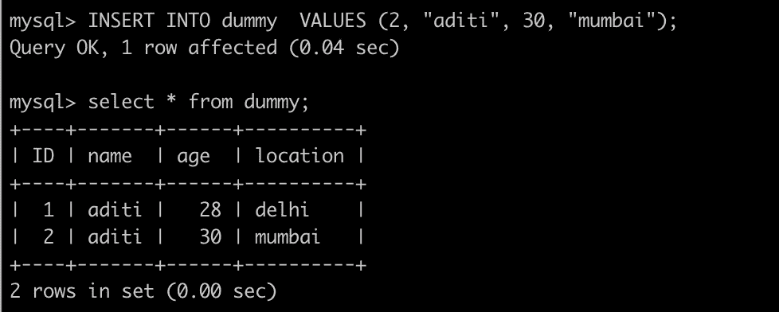

# 限制

约束用于为表中的数据指定一些规则。它们限制了可以插入表中的数据类型。这些约束有助于确保表中数据的准确性和可靠性。这些可以应用于列级或表级。

最常用的约束条件:

*   `[NOT NULL](https://www.w3schools.com/sql/sql_notnull.asp)` -列不能有空值
*   `[UNIQUE](https://www.w3schools.com/sql/sql_unique.asp)` -一列中的所有值都不同
*   `[PRIMARY KEY](https://www.w3schools.com/sql/sql_primarykey.asp)`——a`NOT NULL`和`UNIQUE`的组合
*   `[FOREIGN KEY](https://www.w3schools.com/sql/sql_foreignkey.asp)` -防止破坏两个表之间链接的动作
*   `[CHECK](https://www.w3schools.com/sql/sql_check.asp)` -确保列中的值满足特定条件
*   `[DEFAULT](https://www.w3schools.com/sql/sql_default.asp)` -如果没有指定值，则为列设置默认值
*   `[CREATE INDEX](https://www.w3schools.com/sql/sql_create_index.asp)` -用于快速创建和检索数据库中的数据

```
CREATE TABLE *table_name* (
 *column1 datatype* *constraint*,
 *column2 datatype* *constraint*,
 *column3 datatype* *constraint*,
    ....
);
```

# 选择命令

它用于从表中选择数据。如果要从表中选择特定的列，请使用以下命令

```
SELECT *column1*, *column2, ...*
FROM *table_name*;
```

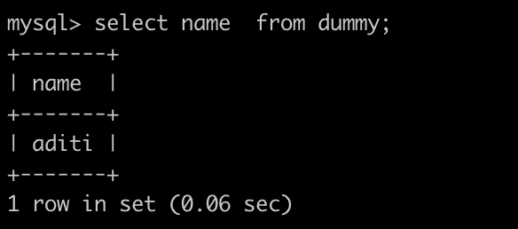

如果要选择表格中的所有数据:

```
SELECT *** FROM *table_name*;
```

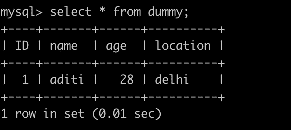

## 选择不同的值

它用于仅返回列中存在的不同值。

```
SELECT DISTINCT column_name FROM table_name;
```

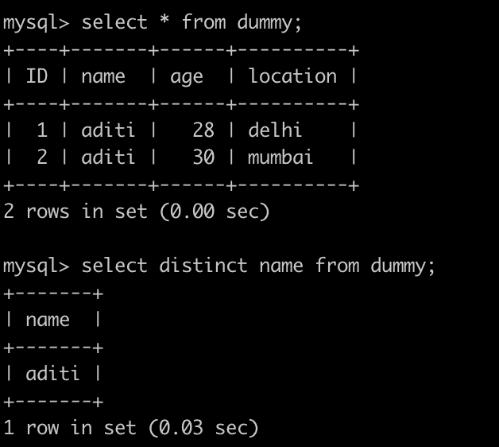

# **何处命令**

它用于根据特定条件或过滤器选择数据。

```
SELECT column_name FROM table_name WHERE condition;
```

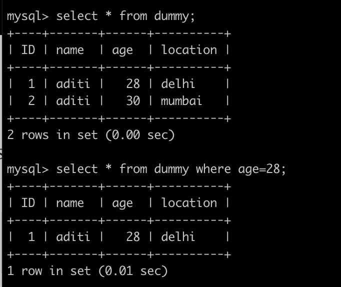

您还可以使用 AND 或 or 来指定多个过滤器

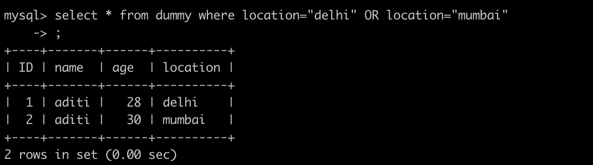

在 where 子句中可以使用以下操作符:=，>，

# Count command

Gives the number of records that follows a specified condition.

```
SELECT COUNT(column_name) FROM table_name WHERE condition;
```

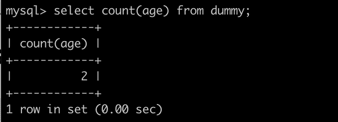

# Order By Command

It is used to sort the result in either ascending (default) or descending order of a column’s values.

```
SELECT "column_name" FROM "table_name" WHERE "condition" ORDER BY column_name ASC|DESC
```


# **更新表中的现有记录**

更新表中数据的信息。

```
UPDATE table_name SET name = "new_name" WHERE name = "old_name";
```

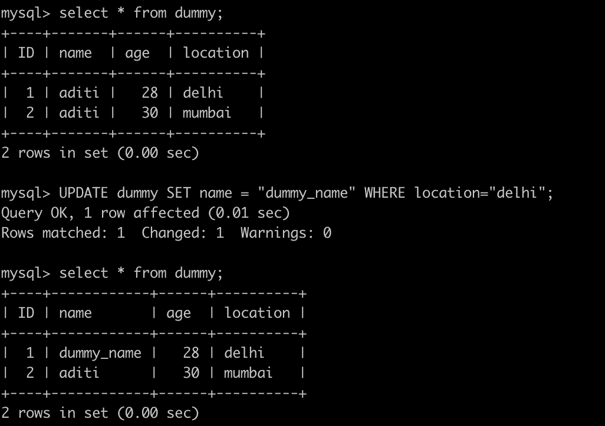

如果删除`WHERE`子句，所有记录都将被更新！

# 删除记录

从数据库中删除一行。

```
DELETE FROM table_name WHERE condition;
```

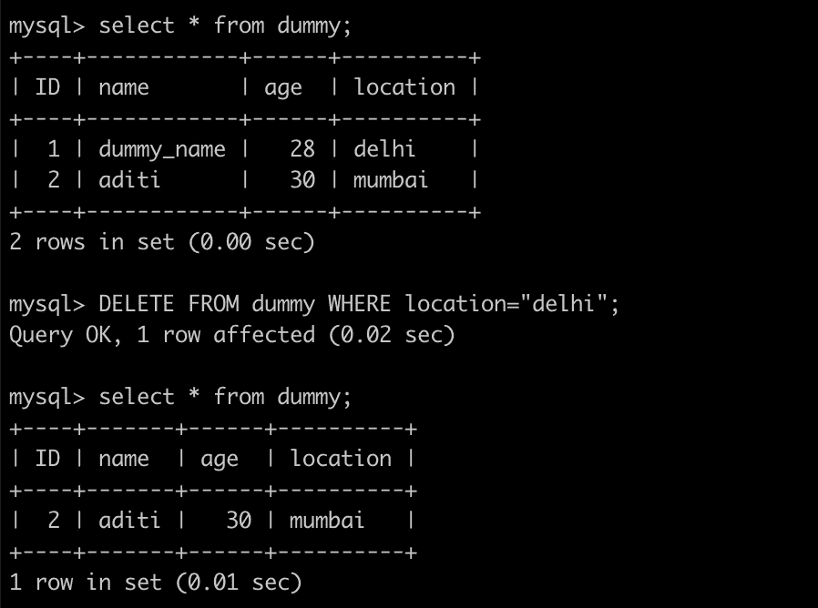

如果省略`WHERE`子句，表中的所有记录都将被删除！

# 选择到命令

它将数据从一个表复制到另一个表中。

```
SELECT column_name(s) INTO new_table FROM old_table WHERE condition;
```

将使用旧表中定义的列名和类型创建新表。您可以使用`AS`子句创建新的列名。MySQL 不支持 Select Into。相反，它有[插入..选择](https://dev.mysql.com/doc/refman/8.0/en/ansi-diff-select-into-table.html)。

# 选择顶部

它用于指定表中要显示的记录数。

*   不是所有的数据库系统都支持`SELECT TOP`。MySQL 支持`LIMIT`来选择有限数量的记录，而 Oracle 使用`FETCH FIRST *n* ROWS ONLY`和`ROWNUM`。

```
SELECT *column_name* FROM *table_name* WHERE *condition* LIMIT *number*;SELECT TOP *number*|*percent* *column_name* FROM *table_name* WHERE *condition*;
```

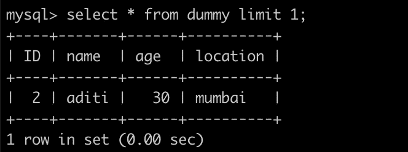

# 存储过程

这是您可以保存以便再次重用的代码。

用于储存:

```
CREATE PROCEDURE *procedureName* AS *sqlStatement* GO;
```

要调用存储过程:

```
EXEC *procedureName;*
```

# 连接

它用于根据两个或多个表之间的公共列来合并它们的行。有四种类型的连接。

*   内部联接-返回两个表之间的所有公共记录
*   左(外)连接-返回左表中的所有行，以及右表中的匹配行
*   右(外)连接-返回右表中的所有行，以及左表中的匹配行
*   完全(外部)连接-当其中一个表中存在匹配项时，返回所有行

```
SELECT column_name FROM table_name_1 INNER JOIN table_name_2 ON table_name_1.column_name = table_name_2.column.name;
```

一个表中有一列包含另一个表的外键，就像如果有一个学生个人详细信息表和一个学生成绩表，学生详细信息表可能有一列 roll_nos，然后将该列联接到另一个表的 roll_nos 列上。

```
SELECT *column_name* FROM *table_name_1* LEFT JOIN *table_name_2* ON table_name_1.column_name = table_name_2.column.name;SELECT *column_name* FROM *table_name_1* RIGHT JOIN *table_name_2* ON table_name_1.column_name = table_name_2.column.name;SELECT *column_name* FROM *table_name_1* FULL OUTER JOIN *table_name_2* ON table_name_1.column_name = table_name_2.column.name;
```

# 自连接

自联接类似于常规联接，但表是与自身联接的。

```
SELECT *column_name* FROM *table_name_1 T1, table_name_1 T2* WHERE *condition;*
```

示例:

```
SELECT X.StudentName AS StudentName1, Y.StudentName AS StudentName2, X.City FROM Students X, Students Y WHERE X.StudentID <> Y.StudentID AND X.City = Y.City ORDER BY X.City;
```

# 最小值和最大值函数

这些函数可用于获取特定列的最小值或最大值。

```
SELECT MIN(*column_name*) FROM *table_name* WHERE *condition*;SELECT MAX(*column_name*) FROM *table_name* WHERE *condition*;
```

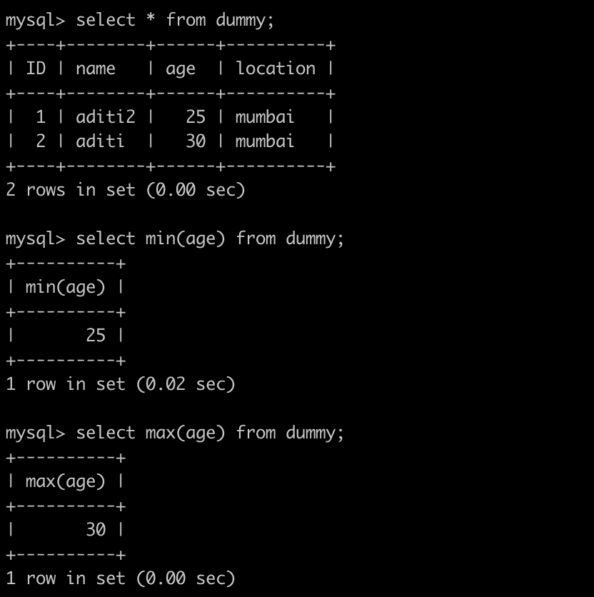

# 主关键字

主键用于唯一标识特定表中的每条记录。它必须包含唯一的值，并且不能包含空值。

一个表只能有一个主键；在表中，这个主键可以由一列或多列组成。

可以在创建表或使用 alter table 命令时创建主键。

```
CREATE TABLE Students ( ID int NOT NULL,
    LastName varchar(64) NOT NULL,
    FirstName varchar(64),
    Age int,
    PRIMARY KEY (ID)
);
```

对于在多个字段上添加主键:

```
CREATE TABLE Students  (
    ID int NOT NULL,
    LastName varchar(64) NOT NULL,
    FirstName varchar(64),
    Age int,
    CONSTRAINT S_Student PRIMARY KEY (ID,LastName)
);
```

如果要使用 alter table 添加主键:

```
ALTER TABLE Students ADD PRIMARY KEY (ID);ALTER TABLE Students ADD CONSTRAINT S_Student PRIMARY KEY (ID,LastName);
```

删除主键约束:

```
ALTER TABLE Students DROP PRIMARY KEY;
```

# 外键

它用于防止破坏表之间链接的操作。一个`FOREIGN KEY`是一个表中的字段，它引用另一个表中的`PRIMARY KEY`。

```
CREATE TABLE Scores(
    SubjectID int NOT NULL,
    Scores int NOT NULL,
    ID int,
    PRIMARY KEY (SubjectID),
    FOREIGN KEY (ID) REFERENCES Students(ID)
);
```

# 自动增量字段

每当向表中插入新记录时，它都会自动生成一个唯一的数字。通常，这是我们希望每次插入新记录时自动创建的主键字段。

```
CREATE TABLE Students (
    Student_id int NOT NULL AUTO_INCREMENT,
    LastName varchar(255) NOT NULL,
    FirstName varchar(255),
    Age int,
    PRIMARY KEY (Student_id)
);
```

默认情况下，`AUTO_INCREMENT`的起始值是 1，每插入一条新记录，它就增加 1。

要让`AUTO_INCREMENT`序列以其他值开始，使用给定的命令:

```
ALTER TABLE Students AUTO_INCREMENT=50;
```

这些是关于如何创建一个数据库，一个表，对它执行 CRUD 操作，以及修改其中的内容的基础知识。

***感谢阅读！请随时留下任何反馈。***