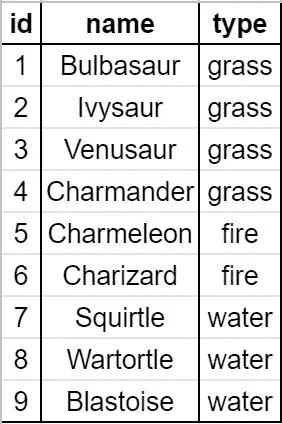
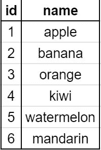

# SQL 基础知识—让我们一起来玩神奇宝贝数据吧！

> 原文：<https://medium.com/nerd-for-tech/sql-basics-lets-play-with-pok%C3%A9mon-data-d81709c9d7ae?source=collection_archive---------1----------------------->


熨斗之旅的第二阶段慢慢展开，我被 SQL 击中了。我很兴奋在课程表上看到它，但是当我看到第一课的时候，我已经想退出浏览器了。

所以我只是盯着页面而页面也回瞪着我，毫无进展。如果你和我一样是个新手，你可能只在招聘信息中见过它，不知道 SQL 是什么，也不知道它是做什么的。

让我们慢慢展开吧！(Flatiron 使用 SQLite 数据管理系统，因此这些命令大多只与用 SQLite 管理的数据库相关。)

# 什么是 SQL？

世界靠数据运行！作为现代人，我们如何存储数据？在线！数据存储在…数据库中！数据就是知识，为了能够获得这样的知识，我们必须获得权力！SQL 的力量！

SQL 代表**结构化查询语言**。有些人发“sequel”的音，而有些人只发每个字母的音，“S.Q.L”

数据存储在一个称为数据库的仓库中。不幸的是，仓库是锁着的。SQL 将是访问数据库和获取我们需要的特定数据的关键。使用 SQL，我们可以创建、读取、更新和删除数据库中的数据。数据存储在表格中，类似于 Microsoft Excel 或 Google Sheet 中的表格。

假设我们在一个名为 pokemon.db 的数据库文件中有这个表。



(但是等等！小火龙不是草的类型！我们将如何改变这种情况？嗯…)

这张桌子有神奇宝贝的记录。惯例是用表格内容的小写复数来命名表格，所以仍然是`**pokemon**` …好吧，让我们试试一个更好的例子！如果一个表有关于水果的数据，那么这个表将被称为`**fruits**`。

下面的表格会以`**fruits**`作为它的名字。



但我真的很喜欢神奇宝贝，所以我们会坚持第一桌。


迈克尔·里维拉·🇵🇭在 [Unsplash](https://unsplash.com?utm_source=medium&utm_medium=referral) 上拍摄的照片

# 如何执行命令？

有几种方法可以执行 SQL 命令。一种方法是打开数据库文件，然后在终端中运行命令，此时您仍然在数据库文件中。第二种方法是将所有代码写在一个文件中(我目前正在学习 Ruby，所以让我们使用。rb 扩展名的文件，但扩展名无关紧要)。然后，使用以下命令调用保存在 list-of-commands-file.rb 中的所有 SQL 命令:

`**pokemon.db < list-of-commands-file.rb**`

对于这种方法，建议您将创建表、插入数据和编写查询的文件分开。

或者，您可以在文本编辑器中编写代码，然后将命令复制并粘贴到终端(一旦您进入数据库文件)。

# 如何创建表格？

所以让我们回到神奇宝贝的例子。让我们从创建一个表来存储信息开始。

```
CREATE TABLE pokemon (
   id INTEGER PRIMARY KEY,
   name TEXT, 
   type TEXT
);
```

`**CREATE TABLE pokemon**`命令正在创建一个名为`**pokemon**`的表。这个表将有三列:`**id**`、`**name**`和`**type**`。通常的惯例是用小写字母键入列名，用大写字母键入命令。这也是防止你误以为命令/语法是字符串或输入的一部分的方法。

第一列`**id**`，输入一个整数。`**id**`通常也被称为表的主键。每个表都有自己的主键。把它想象成一个人的税号。每个人都有不同的税务 id，就像每个神奇宝贝记录都有不同的 ID 一样。记录是表中的每一行信息。

第二列`**name**`，接受文本作为输入。用引号`“”`输入文本。第三列`**type**`，就像第二列一样。

语法的最后一部分是分号`**;**`。如果没有分号，SQLite 不会知道您的命令已经结束。

好了，一旦我们执行了 SQL 命令，我们应该在`**pokemon.db**`文件中有一个空表，只有列名。

我们怎么知道这个表是否真的被创建了呢？

我向你介绍，`**.tables**`命令！

在您的终端中键入`**.tables**`(确保您处于数据库文件的级别)。您应该会得到到目前为止已经创建的所有表！所以你应该会看到`**pokemon**`被列出来。

要检查`**pokemon**`表格的格式，使用`**.schema**`命令。它将返回如下内容:

```
CREATE TABLE pokemon (
   id INTEGER PRIMARY KEY,
   name TEXT, 
   type TEXT
);
```

…等等。那不就是我们的`**CREATE TABLE**`命令吗？是的。是的，它是。

现在就来加点神奇宝贝吧！


[杰](https://unsplash.com/@imjma?utm_source=medium&utm_medium=referral)在 [Unsplash](https://unsplash.com?utm_source=medium&utm_medium=referral) 上拍照

# 如何插入数据？

要添加神奇宝贝，我们将执行以下操作:

```
**INSERT INTO pokemon (name, type) VALUES
("Bulbasaur", "grass"),
("Ivysaur", grass);**
```

或者我们可以做:

```
**INSERT INTO pokemon (name, type) VALUES ("Bulbasaur", "grass");
INSERT INTO pokemon (name, type) VALUES ("Ivysaur", "grass");**
```

但是等等！我不是创建了三个列吗？！

是的。是的，我做到了。那么输入的`**id**`部分在哪里呢？

嗯，你是否曾经输入了太多的数据，以至于有时忘记了你刚刚输入的最后一项内容？或者你有没有忘记你为什么要进一个房间？是为了拿手机充电器…？是去拿毛巾吗…？

SQLite 的神奇之处在于，我们再也不用担心手动计算表中已经有多少神奇宝贝了。SQLite 将帮助我们保持跟踪。第一个记录，妙蛙种子，将有一个`**1**`的`**id**`。第二个记录将有一个`**2**`的`**id**`，依此类推。每条记录的`**id**`值将是其最独特的特征。

当然，你可以争辩说没有两个神奇宝贝会有相同的名字。但是，如果有一天，任天堂决定和我们一起玩，只是创造一整套与以前的神奇宝贝同名的神奇宝贝，那该怎么办？不会吧…对吧？

他们做到了。他们只是在神奇宝贝的名字前面加上了地区名。所以，喵喵还是喵喵。皮卡丘还是皮卡丘。训练员不会说，“阿兰·喵喵，用 Scratch！”这太愚蠢了。

有了 SQLite magic，我们就不用担心*新*神奇宝贝会和老的同名了。我们可以用它们唯一的属性`**id**`进行查询。SQLite 自动为我们添加了`**id**`属性，因为我们将列命名为`**PRIMARY KEY**`。SQLite 将计算 id 并自动递增！厉害！少了一个需要担心的人为错误。

# 怎么查询？

所以我们在桌子上放了两只神奇宝贝。让我们检索表中与所有神奇宝贝相关的所有数据。

```
**SELECT * FROM pokemon;**
```

我们来分解一下`**SELECT**`命令。

`**SELECT**`表示我们希望下面的值返回给我们。

`*****`可能是你在其他数据库搜索中认识到的，比如谷歌。这有点像通配符。SQLite 会认为这是从每一列返回的值。

`**FROM**`是 SQLite 查找紧随其后的表名的关键字。

`**pokemon**`是我们从中选择的表的名称。

`**;**`是结束查询。

该查询将返回如下内容:

```
**1|Bulbasaur|grass
2|Ivysaur|grass**
```

哇哦。那不是很丑吗？让我们把结果做得漂亮一点。

让我们使用`**.headers on**`命令向我们展示列名是什么！

```
**id|name|type**
**1|Bulbasaur|grass
2|Ivysaur|grass**
```

好多了，但还是…丑。如果结果能相互隔开就好了…

让我们试试`**.mode column**`命令。这个命令将使我们能够调整结果的宽度。还是坚持用`**.width auto**`吧。

现在就来看看结果吧！

```
**id        name        type
--------- ----------- ------
1         Bulbasaur   grass
2         Ivysaur     grass**
```

好多了！

那么如果我们只想要神奇宝贝的`**type**`和`**1**`的`**id**`呢？该命令将是:

```
**SELECT pokemon.type FROM pokemon WHERE pokemon.id = 1;**
```

我们来分析一下。

`**SELECT**`表示我们希望该关键字右侧的项目返回给我们。

`**pokemon.type**`意味着我们将进入`**pokemon**`的表，我们需要 type 列的值。通常，数据库会有多个表。为了更好地组织我们的神奇宝贝列表，我们可以从技术上为每个新一代创建表格，对吗？但它们应该都属于同一个文件，因为它们都是神奇宝贝。那么下一个表，比如说`**pokemon-gen-2**`，也将有一个`**name**`列和一个`**type**`列。我们希望使用`**table-name.column-name**`符号来区分我们从哪个表中选择。

`**FROM pokemon**`表示我们将查看`**pokemon**`表。

`**WHERE**`是设置过滤器的关键字。

`**pokemon.id = 1**`是我们的过滤器。

`**;**`是结束查询。

总之，我们只想从有`**1**`的`**id**`的`**pokemon**`桌上得到神奇宝贝的`**type**`。

您总是可以使用其他过滤器，但是`**id**`对于每个记录都是唯一的，所以当您只想要特定的返回时，使用`**id**`过滤器非常有用。


由[托马斯·埃文斯](https://unsplash.com/@timelordmp?utm_source=medium&utm_medium=referral)在 [Unsplash](https://unsplash.com?utm_source=medium&utm_medium=referral) 上拍摄的照片

# 如何更新表格/数据？

如果我没记错的话，阿什在第一季有一个妙蛙种子。所以现在我想在我的表中添加一个`**trainer**`列。让我们更新我们的表的模式，然后用`**.schema**`检查模式！

```
**ALTER TABLE pokemon ADD COLUMN trainer TEXT;**
```

`**.schema**`会返回这样的东西:

```
CREATE TABLE pokemon (
   id INTEGER PRIMARY KEY,
   name TEXT, 
   type TEXT
, trainer TEXT);
```

是的，逗号看起来很别扭，但这是我们的`**pokemon**`表的正确模式！

让我们分解一下`**ALTER TABLE**`命令。

`**ALTER TABLE**`表示我们将更换桌子。但是我们必须让 SQLite 知道是哪个表，对吗？

`**pokemon**`是我们要更改的表的名称。

`**ADD COLUMN**`告诉 SQLite 我们想要如何改变表格。

`**trainer**`是我们将要添加的列名。

`**TEXT**`是训练者栏中输入的数据类型。

`**;**`是结束命令。

现在我们有了自己的`**trainer**`专栏，让我们更新我们的妙蛙种子记录，把它的教练包括进来！

该命令将允许我们更新现有记录:

```
**UPDATE pokemon SET trainer = “Ash” WHERE pokemon.id = 1;**
```

(也可以用`**WHERE pokemon.name = “Bulbasaur”;**`)

我们来分析一下。

`**UPDATE**`是更新现有记录的关键字。

`**pokemon**`是我们正在更新的表的名称。

`**SET**`是设置新值的关键字。

`**trainer =**`是我们希望如何更改`**trainer**`列中的值。

`**“Ash”**`是我们要插入到`**trainer**`列中的值。

`**WHERE**`设置过滤器。

`**pokemon.id = 1**`是滤镜。我们只会改变这个神奇宝贝的`**trainer**`值。

`**;**`结束命令。

你将得不到回报。您必须手动查询特定神奇宝贝的数据，如下所示，以查看妙蛙种子的数据:

```
**SELECT pokemon.trainer FROM pokemon WHERE pokemon.id = 1;**
```

这将返回:

```
trainer
----------
Ash
```

它看起来很漂亮，因为我们之前使用了`**.headers on**`、`**.mode column**`和`**.width auto**`。

还记得第一个表中的错误吗？让我们把那张桌子搬回来。小火龙是火相星座！让我们更新表格。


之前我们更新了一个空的“单元”。我们也可以用相同的`**UPDATE**`命令更新已经有数据的“单元”!

```
**UPDATE pokemon SET type = “fire” WHERE pokemon.id = 4;**
```

# 如何删除表格/数据？

如果有一天你厌倦了神奇宝贝，想转战数码宝贝怎么办？(当然，你可以两者都享受。)所以后来你决定删掉所有关于神奇宝贝的东西。

这是删除表格的方法:

```
**DROP TABLE pokemon;**
```

非常简单。

但是，如果你真的不喜欢某个神奇宝贝，想删除那些数据呢？让我们假设我们已经插入了 151 之前的所有神奇宝贝数据。

```
**DELETE FROM pokemon WHERE pokemon.id = 150;**
```

所以现在`**pokemon**`表的最后两个 id 是`**149**`和`**151**`。你创造的下一个神奇宝贝将不会有`**150**`的`**id**`。它将有一个 id`**152**`。还记得 id 有多独特吗？一旦添加了新行，SQLite 就不会重复以前的 id。

然而，如果我删除了一个`**id**`为`**151**`的神奇宝贝，而当前的表只有 151 条记录，那该怎么办呢？在这种情况下，SQLite 将重用`**id**` `**151**`。

# 结论

SQL 没那么可怕！如果你偶尔忘记一些命令，那也没关系。这就是为什么我们有谷歌！当我写这篇文章的时候，我不得不依靠我的笔记，因为我的记忆力太差了。

现在，您已经学习或复习了如何:

*   创建/删除/更新表
*   插入/更新/删除记录！

还有很多命令，但这些都是基本的。那么既然你已经具备了一些知识，那我们就全部去查询吧！


照片由[大卫·格兰穆金](https://unsplash.com/@davidgrdm?utm_source=medium&utm_medium=referral)在 [Unsplash](https://unsplash.com?utm_source=medium&utm_medium=referral) 上拍摄