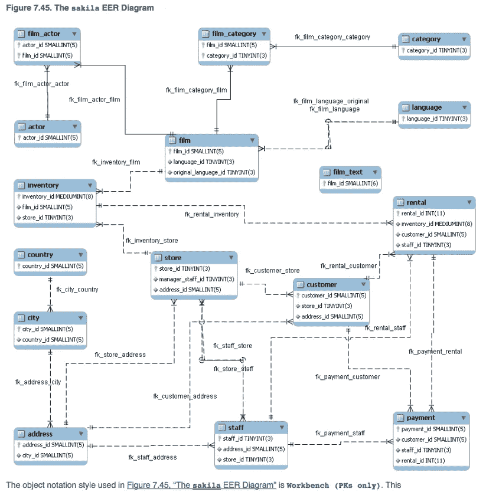

# 10 个查询中的 SQL:边做边学

> 原文：<https://medium.com/nerd-for-tech/sql-in-10-queries-learning-by-doing-3afc7ee6757a?source=collection_archive---------8----------------------->

一名优秀的数据分析师需要具备的关键技能之一是从大型数据库中提取数据的能力。SQL 是一种特定于领域的语言，可以帮助您访问和操作大型数据库。

在本文中，我们将回顾一些基本命令，这些命令对于学习掌握 SQL 非常重要。我们将使用一个公共数据库 Sakila，它列出了关于电影和客户的信息。数据库有许多通过主键和外键相互连接的表。实体关系图如下所示。



我们将回答一系列问题，并尝试学习 SQL 中使用的概念和命令。

Q1)您需要找到一个演员的 ID 号、名和姓，您只知道他的名“乔”您会使用哪一个查询来获取此信息？

```
SELECT actor_id,first_name,last_name
FROM actor
WHERE lower(first_name)='joe';
```

上面的查询使用了 SELECT 和 WHERE 子句，SELECT 帮助我们从查询中检索所需的列，WHERE 子句用于列出查询的条件。

Q2)找到所有姓氏中包含字母`LI`的演员。这一次，按姓氏和名字对行进行排序，顺序如下:

```
SELECT first_name,last_name
FROM actor
WHERE upper(last_name) LIKE '%LI%'
```

除了 SELECT 和 WHERE 子句之外，上面的查询还使用了 LIKE 子句，LIKE 子句是一个通配符运算符，这意味着任何包含单词 LI 的名称都将包含在查询中，ORDER 子句是一个排序命令。

Q3)使用`IN`，显示以下国家的`country_id`和`country`栏:阿富汗、孟加拉国和中国

```
SELECT country_id,country
FROM country
WHERE country IN ('Afghanistan','Bangladesh','China')
```

Q4)列出演员的姓氏以及拥有该姓氏的演员人数，但仅限于至少两个演员共有的姓名

```
SELECT last_name,count(*) AS num_actor
FROM actor
GROUP BY last_name
HAVING num_actor>2
ORDER BY 2 desc;
```

上述查询使用 GROUP 子句，该子句用于根据列或条件聚合数据。HAVING 子句用于对分组值执行条件。

Q5)使用`JOIN`显示每个员工的名和姓以及地址。使用表格`staff`和`address`

```
SELECT staff.first_name,staff.last_name,address.address
FROM staff LEFT JOIN address
ON staff.address_id=address.address_id;
```

JOIN 子句可能是 SQL 中最常用的子句之一，也引起了一些混乱。在本例中，我们使用了 LEFT JOIN，这意味着将包括所有的员工记录，但不包括地址表中不匹配的记录。换言之，没有地址的工作人员将被包括在内。

Q6)列出每部电影以及该电影的演员人数。使用表格`film_actor`和`film`。使用内部联接。

```
SELECT film.film_id,film.title,count(actor_id)
FROM film INNER JOIN film_actor ON
film.film_id=film_actor.film_id
GROUP BY film.film_id,film.title
ORDER BY 3 desc
```

这个例子展示了如何使用内部连接来显示两个表中的匹配记录。

Q7)女王和克里斯·克里斯托佛森的音乐出现了意想不到的复兴。一个意想不到的结果是，以字母`K`和`Q`开头的电影也越来越受欢迎。使用子查询显示以字母`K`和`Q`开头的电影名称，其语言是英语。

```
SELECT film.title
FROM film 
WHERE title LIKE 'K%' OR title LIKE 'L%'
AND language_id = (SELECT language_id FROM language WHERE name='English');
```

这是子查询的一个例子。在本例中，我们使用了子查询，而不是 JOIN 子句。这是编写子查询和访问数据的另一种方式。

Q8)您想在加拿大开展电子邮件营销活动，为此您需要所有加拿大客户的姓名和电子邮件地址。使用联接来检索这些信息。

```
SELECT customer.first_name,customer.last_name,customer.email
FROM customer LEFT JOIN address ON customer.address_id=address.address_id
JOIN city ON address.city_id=city.city_id
JOIN country ON city.country_id=country.country_id
WHERE country='Canada';
```

该查询使用三个连接来访问数据库中的结果。我们现在将讨论与连接和结果相关的更高级的问题。

Q9)构建一个查询，生成纪录片类别中的前 3 部电影列表。

```
SELECT film.title,count(*)
FROM film JOIN film_category ON film.film_id=film_category.film_id
JOIN category on film_category.category_id=category.category_id
JOIN inventory ON film.film_id=inventory.film_id
JOIN rental ON inventory.inventory_id=rental.inventory_id
WHERE category.name='Documentary'
GROUP BY title
ORDER BY  2 DESC
LIMIT 3;
```

Q10)按降序列出总收入排名前五的流派。(提示:您可能需要使用以下表格:类别、film_category、库存、付款和租赁。)

```
select category.name category_name, sum(payment.amount) category_revenue
from category 
LEFT JOIN film_category 
on category.category_id = film_category.category_id
LEFT JOIN film 
on film_category.film_id = film.film_id
LEFT JOIN inventory 
on film.film_id = inventory.film_id
LEFT JOIN rental 
on inventory.inventory_id = rental.inventory_id
LEFT JOIN payment 
on rental.rental_id = payment.rental_id
GROUP BY category.name
ORDER BY category_revenue desc
limit 5;
```

这个查询使用了我们上面讨论的所有内容。它使用多个 JOIN 子句，还使用 GROUP BY 子句。

我们看到了如何使用 SQL 从数据库中查询信息。掌握这些命令可以让你很好地掌握 SQL，如果你想从事数据职业，这是很重要的。