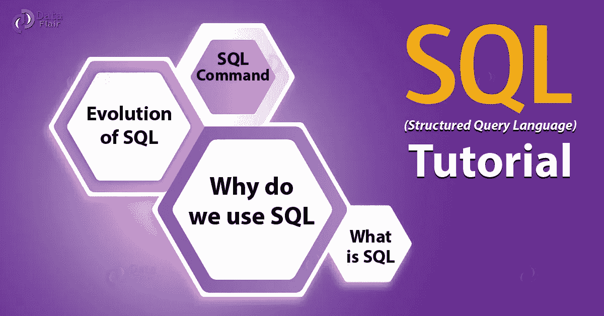

# SQL 是您作为数据/业务分析师首先应该学习的东西之一

> 原文：<https://medium.com/nerd-for-tech/sql-is-one-of-the-first-things-you-should-learn-as-a-data-business-analyst-a42d1f3cfc11?source=collection_archive---------8----------------------->

想象一下，能够使用大数据设计一个模型来缓解交通，使主要城市的交通变得简单方便。这是可以做到的，数据科学家需要的技能之一是 SQL。

随着当前海量数据的出现，企业和行业每天都在汇编数万亿字节的信息。大数据现象需要一套适当的技能来理解它，SQL 就是一个很好的方法。

# **什么是 SQL？**

SQL(结构化查询语言)是一种流行的数据库语言，用于创建、维护和检索关系数据库。

SQL 已经成为数据科学家工具箱中非常重要的工具，因为它在访问、更新、插入、操作和修改关系数据库中的数据时至关重要。

# **你为什么要用它？**

1.  SQL 是数据科学和分析的基础。学习 SQL 的基础知识并使用它们来查询和操作数据是非常容易的。
2.  SQL 因其简单而受到称赞，不像其他编程语言需要高级概念理解和记忆执行任务所需的步骤。
3.  处理大型数据集的最佳解决方案是 SQL。在大多数情况下，数据科学/分析涉及处理存储在关系数据库中的大量信息。处理如此大量的数据需要高级别的解决方案来管理，而不是 excel 电子表格。
4.  对于大多数数据分析工作，SQL 的熟练程度高于其他编程语言。因此，SQL 将为您提供这种能力，这将使您在需要数据分析师/科学家的组织中变得抢手和有用。一项调查显示，51%的数据科学工作在工作描述中列出了 SQL 知识。
5.  SQL 将帮助您调查您的数据集，理解它，识别其结构，并了解您的数据集实际上是什么样子。通过切片、过滤、聚合和排序，SQL 将允许您处理数据集，识别异常值或空值，并知道值是如何分布和组织的。
6.  SQL 将为你提供基础知识，可以帮助你钻研其他编程语言。
7.  SQL 不擅长可视化，但作为一种非常健壮的数据库管理和分析语言，它弥补了这一点。
8.  通过将代码包合并为存储过程，您可以轻松地集成 SQL 和 Python，轻松地完成工作。
9.  SQL 应用于大多数行业，如计算机软件、卫生、制造、运输、银行等。
10.  有一些基于 SQL 的商业智能工具非常方便，数据分析师可以轻松使用。

# **学习 SQL 的最佳地点**

1.  W3 学校:[https://lnkd.in/gJPfrrv](https://lnkd.in/gJPfrrv)—如果你对 SQL 一无所知，这是最好的起点
2.  把 Excel 知识变成 SQL:[https://www . daveondata . com/blog/SQL-programming-made-easy-no-really/](https://www.daveondata.com/blog/sql-programming-made-easy-no-really/)—免费，一个周末就能学会
3.  选择明星:【https://selectstarsql.com】T4/——它是免费的，没有广告，不需要注册或下载。
4.  code academy:[https://lnkd.in/gT5xmpN](https://lnkd.in/gT5xmpN)—学习各种编程语言的绝佳资源
5.  SQLZoo:[https://sqlzoo.net](https://sqlzoo.net/)/—一系列交互式课程和练习，旨在帮助您在浏览器中快速学习 SQL
6.  窗口函数:[https://lnkd.in/g3RtPCJ](https://lnkd.in/g3RtPCJ)—这很好，因为在数据分析师的工作面试中经常会问到窗口函数。
7.  黑客排名:[https://lnkd.in/grv_9sB](https://lnkd.in/grv_9sB)
8.  SQL Bolt:[https://sqlbolt.com](https://sqlbolt.com/)/
9.  leet code:[https://lnkd.in/g3c5JGC](https://lnkd.in/g3c5JGC)——leet code 是一个很好的平台，可以帮助你提高技能，扩展知识，为技术面试做准备。
10.  领英学习:[https://lnkd.in/gQXFc4n](https://lnkd.in/gQXFc4n)
11.  https://www.udemy.com/share/101WY0AkEad1xQTXQ=/

# **涵盖的主题**

常见话题(应该掌握这些):
1。选择过滤和选择的地点
2。COUNT，SUM，MAX，GROUP BY，HAVING for 汇总数据"
3。DISTINCT、COUNT DISTINCT 用于生成有用的不同列表和不同聚合
4。何时/何地使用外连接(如左连接)和内连接
5。字符串和时间转换
6。团结和团结所有人。

你应该熟悉的话题:
1。DML/DDL/DCL 概念
2。创造性地处理空值(例如使用 COALESCE)
3。子查询以及子查询对查询效率的影响
4。临时工作台
5。自连接
6。窗口功能，如分区、超前、滞后、不变。UDFs(用户定义函数)
8。在查询中使用索引来提高操作速度。

# **整理 SQL 并分享我的心得:**

有许多课程、书籍和网站会教你所有的基础知识、中级和高级概念，但是记住通过创建个人项目*来练习(然后把它们添加到你的文件夹中)。*使用你感兴趣的数据集，找到关键见解。

*想法:*尝试使用各种编程语言(SQL/Excel、Python、Tableau/Power BI)在同一个数据集上工作，感受一下它们是如何独立工作和相互协作的。

数据科学涉及处理数据库中的大型数据集，需要 SQL 方面的专业知识才能解决项目中的问题。就数据科学而言，SQL 编程非常畅销。对于每个数据科学家来说，存储、更新、访问控制和操作数据集的能力都是一项非常重要的技能。