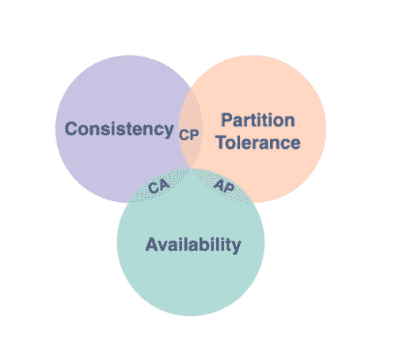
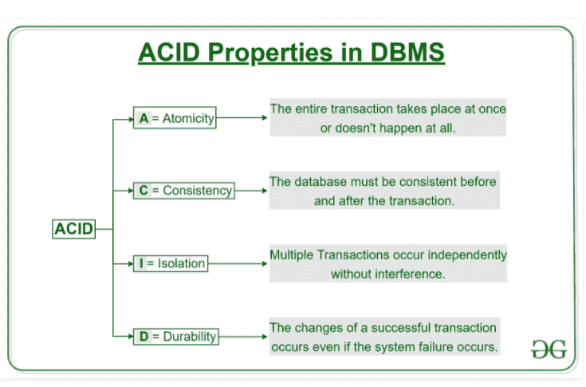
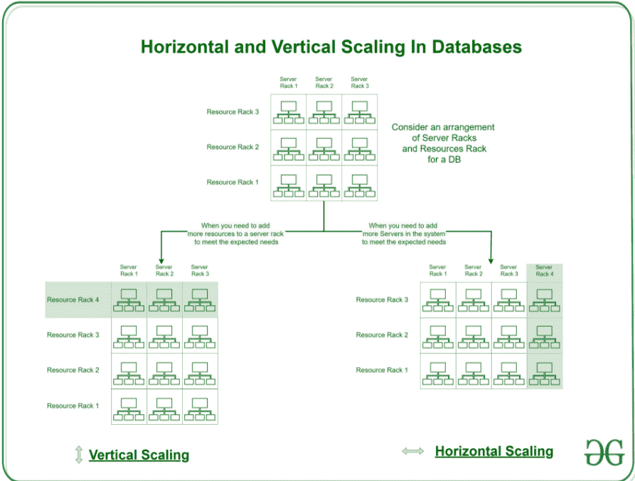

# SQL 或 NoSQL——选择哪一个？

> 原文：<https://medium.com/nerd-for-tech/sql-or-nosql-which-one-to-choose-757147a559f8?source=collection_archive---------2----------------------->


**主题**

1.  什么是 SQL 和 NoSQL？
2.  什么是酸和帽？
3.  处理
4.  (计划或理论的)纲要
5.  正常化
6.  缩放比例
7.  查询/数据检索
8.  存档数据
9.  SQL 慢吗？
10.  SQL 和 NoSQL 的缺点
11.  **什么时候使用 SQL？何时使用 NoSQL？** —答案基于上述所有主题。

## **SQL 和 NoSQL**

SQL 数据库是关系数据库。NoSQL 是一个非关系或分布式数据库。

SQL 要求您在开始实现业务用例之前定义和部署您的模式。NoSQL 是灵活和动态的，因为可以在 NoSQL 数据库中创建数据，而无需先有一个合适的模式。

## **酸和帽**

**CAP** —一致性、可用性、分区容差

这一术语用于分布式系统，也称为布鲁尔定理，表示分布式数据存储不可能同时提供三个特性中的两个以上。



> **一致性**

每次读取都会收到最近一次写入或一个错误。如果系统中有多个并行写入和读取，每个读取将始终返回正确的写入或系统上完成的最后一个写入。

> **可用性**

分布式系统中的可用性确保系统在 100%的时间内保持运行。无论节点的状态如何，每个请求都会得到响应(无错误)。这不能保证响应包含最近的写入(一致性)。

> **分区公差**

即使节点没有响应也能继续运行。失败的节点将由次节点备份，因此尽管当主节点停机时一些消息可能失败，次节点代替它；作为一个系统，它将是容错的。

**MongoDB** 是一个 CP 数据存储。它提供了一致性和分区。

它通过保持一致性来解决网络分区问题，同时牺牲可用性。MongoDB 是一个单主系统。Mongo 只能有一个接收所有写操作的主节点。当主节点不可用时，辅助节点将被选为新的主节点。由于在节点角色转移期间，客户端不能发出任何写请求，因此数据在整个网络中保持一致。

Cassandra 是一个 AP 数据库—它提供可用性和分区容差，但不能始终提供一致性。

*因此证明了 CAP 中的三个特性中只有两个可以保证。*

**酸—** 原子性、一致性、隔离性和持久性。

对数据的所有更改都像单个操作一样执行。事务是访问和修改数据库内容的单个逻辑工作单元。事务使用读写操作来访问数据。
遵循 ACID 属性以提供交易前后数据的一致性。

下图摘自 GeeksforGeeks:



## **交易**:

SQL 数据库更适合处理事务，因为它们提供了 ACID 属性。我们仍然可以使用 NoSQL，但是我们必须在自己的应用程序中编写额外的逻辑来管理它。

像 Neo4j、MarkLogic 这样的 NoSQL 数据库提供了 ACID 属性。然而，它仍然不像 SQL 数据库那样健壮。

一般来说，NoSQL 解决方案比关系数据库具有更轻量级的事务语义，但在某种程度上仍然具有原子操作的功能。

*当你阅读这篇文章时，你会理解为什么与 NoSQL 相比，SQL 中的事务更容易处理。SQL 的设计考虑到了事务特性。SQL 对于事务是健壮的，因为所有相关的数据都存储在同一个节点/机器上。而使用 NoSQL，我们可以有多个节点处理相关数据(水平扩展)。*

例如，对于 SQL，一个表的所有相关数据都在一台机器上，但是对于 NoSQL，我们可以使用水平分区，因此相关数据在多个节点上。所以在 NoSQL 交易很困难。

大多数 NoSQL 工具放松了操作的一致性标准，以获得容错和可伸缩性，这使得实现 ACID 事务非常困难。

NoSQL 数据库有最终的一致性(“最终对一个项目的所有访问将返回最后更新的值”)。但是最终的一致性在像银行这样的交易应用中是难以接受的。由于数据完整性和复杂的查询，银行和金融部门更喜欢 SQL。

MySQL 类发行版的最新更新使分区成为可能，但是这使得系统变得复杂并且更难管理。

## **模式:**

SQL 遵循模式优先的方法，所有列都有特定的类型，如 dbs 中定义的字符串、时间戳和整数。

NoSQL 缺乏图式。因此，当您在文档中插入任何数据时，它可以是字符串、整数、时间戳，任何字面上的东西。

```
[{“amount”: 9}, {“amount”:”hello”}, {“amout”: 282827199273}]
```

如果在 NoSQL 处理数据集时出现任何错误，情况会变得更加棘手，如果不小心的话，可能会导致错误。数据建模错误或数据不一致会让你付出很大代价。
在 dbs 中插入任何数据之前，每个生产应用程序都有模型和验证检查。
Express.js 在您的 NoSQL 应用程序之上实施模式。因此误差幅度非常小。

然而，您认为 SQL 中的模式模式也负责 BD 级别的数据验证，并在查询时向您返回适当的错误吗？我也这么认为

## **归一化**

这是一种消除数据冗余和插入、更新、删除异常的数据库技术。这里有 5 个规则——1NF，2NF，3NF，4NF，5NF

RDBMS/SQL 固有地支持规范化，并允许将数据作为一个单独的问题来管理，而 NoSQL DBMS 固有地不支持规范化，并要求客户端应用程序小心地维护完整性。

## **缩放**

将数据划分到多个节点上被称为数据库扩展。

水平扩展意味着通过向资源池中添加更多的机器来进行扩展，而垂直扩展意味着向现有机器添加更多的计算能力(CPU 或 RAM)。



SQL 中的水平伸缩不是不可能的，但是这需要更多的努力，因为事务管理是 SQL 数据库中的一个主要特性。
事务或一致性不是 NoSQL 的一个关键特性，因此使用一致性哈希可以轻松实现横向扩展。

SQL 使用垂直缩放，NoSQL 使用水平缩放。

## **查询/数据检索:**

*用例*:获取所有带有用户详细信息的订单。

*SQL 中的操作*

SQL 中的两个表——用户和订单

查询—选择用户详细信息、订单来源用户、订单，其中 user.id = orders.user_id

激发了单个查询？是的。

在 NoSQL 的相同操作:

根据用户标识获取订单

基于 userid 获取用户详细信息

启动了两个查询？是

当我们将相关数据分布在多个表中时，管理和使用 SQL 会更容易。在处理需要多个连接的相关数据时，我们可以继续使用 SQL，因为我们可以用 SQL 编写复杂的查询，并且复杂查询的计算在 SQL 中更快。对于简单的查询，如 get、insert、filtering、ordering，NoSQL 更快。如果我们将相关数据集存储在多个集合中，那么在 NoSQL 查询和管理连接就变得很困难。

参考消息—从 Mongo 3.2 开始，我们有$lookup 来执行两个集合之间的操作。

## **归档数据**

存档意味着人们可以存储和访问大量的历史数据，用于存储和分析目的。
大多数情况下，我们使用 NoSQL 来归档数据，因为我们知道我们不需要对数据进行标准化或 ACID 合规。

选择用于分析的数据库取决于许多因素，例如，正在分析的数据类型、拥有的数据量以及需要的速度。例如，关系数据库最适合像用户行为分析这样的应用程序。如果数据适合电子表格，那么它更适合于 SQL 类型的数据库，如 Postgres、BigQuery 因为关系数据库擅长分析行和列中的数据。对于需要大量文本挖掘或图像处理的半结构化数据，如社交媒体、文本或地理数据，NoSQL 类型的数据库如 mongoDB、CouchDB 效果最佳。

## SQL 慢吗？

你有没有听说 NoSQL 更快？如果是，不，事实并非如此。

人们有这种普遍误解认为 SQL 较慢的唯一原因是因为他们没有试图理解原因。 *SQL 模式可以运行复杂的查询，这些查询可以使用许多表作为连接的一部分*。而对于 NoSQL，我们没有运行复杂查询的规定。如果对特定的表使用简单的查询，SQL 的执行方式与 NoSQL 相同。因此，人们说 NoSQL 更快的原因只是因为 complx 查询可以在 SQL server 上运行，而不像 NoSQL。

了解哪个更快的最佳方法将完全取决于您的业务用例。您想要执行的 CRUD 操作是什么？当选择您想要的模式类型时，您会选择哪一个供应商或实现？会有很多问题，比如“什么速度？”与更高可用性、集群、分区、归档、需求关键程度相关的应用程序类型如何？

NoSQL 应用程序可以使用基于主键的操作来执行所有数据访问和修改，以便为 NoSQL K/V 商店进行优化。

SQL 数据库的优势在于，在处理更复杂的查询时，它们的性能通常更高。

## **缺点:**

> 结构化查询语言

*   SQL 不能水平扩展。
*   SQL 是不容错的。
*   架构已定义。DB 修改需要努力。
*   不建议用于需要存储数 Pb 数据的应用程序。

> NoSQL

*   不提供事务管理或 ACID 支持。
*   更少的模式。因此没有数据库级别的验证。
*   事务很难管理。
*   无法运行复杂的联接查询。
*   比较便宜的

## **什么时候用什么？-SQL 还是 NoSQL？**

1.  如果您的数据库数据可以放在一台机器上，而不需要纵向扩展，请使用 SQL。
2.  数据完整性是一个关键特性，您希望您的业务符合 ACID。使用基于 SQL 的数据库。
3.  如果您有复杂的连接和相关数据，请使用 SQL。复杂的查询更容易用 SQL 编写，计算也很快。
4.  NoSQL 似乎更擅长处理非结构化和无关的数据。如果您对模式不确定，并且您知道在不久的将来可能需要进行多次更改。使用 NoSQL
5.  如果您知道需要存储大量数据，并且知道单个节点无法承受这一容量，请使用 NoSQL。
6.  如果你系统中的大多数查询是过滤、条件、分组或排序，就使用 NoSQL；意思是当你有简单的查询时。
7.  如果您经常修改数据库，并且不确定模式设计，请使用 NoSQL
8.  将 SQL 用于事务管理用例。
9.  将 NoSQL 用于图形数据和实时应用，如 IOT、游戏

*注意:更好的解决方案是具有 NoSQL 和 SQL 元素的交叉数据库。我曾经开发过多个应用程序，这些应用程序既有 NoSQL 风格又有 SQL 风格来处理业务需求。*

**结论**

如果你认为任何一点需要从不同的角度来看，请在评论中告诉我。所有的关注和掌声都受到高度赞赏。干杯！