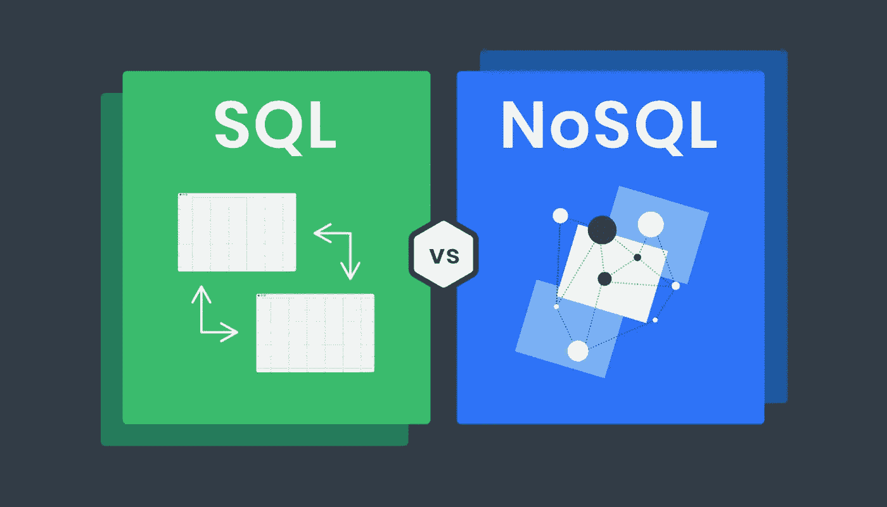
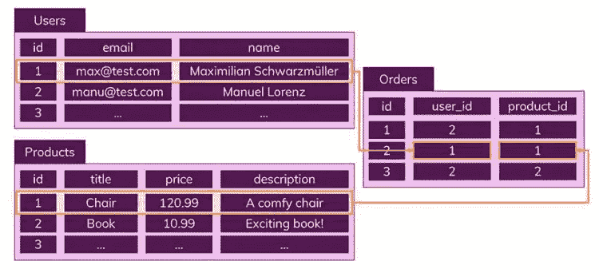
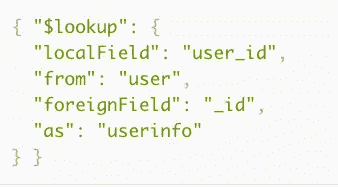

# SQL 与 NoSQL

> 原文：<https://medium.com/nerd-for-tech/sql-vs-nosql-6bc95a2df9d5?source=collection_archive---------13----------------------->

在构建后端或数据库时，我们如何选择 sql 或 nosql？

SQL 与 NoSQL

我们了解到 SQL 是一种叫做“RDBMS”的关系数据库，而 NoSQL 不是关系数据库。因为他们是两个对立的方面，我被误导到了对两者都很了解的地步。理论上，我是正确的。但是实际上，我意识到我并没有完全理解这两者。

在我分享我的故事之前，让我们从更深入的理论术语开始。

# **SQL(关系数据库)**

*   将数据保存到已经定义了数据模式的表中
*   通过关系，数据通过其他表分布

数据作为记录保存在表中，但每个表都有其独特的定义结构。该结构由字段名称和数据类型组成，如字符串类型的名称和整数类型的年龄。

此外，数据库使用关系来避免数据重复。

电子商务服务的关系数据库结构

正如您所看到的，第一个用户订购了一把椅子，这个操作保存在 orders 表中，具有唯一的 id，但只有 users 表和 products 表的主键。因此，不必担心保存重复的数据，如用户或产品，因为可以用主键引用这些数据。

# NoSQL(非关系数据库)

*   没有模式(预定义的结构)
*   没有关系

与 SQL 数据库不同，NoSql 数据库没有遵循预定义结构的模式，这意味着用户可以自由地读取和更新数据。在每个集合中，都有一个名为 documents 的记录。这些文档类似于 JSON 格式，所有相关文档都在一个集合中。所以按照上面的图片，订单文档将有关于用户和产品的信息，而不是保存它的主键。那么，当我们需要使用文档关系来连接时，我们该如何处理呢？

一个可能的解决方案是使用聚合操作中使用的$lookup。

mongoDB 中的查找操作

如您所见，我们在 lookup 中加入了多个过滤选项，这将创建一个名为 userinfo 的新字段，这是一个连接的结果。或者，您可以将属性相互关联，以便及时更新相关信息。

然后，让我们简要介绍一下两种数据库的一些重要优点和缺点。

# 可量测性

水平扩展:基于数据的划分，每个节点包含部分数据(mongo DB)

垂直扩展:数据存储在单个节点上，通过多核实现扩展。(mySQL)

就个人而言，这意味着我们可以通过创建更多集合来轻松扩展 NoSQL，而 SQL 数据库需要考虑关系，这使得扩展变得有点困难。然而，在某种意义上，有一种方法可以在扩展时保持关系，因此我们需要考虑每种类型数据库的利弊。

# 利弊

SQL 优点

*   清晰定义的模式保证了数据的完整性
*   无论位置如何，关系只保存一次数据

SQL Cons

*   不太灵活。总是需要知道模式是如何定义的，而且一旦定义，以后很难修改
*   由于关系，可以构建更复杂的查询
*   大多数情况下，由于已经建立了关系，垂直扩展

NoSQL 专业

*   非常灵活，可以自由修改
*   JSON 数据类型允许应用程序更快地读取数据
*   垂直和水平缩放是可能的

NoSQL 骗局

*   定义数据结构经常被推迟
*   可能会存储重复的数据
*   当修改数据时，需要通过使用数据的其他地方进行更新

所以，我遇到的情况是，我们的服务对每个角色都有不同的权限。角色可以是管理员，也可以是普通用户或某个经理。这里需要注意的重要一点是，当您的角色是经理时，您还可以为普通用户分配不同的本地权限。基本上，有两种权限:全局权限和本地权限，每种权限都有不同的种类。

问题是，我应该使用哪种数据库结构？人们的感觉是，如果你使用 node，你会坚持使用 mongoDB 如果你使用 spring，你会坚持使用 MySQL。但是，我们的服务似乎与两种权限和用户有明确的关系。该服务还有一个包含一组用户的用户组。考虑到这些不同的层和具有权限的用户组，我认为推荐使用 RDBMS。另一件要谈的事情是，我们的服务似乎写回数据库很多，为不同用户组中的不同用户分配不同的权限。在这种情况下，如果我们使用 mongoDB，我们需要确保不同集合中的文档是最新的。

作为进一步的参考，这里总结了在什么情况下推荐什么类型的数据库。

SQL 实例

*   关系数据库经常改变
*   已经定义了模式

NoSQL 实例

*   可能可修改的数据或可能可改变的数据结构
*   读取比数据写入更频繁
*   需要横向扩展(需要处理大量数据)

希望这对人们有所帮助，如果您对本文有任何异议或意见，请发表评论，展开热烈的讨论！

# 编辑**

正如 Chris 在评论中提到的，虽然这篇文章清楚地试图展示什么可能是每个数据库的最佳情况。当你设计一个数据库时，理解没有正确/错误的答案是很重要的，因为情况变化很大。虽然你可能会牺牲速度，但你可以拥有最大的能力，这是计算机科学的核心，你会有所收获，也会有所损失。因此，重要的是了解每个数据库做什么，并尝试在正确的情况下以正确的方式实现它们。