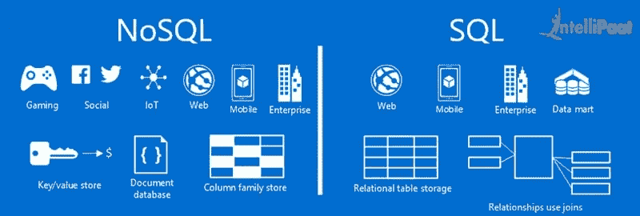
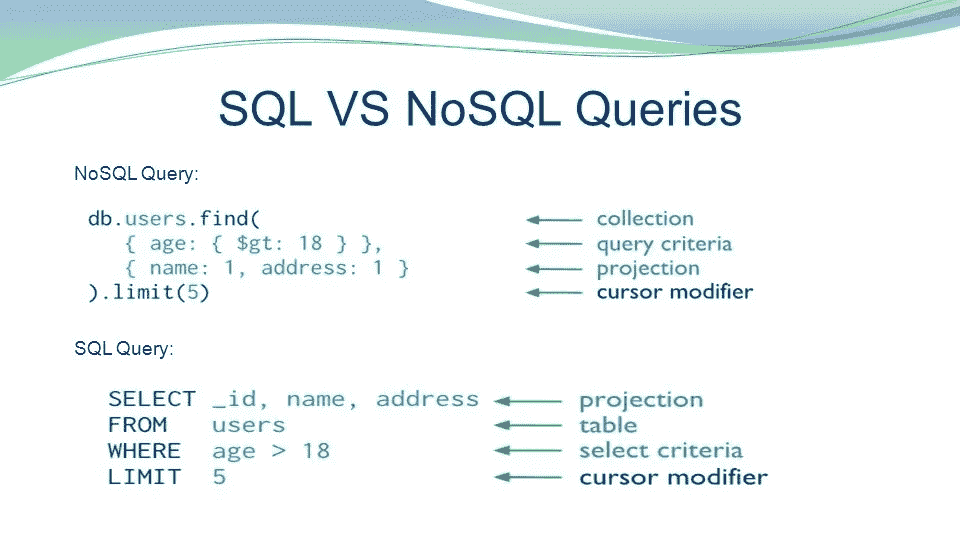
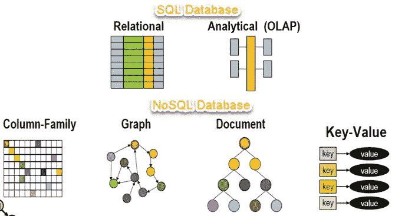
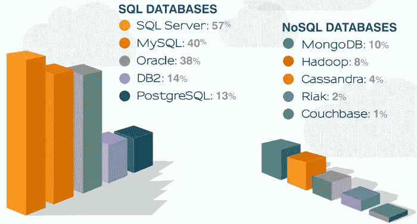
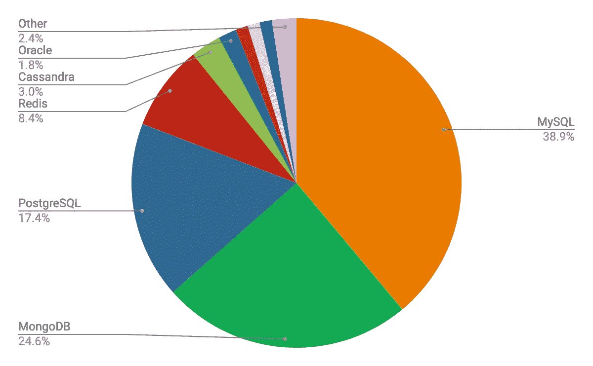
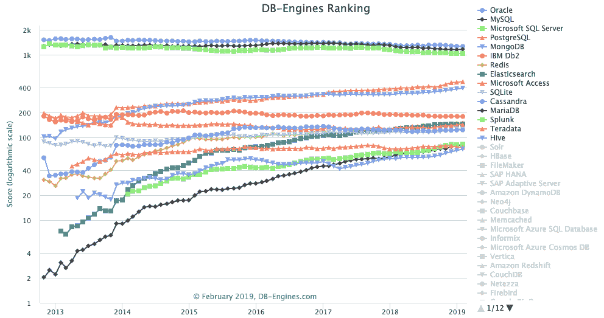

# SQL 与 NoSQL

> 原文：<https://medium.com/nerd-for-tech/sql-vs-nosql-faef10e3852d?source=collection_archive---------0----------------------->

# 介绍

SQL(结构化查询语言)是一种编程语言，用于管理关系中的数据(通常称为表)来存储数据，因此被称为**关系数据库**。存储在关系中的数据通过使用数据集中的共同特征来匹配数据。

> 使用 SQL 的关系数据库管理系统的例子有 Microsoft SQL Server、Oracle、Sybase、Access 和 Ingres。

NoSQL 数据库被称为**非关系数据库。**另一方面，它不需要任何图式，它是自描述的。它也没有在所有情况下强制实施关系之间的关系。NoSQL 文档在 JSON 文档中，是用户可以容易地阅读和理解文档的完整实体。NoSQL 指的是高性能、非关系数据库，它利用了行业中各种各样的数据模型。这些数据库因其可伸缩的性能、易用性、强大的弹性和对用户的广泛可用性而得到高度认可。

> 非关系数据库管理系统的例子包括 Amazon 的 Dynamo DB、Couchbase、CloudDB、MarkLogic 和 MongoDB。

# SQL 和 NoSQL 的主要区别

SQL 和 NoSQL 之间有许多不同之处，但在组织中决定什么可能是最好的数据库管理系统时，理解所有这些都很重要。这些差异包括:

1.  社区
2.  语言
3.  可量测性
4.  结构

# 语言

SQL 和 NoSQL 的主要区别在于它们是不同的语言。SQL 数据库通常只使用一种查询语言。NoSQL 数据库使用一种非通用的方言。

SQL 是最标准化的数据信息存储语言。这是有帮助的，因为它创造了一致性和可访问性。缺点是 SQL 的制度化本质可能会令人望而却步，因为所有信息都必须遵循相似的结构。

NoSQL 具有非结构化的优势，这使得它有更多的机会存储和处理不适应环境的信息。专家可以在不首先表征其结构的情况下制造信息。语言结构的限制较少，可以动态地包含字段。缺点是数据库专家需要精通完全不同的语言，应用程序的编码要复杂得多。

# 可量测性

SQL 数据库在很大程度上是垂直可伸缩的。这意味着通过加强基础设施来增加数据库的功能。这看起来像是在单台服务器上扩展 RAM、CPU 或 SSD。纵向扩展数据库受到越来越多的限制，因为您只能增加现有的数据库，而不能创建一个全新的框架。

NoSQL 数据库是可扩展的。这意味着与改进框架相反，组织使用分片和添加服务器来扩展信息数据存储能力。分片需要大量的信息索引，并将它们分离成小块。这些小片段可以分布在不同的服务器上。这可以允许更大和更灵活的数据信息。

# 结构

SQL 数据库被称为关系数据库，因为它们的存储系统使用表和关系代数来处理数据信息。这对于具有表结构的预定行的应用程序(如会计应用程序)来说总是很合适的。模式必须预先确定并结构化。每次都是因为改变数据库会花费很大一笔钱。SQL 很适合复杂的查询，但不适合分层设计。

NoSQL 数据库是非关系数据库。这些包括文档数据库、宽列存储、键值存储和图形存储。这种结构允许比 SQL 更灵活的模型。公司和组织可以存储不同类型的结构化或非结构化数据。它允许敏捷团队在需要的时候更新他们的模式，而不需要逆向工作，也不需要时不时地为应用程序制造停机时间。NoSQL 数据库总是存储分层数据和大型数据集的首选。

# 社区

由于 SQL 的发展，与 NoSQL 相比，它有了更多的发展和逐步创建的网络。有大量的论坛和聚会可供专家们分享知识和研究 SQL 最佳实践，不断提高能力。尽管 NoSQL 的发展很快，但它的语言环境并不像 SQL 一样，因为它还比较新。

最近对数据库用例以及客户反馈进行的研究也强调了 NoSQL 数据库和关系数据库软件之间的一些差异。

如上所述，SQL 数据库更适合那些经常使用关系结构中的数据的行业。毫不奇怪，金融服务、医疗保健和高等教育行业是关系数据库的前五大审查行业。

# 结论

无论您在哪个领域，为您的组织或公司选择正确的数据库都是一个重要的决定。如今，NoSQL 数据库正迅速成为数据库领域的重要组成部分，并被证明是 IT 领域真正的游戏规则改变者。它们有许多好处，包括开源可用性、更低的成本和更容易的可扩展性，这使得 NoSQL 成为任何考虑集成到大数据的人的最佳选择。然而，它们是新技术，这使得它们因其需求而变得更加不稳定。

另一方面，SQL 数据库已经证明了自己超过 40 年，并使用长期建立的标准，这些标准在过去的舞台上得到很好的定义。他们背后有一个庞大的专业人士社区，合作的机会是无限的。

总的来说，对于企业或组织来说，使用 SQL 还是 NoSQL 并不完全是黑白分明的；它需要一些比较和对比，以确定哪个数据库最适合您现在和将来的特定需求。然而，通过适当的研究和准备，您将确保您选择的数据库在将来为您的组织提供有效的管理系统。

