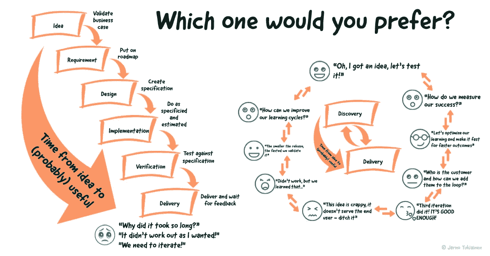

# 挤压瀑布——又一个 TL；大声疾呼灵活性的博士

> 原文：<https://medium.com/nerd-for-tech/squeezing-the-waterfall-yet-another-tl-dr-rant-about-flexibility-f10f13e54701?source=collection_archive---------14----------------------->

这篇文章没有什么新意，它没有提供任何新的见解，也没有给你提供任何新的工作框架。它是关于重新措辞的方法，这些方法有助于理解你如何为你的客户和用户做有意义的事情，而不是做一些将被重写、遗忘或陷入僵局的事情。它会从软件行业的角度思考问题，但是你可以把这种思维模式应用到任何事情上。

这不是一个框架或新的意识形态，它不局限于软件。受到限制的是产品思维而不是项目思维，我是一名产品专业人员，并没有一次又一次地将这种思维用于项目。如果你考虑项目或咨询，可能会有一些陷阱，只是我没有考虑到。所以不管你的专业领域是什么，准备应用一些没有给出框架或终极思想的东西。看在上帝的份上，这只是一种心态，不同意也可以改进。

# 开始挤压

那么，我为什么要写这个呢？只是因为我觉得敏捷已死，应该弃用。不是因为这真的是一种好的心态，而是大量的误解和解释扼杀了敏捷原则背后的基本意识形态。要想变得敏捷，你应该只有一个工具可以遵循——敏捷原则。这就是为什么我在这篇文章中更喜欢用“灵活”而不是“敏捷”，因为归根结底，这是关于你要做的事情有多灵活。

在我从事软件行业的 15 年多时间里，我看到很多人奔向下一个银弹，它为你提供了敏捷的现成食物，只是为了以某种神奇的方式消费和变得敏捷。组织一直在等待下一个能够创造奇迹的框架或过程，只要轻轻一挥魔杖，整个组织就变得敏捷了。但是通常这些叠加的框架最终会成为某种瀑布，而不能提供组织所寻求的优势。

这就是为什么我更喜欢瀑布被挤压，而不是“将组织转变为敏捷”。即使你想一想，这就是它，它让事情连续而不是连续。达到这一目标的心态是通过采取小的迭代步骤来达到最小的瀑布量，从而更快地达到想要的结果。作为一种心态，“挤压瀑布”比“转向敏捷”或“使用敏捷”更容易理解为持续发展，因为这就是它——一个不断学习的过程，让你、你的团队和你的组织做得更好。这是关于通过反复实验来学习和发展。有模型和框架，但缺少最重要的——通过实验学习。挤压瀑布是关于人们进入和学习，有很大的不同。

不要误解我。框架并不都是坏的。它们确实是开始改进流程的良好起点，但是当你学会骑自行车时，训练轮变得毫无用处，并开始阻碍你的进步。

# 那么如何识别瀑布呢？

你们中的很多人会说“我知道瀑布方法是什么，我肯定能看出它和敏捷之间的区别”。我打赌你知道。但是，请检查下面的列表，对我来说是确定的地方，以确定瀑布，然后告诉我你确定它:

*   您编写需求或规范，然后交给开发人员。
*   您需要不断更新产品路线图，因为时间表会发生变化，并且不会反映到您的估计中。
*   你在详细的层面上预先估计了一切。
*   你在估算中加入了你认为不确定的因素。可能是 3.14..
*   客户/用户已经在几周前的最后一次会议上参与进来，或者在最糟糕的情况下，在合同谈判中最新出现。
*   你正在形成你正在猜测的商业案例。
*   你认为开发者是“团队”。还有营销，销售，财务，其他人都是自己的团队。
*   你可以一个人工作，大部分时间你都是这样度过的。
*   您有一个代码冻结或其他冻结，用于在发布前进行彻底/手动测试。
*   你的发布周期比几周还要长。
*   有人说“它需要更多的规范”或者“我是按规定做的”。
*   您已经发布了一个特性，但是没有跟踪它的性能，甚至没有跟踪它是否被使用过。
*   当大多数想法听起来满足了需求时，它们就被作为规范包含在内。

听起来很熟悉？即使这只是一个小的冒烟测试(我可以没完没了地继续下去)，我想你可能已经发现你需要一点挤压。

# 伟大的想法

因为我可以写一本关于这个的书，所以在这篇文章中我会尽量简短。这一切背后的伟大想法是心态。它是关于识别可能发生浪费的地方，并使它们成为流程的一个连续部分，通过快速迭代循环向用户/客户交付有意义的东西。

如我所说，它没有给你任何新的东西。这与成长黑客、精益、敏捷、客户体验和<you name="" it="">背后的元素或心态完全相同(至少部分相同)。它是关于将客户放在过程的中心，并通过实验推动对客户有用的东西(会说对用户/客户有价值，但见鬼，这是另一个被广泛误解的术语——请不要让我对 MVP 咆哮)。</you>

现在让我们继续如何申请。我觉得这篇文章已经够长了。

# 第一步——承认它！

第一件事最难！你必须承认你在瀑布一样的东西。这就像 AA 的 12 个步骤——我们必须承认我们对瀑布无能为力——我们的工作因此变得难以管理。在你承认你做了一点点瀑布之后，你就可以继续了。在那之前，它只是与风车作战。我敢肯定，我们中的许多人甚至没有注意到它，它只是许多已经使用了几十年的框架和工作方式的核心部分，即使是最敏捷的人也倾向于以某种形式回到它。开始识别它，当你滑倒时你会注意到。

当你开始在你的过程中看到瀑布时，你可以开始将它们作为连续的活动。只是挤压它，直到你改善，当你成功了，采取下一步，迭代。把它当成持续的行动，而不是一次性的活动。注意，你可能要做的最多的工作就是给其他人洗脑，让他们相信“敏捷”是最重要的。所以，宣传这个想法，让其他人也这样做。这是一种文化上的改变，总是很难。当想法和好的工作方式交叉传播到其他团队时，文化往往最容易改变。

如你所见，我不会给你任何特定的活动，告诉你如何达到不经意的灵活流程和工作方式。如果我做了，它将是一个框架或一个模型，这是行不通的。软件行业的每个人都知道“Spotify 模式”——我认为这是每个软件团队的某种敏捷梦遗，但是如果你不接受在该模式的开发中包含的学习，实现该模式并不会让你变得更加敏捷。我认为，即使是 Spotify，在看到其中的问题后，也已经从模型演变为更好的工作组织。他们不断发现并交付他们的流程变更。甚至他们也在不断学习。

# 步骤 2 —分享和自动化

当你确定了你正在下降的地方，停止做它，并通过增加共同理解和自动化找到做这些任务的另一种方法。我几乎可以向你保证，当人们可以选择参与而不是阅读和评论文档时，你的工作会变得更容易。不要留下任何未完成的事情或跳过这一步，通常会有一些脑力来解释为什么要做这些事情。敏捷并不意味着你不写文档或者不测试——事实上正相反，测试和文档的需求甚至会增加。

我的经验是找到听起来最合理的事情的对立面。通常它是有效的——推理倾向于朝着瀑布前进。是的，我尝试过，但总是以打磨钻石告终，直到适得其反。

例如，当发布总是在最后几周/几天进行的时候。有人担心客户不会在 404 中结束，或者你发布的特性不会给下一个版本带来维护问题。简单的方法是延长发布时间或者在最后添加某种“测试冻结”,这意味着你要花几个月的时间来修复你自己创造的 bug。哦，对了，你现在找到它们了，因为你以前在真实环境中测试过吗？无论如何，我认为这两者都是将问题推进到下一步，而不是一开始就把它作为“团队问题”。

在这些情况下，我喜欢致力于缩短发布周期。能做的越少，对自己的伤害就越小。我很高兴能与这样的团队一起工作，他们每天做几十个产品更新，并封装他们的工作，以便在向所有人推广之前，每个产品推广都经过客户子集的评估和验证。这样，他们甚至可以选择将新功能提前推给客户进行验证，并快速迭代。他们拥有需求、规范和产品，而不仅仅是充当转化为代码的媒介。我知道，这并不总是可能的，但是短发布周期肯定是你想要的目标。这是如何节省时间和缩短赚钱时间的关键，而不仅仅是缩短整个瀑布周期。

# 临终遗言

你可以用不同的方式来做事情，只要把你的努力集中在改善推动发现-交付探索的文化上，在任何十字路口停下来问下一个路口在哪里。除了你决定走的那条路，还有其他的路可以到达未知的地方，即使你的钱用完了，或者你的乐观估计彻底失败了。

只要专注于建立团队和他们的能力，通过打破孤岛来实现跨职能。这不仅仅是开发人员的事情，它将每个人都纳入到同一个发现、学习和不断交付的循环中，以服务于用户和客户。如果你找到了移交文档，发起一个故事映射会议或围绕它的事情，并确保事情在整个过程中成为活的文档，而不是所有的都迅速腐烂到非更新需求的土壤中。让它成为团队问题。

这篇文章比我想象的要长，可能就我所宣扬的东西而言，把它切成更短的部分会更好。可能还会有更多，我还不知道。

希望你喜欢阅读！