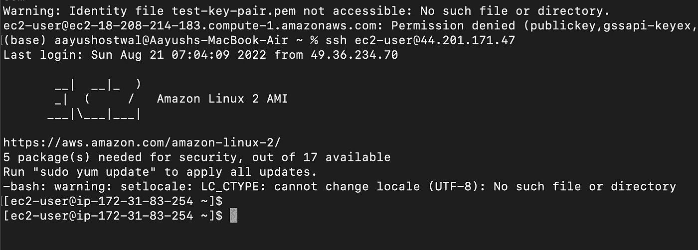
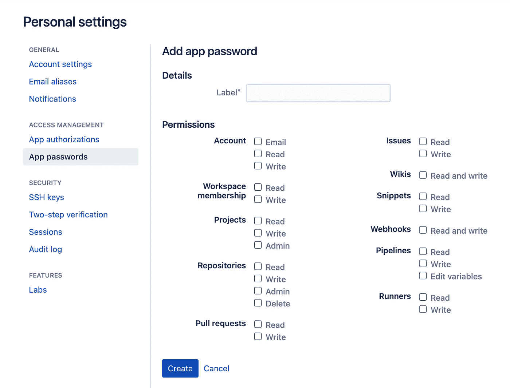
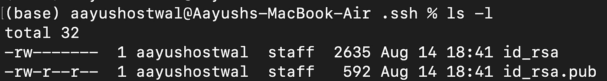
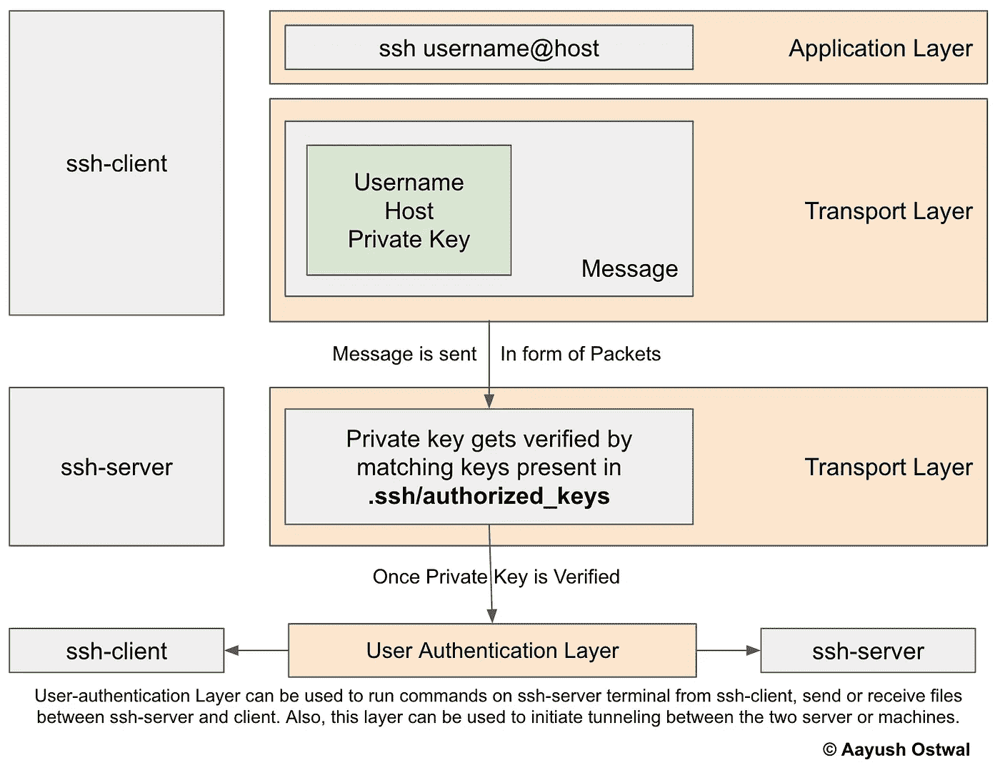
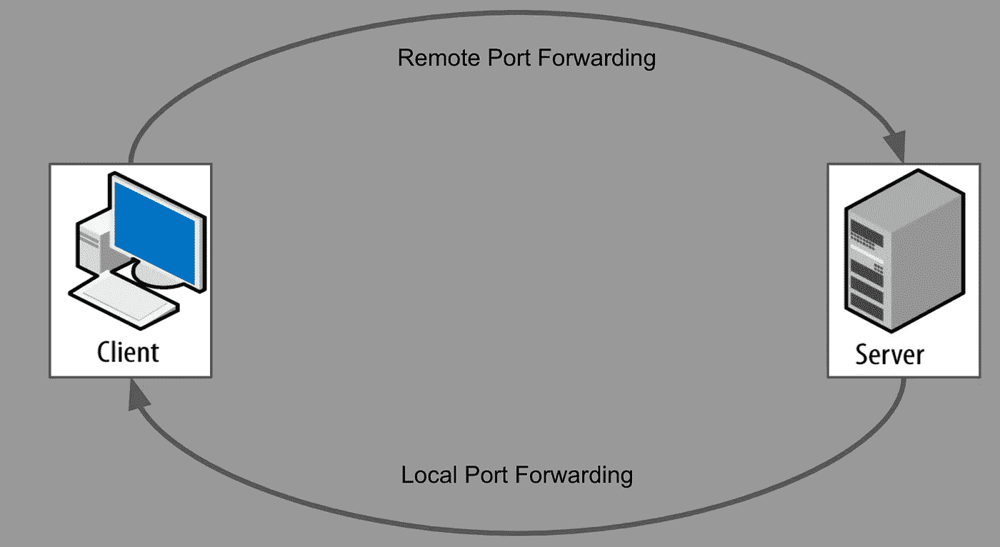

# SSH:架构、配置和应用程序(SSH、SCP、SFTP、隧道)

> 原文：<https://medium.com/nerd-for-tech/ssh-architecture-and-applications-ssh-scp-sftp-tunneling-or-port-forwarding-bd495fedeff7?source=collection_archive---------0----------------------->

## 甚至 BitBucket 现在也通过启用应用程序密码来使用 SSH 的强大功能



使用我的 mac 电脑登录服务器终端(信用: [Aayush Ostwal](https://medium.com/u/c541fb3fb779?source=post_page-----bd495fedeff7--------------------------------)

# 内容

本文将涵盖以下主题。

```
**- Bitbucket Use Case for SSH
- Why Bitbucket Usecase?
- SSH: Secure Shell Protocol
- SSH: Architecture**
     - Terminology
     - Key-pair
     - Architecture
**- SSH: Applications**
     - Login into Terminal
     - File transfer using SCP and SFTP
     - Port Forwarding
```

B itbucket，最常用的基于 git 和 CI/CD(持续集成和开发)工具，最近改变了使用其 API 进行认证的方式。以前，我们使用**账户密码**进行认证，而现在，我们需要创建应用程序密码进行认证或设置 SSH 密钥。

Bitbucket 提供了这种架构变化背后的两个主要原因，以及它如何确保更多的安全性。

*   **访问控制**:bit bucket 中的每个 app 密码都有一个访问控制的核对表。您可以修改与其关联的权限。



位桶中的应用程序密码权限。(信用: [Aayush Ostwal](https://medium.com/u/c541fb3fb779?source=post_page-----bd495fedeff7--------------------------------) )

*   **加密** : App 密码以加密形式存储在 Bitbucket 数据库中。即使是直接使用这些数据库的人也不能使用这些密码。

# 为什么使用 Bitbucket 用例？

根据右秤年报上的[云状态](https://resources.flexera.com/web/media/documents/rightscale-2019-state-of-the-cloud-report-from-flexera.pdf):

*   **91%** 的组织正在使用公共云
*   **72%** 的组织正在使用私有云

随着云计算的普及，数据泄露的风险也在急剧上升。数据泄漏是指服务器上的数据以某种方式被删除、损坏或对任何用户或应用程序不可读的过程。

但是为什么我们在 SSH 文章里要说 BitBucket 呢？

> App passwords 对 bitbucket API 的作用，SSH 对我们使用的服务器的作用。

通过实现 SSH，您可以在使用服务器的过程中增加另一层安全和身份验证。

# SSH:安全外壳协议

SSH 是安全的 Sheel 协议。它是一种网络协议，允许您在不安全的网络(互联网)上更安全地使用网络服务(与服务器交互)(加密和验证)。

SSH 打破了这一技术定义，提供了一种更加加密、无密码和安全的与服务器通信的方式。现在，由于密码是隐藏的，相关的风险也得到抑制。

# SSH:架构

SSH 协议包含一对密钥，并且基于**服务器-客户端架构**。

## 术语:

在开始 SSH 的任何技术架构之前，我想指定一些术语:

*   **SSH-Client** :您当前可以访问的机器或服务器。这可以是你的电脑。
*   **SSH-Server** :你要连接的服务器。任何 AWS EC2 实例都可以充当 ssh 服务器。

## 密钥对

第一步是生成密钥对。当您在 ssh-client 的终端中运行`ssh-keygen`时，会生成一个密钥对。



输入密钥对。shh 文件夹(Credit: [Aayush Ostwal](https://medium.com/u/c541fb3fb779?source=post_page-----bd495fedeff7--------------------------------) )

*   **公钥(id_rsa.pub)** :可以公开共享的密钥。这个密钥被复制到 ssh-server，当我们使用 ssh 从一个连接请求时，它将用于身份验证。
*   **私有密钥(id_rsa)** :驻留在 ssh 客户端上的密钥。这用于认证和解密来自服务器的数据。

## 建筑

当您在 ssh-client 的终端中运行`ssh username@host`时，会发生以下事情

*   您运行命令的这个终端充当 SSH 的**应用层**。这可以是你的终端，也可以是任何软件，比如 mobaxtrem(windows)，或者 iTerm (mac)。
*   **ssh-client 上的传输层**:创建包含用户名、主机、私钥等信息的消息，以加密包的形式发送给 ssh-server。
*   ssh-server 上的传输层:接收数据包并恢复消息。一旦获得了私钥，它就会在 ssh-server 上的`authorized_keys`文件中寻找另一对。
*   一旦通过认证，客户端和服务器之间就会建立一个**用户认证层**。

用户认证层用于 ssh-server 和 ssh-client 之间的交互。您可以:

*   在终端上运行命令
*   发送或接收文件。
*   隧道或转发端口。



SSH 架构的示意图(鸣谢: [Aayush Ostwal](https://medium.com/u/c541fb3fb779?source=post_page-----bd495fedeff7--------------------------------) )

# SSH:应用程序

为了设置 SSH，首先，您需要发送您的公钥(**)。ssh/id_rsa.pub** )到您的服务器。为此，有两种方法:

*   **手动复制**:使用密码登录您的服务器，将您的公钥复制到`.ssh/authorized_keys`文件中。如果一个`authorized_keys`文件不存在，请随意创建一个。

```
cat "ssh-rsa {a encoded key} aayushostwal@Aayush-MacBook-Air.local" >> .ssh/authorized_keys
```

*   **SSH 复制 ID** :有一个命令行包，用于将您的文件发送到服务器。`ssh-copy-id`。这将自动将公钥添加到服务器上的文件`authorized_keys`。

```
ssh-copy-id -i ~/.ssh/is_rsa.pub username@host
```

**注意**:使用`ssh-copy-id`时，需要输入服务器密码。

现在认证已经建立，我们可以开始探索 SSH 的应用程序了。

## 登录到终端

*   **命令** : `ssh ec2-user@18.208.214.183`
*   该命令将直接将您连接到服务器的终端
*   **预期产出**:

```
**ssh ec2-user@18.208.214.183**
ED25519 key fingerprint is SHA256:9QLdfWE/3wtszmctrlM8uoPgyBw1XWYSBDM3gbqsesY.This host key is known by the following other names/addresses:
~/.ssh/known_hosts:1: ec2-18-208-214-183.compute-1.amazonaws.com
Are you sure you want to continue connecting (yes/no/[fingerprint])? yes
Warning: Permanently added '18.208.214.183' (ED25519) to the list of known hosts.
Last login: Sun Aug 14 13:14:02 2022 from <your_computer_ip>
__|  __|_  )
_|  (     /   Amazon Linux 2 AMI
___|\___|___|
https://aws.amazon.com/amazon-linux-2/
2 package(s) needed for security, out of 10 available
Run "sudo yum update" to apply all updates.
-bash: warning: setlocale: LC_CTYPE: cannot change locale (UTF-8): No such file or directory**[ec2-user@ip-172-31-20-80 ~]$**
```

## 使用 SCP 的文件传输:安全复制

*   **命令**:T6
*   这个命令将把`file.txt`发送到服务器上的指定位置。还有，会有一个进度条显示上传文件的进度。
*   **预期产量:**

```
**scp file.txt ec2-user@18.208.214.183:/home/ec2-user**/etc/profile.d/lang.sh: line 19: warning: setlocale: LC_CTYPE: cannot change locale (UTF-8): No such file or directoryfile.txt                                                                                             100% 2321     9.6KB/s   00:00
```

## 使用 SFTP 的文件传输:安全文件传输协议

*   对于使用 SFTP 的文件传输，首先，你需要打开一个 SFTP 终端。
*   **命令**:T8
*   然后，您可以使用 SFTP 命令从服务器发送或接收文件。这里你也会看到进度条。
*   **预期产出:**

```
**sftp ec2-user@18.208.214.183**Connected to 18.208.214.183.**sftp> put file.txt**
Uploading file.txt to /home/ec2-user/file.txtfile.txt                                                                                             100% 2321     9.6KB/s   00:00**sftp> exit**
```

> **SCP 与 SFTP 的区别:** SCP 仅作为文件传输的工具，而 SFTP 用于文件传输和文件管理。简而言之，SFTP 可以用来删除或创建文件/目录以及文件传输。另外，SFTP 比 SCP 快。

## 隧道(端口转发)

*   当你在一个端口上的服务器上运行一个应用程序，并且你想让用户访问这个应用程序而不访问服务器本身时，隧道就是解决方案。在本文中，我们将讨论两种类型的隧道。
*   **远程端口转发:**端口从客户端转发到服务器。如果有任何应用程序正在客户端上运行，您可以在服务器上访问它。
*   **本地端口转发:**端口从服务器转发到客户端。如果有任何应用程序正在服务器上运行，您可以在客户端访问它。



远程和本地港口转运(信用: [Aayush Ostwal](https://medium.com/u/c541fb3fb779?source=post_page-----bd495fedeff7--------------------------------)

*   **远程端口转发命令**:`ssh -R server_ip_address:server_port:client_ip_address:client_port username@server_ip`
*   **远程端口转发的预期输出****:(运行在客户端端口 8888 上的应用程序被转发到服务器端口 8080)**

```
ssh -R localhost:8888:localhost:8080 ec2-user@18.208.214.183
Last login: Sun Aug 14 13:14:02 2022 from <your_computer_ip>
__|  __|_  )
_|  (     /   Amazon Linux 2 AMI
___|\___|___|
https://aws.amazon.com/amazon-linux-2/
2 package(s) needed for security, out of 10 available
Run "sudo yum update" to apply all updates.
-bash: warning: setlocale: LC_CTYPE: cannot change locale (UTF-8): No such file or directory**[ec2-user@ip-172-31-20-80 ~]$**
```

*   ****本地端口转发命令**:`ssh -L client_ip_address:client_port:server_ip_address:server_port username@server_ip`**
*   ****本地端口转发的预期输出****:(运行在服务器端口 8888 上的应用被转发到客户端端口 8080)****

```
**ssh -L localhost:8080:localhost:8888 ec2-user@18.208.214.183
Last login: Sun Aug 14 13:17:03 2022 from <your_computer_ip>
__|  __|_  )
_|  (     /   Amazon Linux 2 AMI
___|\___|___|
https://aws.amazon.com/amazon-linux-2/
2 package(s) needed for security, out of 10 available
Run "sudo yum update" to apply all updates.
-bash: warning: setlocale: LC_CTYPE: cannot change locale (UTF-8): No such file or directory**[ec2-user@ip-172-31-20-80 ~]$****
```

****在 Youtube 上观看这篇文章:****

****(视频由 [Aayush Ostwal](https://medium.com/u/c541fb3fb779?source=post_page-----bd495fedeff7--------------------------------) 拍摄)****

# ****就是这样！****

****你需要知道的关于 SSH 的所有事情都完成了。现在，您可以通过更安全的连接接入任何服务器。****

****我认为 SSH 的最佳用例是自动化。当您需要在多个服务器之间发送或接收文件时。最关键的部分是您不需要将密码保存在配置文件中。SSH 会跟踪每一次通信。****

****请让我知道你的 SSH 用例，以及你如何使用 SSH 的力量。****

****感谢阅读！！！****