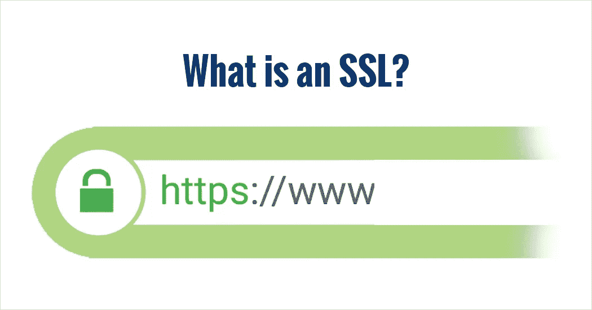

# SSL 解释–单向与双向 SSL

> 原文：<https://medium.com/nerd-for-tech/ssl-explained-one-way-vs-two-way-ssl-c02f4ea3b60e?source=collection_archive---------1----------------------->

SSL(安全套接字层)是一种标准技术，用于实现客户端和服务器之间的安全通信。SSL 确保客户端和服务器之间的数据安全，并确保数据完整性。如果我们在 https 中看到“s ”,这意味着正在使用 ssl。

SSL 使用加密算法来扰乱传输中的数据，从而防止黑客攻击。如果在通信中使用 SSL 证书，黑客所能看到的只是连接了哪个 IP 和端口，以及大概发送了多少数据。他/她看不到 url 的其余部分。

TLS(传输层安全性)是 SSL 的更新版本，更加安全。术语 SSL 和 TLS 经常互换使用。

Truststore:包含签名者证书(CA 证书)的列表，这些证书定义了 SSL 协议信任的证书。也称为信任密钥库，它存储公钥和证书颁发机构颁发的证书。

Keystore:也称为 Identity Keystore，它包含私有密钥，仅当服务器在 SSL 连接上运行时才需要。

注意:信任库和密钥库可以是同一个物理文件。

基本原理是当 SSL 证书安装在服务器上并且客户端连接到它时，证书的存在触发 SSL 协议，该协议加密客户端-服务器之间共享的信息。SSL 直接在 TCP(传输控制协议)之上运行，有效地充当了安全毯。在 SSL 层之下，其他协议层能够正常工作。充当 SSL 服务器的应用程序在签名的数字证书中提供其凭证，以向 SSL 客户端验证它是它所声称的实体。SSL 可以单向或双向实现。

**在单向 SSL** 中，只有客户端验证服务器，以确保它从目标服务器接收数据。为了实现单向 SSL，服务器与客户端共享其公共证书。它只在 SSL 服务器端需要一个密钥库和证书，在 SSL 客户端只需要一个信任库。例如，CA 证书“A”存在于 SSL 客户机上的信任库中，也存在于 SSL 服务器上的密钥库中。以下是发生的步骤:

1.客户端通过 HTTPS 协议请求受保护的资源，SSL/TLS 握手过程开始。

2.服务器返回其公共证书(。crt)发送到客户端。

3.客户端验证/核实其信任库中的服务器公共证书。

4.客户端发回使用服务器公共证书生成的对称会话密钥。服务器将使用服务器私有证书解密对称会话密钥，并将加密的会话密钥发送回客户端以建立安全连接。

5.在同意这个秘密密钥之后，客户机和服务器通过使用这个密钥加密/解密数据来进一步通信以进行实际的数据传输。

***而在双向 SSL*** 中，客户端和服务器都相互认证，以确保通信双方都是可信的。双方互相共享他们的公共证书，然后在此基础上执行验证/确认。它需要一个带有证书的密钥库和一个信任库，信任库包含在 SSL 服务器和客户机上签发另一个证书的证书的签名者。例如，在客户端的信任库和服务器的密钥库中有一个 CA 证书“A ”,在客户端的密钥库和服务器的信任库中有一个 CA 证书“B”。

1.客户端通过 HTTPS 协议请求受保护的资源，SSL/TSL 握手过程开始。

2.服务器返回其公共证书(。crt)发送到客户端。

3.客户端验证/核实其信任库中的服务器公共证书。

4.客户端发回使用服务器公共证书生成的对称会话密钥。服务器将使用服务器私有证书解密对称会话密钥，将加密的会话密钥发送回客户端以建立安全连接，并请求客户端证书。

5.如果服务器证书验证成功，客户端将向服务器提供其公共证书。

6.服务器验证/核实服务器信任库中收到的客户端证书。

7.握手过程完成后，客户端和服务器相互通信并传输数据，这些数据使用握手过程中双方共享的密钥进行加密。

希望这篇文章有用！快乐阅读:)

引用:https 中的[SSL](https://www.websecurity.digicert.com/en/in/security-topics/what-is-ssl-tls-https)、[单向 SSL 和双向 SSL](https://tutorialspedia.com/an-overview-of-one-way-ssl-and-two-way-ssl/)