# 超自动机器上的断续浓缩咖啡

> 原文：<https://medium.com/nerd-for-tech/staccato-espresso-on-a-super-automatic-machine-f97c0fe842a7?source=collection_archive---------2----------------------->

## 咖啡数据科学

## 利用咖啡渣旁路

我的亲家今年得到了一辆新的超自动汽车，这是我第一次能够在其中使用旁路功能。我有一台超级自动驾驶仪已经 10 年了，我认为它们在事情繁忙的时候很有用。这是一个菲利普斯，他们制造了几乎任何价格点的超级自动。

这个可以制作其他非浓缩咖啡饮料，并且可以调节剂量、产量和温度。所以我想看看能不能在其中一台机器上制作一杯[断续](/overthinking-life/staccato-espresso-leveling-up-espresso-70b68144f94)浓缩咖啡。我发现我不能充分优化机器参数来拍出好的断奏照片，我也没有时间去调进更好的断奏照片。然而，这是一个令人愉快的实验，最重要的是，我没有弄坏他们的新机器。

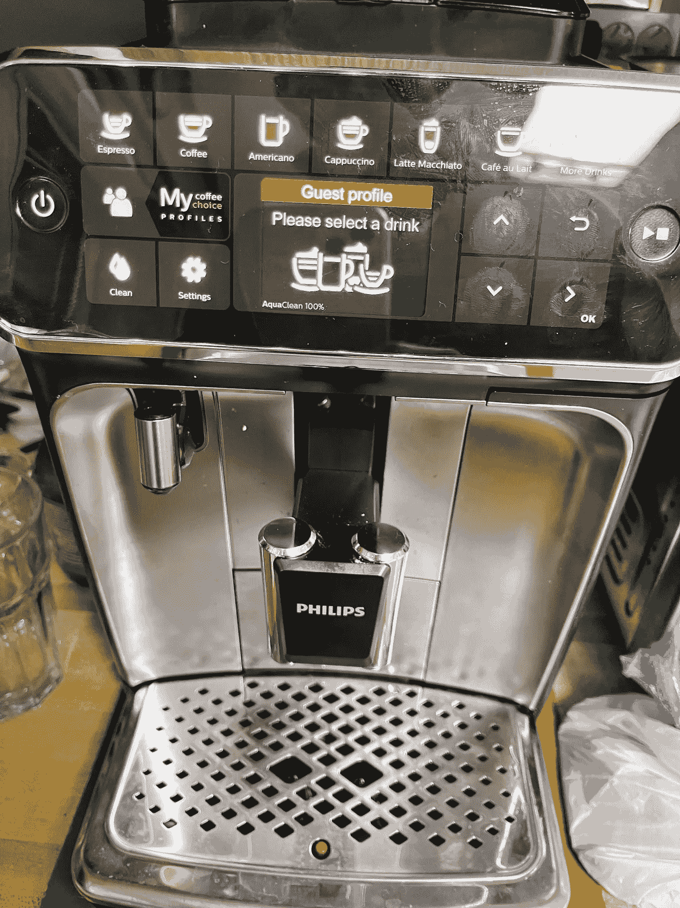

所有图片由作者提供

我使用了[韩国](https://towardsdatascience.com/rok-beats-niche-zero-part-1-7957ec49840d)研磨机，我看着修改剂量水平一点。我想如果我家里有一台这样的超自动机器，我就能更好地确定输入剂量。

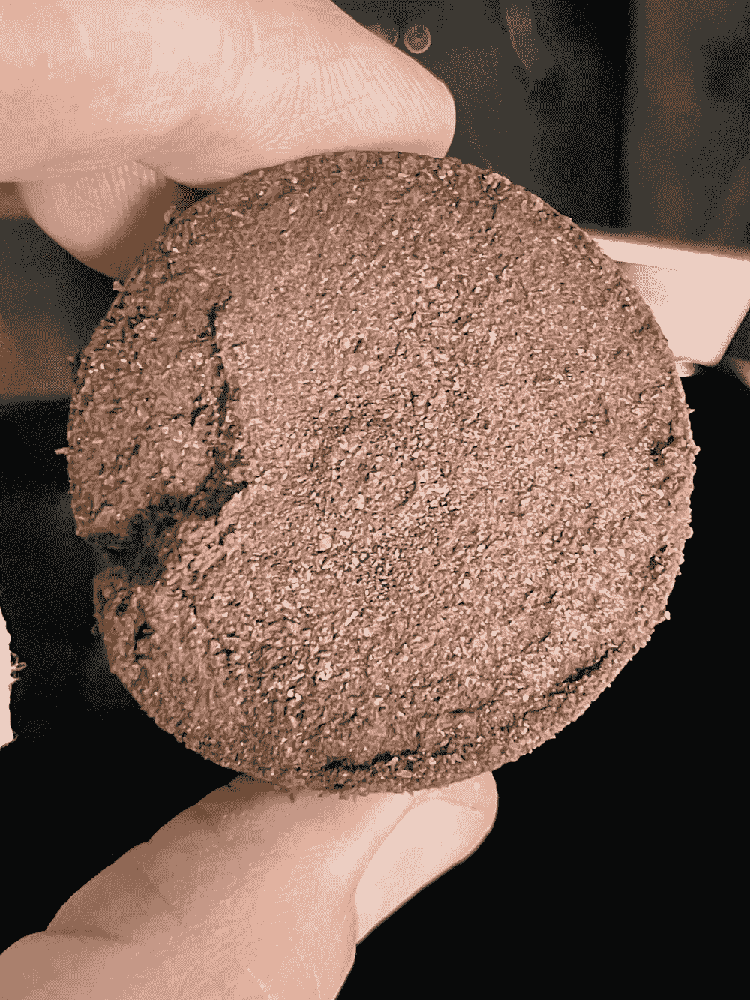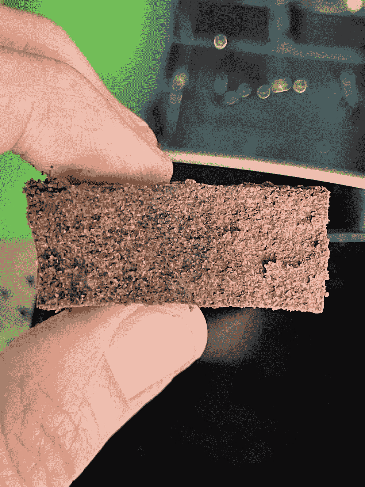

使用旁路的普通击球。有一些通灵。

一个主要的挑战是滑音过滤器是加压的，我没有很多使用加压滑音过滤器的经验，尤其是对于断奏。这台机器通常在开始时会卡住，但最终会运转起来。

我不得不把断奏向后拍，因为滤篮实际上是颠倒的。我敢肯定，这可能会导致不像传统机器那样预先注入二氧化碳的问题，但也许二氧化碳可以被挤出去。我用了两层使用[研究员摆振](https://fellowproducts.com/products/shimmy-coffee-sieve)，所以它是分裂在 300 微米(产品表说 200 微米，但有效的孔大小是 300 微米)。

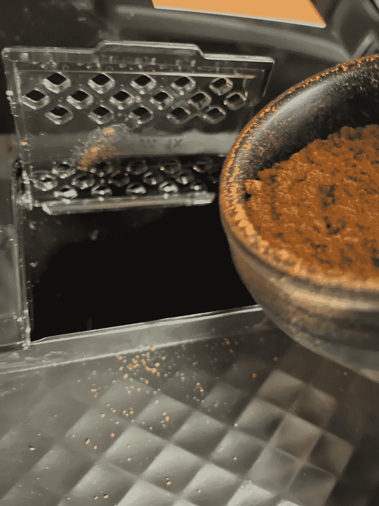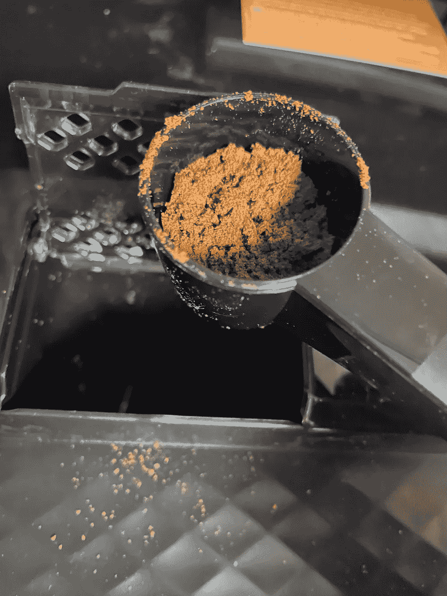

注射本身已经是浅色的，这可能是由于缺乏预输注。我怀疑因为流动会被堵塞，压力会上升得更高。

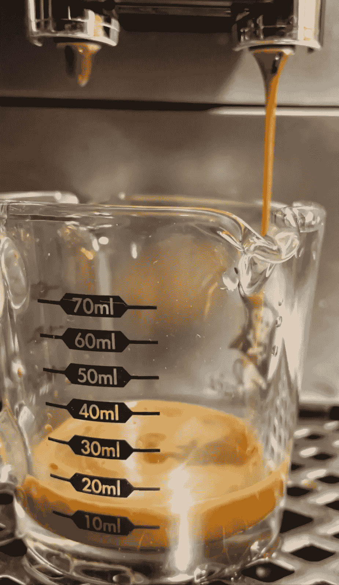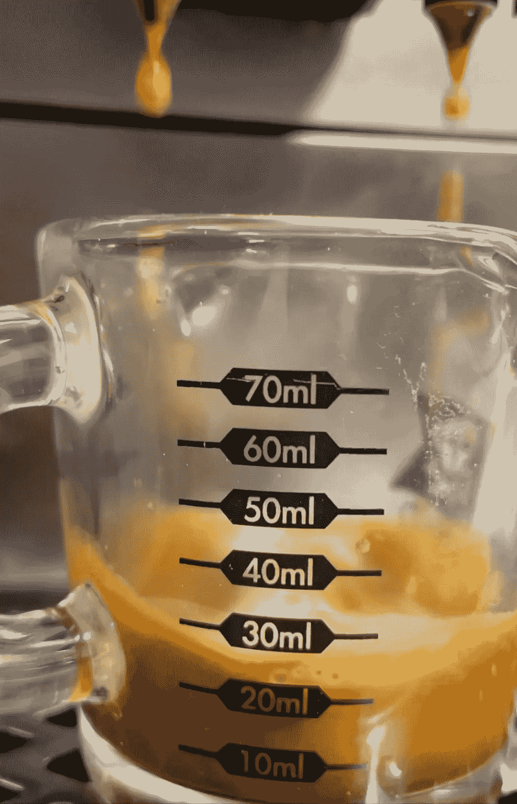

其中一个断奏的镜头有一些主要的慢点，如黑点所示，特别是在中心。

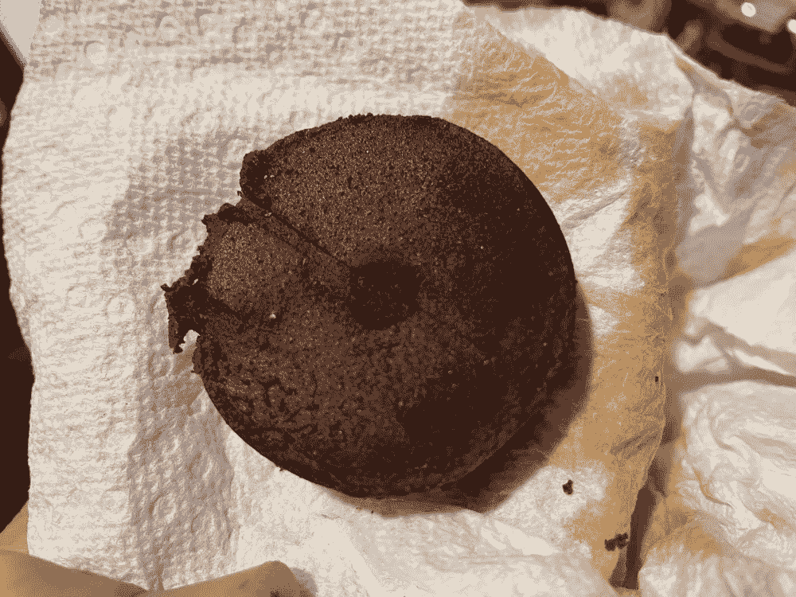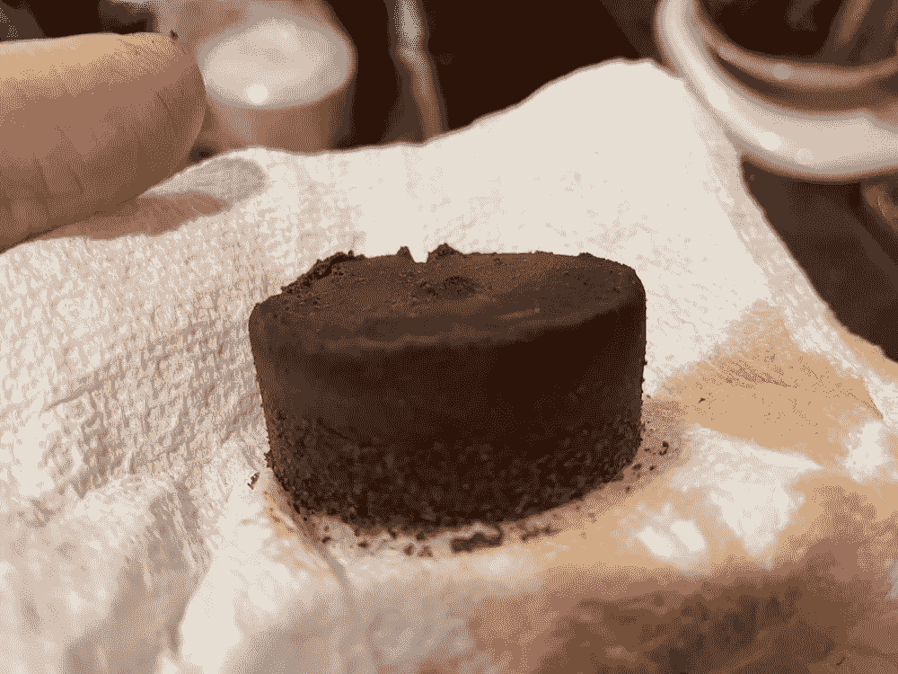

在杯子里，它看起来有点轻。

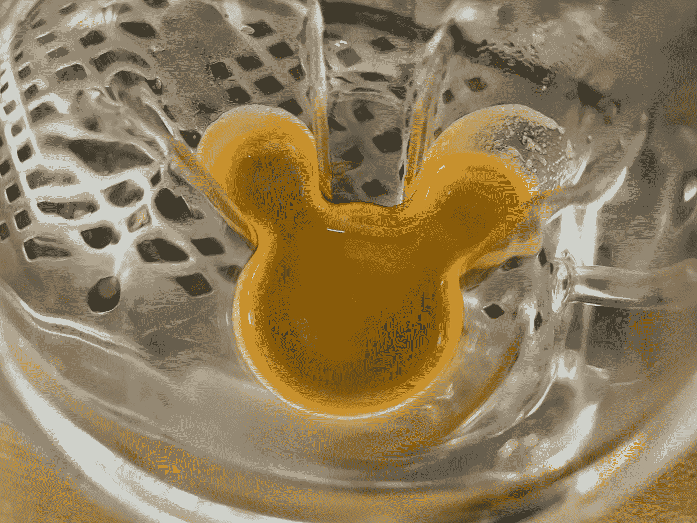

# 绩效指标

我使用两个[指标](https://towardsdatascience.com/metrics-of-performance-espresso-1ef8af75ce9a)来评估技术之间的差异:最终得分和咖啡萃取。

[**最终得分**](https://towardsdatascience.com/@rmckeon/coffee-data-sheet-d95fd241e7f6) 是评分卡上 7 个指标(辛辣、浓郁、糖浆、甜味、酸味、苦味和回味)的平均值。当然，这些分数是主观的，但它们符合我的口味，帮助我提高了我的拍摄水平。分数有一些变化。我的目标是保持每个指标的一致性，但有时粒度很难确定。

**强度半径(IR)** 定义为 TDS vs EY 控制图上原点的半径，所以 IR = sqrt( TDS + EY)。这一指标有助于标准化产量或酿造比的击球性能。

# 表演

我的表现与杠杆机器上的常规和断续击球相比较。在这种设置下，断奏的味道并没有比常规击球更好，这是因为出现了通道现象。我认为这个镜头对机器来说不是很好。

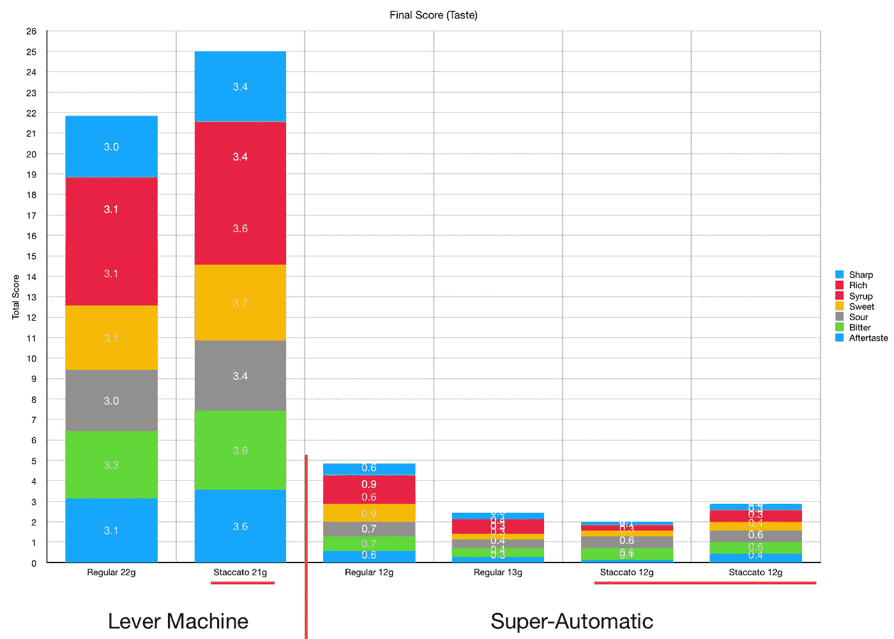

就 EY、TDS 和强度半径而言，常规拍摄更好。他们接近杠杆机拍摄在 ey，但不是 TDS。

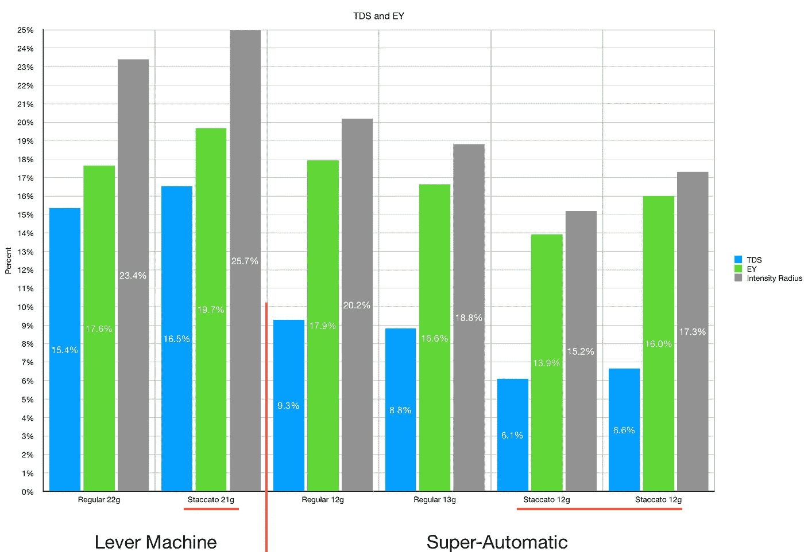

这些实验告诉我，在超自动钢琴上弹奏断奏需要一些技巧来处理机器功能的差异。在压力分布和预注入方面，它不像杠杆式机器那样宽容。

如果你愿意，可以在 [Twitter](https://mobile.twitter.com/espressofun?source=post_page---------------------------) 、 [YouTube](https://m.youtube.com/channel/UClgcmAtBMTmVVGANjtntXTw?source=post_page---------------------------) 和 [Instagram](https://www.instagram.com/espressofun/) 上关注我，我会在那里发布不同机器上的浓缩咖啡照片和浓缩咖啡相关的视频。你也可以在 LinkedIn 上找到我。也可以关注我的[中](https://towardsdatascience.com/@rmckeon/follow)和[订阅](https://rmckeon.medium.com/subscribe)。

# [我的进一步阅读](https://rmckeon.medium.com/story-collection-splash-page-e15025710347):

[我的书](https://www.indiegogo.com/projects/engineering-better-espresso-data-driven-coffee)

[浓缩咖啡系列文章](https://rmckeon.medium.com/a-collection-of-espresso-articles-de8a3abf9917?postPublishedType=repub)

[工作和学校故事集](https://rmckeon.medium.com/a-collection-of-work-and-school-stories-6b7ca5a58318?source=your_stories_page-------------------------------------)

[个人故事和关注点](https://rmckeon.medium.com/personal-stories-and-concerns-51bd8b3e63e6?source=your_stories_page-------------------------------------)

[乐高故事启动页面](https://rmckeon.medium.com/lego-story-splash-page-b91ba4f56bc7?source=your_stories_page-------------------------------------)

[摄影启动页面](https://rmckeon.medium.com/photography-splash-page-fe93297abc06?source=your_stories_page-------------------------------------)

[改进浓缩咖啡](https://rmckeon.medium.com/improving-espresso-splash-page-576c70e64d0d?source=your_stories_page-------------------------------------)

[断奏生活方式概述](https://rmckeon.medium.com/a-summary-of-the-staccato-lifestyle-dd1dc6d4b861?source=your_stories_page-------------------------------------)

[测量咖啡磨粒分布](https://rmckeon.medium.com/measuring-coffee-grind-distribution-d37a39ffc215?source=your_stories_page-------------------------------------)

[浓缩咖啡中的粉末迁移](/nerd-for-tech/rebuking-fines-migration-in-espresso-6790e6c964de)

[咖啡萃取](https://rmckeon.medium.com/coffee-extraction-splash-page-3e568df003ac?source=your_stories_page-------------------------------------)

[咖啡烘焙](https://rmckeon.medium.com/coffee-roasting-splash-page-780b0c3242ea?source=your_stories_page-------------------------------------)

[咖啡豆](https://rmckeon.medium.com/coffee-beans-splash-page-e52e1993274f?source=your_stories_page-------------------------------------)

[浓缩咖啡滤纸](https://rmckeon.medium.com/paper-filters-for-espresso-splash-page-f55fc553e98?source=your_stories_page-------------------------------------)

[浓缩咖啡篮及相关主题](https://rmckeon.medium.com/espresso-baskets-and-related-topics-splash-page-ff10f690a738?source=your_stories_page-------------------------------------)

[意式咖啡观点](https://rmckeon.medium.com/espresso-opinions-splash-page-5a89856d74da?source=your_stories_page-------------------------------------)

[透明 Portafilter 实验](https://rmckeon.medium.com/transparent-portafilter-experiments-splash-page-8fd3ae3a286d?source=your_stories_page-------------------------------------)

[杠杆机维修](https://rmckeon.medium.com/lever-machine-maintenance-splash-page-72c1e3102ff?source=your_stories_page-------------------------------------)

[咖啡评论和想法](https://rmckeon.medium.com/coffee-reviews-and-thoughts-splash-page-ca6840eb04f7?source=your_stories_page-------------------------------------)

[咖啡实验](https://rmckeon.medium.com/coffee-experiments-splash-page-671a77ba4d42?source=your_stories_page-------------------------------------)