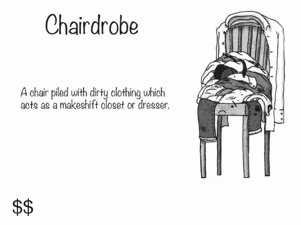
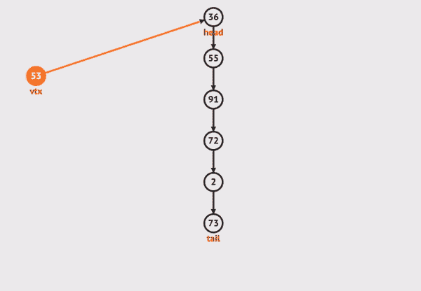
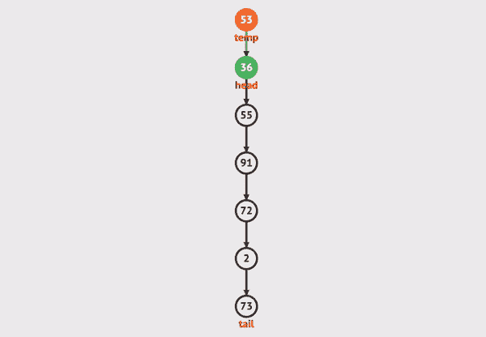
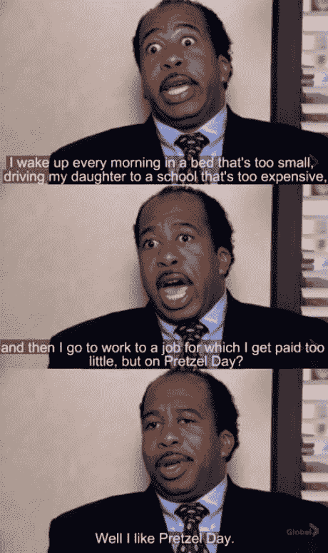
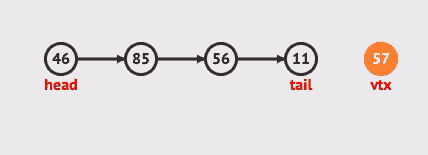
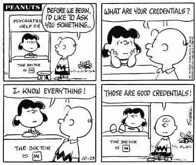

# 带有(单)链表的堆栈和队列

> 原文：<https://medium.com/nerd-for-tech/stack-queue-with-singly-linked-list-3ba42db98d87?source=collection_archive---------0----------------------->

## 链表，科技面试常见数据结构问题的话题之一。我将带你们探索栈和链表队列的概念！

(免责声明:本文需要预先了解链表，代码将用 Javascript 编写。)

照片由[思想目录](https://unsplash.com/@thoughtcatalog?utm_source=medium&utm_medium=referral)在 [Unsplash](https://unsplash.com?utm_source=medium&utm_medium=referral) 上拍摄

我花了两周时间学习链表。我不得不说，在与排序算法(那些冒泡、插入、合并，只是——aaahh)斗争之后，我发现链表比*更容易掌握。我最终会回到排序算法。此时此刻，我生活在链表的*泡泡*中(向排序算法脱帽致敬🎩).*

**目录:**

*   [**快速浏览链表**](#d524)
*   [**堆栈**](#d67e)
*   [**队列**](#12e2)
*   [**堆栈和队列的大 O**](#2bd3)
*   [**重述:并排比较:堆栈与队列**](#3165)

在我们深入堆栈和队列之前，让我们快速回顾一下什么是链表。

## 快速浏览链接列表

L 链表是一种线性数据结构，就像数组一样。你可能知道也可能不知道，有两种类型的链表:单向链表和双向链表。啊，连名字都这么可爱。主要区别是什么？

**单链表**:通常提供头部(第一个节点)，不提供尾部。

信用:[极客对极客——链表 vs 数组](https://www.geeksforgeeks.org/linked-list-vs-array/)

**双向链表**:头部和尾部都会被提供。

鸣谢:[极客帮极客—双向链表| Set 1](https://www.geeksforgeeks.org/doubly-linked-list/)

为什么我们要使用链表而不是数组？

因为

*   从一个数组中插入/移除元素是很昂贵的，因为需要空间来移动或插入一个元素，而在链表中，添加头部或尾部，甚至在中间插入/移除都很容易。O(n)与 O(1)的区别。
*   链表的动态大小使事情变得更容易，因为链表的长度可以根据需要增加或减少。

然而

*   由于指针的原因，链表往往比数组占用更多的内存空间；
*   由于指针系统，随机访问元素似乎是不可能的。

不管怎样，我不打算用我文章的一半来解释什么是链表。我假设你想更好地理解栈和队列，这就是你在这里的原因。在本文中，我们将着重使用单链表的概念来解释堆栈和队列。

好吧，什么是栈，什么是队列？

# 堆

在我们开始之前，这里是我们的两个类的起始代码:Stack 和 Nodes。

(《新女孩》第三季第 19 集 9:39——Stack 的绝佳例子)

快速解释:我们将这个列表设置为一个空列表。无头(第一)无尾(最后)。

把书架想象成…你放在椅子上的一堆脏衣服，又名椅柜。

信用: [me.me](https://me.me/i/chair-drobe-a-chair-piled-with-dirty-olothing-which-acts-6262313)

现在是早上 7:30，你正准备去上班/上学。你懒得在衣柜里找新衣服，你知道今天还不是洗衣服的日子，你知道吗？椅子上的衣服也不太脏。所以你拿起你在这堆衣服中找到的第一件上衣(你昨晚穿的),闻闻，深深地闻闻……是的，闻起来不太脏，所以你穿上了它。那你管这叫什么？ **LIFO** ，又名**L**ast-**I**n-**F**first-**O**ut。这差不多就是堆栈。你会经常看到那种情况，包括**递归**。

stacks 中有两种方法(以数组的形式):`unshift`(到头的项)和`shift`(从头的第一项)。我会用代码解释。

## `push(val)`

信用: [VisuAlgo](https://visualgo.net/en/list)

在这种情况下，53 的值需要被**推到**列表的开头。因为这不是一个数组，所以没有内置的方法将值“推入”我们的列表。相反，让我们写一个函数:

事情是这样的:

1.  我们首先创建一个值为 53 的节点。
2.  然后我们创建一个条件语句:

*   `If`列表是空的，我们的新节点将是列表的头和尾。
*   **或者** `else`，既然不想让我们原来的头完全变异，我们就把原来的头设置成一个新变量`temp`。然后我们把我们的新节点设置为新的头，我们原来的头成为下一个带`this.first.next`的节点。

3.最后但同样重要的是，我们将列表的大小增加 1。

很酷，对吧？接下来，让我们从列表中“弹出”53 个(比如你的衣服)。

## 流行()

信用: [VisuAlgo](https://visualgo.net/en/list)

类似于我们的`push`方法，没有内置的方法将值“弹出”列表。所以我们需要写一个:

1.  边缘情况:`if`列表为空，我们什么都不用做，直接返回`null`。
2.  将当前头(53)设置为变量`temp`。如果头部和尾部(即列表的大小为 1)相同，我们可以将尾部设置为`null`，因为我们不需要遍历整个列表。如果我们的列表不满足条件语句，我们可以忽略它。

3.然后，我们将头设置到下一个节点(因为我们正在删除当前的头)。将列表的大小减 1。

4.最后但同样重要的是，该函数返回当前头`temp`的`value`。

## 长队

我们队列的起始代码

代码与 stack 非常相似，除了我们将类名从 Stack 改为 Queue。

Queue……发音像字母“Q”，这个“-ueue”是什么意思？不管怎样，我们不是在学习英语，而是在学习计算机语言。在英式英语中，queue 是队列。在美式英语中，queue 的意思是排队。所以“队列”是什么就不言自明了。

在我们的日常生活中，我们排队…几乎所有的事情。好吧，想想办公室的斯坦利，他喜欢椒盐卷饼日。

《信用:办公室——椒盐卷饼日》(第三季第五集)

今天是椒盐卷饼日，每个人都要排队领取免费椒盐卷饼。队列的概念是 **FIFO** ，又名**F**first-**I**n-**F**first-**O**ut。在数组方面，有两种方法可以满足条件:`push`和`shift`。在队列中，push 称为`enqueue`，shift 称为`dequeue`。因为没有内置的方法，所以让我们构建自己的函数。

## 排队(val)

信用: [VisuAlgo](https://visualgo.net/en/list)

斯坦利兴奋地等着轮到他拿免费的椒盐卷饼。但是当斯坦利认为菲利斯因为鲍勃而试图插队时，不行。斯坦利疯了！菲利斯必须到队伍后面去。

信用:[Reddit](https://www.reddit.com/r/DunderMifflin/comments/a7mjmx/getting_between_stanley_and_pretzel_day_might_be/)/办公室

为此，我们的函数如下所示:

事情是这样的:

1.  我们首先用参数中接受的值创建新节点(在我们的例子中是 Phyllis)。
2.  然后我们创建一个条件语句:

*   我们首先检查是否有标题(即列表是否为空)。头部不存在，我们的新节点将是列表的头部和尾部。
*   `else`，我们将当前 tail 的下一个节点设置为我们的新节点`newNode`，因此，我们的`newNode`将成为我们列表的新 tail。

3.最后但同样重要的是，将列表的大小增加 1。

## 出列()

信用: [VisuAlgo](https://visualgo.net/en/list)

我需要一张斯坦利拿着椒盐卷饼做填字游戏时的截图。这是第九季第 18 集。请忽略字幕！

耶！斯坦利终于得到了他的椒盐卷饼！让我们`dequeue`/把他从我们的队列中弹出来。

这与`Stack`中的`pop`函数代码完全相同。如果你需要提醒的话，以下是步骤:

1.  边缘情况:`if`列表为空，我们什么都不用做，只需返回`null`。
2.  将我们当前的头(Stanley)设置为变量`temp`。如果头部和尾部(即列表的大小为 1)相同，我们可以将尾部设置为`null`，因为我们不需要遍历整个列表。如果我们的列表不满足条件语句，我们可以忽略它。

3.然后，我们将头设置到下一个节点(因为我们正在删除当前的头)。将列表的大小减 1。

4.最后但同样重要的是，该函数返回当前头`temp`的`value`。

那就差不多了`Queue`！相当令人兴奋的东西和相当直观的我会说！

## 堆栈和队列的大 O

正如前面在链表部分提到的，与数组相比，链表更适合于插入和移除。就时间复杂度而言，链表中的**插入和移除是 O(1)** ，而数组中的**插入和移除是 O(n)** ，因为数组需要遍历链表来遍历元素的索引等。

然而，**搜索和访问**并不是链表的最佳选择，因为计算机必须遍历每个节点才能找到那个特定的。因此，**链表的时间复杂度为 O(n)** 。但是在 array 中，计算机可以简单地搜索和访问元素，因为元素是用索引“标记”的(例如。数组[1])。因此，**数组的时间复杂度为 O(1)** 。

## 总结:堆栈和队列之间的比较

到结束这篇文章，让我们比较一下堆栈和队列的区别。

*   **堆栈**基于**后进先出**原则，即最后插入的**最后一个**元素将是**第一个**元素以“离开”列表
*   在**堆栈**中，插入和删除从顶部开始，而在**队列**中，插入和删除从列表的另一端开始——插入发生在列表的后面，删除发生在列表的前面。
*   **堆栈:**插入- >推送和删除- >弹出 vs **队列**:插入- >入队和删除- >出列

感谢阅读这篇文章！如果你期待一些非常专业的术语和解释，我很抱歉。我写这篇文章就好像我试图向一个不完全理解计算机科学如何工作的朋友解释这一点，这种方法帮助我更直观地理解概念。我希望你喜欢这篇文章！

# 资源

要理解堆栈和队列:

 [## 堆栈和队列数据结构的区别

### 堆栈和队列数据结构的区别堆栈是一种线性数据结构，其中的元素可以是…

www.geeksforgeeks.org](https://www.geeksforgeeks.org/difference-between-stack-and-queue-data-structures/) 

对于视觉学习者:

 [## 链表(单链表，双链表)，堆栈，队列，队列

### 链表是一种数据结构，由一组顶点(节点)组成，它们共同代表一个序列。在…下面

visualgo.net](https://visualgo.net/en/list) 

关于链表的更多信息:

 [## 链表

### 各位程序员好！我写的上一篇博客是关于一个叫做动态编程的数据结构概念…

blog.usejournal.com](https://blog.usejournal.com/linked-list-a64cd53edf43)  [## 链表数据结构- GeeksforGeeks

### 链表是一种线性数据结构，其中的元素不是存储在连续的内存位置。的…

www.geeksforgeeks.org](https://www.geeksforgeeks.org/data-structures/linked-list/) 

根据我对数据结构和算法的基本概念的理解，我了解到:

 [## JavaScript (JS)算法和数据结构大师班

### 嗨！我是柯尔特。我是一名热爱教学的开发人员。过去几年我一直在教人们…

www.udemy.com](https://www.udemy.com/course/js-algorithms-and-data-structures-masterclass/) 

还有花生漫画里的一点幽默:

查理·布朗向精神病医生露西寻求帮助