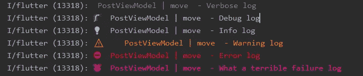
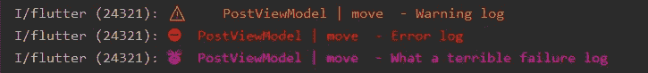

# 堆叠包装—服务位置、路线和记录

> 原文：<https://medium.com/nerd-for-tech/stacked-package-service-location-routing-logging-b8bdc1e6c839?source=collection_archive---------5----------------------->

大家好，我已经写了一篇文章，关于我们如何用堆叠包轻松处理加载状态和错误。

*在本文中，我们将了解堆叠包提供的各种服务。*

堆叠包提供各种功能，如**服务定位、路由、记录**等。它通过代码生成使它们变得非常简单，你需要做的只是用`@StackedApp` 注释一个类并指定你想要的服务。

首先，在您的`pubspec.yaml`中声明依赖项，

```
dependencies:
  **stacked: ^2.2.2**
  **stacked_services: ^0.8.10**dev_dependencies:
  **build_runner: 
  stacked_generator:**
```

# 按指定路线发送


何塞·马丁·拉米雷斯·卡拉斯科在 [Unsplash](https://unsplash.com/s/photos/route?utm_source=unsplash&utm_medium=referral&utm_content=creditCopyText) 上拍摄的照片

## **设置**

1.  **用@StackedApp** 注释一个类

创建一个文件，名字由你选择🙃，我把它命名为`app.dart`

然后，让我们为我们的应用程序指定一些**路线**，

```
**@StackedApp(
  routes:[** MaterialRoute(page: HomePage,initial: true),
    MaterialRoute(page: LoginPage), **]
)**
class **App**{
   //empty class, will be filled after code generation
}
```

*   我们刚刚宣布了两条路线，并将我们的主页设置为我们的初始路线。
*   这也支持嵌套路由( [docs](https://pub.dev/packages/stacked) )

**2。运行代码生成器命令**

```
flutter pubrun *build_runner build --delete-conflicting-outputs*
```

这将产生

> `*app.router.dart*`:由**路线**参数自动生成。
> 
> `*app.locator.dart*`:由**依赖关系**参数自动生成。
> 
> `*app.logger.dart*`:由**记录器**参数自动生成。

> 每次对@StackedApp 进行一些更改时，都必须运行这个命令

**3。在您的 MaterialApp** 中指定 onGenerateRoute，navigatorKey

```
class MyApp extends StatelessWidget {
  @override
  Widget build(BuildContext context) {
    return MaterialApp(
        title: 'My APP',
        **navigatorKey: StackedService.*navigatorKey*,
        onGenerateRoute: StackedRouter().onGenerateRoute**,
    );
  }
}
```

*   Navigator 键非常重要，它使我们能够在不明确使用上下文的情况下浏览页面。
*   StackedApp 使用 auto_route 生成`app.router.dart` 文件。最棒的是，它为每条路由创建了一个路由器参数类(在构造函数中有相同的参数)，您可以在导航到目标类时使用它。

假设我们的 LoginPage 如下所示，

```
class LoginPage extends StatelessWidget {
  **String id;
  LoginPage(this.id);**
  //...
}
```

`app.router.dart`有一个`**LoginArguments**` 类，作为构造函数参数的持有者，

```
class LoginPageArguments {
  final String id;
  LoginPageArguments({required this.id});
}
```

我们如何使用它？假设我们在一个视图模型中

```
*//within a viewModel* void move(){
     //after registering navigationService as dependency(more on this later)
     **locator.get<NavigationService()**
            .navigateTo(
                Routes.*loginPage*,
                 **arguments:** **LoginPageArguments(id: '1')**);

    /* #### Equivalent to #####
     *Navigator.of(context)
              .pushNamed(Routes.loginPage,
                  arguments:{id:1});
*    */ 
}
```

这将把我们导航到带有传递的参数的 Loginpage。参数解组将由堆叠的包完成。

*   当使用 LoginPageArguments 时，我们不能跳过任何`required`参数，这为传递参数提供了**编译时安全性**。

```
**arguments:** **LoginPageArguments() //error, must pass 'id'**
```

*   如您所见，我们在业务逻辑层中不使用任何上下文进行导航。这是使用堆叠服务的主要好处之一。


Diana Polekhina 在 [Unsplash](https://unsplash.com/s/photos/injection?utm_source=unsplash&utm_medium=referral&utm_content=creditCopyText) 上拍摄的照片

## 2.依赖性注册

您可以在 stackedApp 注释中注册您的依赖项，它减少了`get_it`包的大部分注册样板代码。我写了一篇关于 get_it 的文章，如果你有兴趣可以在这里[阅读。](/nerd-for-tech/implement-service-locator-design-pattern-with-get-it-flutter-5e50671bbbcb)

## 1.在@StackedApp 中指定依赖项

```
//code snippet from the official docs
**@StackedApp**(
routes : [ ... ],
**dependencies**: [
    **LazySingleton**(classType: ThemeService, resolveUsing: ThemeService.getInstance),*// abstracted class type support*
    **LazySingleton**(classType: FirebaseAuthService, asType: AuthService), **Singleton**(classType: NavigationService),**Factory**( classType: Counter)**,****Presolve**(
      classType: SharedPreferencesService,
      presolveUsing: SharedPreferencesService.getInstance,
    ),
  ],
)
```

## 2.运行命令

不要忘记运行命令，

```
**flutter pubrun *build_runner build --delete-conflicting-outputs***
```

> 这将生成 **app.locator.dart** ，其中包含您指定的所有依赖项。

## 3.从 runApp()调用 setupLocator()

另外，不要忘记从 runApp()调用 setupLocator()，

```
import './**app.locator.dart**';
void main() {
  **setupLocator()**; //this function is inside the ***app.router.dart*** file
  runApp(MyApp());
}
```

**4 种注册类型**

## 1.辛格尔顿&拉兹辛格尔顿

*   Singleton —始终只创建和重用一个实例。
*   LazySingleton——类似于 Singleton，但实例仅在用户第一次请求时创建，而不是在应用程序启动时创建，这可以节省一些启动时间。

**参数:**

*   **classType** :要初始化的类的类型。
*   **asType** :要公开的类的类型。
*   **resolveUsing** :这里需要传递一个静态函数，这个函数可以返回`classType`的实例。

示例:

```
//abstract parent class
**abstract class AuthService** {
    bool get isLoggedIn;
    void login();
    void logout();
    void register();
}
```

我们的 AuthService 实现

```
**class FirebaseAuthService extends AuthService** {
    //implements all the required methods of AuthService
}
```

现在我们要启动 FirebaseAuthService 并将其类型公开为其父类型(AuthService)，

```
**AuthService** authService = **FirebaseAuthService**();
```

我们可以使用相同的逻辑注册服务，

```
LazySingleton(**classType**: **FirebaseAuthService**, **asType**: **AuthService**)
```

## 2.工厂()

有时我们不想要单例，我们希望每次调用`locator.get<T>()`时都有一个新的实例。可以使用 Factory()注册来实现。

```
**Factory**(classType: Dog,asType: Animal,);
```

相当于

```
Animal animal = new Dog();
```

在 get_it 中，它相当于，

```
locator.registerFactory<Animal>(() => Dog());
```

3.预求解()

假设我们说你想在注册对象之前做一些 ***未来*** 的计算，可以用 *Presolve()* 。

```
Presolve(
      classType: SharedPreferencesService,
      ***presolveUsing: SharedPreferencesService.getInstance***,
    ),
```

*   presolveUsing:它也采用类似于`resolveUsing` 的静态方法，但是它必须返回指定类型的未来。`Future<classType>`

```
**static** Future<SharedPreferencesService> getInstance() **async** {
  **//...**
}
```

如你所见，`getInstance()` 是一个静态方法，返回指定类型的未来值`SharedPreferencesService.`

*   如果我们尝试在没有预解的情况下注册，它将注册`Future<SharedPreferencesService>` 而不是`SharedPreferencesService.`的类型
*   预解决'**等待'**,直到将来完成并注册实例。

> 如果您注册了任何需要预先解决的依赖项，那么您必须将主函数更改为 **Future，并等待 setupLocator** 调用。

```
Future main() **async** {
  **await** setupLocator();
  runApp(MyApp());
}
```

## 3.记录

你如何调试你的程序？使用 print()，是时候改变了。堆叠封装提供开箱即用的`logger` 。

**1。在@StackedApp** 中指定记录器

```
**@StackedApp**(
routes: [..],
**logger: StackedLogger()** )
```

**2。安装记录器包**

```
dependencies:
  ...
  logger:
```

您可以调用 getLogger()，它返回一个 Logger，它更像一个 print()，但是它巧妙地格式化了消息，并赋予它一定的重要性。

```
**class** **MyViewModel** {
**final** logger = getLogger('MyViewModel');
**void** move() {
    //importance level from low to high
    logger.**v**("Verbose log");  //verbose
    logger.**d**("Debug log");    //debug
    logger.**i**("Info log");     //info
    logger.**w**("Warning log");  //warning
    logger.**e**("Error log");    //error
    logger.**wtf**("What a terrible failure log"); //you know this
  }
}
```

> 确保你传递给 getLogger()的类名与你所在的类相同。这将帮助记录器自动打印方法名。(本例中为 move())

这将在您的控制台上打印以下消息



表情类名|方法名—错误消息

您还可以过滤日志级别的日志，假设您只想打印日志级别为'*警告'*'的日志。你能做的，

```
void main() {
  runApp(MyApp());
  **Logger.*level* = Level.warning;** //prints only ['warning','error','wtf'] logs
}
```



如果你想用其他方法而不是`getLogger()`来获取日志，你可以在`StackedLogger`中覆盖它。

```
@StackedApp(
  routes:[..],
  logger: StackedLogger(
    **logHelperName: 'getMyLogger'** //default: 'getLogger'
  )
)
```

您可以使用以下命令调用记录器:

```
getMyLogger(‘className);
```

有了`Stacked` 包，你就可以**自动生成表单**另外，要了解更多信息，可以去看看[官方文档](https://pub.dev/packages/stacked)，在我看来，它写得非常好。感谢您的阅读。拍手声👏如果你喜欢这篇文章。