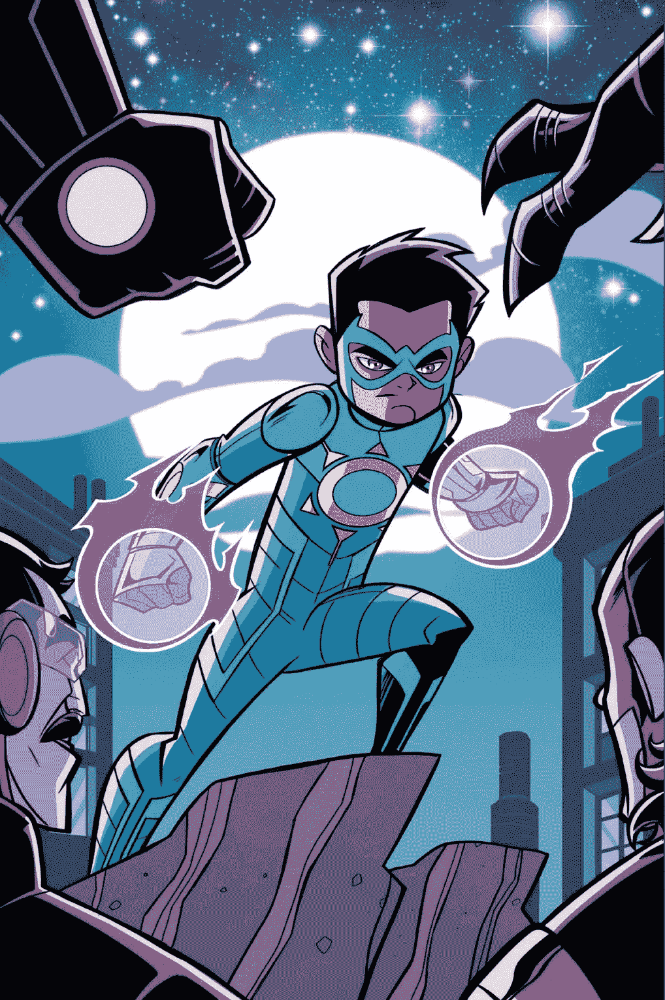

# 无敌斯坦·李的查克拉——印度最受欢迎的超级英雄现在是 NFT

> 原文：<https://medium.com/nerd-for-tech/stan-lees-chakra-the-invincible-india-s-most-loved-superhero-is-now-an-nft-1b6a1b8c54c3?source=collection_archive---------3----------------------->

## Beyondlife.club 为我们带来了 Chakra NFT 系列的精彩作品。

[查克拉无敌](https://chakra.beyondlife.club/?fsz=home)

有大量的印度超级英雄漫画小说和电视节目，让每个孩子都崇拜他们，并被他们为人民做的好事所激励，让世界变得更好，无敌查克拉是其中非常独特的。

[**隐形查克拉**](https://chakra.beyondlife.club/?fsz=home) 是一部印度超级英雄漫画，后来被改编成电视节目，在卡通网络等各种卡通媒体和 Toonami 等数字流媒体平台上播出。这部超级英雄电视剧已经俘获了年轻一代的心，并在全球超级英雄卡通领域成为家喻户晓的名字。《查克拉》在其剧集中完美地描绘了故事和动作的美，并将观众传送到了令人惊叹和兴奋的地方。

**无敌查克拉-快速预览**

[斯坦·李的查克拉无敌](https://chakra.beyondlife.club/?fsz=home)

查克拉的故事围绕着一个名叫拉朱·拉伊的年轻男孩展开，他是一个科学爱好者，想要通过科学解开人类的奥秘。他的导师辛格博士正在追求他一生的目标，他创造了一套纳米技术服装，能够显示一个人身体中的脉轮。这种表现赋予使用者超人的能力和力量。Raju Rai 意外地与西装联系在一起，他决心使用他被赋予的这些新能力来保护孟买城免受潜伏在阴影中的邪恶势力的侵害。

是什么让这个超级英雄如此有趣？

正如该剧的名字所暗示的，查克拉是这个超级英雄是一个特殊而有趣的角色的原因。脉轮是人体的焦点，作为一个触发器来最大限度地释放一个人身体的潜力。据说这在古代被许多人使用过。辛格博士开发的纳米技术套装使用脉轮的确切原理，套装的核心功能是最大化脉轮，并将其显化为更伟大的东西。人体总共有七个不同的脉轮，它们分别代表了独特力量的潜力。

**无敌查克拉盗梦空间**

脉轮的创造者找到斯坦·李，与他们合作创造一个印度血统的超级英雄。事实证明，斯坦·李很久以来就一直想塑造一个印度血统的超级英雄，并赋予其生命，随着这个想法的出现，斯坦·李与印度制图公司合作，共同创作了《无敌查克拉》。

斯坦·李的主要意图一直是探索各种独特的地理边界，并在国际市场上创造一个潮流，创造具有不同起源的超级英雄。查克拉是这个模块的缩影。这部剧将印度超级英雄的虚构角色在地图上展开，让观众看到并体验一些非常惊人和特别的东西。

**查克拉进入 NFT 宇宙**

印度 NFT 市场正在迅速扩张。各种各样的印度项目正在涉足这个宇宙，Chakra 是名单中的最新成员。 [**Beyondlife.club 为我们带来了 Chakra NFT 系列的精彩创作**](https://chakra.beyondlife.club/?fsz=home) 。有超过

6000 个独特的 NFT 已经在市场上发布，供数码爱好者选择和体验一些非凡的东西。

Beyondlife.club 创造了大量的 NFT 系列；查克拉艺术朋克战利品盒，查克拉艺术朋克，动画生活漫画封面，漫画剧照，七查克拉的权力，动画 NFT 视频，和斯坦·李 B'day 特别。这些 NFT 收藏充满了巨大的兴奋和伟大的奖品。

这是 NFT 漫画爱好者的天堂。在这个平台上收集的 NFT 是广泛的。

[收集 NFT](https://chakra.beyondlife.club/?fsz=home)

*   在这些收藏中，战利品箱被认为是非常令人兴奋的一个，因为它的本质是提供刺激和惊喜。战利品箱有 6865 个独特的查克拉 NFT，用户可以在那里测试他们的运气并赢得巨额奖金。
*   下一个是 [**查克拉艺术朋克**](https://chakra.beyondlife.club/?fsz=home) ，它有 15 个，在 Beyondlife.club 平台进行的拍卖中出售。
*   从动画封面到漫画剧照，一切都以拍卖的方式出售。这些 NFT 收藏极其有限。因此，要争分夺秒地得到这些特殊的物品。
*   在该平台上提供的所有 NFT 收藏中，斯坦·李多年前亲笔签名的原始有限石版画在该平台上占有特殊的地位。对于他的铁杆粉丝来说，这个 NFT 被认为是一个非常特别和感性的 NFT。

**总结，**

这些来自查克拉宇宙的奇妙的 NFT 可以在 Beyondlife.club 平台上买到。因此，准备好你的加密钱包，准备成为传奇和历史的一部分。