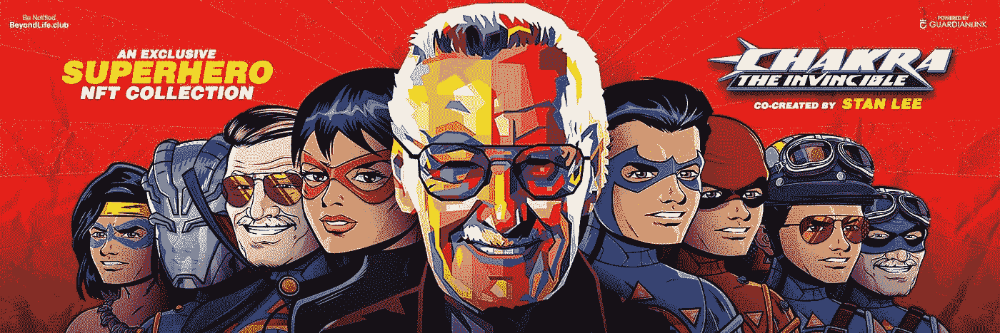
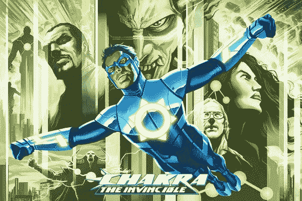
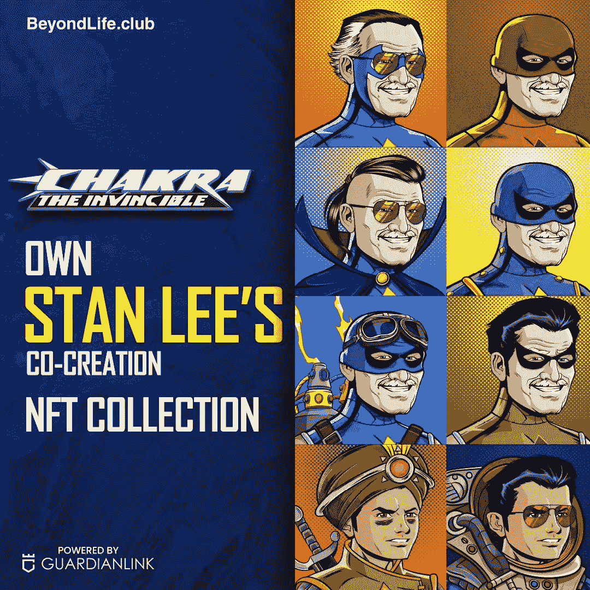
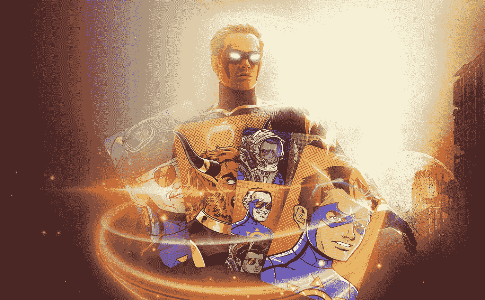

# 斯坦·李的“脉轮宇宙”及其在 NFT 世界的涟漪效应。

> 原文：<https://medium.com/nerd-for-tech/stan-lees-chakraverse-and-the-effects-of-its-ripples-in-the-nft-world-421ae42bdfc0?source=collection_archive---------8----------------------->

## **斯坦·李的查克拉无敌 NFT 系列**

**斯坦·李的查克拉无敌 NFT**

在任何现代交易者的家中，NFT 都是一个家喻户晓的名字。他们每天都在证明并继续提高他们的可能性。随着许多令人敬畏的密码艺术的开发和推出， [**斯坦·李的“无敌查克拉”**](https://chakra.beyondlife.club/?fsz=home) 正在全球范围内在超级英雄粉丝的眼中首次亮相。这款产品在斯坦 99 岁生日之际适时推出，作为向这位偶像致敬的作品。

**那么，谁是查克拉无敌？这和斯坦·李有什么关系？**

**查克拉无敌**

[**无敌查克拉**](https://en.wikipedia.org/wiki/Chakra:_The_Invincible) 是一封写给全球印度粉丝的情书，这些粉丝过去和现在都是联合创作者斯坦·李的粉丝，他与 Sharad Devarajan 和 Gotham Chopra 一起开发了这个角色，Jeevan J. Kang 的艺术作品为这些广受好评的漫画注入了活力。

几十年来，斯坦·李一直是漫画超级英雄创作和发展的一部分，并参与了蜘蛛侠、x 战警、猩红女巫、复仇者联盟等项目，以及大多数使漫威漫画成为今天电影产业的创作者。代替这个天才，“无敌查克拉”是超级英雄创造奇迹男孩的另一个成功故事。

整个现象始于 2011 年，小说、漫画、电影和动画电视剧紧随其后；它在世界各地取得了巨大的成功，粉丝们欢迎并支持这一新的精彩举措。

斯坦·李和印度图形一起支持这个角色，让查克拉出现在全世界的主流媒体上。令人惊讶的是，这使它成为斯坦的梦想工程，因为他一直在寻找转向东方。他将古印度丰富的文化和教义铭记于心，创造了无敌的查克拉和他的力量。

《无敌查克拉》讲述了孟买一个年轻小伙子拉朱·拉伊的故事，他在独特的环境下与他的哥哥萨梅尔一起生存了下来。他和一个疯狂的天才科学家辛格博士有联系。他合作开发了一种超级套装，可以利用与宇宙能量相关的“脉轮”的神秘力量。

一些权力包括，

> 𝐘𝐞𝐥𝐥𝐨𝐰𝐂𝐡𝐚𝐤𝐫𝐚**——飞行的力量。**
> 
> **𝐁𝐥𝐮𝐞𝐂𝐡𝐚𝐤𝐫𝐚——力场的力量。**
> 
> **𝐑𝐞𝐝𝐂𝐡𝐚𝐤𝐫𝐚——致命的能量爆炸。**
> 
> **𝐌𝐚𝐠𝐞𝐧𝐭𝐚𝐂𝐡𝐚𝐤𝐫𝐚——快速康复。**
> 
> **𝐏𝐮𝐫𝐩𝐥𝐞𝐂𝐡𝐚𝐤𝐫𝐚——幻觉和套装控制。**
> 
> **𝐆𝐫𝐞𝐞𝐧𝐂𝐡𝐚𝐤𝐫𝐚——第六感还是内心的声音。**
> 
> **𝐖𝐡𝐢𝐭𝐞𝐂𝐡𝐚𝐤𝐫𝐚——宇宙一体，最强大的力量。**

**NFT 是如何与无敌查克拉联系在一起的。**

> **Chakraverse 正在进入加密艺术的世界。NFT 是收藏家和投资者的收藏品和投资选择的新形式。艺术朋克的限量版收藏，动画 NFT 视频，由一系列视频组成的致敬作品，带有传奇人物斯坦·李在他 99 岁生日时的第一版漫画的特殊个性化签名。 [**查克拉 NFT**](https://chakra.beyondlife.club/?fsz=home)是 NFT 滴超级英雄领域中独一无二的滴。**

**一份 Chakraverse NFTs 的详细清单即将出炉。**

****

*   **一个非常特别的 6865 艺术朋克，他们每一个都是为你的战利品盒中的乐趣而独特制作的。这是一种有趣的注册等待名单的方式，可以让你花 **25 美元**获得一个随机生成的 NFT。**
*   **15 件限量版的艺术朋克作品将被拍卖，每件作品的底价为 200 美元。**
*   **两个专业设计和策划的 NFT 动画视频，仅制作了 1250 份，以 50 美元的价格出售。**
*   **五本《无敌查克拉》原版连环画封面，发行量 1250 册，购买价格 **25 美元**。**
*   **只有两个活生生的动画漫画封面被制作出来，查克拉的原始动画被拍卖，底价从 **500 美元**起。**
*   **查克拉的七种力量都是非功能性的，每种力量都以 1000 美元的底价拍卖。**
*   **以及一个千载难逢的机会，拥有一件斯坦的贡品，拍卖从他 99 岁生日那天的 10 万美元开始。**

**无敌查克拉的 NFT 什么时候掉落？**

****

**当你绞尽脑汁想在这个假期给那个特别的人或自己买些什么的时候，这些 NFT 糖就像天赐的一样。查看额外的惊喜和一些精选的购物项目。这为查克拉、斯坦的粉丝和他们的共同崇拜者提供了一个非常好的窗口，让他们有机会展示和拥有他们以 NFTs 形式存在的遗产，这对投资者来说是一个非常酷和值得投资的收藏。**

**[**这些 NFT 将在太平洋标准时间 12 月 27 日晚上 7:30(IST 时间 12 月 28 日上午 9 点)**](https://chakra.beyondlife.club/?fsz=home) 投放，但“斯坦·李的生日特别节目”除外，它将在 12 月 28 日他的生日当天投放。发射将持续三天。**

****结束这次令人惊叹的过山车之旅。****

**轰轰烈烈地开始新的一年。查看 [**BeyondLife**](https://discord.gg/qmBpSsHyQs) 和 Orange Comet，进入候补名单并注册，就有机会获得令人敬畏的“无敌查克拉”NFTs 仅仅从斯坦的遗产与这个项目的联系来看，它们就具有特殊的价值。**