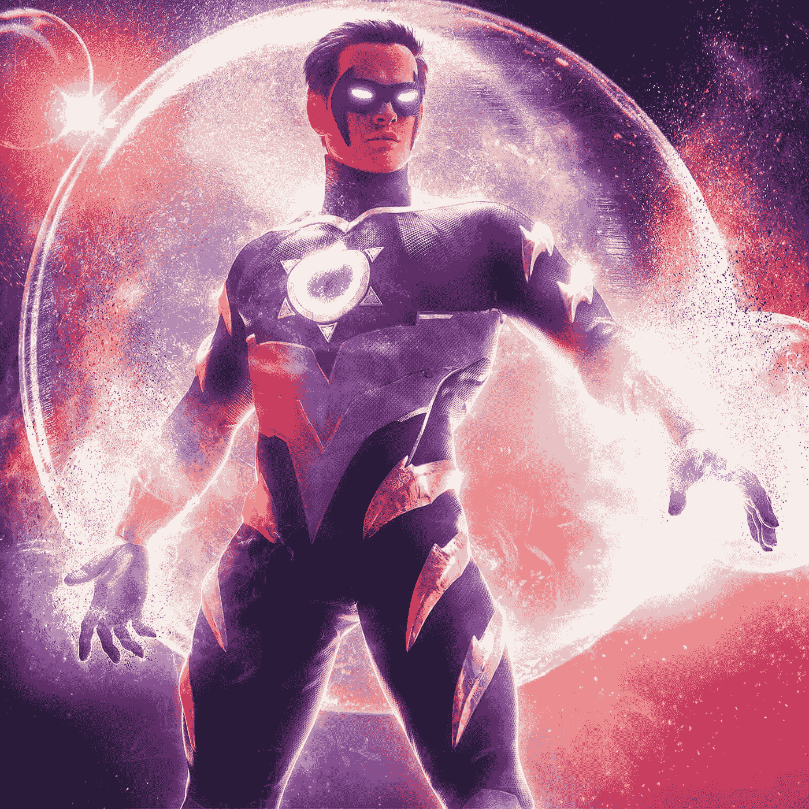
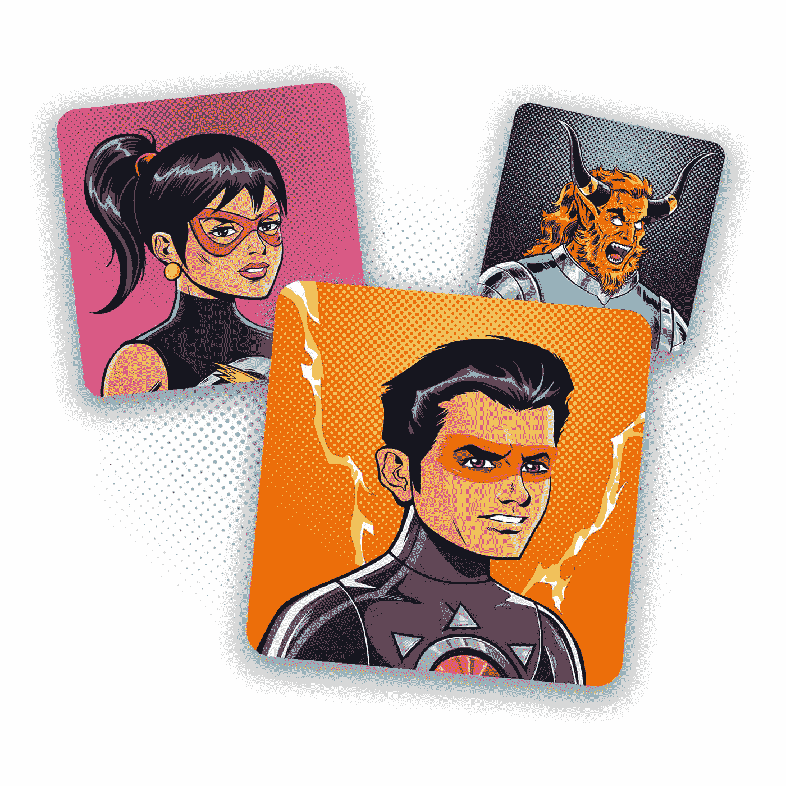

# 斯坦·李的作品现在是 NFTs:拥有一件斯坦·李查克拉 NFT 收藏的 NFT

> 原文：<https://medium.com/nerd-for-tech/stan-lees-creations-are-nfts-now-own-an-nft-from-stan-lee-s-chakra-nft-collection-1d2a1095f8c0?source=collection_archive---------2----------------------->

从获得食物到用数字货币支付食物，这个世界正在变得数字化。这种狂热达到了稀有收藏品的程度，它们现在以 NFT 的形式出现。你不需要保险库，你不需要把它们藏在枕头和床底下。在区块链里会安然无恙。你现在能买到的最流行的 NFT 系列是由漫威的创造者斯坦·李创作的查克拉 NFT 系列。

**关于查克拉 NFT 系列的一切**

查克拉 NFT 系列是基于斯坦·李创造的漫画人物。查克拉-无敌是一部基于印度的漫画，后来在 2013 年作为动画电影发行。著名的卡通电视网在印度播放了这部电影。一个叫 Raju Rai 的孩子得到了一套基于 7 个能量轮的超级英雄套装。过了一段时间，斯坦·李开始创造成熟版本的脉轮，但没有被释放。在 2018 年去世后，查克拉-无敌现在以 NFT 的身份回归。这是为了纪念今年 12 月斯坦·李 99 岁生日。该系列有许多有趣的物品，可以在 Beyondlife.club 的官方 [**查克拉 NFT 市场**](https://chakra.beyondlife.club/?fsz=home) 购买。你必须尽快加入愿望清单以获得你的。

总结一下这个系列

1.  查克拉艺术朋克战利品盒
2.  查克拉艺术朋克
3.  查克拉动画现场漫画书封面
4.  查克拉漫画封面剧照
5.  七轮力量
6.  脉轮动画 NFT 视频
7.  斯坦·李生日特别 NFT

上面提到的每一个 NFT 都是斯坦·李自己创造的。价格最高、需求量最大、最受期待的 NFT 是斯坦·李生日特别 NFT。

**斯坦·李生日特辑 NFT**

[**查克拉 NFT 系列**](https://chakra.beyondlife.club/?fsz=home) 中的每一个 NFT 都是独一无二的稀有之物。有些甚至包括斯坦创作并亲自签名的原始石版画。该系列的亮点或珍藏是斯坦·李纪念日特别 NFT。这个 NFT 是专为纪念这位传奇的创造者而创作的，展示了他罕见的超级英雄草图。NFT 可以通过在他生日那天举行的拍卖会购买。这是一套珍贵的收藏品。它包括斯坦·李亲笔签名的罕见石版画，他对无敌超级英雄查克拉的签名故事处理，查克拉无敌漫画书的第一个副本。

最后但并非最不重要的是，这个包中最珍贵的东西是他创作的一个新角色。据说他为这个角色工作了几十年，现在还没有发行。我用谷歌搜索了这个角色的名字，什么也没找到。这确实在粉丝中制造了炒作。这个角色被命名为“温柔的珀西的力量”。虽然有许多关于污垢人的参考资料，一个他和他的女儿一起创造的人物，温和的珀西将被认为是本世纪最稀有的收藏品。

如何购买查克拉 NFT 系列？

*   你所要做的就是去 Beyondlife.club 的官方网站或者 Orange Comet 探索一下藏品。
*   你必须立即注册并加入 beyondlife.club 的愿望清单，因为对该系列的需求很大
*   请等待 12 月 27 日斯坦·李 99 周年纪念日的发布。
*   你可以直接购买一些非功能性食物，但是大部分都在拍卖中。
*   参加拍卖，赢得最稀有的稀有非功能性食物。

如果你是一个收藏家，NFT 是很好的投资。NFT 是安全可靠的，你可以很容易地要求你的所有权。区块链技术是不可破解的，你可以愉快地炫耀你对独一无二的斯坦·李作品的所有权。